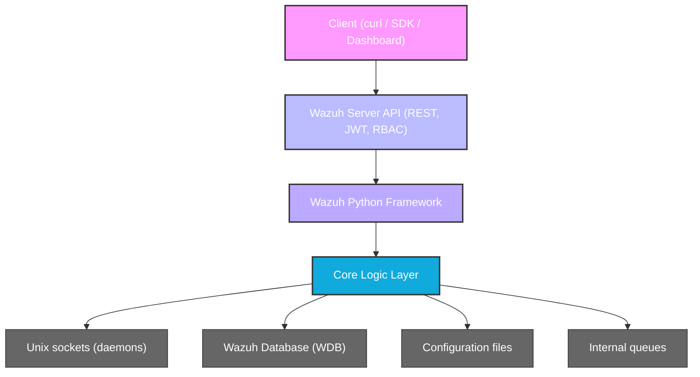
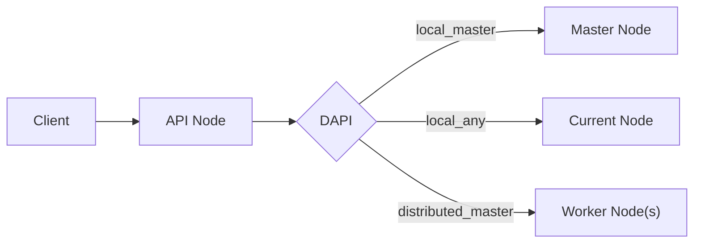

# Architecture

The Wazuh Server API is a layered system where an HTTP server delegates to a Python framework, which in turn communicates with internal daemons and databases through Unix sockets.

---

## System Architecture Overview


```mermaid
graph TD
    A["Client (curl / SDK / Dashboard)"] --> B["Wazuh Server API (REST, JWT, RBAC)"]
    B --> C["Wazuh Python Framework"]
    C --> D["Core Logic Layer"]
    
    D --> E["Unix sockets (daemons)"]
    D --> F["Wazuh Database (WDB)"]
    D --> G["Configuration files"]
    D --> H["Internal queues"]

    style A fill:#f9f,stroke:#333,stroke-width:2px,color:#fff
    style B fill:#bbf,stroke:#333,stroke-width:2px,color:#fff
    style C fill:#baf,stroke:#333,stroke-width:2px,color:#fff
    style D fill:#1ad,stroke:#333,stroke-width:2px,color:#fff
    style E fill:#666,stroke:#333,color:#fff
    style F fill:#666,stroke:#333,color:#fff
    style G fill:#666,stroke:#333,color:#fff
    style H fill:#666,stroke:#333,color:#fff
```

---

## Directory Structure

### API Interface Layer
`wazuh/framework/wazuh/`

This layer:
- Exposes API-facing functions
- Validates input
- Enforces RBAC
- Formats responses

It **must not** contain business logic.

| Module | Responsibility | Main Endpoints |
|--------|----------------|----------------|
| `agent.py` | Agent lifecycle and queries | `/agents` |
| `manager.py` | Manager status and configuration | used by `cluster_controller.py` (no dedicated route) |
| `cluster.py` | Cluster operations | `/cluster` |
| `security.py` | Authentication and users | `/security` |
| `rbac/` | Authorization logic | `/security/*` |
| `mitre.py` | MITRE ATT&CK mappings | `/mitre` |
| `stats.py` | Manager statistics | used by `cluster_controller.py` (no dedicated route) |

---

### Core Logic Layer
`wazuh/framework/wazuh/core/`

This layer contains **all real logic**. It is **API-agnostic** and can be reused internally.

| Component | Description |
|-----------|-------------|
| `agent.py`, `manager.py`, etc. | Business logic implementation |
| `common.py` | Global constants, paths, context variables, and utility functions |
| `results.py` | Standardized result model (`WazuhResult`, `AffectedItemsWazuhResult`) |
| `InputValidator.py` | Regex-based input validation (names, lengths) |
| `utils.py` | General utilities (caching, process management, helpers) |
| `wazuh_socket.py` | IPC with Wazuh daemons via Unix sockets |
| `wdb.py` | Async interface to Wazuh DB (length-prefixed Unix socket protocol) |
| `wdb_http.py` | HTTP-based alternative WDB client (via `aiohttp`) |
| `configuration.py` | Parse `wazuh-manager.conf` and related files |
| `exception.py` | Custom exception hierarchy and error code catalog |
| `wlogging.py` | Custom log rotation with gzip compression |
| `pyDaemonModule.py` | UNIX daemonization (double-fork pattern) |
| `stats.py` | Statistics processing logic |
| `cluster/` | Cluster architecture (master, worker, DAPI) |
| `indexer/` | Wazuh Indexer integration (credentials, disconnected agents) |

---

### API Server Layer
`wazuh/api/api/`

This layer implements the **HTTP server** that exposes the REST API.

| Component | Description |
|-----------|-------------|
| `controllers/` | Route handlers (one per resource: agent, cluster, security, etc.) |
| `authentication.py` | JWT token generation and validation using EC keys (PyJWT) |
| `middlewares.py` | Request/response pipeline (security headers, rate limiting, access logging) |
| `error_handler.py` | Centralized error handling and brute-force protection |
| `validator.py` | Comprehensive regex-based validation for all API input parameters |
| `signals.py` | API lifecycle events and background tasks (key generation, CTI updates) |
| `constants.py` | API filesystem paths (`/api/configuration`, `/api/security`, etc.) |
| `encoder.py` | Custom JSON serialization |
| `uri_parser.py` | URI parsing utilities |
| `alogging.py` | Async-aware API logging |
| `spec/spec.yaml` | OpenAPI 3.0 specification (defines all endpoints, schemas, parameters) |
| `configuration/` | API configuration management |
| `models/` | Data models for request/response objects |

#### Controllers

Each controller wraps framework calls in the **DAPI (Distributed API)** layer to transparently route requests across cluster nodes.

| Controller | Responsibility |
|------------|----------------|
| `agent_controller.py` | Agent CRUD and lifecycle |
| `cluster_controller.py` | Cluster node operations |
| `security_controller.py` | Users, roles, policies, RBAC |
| `mitre_controller.py` | MITRE ATT&CK mappings |
| `overview_controller.py` | Agent overview/summary |
| `default_controller.py` | Basic API info (version, hostname, timestamp) |

---

### RBAC Sub-module
`wazuh/framework/wazuh/rbac/`

| File | Responsibility |
|------|----------------|
| `decorators.py` | `expose_resources` decorator that enforces action/resource permissions |
| `orm.py` | ORM models for roles, policies, and user-role mappings |
| `preprocessor.py` | Resource preprocessing before permission checks |
| `default/{roles,policies,rules,relationships,users}.yaml` | Built-in default RBAC data, loaded via `orm.py`'s `insert_default_resources` |
| `auth_context.py` | Authentication context handling |

---

### Cluster Sub-module
`wazuh/framework/wazuh/core/cluster/`

| File | Responsibility |
|------|----------------|
| `dapi/` | **Distributed API** — routes requests to the correct cluster node |
| `master.py` | Master node logic |
| `worker.py` | Worker node logic |
| `client.py` | Worker → master communication |
| `server.py` | Cluster server |
| `local_client.py` | Local cluster client |
| `local_server.py` | Local cluster server |
| `control.py` | Cluster control operations |
| `cluster.py` | Core cluster logic |
| `common.py` | Cluster-specific shared utilities |
| `utils.py` | Cluster utilities (`get_cluster_items`, etc.) |

---

### Indexer Sub-module
`wazuh/framework/wazuh/core/indexer/`

| File | Responsibility |
|------|----------------|
| `indexer.py` | Main Wazuh Indexer client |
| `credential_manager.py` | Indexer credential management |
| `disconnected_agents.py` | Handling disconnected agents in the indexer |
| `active_response.py` | Active response document indexing |
| `metrics.py` | Indexer metrics collection |
| `metrics_snapshot.py` | Cluster-wide metrics snapshot aggregation |
| `states_components.py` | Component state indexing |

---

## Execution Flow

Example: `GET /agents?status=active`

1. HTTP request reaches the Server API (Starlette/Connexion)
2. Middlewares process the request (security headers, rate limiting, access logging)
3. JWT token is validated via `authentication.py`
4. Input parameters are validated via `validator.py` (regex-based)
5. Request is routed to the controller (`agent_controller.py`)
6. Controller wraps the call in the **DAPI** layer for cluster routing
7. DAPI determines the target node (`local_master`, `local_any`, etc.)
8. Framework function (`wazuh/agent.py`) is invoked
9. RBAC permissions are checked via `expose_resources` decorator
10. Core logic (`core/agent.py`) is executed
11. Data is fetched from:
    - WDB (via Unix socket or HTTP)
    - Manager daemon (via Unix socket)
    - Filesystem
12. Result is wrapped in `AffectedItemsWazuhResult` or `WazuhResult`
13. Result is serialized to JSON and returned

---

## Startup and socket binding

`api/scripts/wazuh_manager_apid.py` opens the API's listening sockets itself, before uvicorn is started, and hands them to `uvicorn.Server(config).run(sockets=...)`. uvicorn never binds anything on its own.

One socket is bound per address that each entry in `api.yaml`'s `host` (a list, `['0.0.0.0', '::']` by default) resolves to. Entries are resolved with `socket.getaddrinfo()` -- not by checking for a literal `:` in the string, so a hostname with both A and AAAA records is bound on both, and one with no colon in it that only resolves to an AAAA record is still bound as IPv6 -- and every IPv6 socket is bound `IPV6_V6ONLY`, so an IPv4 client is always served by the IPv4 socket and its address reaches the access log and the brute-force IP blocking as `1.2.3.4` rather than the v4-mapped `::ffff:1.2.3.4`.

A real bind failure (the port already in use, permission denied, ...) is all-or-nothing per attempt: every socket opened so far in that attempt is closed before the next attempt or before raising. The one exception is an address whose family isn't available on this system at all -- opening the socket fails with `EAFNOSUPPORT` on a kernel booted with `ipv6.disable=1`, or the bind fails with `EADDRNOTAVAIL`/`EAFNOSUPPORT` when IPv6 is disabled through `net.ipv6.conf.all.disable_ipv6` -- which is what `asyncio.loop.create_server()` tolerated too: that address is skipped and the attempt proceeds with whatever else binds, so the API can end up serving on only one address family if the other one isn't available on this host at all. The attempt only fails this way if every address ends up skipped.

```
                  ┌──────────────────────────────────────────────┐
                  │  bind one socket per resolved 'host' address │
                  └──────────────────────────────────────────────┘
                        │                          │
                 EADDRINUSE                   all bound
                        │                          │
       ┌────────────────▼───────────────┐          │
       │ attempts left?                 │          │
       │  yes -> WARNING in api.log,    │          │
       │         wait 2^n * 2s + jitter │          │
       │  no  -> ERROR 2010, exit       │          │
       └────────────────┬───────────────┘          │
                        │ retry                    ▼
                        └──────────────► uvicorn.Server.run(sockets=...)
                                            │
                                            ▼
                                         ASGI lifespan startup
                                         logs "Listening on ..."
```

### Retry on a busy port

A bind that fails with `EADDRINUSE` is retried 5 times on top of the first attempt, with an exponential backoff of `2 ** attempt * 2` seconds plus up to a second of jitter, i.e. roughly 62 seconds of waiting in the worst case. This covers a port that is momentarily held by something else, for example an unrelated outbound connection that was given it as an ephemeral source port.

- Each failed attempt is logged in `api.log` at `WARNING` level with the hosts, the port, the attempt number and the wait before the next one.
- Any other `OSError` (for example `EACCES` on a privileged port) is not retried: retrying cannot change the outcome. The exception is an address family that isn't available on this host (see above), which is tolerated by skipping that address rather than by retrying -- it only reaches this retry/exit logic if it leaves every address skipped.
- Exhausting every attempt logs error `2010`, *Error while attempting to bind on address: address already in use*, at `ERROR` level, and the process exits. **This failure is only visible in `api.log`**: it is not written to `logs/wazuh-manager.log`, and it does not change `wazuh-manager.service`'s own unit state, which stays `active` because the other manager daemons are still running.

Because the bind succeeds before uvicorn is started, the `Listening on ...` line emitted from the ASGI lifespan startup hook (`api/api/signals.py`) can only be logged once a real socket exists. uvicorn's own `Uvicorn running on http://...` line is not logged at all when it is given pre-bound sockets.

The process daemonizes and writes its PID files before it reaches this point, so for as long as the retry loop keeps waiting the daemon exists and `wazuh-manager-control status` reports `wazuh-manager-apid is running...` while nothing is bound and the API answers nothing. `api.log`'s retry warnings are what distinguish that window from a served API.

### Shutdown during startup

The retry wait is backed by a `threading.Event` that `exit_handler`, the `SIGTERM` handler, sets before it removes the API's PID files. A stop issued while apid is still waiting to retry therefore ends the process immediately, instead of leaving it retrying in the background with its PID files already gone and `wazuh-manager-control status` reporting it stopped. The same event is checked once more after the bind succeeds and before uvicorn is started, so a stop that lands during the bind itself does not leave the API serving with its PID files already removed.

---

## Distributed API (DAPI)

In cluster deployments, not all requests can be handled by the node receiving them.

The DAPI layer (`core/cluster/dapi/`) transparently routes requests:

| Routing Mode | Description |
|--------------|-------------|
| `local_master` | Must execute on the master node |
| `local_any` | Can execute on any node |
| `distributed_master` | Master distributes to relevant worker nodes |


```mermaid
graph LR
    A["Client"] --> B["API Node"]
    B --> C{"DAPI"}
    C -->|local_master| D["Master Node"]
    C -->|local_any| E["Current Node"]
    C -->|distributed_master| F["Worker Node(s)"]
```

---

## Result Model

All framework functions return standardized result objects defined in `core/results.py`:

| Class | Description |
|-------|-------------|
| `WazuhResult` | Base dict-like result wrapper |
| `AffectedItemsWazuhResult` | Tracks affected/failed items with error details |

Results support:
- Merge operations (`|` operator) for combining results across cluster nodes
- Iteration, length, and containment checks
- Pagination metadata

---

## Socket Communication Protocol

The framework communicates with Wazuh daemons via **Unix domain sockets** using a length-prefixed protocol.

### Protocol Details
- Messages use a **4-byte little-endian header** indicating the payload length
- The same framing is used for both sending and receiving
- `WazuhAsyncSocket` (in `core/wdb.py`) handles async socket connections

### Key Socket Paths

| Socket | Daemon | Purpose |
|--------|--------|---------|
| `queue/sockets/wdb.sock` | wazuh-manager-db | Database queries (length-prefixed socket protocol) |
| `queue/sockets/wdb-http.sock` | wazuh-manager-db | HTTP-based database queries (`wdb_http.py`), and the daemon's readiness for node status (`GET /v1/status`, read by `engine_http.py`) |
| `queue/sockets/engine-api-http.sock` | wazuh-manager-analysisd | Engine stats and metrics (HTTP API, `engine_http.py`) |
| `queue/sockets/auth.sock` | wazuh-manager-authd | Agent registration |
| `queue/sockets/remote.sock` | wazuh-manager-remoted | Agent communication |

---

## Logging Architecture

### Custom Log Rotation (`core/wlogging.py`)
- The `CustomFileRotatingHandler` class extends Python's logging to:
  - Rotate log files when they reach a size threshold
  - Compress rotated files with **gzip**
  - Set file permissions to `0o640`
  - Store rotated logs in a dedicated directory

### API Access Logging (`api/alogging.py`)
- Every API request generates an access log entry, including one for a request the API rejected: the entry is written after the response, so a body the OpenAPI validator refused has still been recorded
- The entry carries the query string, and the request body whenever the caller was authenticated and the body is under `MAX_LOGGED_BODY_SIZE`, with sensitive values **masked** as `****` by `redact_sensitive_fields`, at any depth of the body and inside arrays
- A field is masked when its name matches `password`, `passwd`, `pwd`, `key`, `token`, `secret`, `credential`, `credentials`, `authorization` or `cookie`, case-insensitively, either exactly or as the tail of a compound name — `api_key`, `x-api-key`, `clientSecret` and `accessToken` all match, `keyword` and `monkey` do not. Hyphens and camelCase boundaries are folded before matching, and the plain lowercased spelling is tested too, so `PaSsWoRd` is caught as well as `accessToken`
- This is a denylist: a secret sent under a field name outside that set is still written to the log
- The `run_as` authorization context is **not** written out at `info` level. It is arbitrary third-party JSON under names the denylist cannot anticipate, so the entry carries only its `hash_auth_context`; raise `logs.level` to `debug` to see the context itself
