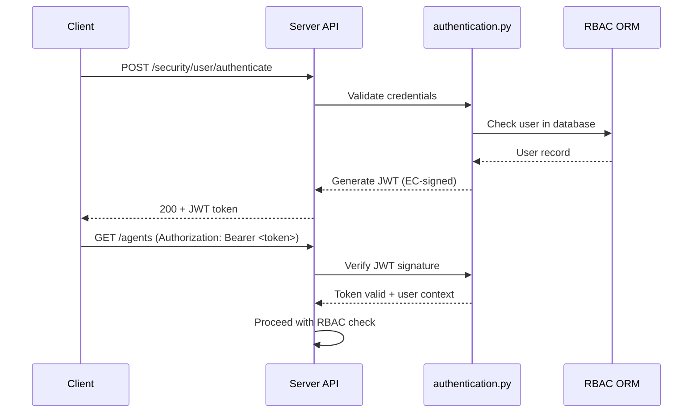

# Authentication & Security

All access to the Wazuh Server API is protected by JWT authentication and RBAC authorization. Additional protections include rate limiting, brute-force prevention, and security headers.

---

## JWT Authentication

- All endpoints require a JWT token (except `/security/user/authenticate`)
- Tokens are short-lived (default: **900 seconds**)
- Tokens must be included in every request: `Authorization: Bearer <JWT_TOKEN>`
- Tokens are signed using **Elliptic Curve (EC) keys** generated at startup
- Authentication logic uses `PyJWT` for token encoding/decoding
- Credentials are validated against the RBAC ORM database
- Authentication **must run on the master node** in cluster deployments

### Authentication Flow

---

## RBAC Enforcement

RBAC is enforced **before** any core logic is executed.

- Permissions are evaluated per endpoint
- Framework functions are decorated with `expose_resources` from `rbac/decorators.py`
- RBAC policies can allow or deny access even with valid tokens
- Two RBAC modes: **white** (deny by default) and **black** (allow by default)
- A `403 Forbidden` usually indicates RBAC blocking, not auth failure
- Current user, RBAC mode, and cluster context are stored in `contextvars` for request-scoped access

### RBAC Components

| File | Role |
|------|------|
| `rbac/decorators.py` | `expose_resources` decorator that enforces action/resource permissions |
| `rbac/orm.py` | ORM models for roles, policies, and user-role mappings |
| `rbac/preprocessor.py` | Resource preprocessing before permission checks |
| `rbac/default_resources.py` | Built-in default RBAC resource definitions |
| `rbac/auth_context.py` | Authentication context handling |

---

## Rate Limiting & Brute-Force Protection

- The API tracks failed login attempts per IP address
- After exceeding a configurable threshold, the IP is added to a blocked set
- Blocked IPs receive `429 Too Many Requests` or immediate rejection
- Rate limiting state is managed in-memory within `middlewares.py` and `error_handler.py`

---

## Security Headers

The API sets the following security headers on all responses:

| Header | Value | Purpose |
|--------|-------|---------|
| `Content-Security-Policy` | `none` | Restricts resource loading |
| `X-Frame-Options` | `DENY` | Prevents clickjacking |
| `Server` | `Wazuh` | Masks underlying server technology |

These are applied via the `secure` Python library in `middlewares.py`.

---

## Best Practices

- Handle token expiration gracefully — re-authenticate before the token expires
- Treat `403` as RBAC errors, not authentication failures
- Never embed credentials in scripts — use environment variables or secret managers
- In cluster deployments, ensure authentication calls reach the master node
- Use the `rbac_mode` setting appropriate for your security posture (`white` for strict environments)
