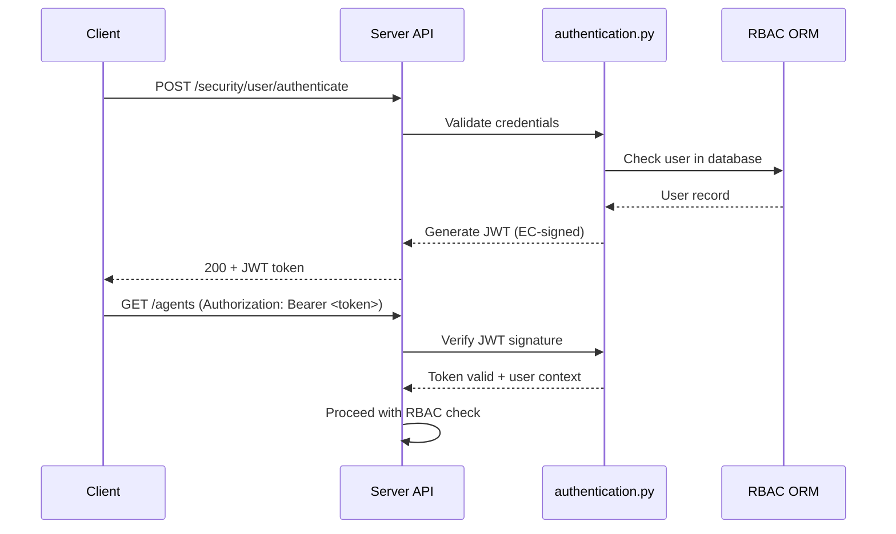

# Authentication & Security

All access to the Wazuh Server API is protected by JWT authentication and RBAC authorization. Additional protections include rate limiting, brute-force prevention, and security headers.

---

## JWT Authentication

- All endpoints require a JWT token (except `/security/user/authenticate`)
- Tokens are short-lived (default: **900 seconds**)
- Tokens must be included in every request: `Authorization: Bearer <JWT_TOKEN>`
- Tokens are signed using **Elliptic Curve (EC) keys** generated at startup
- Authentication logic uses `PyJWT` for token encoding/decoding
- Credentials are validated against the RBAC ORM database
- Authentication **must run on the master node** in cluster deployments

### Authentication Flow


```mermaid
sequenceDiagram
    participant C as Client
    participant API as Server API
    participant Auth as authentication.py
    participant RBAC as RBAC ORM

    C->>API: POST /security/user/authenticate
    API->>Auth: Validate credentials
    Auth->>RBAC: Check user in database
    RBAC-->>Auth: User record
    Auth-->>API: Generate JWT (EC-signed)
    API-->>C: 200 + JWT token

    C->>API: GET /agents (Authorization: Bearer <token>)
    API->>Auth: Verify JWT signature
    Auth-->>API: Token valid + user context
    API->>API: Proceed with RBAC check
```

---

## Default Users

A fresh installation seeds `rbac.db` from `rbac/default/*.yaml` with exactly two users, both linked to the `administrator` role:

| ID | User | `allow_run_as` | Used by |
|----|------|----------------|---------|
| 1 | `wazuh` | No | Operators and scripts calling the API directly |
| 2 | `wazuh-wui` | Yes | The Wazuh dashboard |

Only `wazuh-wui` can authenticate with an authorization context, because resolving one into roles is the dashboard's mechanism for mapping the indexer user who logged in onto a Wazuh role (see the rules in `rbac/default/rules.yaml`). `wazuh` has no use for it, so the flag is off: `POST /security/user/authenticate/run_as` as `wazuh` answers `403` with error `6004`. Either flag can be changed with `PUT /security/users/{user_id}/run_as`.

The flag on its own does not grant the shipped mappings, which is easy to miss. `RBAChecker.get_user_roles` evaluates a rule holding a reserved ID — the five in `rules.yaml` get IDs `1..5`, while rules created through the API start at `100` — only when the caller is user ID 2. Enabling `allow_run_as` on any other account therefore lets it resolve **custom rules only**, and a context that matches one grants that role whatever the account's own role links say.

Neither user has a shipped password. `insert_default_resources` generates a different random one per user when it seeds the database, unless a pre-seed file supplies them (see below), and `check_database_integrity` hands the generated ones back to `wazuh-manager-apid`, which discloses them once in `api/configuration/security/wazuh-api-passwords.txt` (mode `0400`). They are reserved IDs (`<= MAX_ID_RESERVED`), so only another reserved user can change their password — `update_user` needs a `current_user` naming who is asking, which the API takes from the token's `sub`.

The generated password is drawn from `secrets` over a 67-character alphabet (alphanumerics plus `-_.+=`), 24 characters long with an alphanumeric first character, rejection-sampled against the password policy so the draw is uniform over the compliant subset. The alphabet is deliberately narrower than the policy allows: the value crosses a YAML scalar, a JSON string, a shell word and a `sed` replacement before it reaches whoever provisions it, and a character that is special in any of those is a provisioning failure rather than a stronger password. **This constrains generation only.** The policy is unchanged, so a password set through the API or through `rbac_control` may still use any symbol it accepts.

The `administrator` role these two users carry is also the only one that receives `secrets_read`,
the policy behind `cluster:read_secrets` and `agent:read_secrets`. An `rbac.db` seeded **before** that policy existed does not
gain it — the defaults are only re-inserted when the ORM version changes — so on such an installation
even `wazuh` sees the enrollment password and the cluster key masked, and is denied an agent's key,
until the database is recreated or the policy is added by hand.

That is the general rule, not an exception: **RBAC policies are not migrated.** There is no upgrade
path from 4.x, and an `rbac.db` left by an earlier 5.0 development build keeps whatever defaults it
was seeded with — its owner recreates it, or adds the missing policy. New default policies therefore
reach an installation through a fresh database, and nothing in the manager rewrites one in place.

`wazuh-manager-apid` logs a warning on every start while the disclosure file is still on disk, and separately for any default user that still authenticates with the password older versions shipped (`wazuh`/`wazuh`, `wazuh-wui`/`wazuh-wui`) — an installation upgraded from one of those keeps it, because the RBAC migration preserves the default users. It does not refuse to serve either way, because some deployments configure the credentials only after the first start.

### Provisioning and recovery

An installer that needs deterministic credentials writes `api/configuration/security/wazuh-preseeded-passwords.json` **before** the first API start, in the same JSON shape as `--passwords-file`, and those passwords are used instead of generated ones. A key that is not one of the default users is rejected; naming only one of them is valid, and the user it leaves out still gets a generated password disclosed as usual.

The file has to be readable by the user `wazuh-manager-apid` runs as, which is `wazuh-manager`, so `root:root 0600` does not work: use `wazuh-manager:wazuh-manager 0600` or `root:wazuh-manager 0640`. It must also be owned by `root` or by the Wazuh user and must not be writable by its group or by others, because the directory it lives in is group-writable and the file decides an administrator password.

A file that is present but unusable for any of those reasons, or that is not UTF-8 JSON holding an object of policy-compliant passwords, stops the API with error `2012` and leaves no database behind. It is kept on disk so that it can be corrected, and never falls back to a generated password: that would leave whoever wrote it convinced they had provisioned a credential that does not exist, and the failure would only surface as a `401` much later.

The manager removes the file as soon as it has seeded the database, so a plaintext administrator credential does not outlive the installation step. One found when `rbac.db` already exists can no longer be applied, so it is reported and removed too. `rbac_control factory-reset` seeds through the same path, which is how an automated environment resets to known credentials: write the pre-seed, then reset, and it is consumed like any other first seeding.

`rbac.db` holds a scrypt hash, so a generated password that was never read is **not recoverable** — `rbac_control change-password` sets a new one instead, and never asks for the current one. The manager does not regenerate on its own when the disclosure file goes missing, because that would rotate the credential the dashboard holds without anyone asking. It does regenerate when `rbac.db` itself is gone, since there is nothing left to preserve; that case is reported with its own warning, distinguished from a first install by a marker file written beside the first disclosure and never removed.

Change them with `bin/rbac_control change-password`, which prompts for each password when run without options (an empty answer leaves that one unchanged) and can also be driven from a file so that installers and password tools can use it:

```bash
# One user, password read from the first line of a file (use '-' for the standard input)
bin/rbac_control change-password --user wazuh-wui --password-file /root/wui.pass

# Every default user in a single execution
echo '{"wazuh": "...", "wazuh-wui": "..."}' | bin/rbac_control change-password --passwords-file -
```

Passwords are never accepted as a command-line argument, so they do not reach the process list. The command exits non-zero if any requested change was not applied. `--local` applies the change to the node it runs on instead of the master. A new password must satisfy the policy enforced by `framework/wazuh/security.py`: 12 to 64 characters, with a lowercase letter, an uppercase letter, a digit and a symbol. Changing `wazuh-wui`'s password requires updating the dashboard configuration to match.

### What a password change does and does not do

The policy above is enforced by `security.update_user` and `security.create_user`: a password outside 12-64 characters fails with error `5009`, one missing a character class with `5007`. A caller that is not itself a reserved user gets `5011`, however privileged its role, and these users cannot be deleted at all (`5004`).

Once a change goes through:

- It is written to the **master** node's `rbac.db` by default. `check_user` and `update_user` are `local_master` requests, so a worker forwards every authentication and needs no action while it stays a worker. Each node still keeps its own `rbac.db`, seeded independently, and the cluster does not synchronize it (`cluster.json` shares `etc/`, `etc/shared/` and `var/multigroups/` only) — so a worker promoted to master starts serving a password generated on that node, which is not the one in use. Align any node that may take that role with `rbac_control change-password --local`, which routes the call as `local_any` and therefore acts on that node's own database; without it the command runs on the master and reports success there. Pre-seeding every node is the other way to get the same result without operator action.
- **No daemon restart** is required. The next `POST /security/user/authenticate` already uses the new password.
- Every token held by the modified user is **revoked immediately** (`update_user` calls `invalid_users_tokens`), so a script that changes its own user's password must authenticate again before its next call. Tokens of other users are untouched; `PUT /security/user/revoke` revokes all of them at once.
- A client left with the old password — typically a dashboard whose stored copy was not updated — is counted against `max_login_attempts` (50) and its IP is then blocked for `block_time` (300 seconds), answering `403`. The block is lifted when that time elapses, not when the password is corrected.
- No manager component authenticates with `wazuh` or `wazuh-wui`, so the keystore and the manager configuration files are unaffected. The only copy outside the manager is the dashboard's `wazuh_core.hosts.<host>.password`, which is why changing `wazuh-wui` — and only that user — needs the dashboard updated and restarted.

The step-by-step procedure, including the dashboard side and the container variants, is in [Installation](../../getting-started/installation.md#retrieve-and-change-the-api-passwords).

---

## RBAC Enforcement

RBAC is enforced **before** any core logic is executed.

- Permissions are evaluated per endpoint
- Framework functions are decorated with `expose_resources` from `rbac/decorators.py`
- RBAC policies can allow or deny access even with valid tokens
- Two RBAC modes: **white** (deny by default) and **black** (allow by default)
- A `403 Forbidden` usually indicates RBAC blocking, not auth failure
- Current user, RBAC mode, and cluster context are stored in `contextvars` for request-scoped access

### Sensitive configuration values

`GET /cluster/local/config` and the two node-configuration endpoints answer with the enrollment
password (`authd.pass`) and the cluster key in them. Those two values come back masked as `*****`
unless the caller holds **`cluster:read_secrets`**, an action of its own: being allowed to change the
configuration does not entitle anyone to read the secrets inside it. It is granted by the default
policy `secrets_read`, which only the `administrator` role carries.

The action is checked **against the node that answers**, with the same matcher every other permission
goes through: a policy that grants it over `node:id:master-node` does not uncover a worker's values,
a later `deny` over the node being served wins, and in `rbac_mode: black` the values come back in
clear unless a policy denies them, as everything else does in that mode. The default policy grants
it over `node:id:*`, so an `administrator` sees them on every node.

### Agent keys

An agent's pre-shared key — the `client.keys` line that authenticates it — is the third secret behind
`secrets_read`, through an action of its own, **`agent:read_secrets`**. `GET /agents/{agent_id}/key`
requires it and answers `403` without it; unlike the configuration values there is nothing to mask,
since the key is the whole answer. It is scoped per agent and per group, so a policy may uncover one
agent's key and not another's.

`agent:read` no longer grants it. The boundary worth remembering is *existing* versus *new*:
`agent:create` still answers `POST /agents` with the key of the agent it just created, because an
agent cannot be created without one, and that is not the same risk as reading the credential of an
agent that already exists and may be running. An operator who provisions agents therefore keeps
`agents_all` — `POST /agents`, or minting an enrollment token — and only re-reading an existing
agent's key needs `administrator`.

### Auditing a disclosure

Every disclosure is recorded as a `secret_read` line naming the user and the fields, never the value.
It lands in `logs/api.log` for `GET /cluster/local/config`, which the API process serves, and in
`logs/cluster.log` for the two node-configuration endpoints, which run inside the answering node's
`wazuh-manager-clusterd`. `GET /agents/{agent_id}/key` records its own line the same way, naming the
agents served rather than a field. If the masking itself fails, the request fails: a response nobody could
mask is not served.

### RBAC Components

| File | Role |
|------|------|
| `rbac/decorators.py` | `expose_resources` decorator that enforces action/resource permissions |
| `rbac/orm.py` | ORM models for roles, policies, and user-role mappings |
| `rbac/preprocessor.py` | Resource preprocessing before permission checks |
| `rbac/default/*.yaml` | Built-in default RBAC data, loaded via `insert_default_resources` in `rbac/orm.py` |
| `rbac/auth_context.py` | Authentication context handling |

---

## Rate Limiting & Brute-Force Protection

- The API tracks failed login attempts per IP address
- After exceeding a configurable threshold, the IP is added to a blocked set
- Blocked IPs receive `429 Too Many Requests` or immediate rejection
- Rate limiting state is managed in-memory within `middlewares.py` and `error_handler.py`

---

## Security Headers

The API sets the following security headers on all responses:

| Header | Value | Purpose |
|--------|-------|---------|
| `Content-Security-Policy` | `none` | Restricts resource loading |
| `X-Frame-Options` | `DENY` | Prevents clickjacking |
| `Server` | `Wazuh` | Masks underlying server technology |

These are applied via the `secure` Python library in `middlewares.py`.

---

## Best Practices

- Handle token expiration gracefully — re-authenticate before the token expires
- Treat `403` as RBAC errors, not authentication failures
- Never embed credentials in scripts — use environment variables or secret managers
- In cluster deployments, ensure authentication calls reach the master node
- Use the `rbac_mode` setting appropriate for your security posture (`white` for strict environments)
