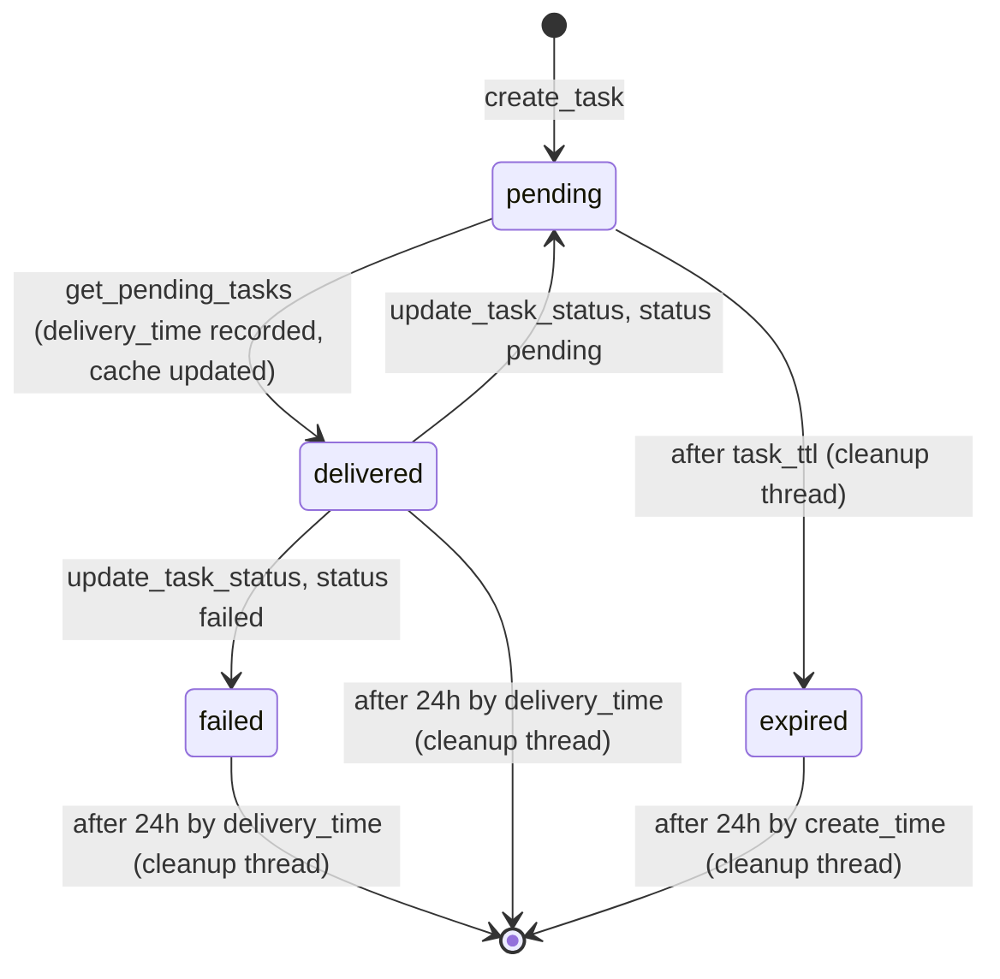

# Task Manager Module

The Task Manager is a generic manager-side task-broker that stores tasks addressed to agents and lets other manager components (Agent Upgrade, Active Response, API) hand off asynchronous work to be picked up by agents on their next poll.

**Daemon:** Part of `wazuh-modulesd`

**Platform:** Manager only (Linux)

**Type:** Manager-only

**Configuration file:** `/var/wazuh-manager/etc/wazuh-manager.conf`

**XML Section:** `<task-manager>`

Source: [src/wazuh_modules/src/task_manager/](../../../../src/wazuh_modules/src/task_manager/)

---

## Overview

The Task Manager owns the lifecycle of *tasks* — small, typed JSON records that instruct an agent to perform an action. It exposes a JSON-based IPC interface over a Unix domain socket and persists tasks in the `tasks.db` SQLite database (managed by Wazuh DB). The Task Manager itself never delivers a task to an agent — it only stores `create_task` calls and hands back pending ones on `get_pending_tasks`, marking them delivered as it does. Delivery is the consumer's job: `remoted`'s own task-polling thread is the current consumer, and it pushes `remote_upgrade` tasks over the agent's existing session.

`get_pending_tasks` marks a task `delivered` purely as a side effect of the read, before the consumer has actually attempted delivery. A consumer that later finds out delivery didn't succeed can report that outcome back with `update_task_status`, moving the task to `pending` (retryable — offered again on a future `get_pending_tasks` call) or `failed` (terminal, distinguishable from a real delivery). Reporting back is opt-in and best-effort: a consumer that never calls it (or a call that itself fails) leaves the task `delivered`, exactly as before this action existed.

Key properties of the current implementation:

- **Task-type based** — a task is not tied to a single module. Four task types are supported today: `active_response`, `remote_upgrade`, `agent_restart`, and `agent_reload`.
- **Deterministic task IDs** — task IDs are UUID-like strings derived from `SHA-256(source_id : agent_id : task_type : create_time)`, so the same logical task produced on different cluster nodes has the same ID and is not duplicated.
- **Delivery outcome is opt-in, not tracked automatically** — the Task Manager itself never watches or times out a delivery. It stores tasks, hands them out on `get_pending_tasks` (marking them delivered as it does), and expires never-picked-up ones after their TTL. A consumer may additionally call `update_task_status` to report whether a delivery actually succeeded; if it never does, the task simply stays `delivered`.
- **In-memory cache** — caches "no pending tasks" state per agent to reduce database queries from high-frequency agent polls without risk of re-delivering tasks. `update_task_status` invalidates this cache for the agent when moving a task back to `pending`, so a reset task isn't hidden behind a stale "no pending tasks" entry.
- **Multi-threaded architecture** — uses a dealer thread to accept connections and a pool of 8 worker threads to process requests concurrently, matching the WazuhDB architecture. Worker threads use `wnotify` for event-driven I/O and maintain persistent connections to optimize performance.
- **Runs on every manager node** — the listener socket and cleanup thread start on both master and worker nodes so any node can create tasks and serve them to the agents connected to it.

---

## Task types

| Type              | Purpose                                        | Created by                        |
| ----------------- | ---------------------------------------------- | --------------------------------- |
| `active_response` | Execute an Active Response script on the agent | Engine / Active Response pipeline |
| `remote_upgrade`  | Trigger a WPK-based agent upgrade              | Agent Upgrade module              |
| `agent_restart`   | Restart the `wazuh-agent` service              | Server API                        |
| `agent_reload`    | Reload the agent configuration                 | Server API                        |

Each task carries a free-form JSON `payload` whose contents are defined by the producer of the task and interpreted by the agent.

---

## IPC interface

The Task Manager listens on the Unix domain socket `queue/sockets/task.sock` (`WM_TASK_MODULE_SOCK`). Messages are JSON documents; the socket uses the Wazuh secure TCP framing (`OS_SendSecureTCP` / `OS_RecvSecureTCP`).

Three actions are accepted:

### `create_task`

Request:

```json
{
  "action": "create_task",
  "agent_id": "001",
  "task_type": "remote_upgrade",
  "create_time": 1734879600,
  "source_id": "optional-source-identifier",
  "payload": {
    "wpk_file": "wazuh_agent_v5.0.0_linux_x86_64.wpk",
    "wpk_sha1": "aabbccdd...",
    "installer": "upgrade.sh"
  }
}
```

- `agent_id` — required string.
- `task_type` — required, one of the values listed above.
- `create_time` — required Unix timestamp. Must be within `[now - 1 year, now + 60 s]`.
- `source_id` — optional. When present it is mixed into the deterministic task ID (useful for Active Response, which uses the source document ID).
- `payload` — required JSON object. Any structure is accepted; the module validates it is well-formed JSON and its serialized size does not exceed `max_payload_bytes`.

Successful response:

```json
{"status": "ok", "task_id": "a3f5e2d1-4c6b-8a9e-1f2d-3c4b5a6e7d8f"}
```

Error response:

```json
{"error": "<code>", "message": "<description>"}
```

Possible error codes returned by the module: `invalid_json`, `parsing_error`, `create_failed`, `query_failed`, `parsing_failed`, `serialization_failed`.

### `get_pending_tasks`

Request:

```json
{"action": "get_pending_tasks", "agent_id": "001"}
```

Successful response:

```json
{
  "status": "ok",
  "tasks": [
    {
      "task_id": "a3f5e2d1-4c6b-8a9e-1f2d-3c4b5a6e7d8f",
      "task_type": "remote_upgrade",
      "payload": { "...": "..." }
    }
  ]
}
```

Calling `get_pending_tasks` also **marks the returned tasks as delivered** in `tasks.db`. Delivery is recorded only on the node that served the request; the Task Manager does not propagate delivery state across cluster nodes.

### `update_task_status`

Lets a consumer report the outcome of a delivery attempt for a task it previously received from
`get_pending_tasks` (and which is therefore already `delivered`).

Request:

```json
{"action": "update_task_status", "task_id": "a3f5e2d1-4c6b-8a9e-1f2d-3c4b5a6e7d8f", "status": "pending", "agent_id": "001"}
```

- `task_id` — required string.
- `status` — required, one of `pending` (retryable failure — re-offered on a future `get_pending_tasks` call) or `failed` (terminal — permanent failure, distinguishable from a successful delivery). No other value is accepted; the Task Manager's own terminal states (`expired`, and `delivered` itself) can't be requested through this action.
- `agent_id` — optional. When present and `status` is `pending`, invalidates that agent's "no pending tasks" cache entry (if any), so the reset task isn't hidden behind a stale cache hit.

Successful response:

```json
{"status": "ok"}
```

Error response: same envelope as the other actions (`{"error": "<code>", "message": "<description>"}`); additional codes: `update_failed`.

This is best-effort from the Task Manager's point of view: nothing polls or times out a `delivered`
task on its own. If the consumer never calls this action — or the call itself fails (Task Manager
unreachable, `wazuh-db` error) — the task simply stays `delivered`, same as before this action
existed.

---

## Task lifecycle



- The cleanup thread runs every `cleanup_interval` seconds. It sends `task cleanup_expired` and `task delete_old` queries to Wazuh DB and, once a day, `task sql VACUUM;`.
- A task that never got picked up by an agent transitions `pending → expired → deleted`.
- A task that was delivered and never has its status updated stays as `delivered` until it is
  deleted by the cleanup thread — the pre-`update_task_status` behavior, still the default for any
  consumer that doesn't call it.
- A consumer that calls `update_task_status` can instead move a `delivered` task back to `pending`
  (offered again on a future `get_pending_tasks` call — nothing caps how many times this can
  happen, other than the task's own `task_ttl`/`create_time` cutoff, which is untouched by these
  transitions) or forward to `failed` (terminal; deleted on the same cutoff as `delivered`).

---

## In-memory cache

`get_pending_tasks` uses an in-memory cache to optimize database access. The cache only stores "no pending tasks" states per agent — actual tasks are never cached to ensure each task is delivered exactly once. Cache invalidation happens automatically when a new task is created for the agent.

The cache reduces database queries for agents that poll frequently when they have no pending tasks. Its size grows linearly with the number of distinct agents with no pending work.

---

## Cluster behavior

- The listener socket and the cleanup thread run on every manager node — master and workers alike. Any node can accept `create_task` requests from local producers and serve `get_pending_tasks` to the agents connected to it.
- Task IDs are deterministic, so the same logical request routed to different manager nodes produces the same `task_id` and collapses into a single row in `tasks.db`.
- Delivery bookkeeping is node-local: `mark_delivered` is issued by the node that returned the task, and no cross-node broadcast is performed. Task creation always routes to the agent's current owning node, so this is a stranding risk (a task can sit on the wrong node's `tasks.db` if an agent reconnects elsewhere, and simply expires via the normal TTL sweep), not a duplication risk — an agent can't receive the same task twice from two nodes, since `remoted`'s poller only ever talks to the agent's own node.

---

## Storage

Tasks are stored in the `tasks.db` database managed by Wazuh DB. The Task Manager talks to Wazuh DB through the standard `task <command> <parameters>` protocol; commands used by this module are:

| Command                | Direction               | Purpose                                                   |
| ---------------------- | ----------------------- | --------------------------------------------------------- |
| `task create`          | Task Manager → wazuh-db | Persist a new task row                                    |
| `task get_pending`     | Task Manager → wazuh-db | Fetch pending tasks for an agent                          |
| `task mark_delivered`  | Task Manager → wazuh-db | Record `delivery_time` for a task                         |
| `task update_status`   | Task Manager → wazuh-db | Move a `delivered` task to `pending` or `failed`          |
| `task cleanup_expired` | Task Manager → wazuh-db | Mark tasks older than `task_ttl` as expired               |
| `task delete_old`      | Task Manager → wazuh-db | Remove `expired` tasks past their TTL, and `delivered`/`failed` tasks past their `delivery_time` cutoff |
| `task sql VACUUM;`     | Task Manager → wazuh-db | Daily database compaction                                 |

See the [Wazuh DB module documentation](../wazuh_db/README.md) for the underlying schema.

---

## Configuration

For every option and defaults, see the [Task Manager Configuration Reference](configuration.md).

Minimal example:

```xml
<task-manager>
  <task_ttl>3600</task_ttl>
  <cleanup_interval>300</cleanup_interval>
  <max_payload_bytes>1048576</max_payload_bytes>
  <max_tasks_per_poll>100</max_tasks_per_poll>
</task-manager>
```

---

## Architecture

The Task Manager uses a multi-threaded architecture similar to WazuhDB:

- **Dealer thread** (`wm_task_manager_dealer`): Accepts incoming socket connections and adds them to a `wnotify` notification queue
- **Worker pool** (`wm_task_manager_worker`): 8 worker threads wait on the notification queue, process requests concurrently, and maintain persistent connections by re-adding peers to the queue after serving responses
- **Main thread** (`wm_task_manager_main`): Initializes the notification queue and starts the dealer and worker threads

This design allows multiple concurrent connections from remoted's `/control` endpoint and other IPC clients, improving throughput and responsiveness.

---

## Key source files

| File                         | Purpose                                                                      |
| ---------------------------- | ---------------------------------------------------------------------------- |
| `wm_task_manager.c`          | Module entry point, dealer thread, worker pool, and multi-threaded dispatcher |
| `wm_task_manager_parsing.c`  | JSON request parsing and response building                                   |
| `wm_task_manager_commands.c` | Wazuh DB IPC, `create_task`/`get_pending_tasks`/`update_task_status` handlers, cleanup thread |
| `wm_task_manager_tasks.c`    | Deterministic task ID generation and in-memory task cache                    |

---

## See Also

- [Task Manager Configuration Reference](configuration.md)
- [Agent Upgrade Module](../agent_upgrade/README.md) — main producer of `remote_upgrade` tasks
- [Wazuh DB Module](../wazuh_db/README.md) — persistence backend
