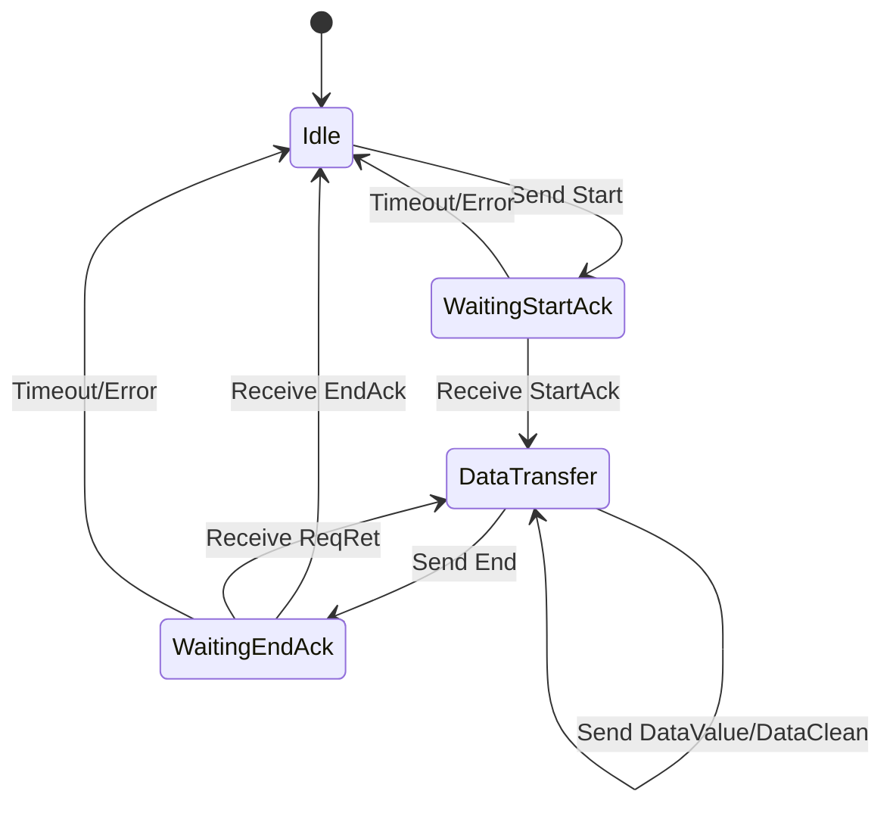

# Protocol Lifecycle

The Agent Sync Protocol implements a session-based synchronization mechanism with well-defined phases and message types. This document details the complete lifecycle of a synchronization session, including all message types and state transitions.

## Synchronization Phases

The protocol operates through three main phases:

1. **Idle Phase**: No active synchronization
2. **Session Establishment**: Start message and StartAck response
3. **Data Transfer**: Sending differences and handling retransmissions
4. **Session Completion**: End message and EndAck response

## Message Types

### 1. Start Message

Initiates a synchronization session.

**Direction**: Agent → Manager

**Content**:
- Synchronization mode (Full/Delta)
- Total number of differences to send

**FlatBuffer Schema**:
```
table Start {
    mode: Mode;
    size: uint64;
}
```

**State Transition**: `Idle` → `WaitingStartAck`

### 2. StartAck Message

Acknowledges session establishment and provides session ID.

**Direction**: Manager → Agent

**Content**:
- Acknowledgment status
- Session ID (unique identifier for this sync session)

**FlatBuffer Schema**:
```
table StartAck {
    status: Status;
    session: uint64;
}
```

**State Transition**: `WaitingStartAck` → `DataTransfer`

### 3. DataValue Message

Transmits individual differences to the manager.

**Direction**: Agent → Manager

**Content**:
- Sequence number
- Session ID
- Operation type (Upsert/Delete)
- Data identifier
- Target index
- Version number
- Data payload

**FlatBuffer Schema**:
```
table DataValue {
    seq: ulong;
    session: ulong;
    operation: Operation;
    id: string;
    index: string;
    version: ulong;
    data: [byte];
}
```

**State**: Remains in `DataTransfer`

### 4. DataClean Message

Notifies the manager that specific indices should be cleaned.

**Direction**: Agent → Manager

**Content**:
- Sequence number
- Session ID
- Index name to clean

**FlatBuffer Schema**:
```
table DataClean {
    seq: ulong;
    session: ulong;
    index: string;
}
```

**State**: Remains in `DataTransfer`

**Usage**: Sent during data cleaning synchronization mode when notifying the manager that specific indices have been disabled or should be cleared.

### 5. End Message

Signals completion of data transmission.

**Direction**: Agent → Manager

**Content**:
- Session ID

**FlatBuffer Schema**:
```
table End {
    session: ulong;
}
```

**State Transition**: `DataTransfer` → `WaitingEndAck`

### 6. ReqRet Message (Request Retransmission)

Manager requests retransmission of specific data ranges.

**Direction**: Manager → Agent

**Content**:
- List of sequence number ranges to retransmit
- Session ID

**FlatBuffer Schema**:
```
table ReqRet {
    seq: [Pair];
    session: ulong;
}

table Pair {
    begin: ulong;
    end: ulong;
}
```

**State**: Remains in `DataTransfer`

**Agent Response**: Retransmits requested DataValue messages

### 7. EndAck Message

Confirms successful session completion.

**Direction**: Manager → Agent

**Content**:
- Status (Success/Failed)
- Session ID

**FlatBuffer Schema**:
```
table EndAck {
    status: Status;
    session: ulong;
}
```

**State Transition**: `WaitingEndAck` → `Idle`

### 8. ChecksumModule Message

Transmits checksum information for integrity verification.

**Direction**: Agent → Manager

**Content**:
- Session ID
- Index identifier
- Checksum value

**FlatBuffer Schema**:
```
table ChecksumModule {
    session: ulong;
    index: string;
    checksum: string;
}
```

**State**: Used during integrity check mode, sent between StartAck and End

## Special Synchronization Modes

### Integrity Check Mode (requiresFullSync)

The `requiresFullSync` method implements a specialized synchronization flow for checksum verification:

```
Agent                                   Manager
  |                                        |
  |-------------- Start ---------------->  |
  |    (mode=CHECK, checksum)              |
  |                                        |
  |<------------ StartAck ---------------- |
  |            (session_id)                |
  |                                        |
  |---------- ChecksumModule ----------->  |
  |          (index, checksum)             |
  |                                        |
  |--------------- End ------------------> |
  |             (session_id)               |
  |                                        |
  |<------------- EndAck ----------------- |
  |       (status: match/mismatch)         |
  |                                        |
```

**Process:**
1. Agent sends Start message with CHECK mode
2. Agent sends checksum message
3. Agent sends End message
4. Manager responds with EndAck indicating if checksums match
5. Return `Error` if mismatch (full sync needed), `Ok` if valid

### Metadata/Groups Synchronization Mode

The `synchronizeMetadataOrGroups` method implements a simplified flow without data transfer:

```
Agent                                   Manager
  |                                        |
  |-------------- Start ---------------->  |
  |  (mode=METADATA_DELTA/GROUP_DELTA)     |
  |                                        |
  |<------------ StartAck ---------------- |
  |            (session_id)                |
  |                                        |
  |--------------- End ------------------> |
  |             (session_id)               |
  |                                        |
  |<------------- EndAck ----------------- |
  |              (success)                 |
  |                                        |
```

**Supported Modes:**
- `METADATA_DELTA`: Metadata delta synchronization
- `METADATA_CHECK`: Metadata integrity check
- `GROUP_DELTA`: Group delta synchronization
- `GROUP_CHECK`: Group integrity check

**Process:**
1. Agent sends Start message with metadata/group mode
2. No DataValue messages are sent
3. Agent immediately sends End message
4. Manager processes metadata/group information and responds with EndAck

### Data Clean Synchronization Mode (notifyDataClean)

The `notifyDataClean` method implements a specialized flow for notifying the manager about data cleaning when modules are disabled:

```
Agent                                   Manager
  |                                        |
  |-------------- Start ---------------->  |
  |   (mode=DELTA, size=N, indices=[...])  |
  |                                        |
  |<------------ StartAck ---------------- |
  |            (session_id)                |
  |                                        |
  |---------- DataClean[0] -------------->  |
  |    (seq=0, session, index="fim_files") |
  |                                        |
  |---------- DataClean[1] -------------->  |
  |  (seq=1, session, index="fim_registry")|
  |                                        |
  |              ...                       |
  |                                        |
  |---------- DataClean[N-1] ------------>  |
  |    (seq=N-1, session, index=...)       |
  |                                        |
  |--------------- End ------------------> |
  |             (session_id)               |
  |                                        |
  |<------------- EndAck ----------------- |
  |         (status: Ok/PartialOk)         |
  |                                        |
  | clearItemsByIndex() for each index     |
  | (cleanup local database entries)       |
  |                                        |
```

### In-Memory Recovery Mode

When using `persistDifferenceInMemory` for recovery scenarios:

```
Agent (Recovery)                       Manager
  |                                        |
  | clearInMemoryData()                    |
  | (cleanup before sync)                  |
  |                                        |
  | persistDifferenceInMemory() × N        |
  | (storing recovery data in memory)      |
  |                                        |
  |-------------- Start ---------------->  |
  |          (mode=FULL)                   |
  |                                        |
  |<------------ StartAck ---------------- |
  |                                        |
  |------- DataValue (from memory) ------> |
  |------- DataValue (from memory) ------> |
  |              ...                       |
  |                                        |
  |--------------- End ------------------> |
  |                                        |
  |<------------- EndAck ----------------- |
  |                                        |
```

**Process:**
1. Before a sync attempt, agent calls `clearInMemoryData()` to make sure memory is clean before persisting
2. Agent persists recovery data in memory using `persistDifferenceInMemory()`
3. Agent triggers full synchronization
4. DataValue messages are sent from in-memory vector (not from database)

## Complete Synchronization Flow

### Successful Synchronization

```
Agent                                   Manager
  |                                        |
  |-------------- Start ---------------->  |
  |            (mode, count)               |
  |                                        |
  |<------------ StartAck ---------------- |
  |            (session_id)                |
  |                                        |
  |----------- DataValue[0] -------------> |
  |----------- DataValue[1] -------------> |
  |----------- DataValue[2] -------------> |
  |              ...                       |
  |----------- DataValue[N] -------------> |
  |                                        |
  |--------------- End ------------------> |
  |             (session_id)               |
  |                                        |
  |<------------- EndAck ----------------- |
  |              (success)                 |
  |                                        |
```

### Synchronization with Retransmission

```
Agent                                   Manager
  |                                        |
  |-------------- Start ---------------->  |
  |                                        |
  |<------------ StartAck ---------------- |
  |                                        |
  |----------- DataValue[0] -------------> |
  |----------- DataValue[1] -------------> |
  |----------- DataValue[2] -----X (lost)  |
  |----------- DataValue[3] -------------> |
  |----------- DataValue[4] -------------> |
  |                                        |
  |--------------- End ------------------> |
  |                                        |
  |<------------- ReqRet ----------------- |
  |           (ranges: [[2,2]])            |
  |                                        |
  |----------- DataValue[2] -------------> | (retransmission)
  |                                        |
  |<------------- EndAck ----------------- |
  |                                        |
```

## State Machine



## Timeout and Retry Mechanism

### Timeout Handling

Each phase has specific timeout behaviors:

1. **WaitingStartAck**
   - Default timeout: 30 seconds
   - On timeout: Retry sending Start message
   - Max retries: Configurable (default 3)
   - After max retries: Abort synchronization

2. **DataTransfer**
   - No timeout for data sending
   - Flow control via EPS limiting

3. **WaitingEndAck**
   - Default timeout: 30 seconds
   - On timeout: Retry sending End message
   - Max retries: Configurable (default 3)
   - After max retries: Abort synchronization

## Error Handling

### Protocol Errors

1. **Invalid Session ID**
   - Manager sends message with wrong session ID
   - Agent logs error and continues waiting
   - Does not affect current synchronization

2. **Unexpected Message Type**
   - Receiving message out of sequence
   - Logged as warning
   - Current phase maintained

3. **Malformed Messages**
   - FlatBuffer parsing failures
   - Logged as error
   - Message ignored
