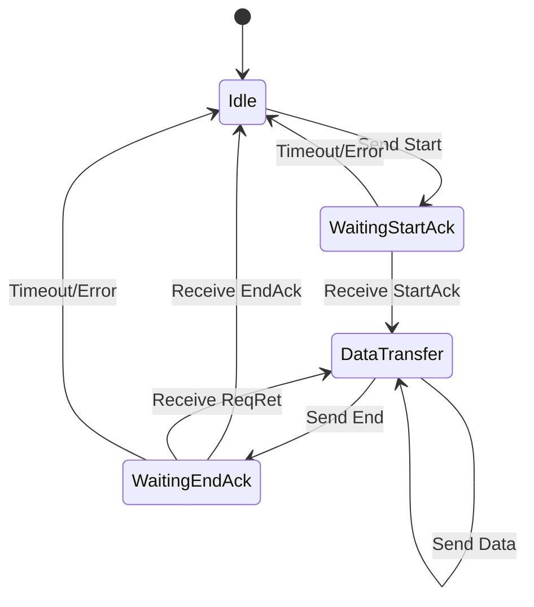

# Protocol Lifecycle

The Agent Sync Protocol implements a session-based synchronization mechanism with well-defined phases and message types. This document details the complete lifecycle of a synchronization session, including all message types and state transitions.

## Synchronization Phases

The protocol operates through three main phases:

1. **Idle Phase**: No active synchronization
2. **Session Establishment**: Start message and StartAck response
3. **Data Transfer**: Sending differences and handling retransmissions
4. **Session Completion**: End message and EndAck response

## Message Types

### 1. Start Message

Initiates a synchronization session.

**Direction**: Agent → Manager

**Content**:
- Synchronization mode (Full/Delta)
- Total number of differences to send

**FlatBuffer Schema**:
```
table Start {
    mode: Mode;
    size: uint64;
}
```

**State Transition**: `Idle` → `WaitingStartAck`

### 2. StartAck Message

Acknowledges session establishment and provides session ID.

**Direction**: Manager → Agent

**Content**:
- Acknowledgment status
- Session ID (unique identifier for this sync session)

**FlatBuffer Schema**:
```
table StartAck {
    status: Status;
    session: uint64;
}
```

**State Transition**: `WaitingStartAck` → `DataTransfer`

### 3. Data Message

Transmits individual differences to the manager.

**Direction**: Agent → Manager

**Content**:
- Sequence number
- Session ID
- Operation type (Upsert/Delete)
- Target index
- Data payload

**FlatBuffer Schema**:
```
table Data {
    seq: ulong;
    session: ulong;
    operation: Operation;
    id: string;
    index: string;
    data: [byte];
}
```

**State**: Remains in `DataTransfer`

### 4. End Message

Signals completion of data transmission.

**Direction**: Agent → Manager

**Content**:
- Session ID

**FlatBuffer Schema**:
```
table End {
    session: ulong;
}
```

**State Transition**: `DataTransfer` → `WaitingEndAck`

### 5. ReqRet Message (Request Retransmission)

Manager requests retransmission of specific data ranges.

**Direction**: Manager → Agent

**Content**:
- List of sequence number ranges to retransmit
- Session ID

**FlatBuffer Schema**:
```
table ReqRet {
    seq: [Pair];
    session: ulong;
}

table Pair {
    begin: ulong;
    end: ulong;
}
```

**State**: Remains in `DataTransfer`

**Agent Response**: Retransmits requested data messages

### 6. EndAck Message

Confirms successful session completion.

**Direction**: Manager → Agent

**Content**:
- Status (Success/Failed)
- Session ID

**FlatBuffer Schema**:
```
table EndAck {
    status: Status;
    session: ulong;
}
```

**State Transition**: `WaitingEndAck` → `Idle`

## Complete Synchronization Flow

### Successful Synchronization

```
Agent                                   Manager
  |                                        |
  |-------------- Start ---------------->  |
  |            (mode, count)               |
  |                                        |
  |<------------ StartAck ---------------- |
  |            (session_id)                |
  |                                        |
  |------------- Data[0] ----------------> |
  |------------- Data[1] ----------------> |
  |------------- Data[2] ----------------> |
  |              ...                       |
  |------------- Data[N] ----------------> |
  |                                        |
  |--------------- End ------------------> |
  |             (session_id)               |
  |                                        |
  |<------------- EndAck ----------------- |
  |              (success)                 |
  |                                        |
```

### Synchronization with Retransmission

```
Agent                                   Manager
  |                                        |
  |-------------- Start ---------------->  |
  |                                        |
  |<------------ StartAck ---------------- |
  |                                        |
  |------------- Data[0] ----------------> |
  |------------- Data[1] ----------------> |
  |------------- Data[2] -------X (lost)   |
  |------------- Data[3] ----------------> |
  |------------- Data[4] ----------------> |
  |                                        |
  |--------------- End ------------------> |
  |                                        |
  |<------------- ReqRet ----------------- |
  |           (ranges: [[2,2]])            |
  |                                        |
  |------------- Data[2] ----------------> | (retransmission)
  |                                        |
  |<------------- EndAck ----------------- |
  |                                        |
```

## State Machine



## Timeout and Retry Mechanism

### Timeout Handling

Each phase has specific timeout behaviors:

1. **WaitingStartAck**
   - Default timeout: 30 seconds
   - On timeout: Retry sending Start message
   - Max retries: Configurable (default 3)
   - After max retries: Abort synchronization

2. **DataTransfer**
   - No timeout for data sending
   - Flow control via EPS limiting

3. **WaitingEndAck**
   - Default timeout: 30 seconds
   - On timeout: Retry sending End message
   - Max retries: Configurable (default 3)
   - After max retries: Abort synchronization

## Error Handling

### Protocol Errors

1. **Invalid Session ID**
   - Manager sends message with wrong session ID
   - Agent logs error and continues waiting
   - Does not affect current synchronization

2. **Unexpected Message Type**
   - Receiving message out of sequence
   - Logged as warning
   - Current phase maintained

3. **Malformed Messages**
   - FlatBuffer parsing failures
   - Logged as error
   - Message ignored
