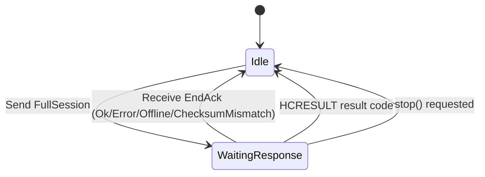

# Protocol Lifecycle

The Agent Sync Protocol sends a whole synchronization session as **one** FlatBuffer message (`FullSession`) and gets back **one** answer (`EndAck`). There is no `StartAck` round-trip, no per-item message exchange, and no retransmission-of-missing-ranges (`ReqRet`) — those existed only because the transport used to be a DGRAM socket bounded by `OS_MAXSTR` (65536 bytes), which forced a session to be split into many small messages. Over the agent's local `queue-sync` STREAM socket that bound is gone, so the session crosses whole.

## Synchronization Phases

The protocol operates through two phases, tracked in `AgentSyncProtocol::SyncPhase`:

1. **Idle**: no active synchronization.
2. **WaitingResponse**: the `FullSession` message has been handed to the transport; the calling thread blocks on a condition variable until `parseResponseBuffer()` (or the HTTPS transport's own result-code callback) reports a terminal outcome, or `stop()` is called.

There is no intermediate "waiting for StartAck" phase and no "processing, wait again" state: the manager's answer is terminal the moment it arrives.

## The `FullSession` Message

```flatbuffers
table Start {
    module: string;
    mode: Mode;
    size: ulong;
    index: [string];
    option: Option;
    architecture: string;
    hostname: string;
    osname: string;
    osplatform: string;
    ostype: string;
    osversion: string;
    agentversion: string;
    agentname: string;
    agentid: string;
    groups: [string];
    global_version: ulong;
    cluster_name: string;
}

table DataValue {
    seq: ulong;
    operation: Operation;
    id: string;
    index: string;
    version: ulong;
    data: [byte];
}

table DataContext {
    seq: ulong;
    id: string;
    index: string;
    data: [byte];
}

table DataClean {
    seq: ulong;
    index: string;
}

table ChecksumModule {
    index: string;
    checksum: string;
}

table SyncData {
    values: [DataValue];
    contexts: [DataContext];
}

table Cleans {
    items: [DataClean];
}

union SessionPayload {
    SyncData,
    Cleans,
    ChecksumModule
}

table End {
}

table FullSession {
    start: Start;
    payload: SessionPayload;
    end: End;
}
```

None of these tables carry a `session` field. The session id is chosen by the **agent** (`AgentSyncProtocol::nextSessionId()`) and is not part of any FlatBuffer table at all — it travels as a parameter of the transport call (`ISyncSessionTransport::sendSession(uint64_t session, ...)`), so a retried session keeps the same id and the manager can dedupe on it independently of the message body.

`payload` carries exactly one of three shapes, depending on what the session is for:

- **`SyncData`** — a module/metadata sync. `values` (`DataValue`, from `persistDifference(..., isDataContext=false)`) and `contexts` (`DataContext`, from `persistDifference(..., isDataContext=true)`) can both be populated in the same session: they are pulled from the same producer queue and travel together.
- **`Cleans`** — one `DataClean` per index, from `notifyDataClean()`. This is a real array: a session can clean several indices at once (e.g. FIM clearing files, registry keys, and registry values together).
- **`ChecksumModule`** — from `requiresFullSync()`. Referenced directly rather than wrapped in an array table, since an integrity check always covers exactly one index/module.
- **absent** — `synchronizeMetadataOrGroups()` sends `Start` and `End` with no payload at all.

A session is always exactly one of these — never a combination — which is why they are a `union` rather than four independent optional fields.

## The Response: `EndAck`

```flatbuffers
enum Status: byte {
    Ok,
    Error,
    Offline,
    ChecksumMismatch,
    Processing
}

table EndAck {
    status: Status;
}
```

`parseResponseBuffer()` only recognizes one message type: `Message` wrapping an `EndAck`. Handling (see `AgentSyncProtocol::parseResponseBuffer()`):

- **`Ok`**: success. `synchronizeModule()`/`notifyDataClean()` delete the synced items from the persistent queue; `requiresFullSync()` returns `false` (integrity valid).
- **`Error`**: generic protocol failure (`SyncResult::PROTOCOL_ERROR`). Items are reset to `PENDING` for the next cycle.
- **`Offline`**: the manager cannot serve this agent right now (`SyncResult::COMMUNICATION_ERROR`, `managerNotReady = true` on the result). Covers both a brief post-restart window and a lasting outage; see `SyncModuleResult::managerNotReady` / `consecutiveFailures` in the [API Reference](api-reference.md#result-type) for how callers tell them apart.
- **`ChecksumMismatch`**: only meaningful as the answer to a `ChecksumModule` session — `requiresFullSync()` returns `true` (full sync needed).
- **`Processing`**: defined in the schema's `Status` enum but not currently handled as an intermediate/"keep waiting" state by `AgentSyncProtocol` — there is no longer a separate `End` message to withhold, since `end` is part of the same `FullSession` the manager already received in full.

`parseResponseBuffer()` is one of two ways a result reaches the protocol. The other is `applyHttpResultCode(int resultCode, uint64_t expectedSession)`, used by the HTTPS transport path: it accepts a `"HCRESULT:<session>:<code>"` string (or the legacy `"HCRESULT:<code>"`, which skips session correlation) carrying the HTTP status code directly, without a FlatBuffer body at all. Either path ends in the same terminal `SyncResult`.

## State Machine


```mermaid
stateDiagram-v2
    [*] --> Idle

    Idle --> WaitingResponse: Send FullSession
    WaitingResponse --> Idle: Receive EndAck (Ok/Error/Offline/ChecksumMismatch)
    WaitingResponse --> Idle: HCRESULT result code
    WaitingResponse --> Idle: stop() requested
```

## Special Synchronization Flows

### Integrity Check (`requiresFullSync`)

```
Agent                                   Manager
  |                                        |
  |------------- FullSession ------------> |
  |   Start(mode=ModuleCheck)               |
  |   payload = ChecksumModule{index, sum}  |
  |   End                                  |
  |                                        |
  |<-------------- EndAck ----------------- |
  |     status: Ok | ChecksumMismatch       |
```

Returns `true` (full sync required) on `ChecksumMismatch`, `false` (integrity valid) on `Ok`.

### Metadata/Groups Sync (`synchronizeMetadataOrGroups`)

```
Agent                                   Manager
  |                                        |
  |------------- FullSession ------------> |
  |   Start(mode=MetadataDelta/            |
  |         MetadataCheck/GroupDelta/      |
  |         GroupCheck, global_version)    |
  |   (no payload)                         |
  |   End                                  |
  |                                        |
  |<-------------- EndAck ----------------- |
  |              status: Ok                |
```

### Data Clean Notification (`notifyDataClean`)

```
Agent                                   Manager
  |                                        |
  |------------- FullSession ------------> |
  |   Start(mode=DELTA, index=[...])       |
  |   payload = Cleans{                    |
  |     DataClean(index="fim_files"),      |
  |     DataClean(index="fim_registry")}   |
  |   End                                  |
  |                                        |
  |<-------------- EndAck ----------------- |
  |              status: Ok                |
  |                                        |
  | clearItemsByIndex() for each index     |
  | (local database cleanup)               |
```

### Full-Replace Recovery: DataClean Then DELTA

There is no `Mode::FULL`/in-memory recovery API anymore. `Mode::FULL` used to make the manager
`deleteByQuery` every index in `Start` unconditionally and then index whatever the agent sent in
that one session — safe only as long as the payload always went whole. Once DELTA sessions
started being byte-capped and split into blocks, stamping a byte-capped payload as `Mode::FULL`
would still trigger the unconditional delete, permanently losing whatever did not fit in that one
session (see the change that removed it).

A full-replace resync (recovery after a checksum mismatch, or a module's first sync) is instead
two ordinary operations already described above: a `Cleans` session to explicitly and scopedly
clear the target index, followed by a `Mode::DELTA` sync — itself already safely
block-splittable — of the freshly rebuilt snapshot, persisted through the normal
`persistDifference()`/persistent-queue path like any other delta.

```
Agent (recovery)                        Manager
  |                                        |
  |------------- FullSession ------------> |
  |   Start(mode=ModuleDelta, index=[idx]) |
  |   payload = Cleans{DataClean(index)}   |
  |   End                                  |
  |                                        |
  |<-------------- EndAck ----------------- |
  |              status: Ok                |
  |                                        |
  | persistDifference() x N                |
  | (fresh snapshot, persistent queue)     |
  |                                        |
  |------------- FullSession ------------> |
  |   Start(mode=ModuleDelta, size=N)      |
  |   payload = SyncData{values: [...]}    |
  |   End                                  |
  |                                        |
  |<-------------- EndAck ----------------- |
  |              status: Ok                |
```

### Delta Sync Split Into Multiple Sessions

`Mode::DELTA` reads from the persistent queue in blocks (`AgentSyncProtocol::synchronizeDeltaByBlocks()`), sending one `FullSession` per block until the queue is drained or `FULLSESSION_MAX_BLOCKS_PER_SYNC` is reached, each block capped at `FULLSESSION_MAX_BYTES` (`Option::VDFIRST`/`Option::VDSYNC` are exempt from the cap). Each block is its own independent `FullSession`/`EndAck` exchange with its own session id — a failure in one block does not roll back the others.

## Transport-Level Timeout and Retry

The sync protocol module does **not** impose a module-level response-wait timeout. Once a session is successfully submitted to the HTTPS transport's intake socket, the module waits indefinitely for the transport callback. The transport layer owns:

- **Per-request timeout** — `statefulTimeoutMs` (default 120 s per attempt, configurable via the HTTPS client configuration).
- **HTTP-level retries** — `STATEFUL_MAX_ATTEMPTS` (default 5 attempts with backoff).

The only retry that remains at the `sync_protocol` level is the fixed `SYNC_HANDOFF_RETRIES` constant (currently 3): how many times `runSession()` re-submits the same session to the local `queue-sync` intake socket if that socket is transiently unavailable (e.g. during an `agentd` restart between attempts). This is not caller-configurable and is a local hand-off concern, not an HTTP-level one.

When all transport attempts are exhausted, the callback fires with a non-OK result, the sync cycle fails, items are reset to `PENDING`, and the module's own periodic timer triggers the next attempt.

## Error Handling

### Protocol Errors

1. **Stale response**: `parseResponseBuffer()`/`applyHttpResultCode()` discard any response that arrives while the protocol is not in `WaitingResponse` phase, or (for `applyHttpResultCode`) whose session id does not match the in-flight one — logged at DEBUG, does not affect the current synchronization.
2. **Unknown message type**: logged at DEBUG, `parseResponseBuffer()` returns `false`.
3. **Malformed messages**: FlatBuffer verification failure or parse exception — logged as an error, message ignored.
