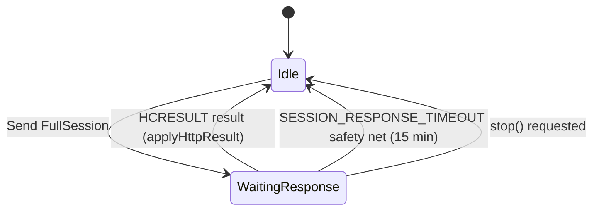

# Protocol Lifecycle

The Agent Sync Protocol sends a whole synchronization session as **one** FlatBuffer message (`FullSession`) and gets back **one** terminal answer — not as a FlatBuffer response message, but as the HTTP result of the `/stateful` request that carried the session, delivered to the module as an `HCRESULT:<session>:<code>:<body>` string. There is no `StartAck` round-trip, no per-item message exchange, and no retransmission-of-missing-ranges (`ReqRet`) — those existed only because the transport used to be a DGRAM socket bounded by `OS_MAXSTR` (65536 bytes), which forced a session to be split into many small messages. Over the agent's local `queue-sync` STREAM socket that bound is gone, so the session crosses whole.

## Synchronization Phases

The protocol operates through two phases, tracked in `AgentSyncProtocol::SyncPhase`:

1. **Idle**: no active synchronization.
2. **WaitingResponse**: the `FullSession` message has been handed to the transport; the calling thread blocks on a condition variable until `parseResponseBuffer()` (or the HTTPS transport's own result-code callback) reports a terminal outcome, or `stop()` is called.

There is no intermediate "waiting for StartAck" phase and no "processing, wait again" state: the manager's answer is terminal the moment it arrives.

## The `FullSession` Message

```flatbuffers
table Start {
    module: string;
    mode: Mode;
    index: [string];
    option: Option;
    architecture: string;
    hostname: string;
    osname: string;
    osplatform: string;
    ostype: string;
    osversion: string;
    agentversion: string;
    agentname: string;
    agentid: string;
    groups: [string];
    global_version: ulong;
    cluster_name: string;
    feed_offset: ulong;
}

table DataValue {
    operation: Operation;
    id: string;
    index: string;
    version: ulong;
    data: [byte];
}

table DataContext {
    id: string;
    index: string;
    data: [byte];
}

table DataClean {
    index: string;
}

table ChecksumModule {
    index: string;
    checksum: string;
}

table SyncData {
    values: [DataValue];
    contexts: [DataContext];
}

table Cleans {
    items: [DataClean];
}

union SessionPayload {
    SyncData,
    Cleans,
    ChecksumModule
}

table FullSession {
    start: Start;
    payload: SessionPayload;
}
```

There is no `End` table and no `end` field: the session's boundary is the `FullSession` message itself, not a trailing sentinel. `feed_offset` is populated only for the uncapped VD sync options (`Option::VDFirst`/`Option::VDSync`); the flatbuffers scalar default of 0 would otherwise be indistinguishable from "absent" for other flows, which is why it is gated on `option` rather than on the value being non-zero.

None of these tables carry a `session` field. The session id is chosen by the **agent** (`AgentSyncProtocol::nextSessionId()`) and is not part of any FlatBuffer table at all — it travels as a parameter of the transport call (`ISyncSessionTransport::sendSession(uint64_t session, ...)`), so a retried session keeps the same id and the manager can dedupe on it independently of the message body.

`payload` carries exactly one of three shapes, depending on what the session is for:

- **`SyncData`** — a module/metadata sync. `values` (`DataValue`, from `persistDifference(..., isDataContext=false)`) and `contexts` (`DataContext`, from `persistDifference(..., isDataContext=true)`) can both be populated in the same session: they are pulled from the same producer queue and travel together.
- **`Cleans`** — one `DataClean` per index, from `notifyDataClean()`. This is a real array: a session can clean several indices at once (e.g. FIM clearing files, registry keys, and registry values together).
- **`ChecksumModule`** — from `requiresFullSync()`. Referenced directly rather than wrapped in an array table, since an integrity check always covers exactly one index/module.
- **absent** — `synchronizeMetadataOrGroups()` sends only `Start`, with no payload set at all.

A session is always exactly one of these — never a combination — which is why they are a `union` rather than four independent optional fields.

## The Response: the `/stateful` HTTP Result

There is no FlatBuffer response message. The manager answers the `POST /stateful` request that carried the `FullSession` with a plain HTTP status code (and an optional JSON body), and that HTTP result *is* the session's outcome — there is no separate acknowledgement message to wait for on top of it.

That result crosses into the module through a string, not a FlatBuffer buffer. The HTTPS client fires its result callback for every outcome (success, HTTP error, timeout, transport abort) from within `wazuh-agentd`; the callback's result is bridged across a module-local socket to this library as:

```
HCRESULT:<session>:<http_code>:<body>
```

`AgentSyncProtocol::parseResponseBuffer(data, length)` is the entry point that receives this string. It verifies the `HCRESULT:` prefix, then splits on the first two colons to recover the session id, the HTTP status code, and the raw body (the body may itself contain colons, so only the first two are treated as delimiters). It then calls:

```cpp
bool applyHttpResult(int httpCode, std::string_view body, uint64_t expectedSession = 0);
```

`applyHttpResult()` (see `agent_sync_protocol.cpp`) is where the outcome is decided, entirely from `httpCode`; `body` is used only for logging:

- **Wrong phase, or `expectedSession` doesn't match the in-flight session**: the result is stale (a previous, already-timed-out session, or nothing in flight) — discarded, logged at DEBUG, returns `true` without touching state. A zero `expectedSession` skips this correlation check (the legacy `HCRESULT:<code>` form with no session number).
- **Any `2xx`**: success (`SyncResult::SUCCESS`). `synchronizeModule()`/`notifyDataClean()` delete the synced items from the persistent queue; `requiresFullSync()` returns `false` (integrity valid). Any 2xx counts, not just 200, since the `/stateful` contract already reserves 202 for a future queued-processing response.
- **`409`**: checksum mismatch (`SyncResult::CHECKSUM_ERROR`) — meaningful only as the answer to a `ChecksumModule` session; `requiresFullSync()` returns `true` (full sync needed).
- **`503`**: the manager cannot serve this agent right now (indexer down, at capacity, shutting down, or a VD feed still downloading) — `SyncResult::COMMUNICATION_ERROR`, `managerNotReady = true` on the result. Covers both a brief post-restart window and a lasting outage; see `SyncModuleResult::managerNotReady` / `consecutiveFailures` in the [API Reference](api-reference.md#result-type) for how callers tell them apart.
- **`415`**: the manager rejected the compressed encoding — treated the same as `503` (`COMMUNICATION_ERROR`, `managerNotReady = true`), since the agent's own `RetrySender` already retries once uncompressed within the same send.
- **`0`** (no HTTP response at all — timeout, connect failure, TLS failure, abort): also treated as `COMMUNICATION_ERROR` / `managerNotReady = true`.
- **`413`**: session rejected as larger than the manager's in-flight budget (`SyncResult::PAYLOAD_TOO_LARGE`) — the caller must split it.
- **everything else** (`400`, `403`, `500`, ...): generic protocol failure (`SyncResult::PROTOCOL_ERROR`). Items are reset to `PENDING` for the next cycle.

Because the whole exchange is one request/response instead of a message plus a separate ack, there is no intermediate "processing, keep waiting" state to model: the HTTP response is terminal the moment it arrives.

## State Machine


```mermaid
stateDiagram-v2
    [*] --> Idle

    Idle --> WaitingResponse: Send FullSession
    WaitingResponse --> Idle: HCRESULT result (applyHttpResult)
    WaitingResponse --> Idle: SESSION_RESPONSE_TIMEOUT safety net (15 min)
    WaitingResponse --> Idle: stop() requested
```

## Special Synchronization Flows

### Integrity Check (`requiresFullSync`)

```
Agent                                   Manager
  |                                        |
  |------------- FullSession ------------> |
  |   Start(mode=ModuleCheck)               |
  |   payload = ChecksumModule{index, sum}  |
  |                                        |
  |<--- HCRESULT:<session>:200|409:<body> - |
```

Returns `true` (full sync required) on HTTP `409` (`SyncResult::CHECKSUM_ERROR`), `false` (integrity valid) on any `2xx`.

### Metadata/Groups Sync (`synchronizeMetadataOrGroups`)

```
Agent                                   Manager
  |                                        |
  |------------- FullSession ------------> |
  |   Start(mode=MetadataDelta/            |
  |         MetadataCheck/GroupDelta/      |
  |         GroupCheck, global_version)    |
  |   (no payload)                         |
  |                                        |
  |<---- HCRESULT:<session>:200:<body> --- |
```

### Data Clean Notification (`notifyDataClean`)

```
Agent                                   Manager
  |                                        |
  |------------- FullSession ------------> |
  |   Start(mode=DELTA, index=[...])       |
  |   payload = Cleans{                    |
  |     DataClean(index="fim_files"),      |
  |     DataClean(index="fim_registry")}   |
  |                                        |
  |<---- HCRESULT:<session>:200:<body> --- |
  |                                        |
  | clearItemsByIndex() for each index     |
  | (local database cleanup)               |
```

### Full-Replace Recovery: DataClean Then DELTA

There is no `Mode::FULL`/in-memory recovery API anymore. `Mode::FULL` used to make the manager
`deleteByQuery` every index in `Start` unconditionally and then index whatever the agent sent in
that one session — safe only as long as the payload always went whole. Once DELTA sessions
started being byte-capped and split into blocks, stamping a byte-capped payload as `Mode::FULL`
would still trigger the unconditional delete, permanently losing whatever did not fit in that one
session (see the change that removed it).

A full-replace resync (recovery after a checksum mismatch, or a module's first sync) is instead
two ordinary operations already described above: a `Cleans` session to explicitly and scopedly
clear the target index, followed by a `Mode::DELTA` sync — itself already safely
block-splittable — of the freshly rebuilt snapshot, persisted through the normal
`persistDifference()`/persistent-queue path like any other delta.

```
Agent (recovery)                        Manager
  |                                        |
  |------------- FullSession ------------> |
  |   Start(mode=ModuleDelta, index=[idx]) |
  |   payload = Cleans{DataClean(index)}   |
  |                                        |
  |<---- HCRESULT:<session>:200:<body> --- |
  |                                        |
  | persistDifference() x N                |
  | (fresh snapshot, persistent queue)     |
  |                                        |
  |------------- FullSession ------------> |
  |   Start(mode=ModuleDelta)              |
  |   payload = SyncData{values: [...]}    |
  |                                        |
  |<---- HCRESULT:<session>:200:<body> --- |
```

### Delta Sync Split Into Multiple Sessions

`Mode::DELTA` reads from the persistent queue in blocks (`AgentSyncProtocol::synchronizeDeltaByBlocks()`), sending one `FullSession` per block until the queue is drained or `FULLSESSION_MAX_BLOCKS_PER_SYNC` is reached, each block capped at `FULLSESSION_MAX_BYTES` (`Option::VDFIRST`/`Option::VDSYNC` are exempt from the cap). Each block is its own independent `FullSession`/HTTP-result exchange with its own session id — a failure in one block does not roll back the others.

## Transport-Level Timeout and Retry

The sync protocol module does **not** impose an aggressive, normal-path response-wait timeout: once a session is successfully submitted to the HTTPS transport's intake socket, `runSession()` blocks on a condition variable that is meant to be woken by the manager's answer arriving as an `HCRESULT` (via `parseResponseBuffer()`/`applyHttpResult()`), not by a clock.

It does define an explicit upper bound as a safety net, though: `SESSION_RESPONSE_TIMEOUT` (15 minutes, `agent_sync_protocol.hpp`) unblocks that wait if no result ever arrives. The code's own comment is explicit that this is "a safety net, not a normal-path timeout": the HTTPS client fires its result callback for every outcome (200, error, timeout, abort) from within `wazuh-agentd`, but that result still has to cross the C bridge (`https_client_bridge.c`) and a module-local socket to reach this wait — a hop that can silently drop it (no route for the session, a full module socket, a `send()` failure). The 15-minute value is set well above `https_client`'s own worst case for one `/stateful` session (5 attempts × 120 s `statefulTimeoutMs` + backoff, ~14 minutes), so it is only expected to fire on an actual delivery failure, never on a slow-but-alive manager. When it does fire, `SyncResult::END_TIMEOUT_ERROR` is recorded and `lastSyncManagerNotReady` is set.

Below that safety net, the transport layer owns its own bounds:

- **Per-request timeout** — `statefulTimeoutMs` (default 120 s per attempt, configurable via the HTTPS client configuration).
- **HTTP-level retries** — `STATEFUL_MAX_ATTEMPTS` (default 5 attempts with backoff).

The only retry that remains at the `sync_protocol` level is the fixed `SYNC_HANDOFF_RETRIES` constant (currently 3): how many times `runSession()` re-submits the same session to the local `queue-sync` intake socket if that socket is transiently unavailable (e.g. during an `agentd` restart between attempts). This is not caller-configurable and is a local hand-off concern, not an HTTP-level one.

When all transport attempts are exhausted, the callback fires with a non-OK result, the sync cycle fails, items are reset to `PENDING`, and the module's own periodic timer triggers the next attempt.

## Error Handling

### Protocol Errors

1. **Stale response**: `applyHttpResult()` discards any response that arrives while the protocol is not in `WaitingResponse` phase, or whose session id does not match the in-flight one (`expectedSession != currentSession`) — logged at DEBUG, returns `true` without affecting the current synchronization.
2. **Non-HCRESULT payload**: `parseResponseBuffer()` returns `false` and logs an error if the buffer does not start with the `HCRESULT:` prefix, or if the `<session>:<code>` fields cannot be located (fewer than two colons after the prefix).
3. **Malformed payload**: an exception while decoding the session id or HTTP code (e.g. a non-numeric field) is caught, logged as an error, and the response is ignored.
