# Sequence Diagrams

This document provides visual representations of the interactions between modules and the Agent Sync Protocol during various synchronization scenarios.

## Module Integration Flow

### Initial Setup and Registration

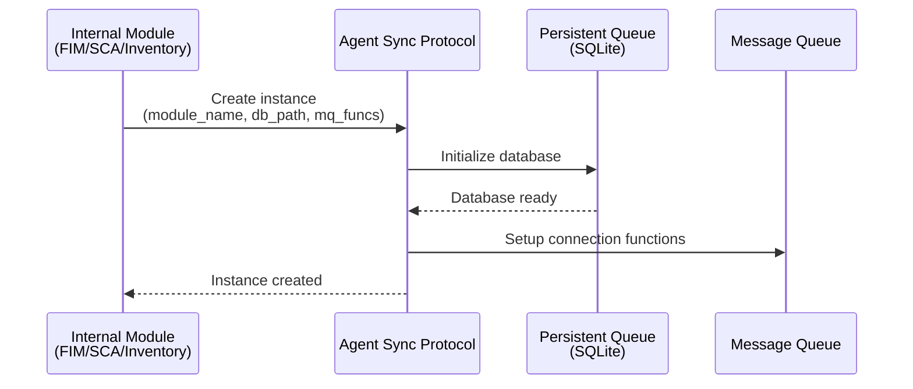

### Data Persistence Flow

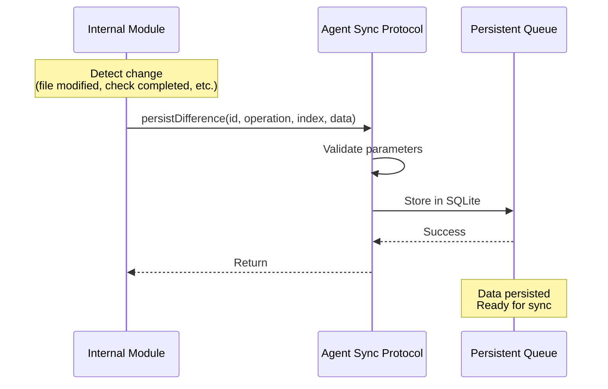

## Synchronization Flows

### Successful Delta Synchronization

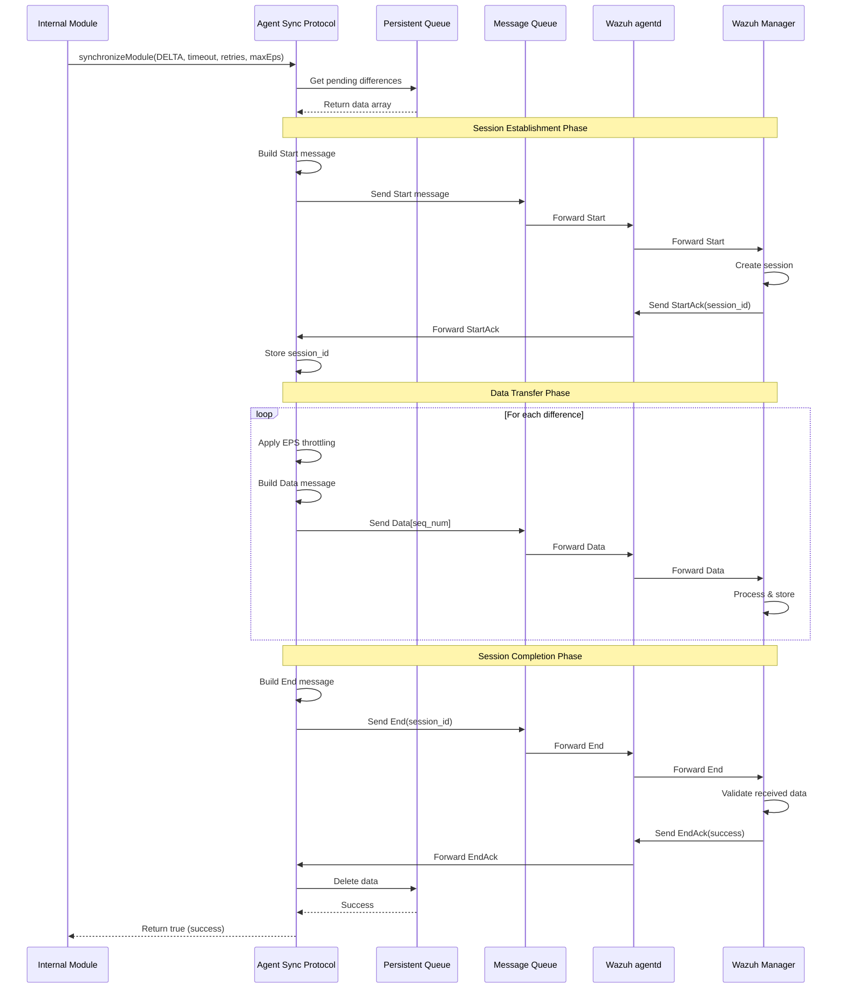

### Synchronization with Retransmission Request

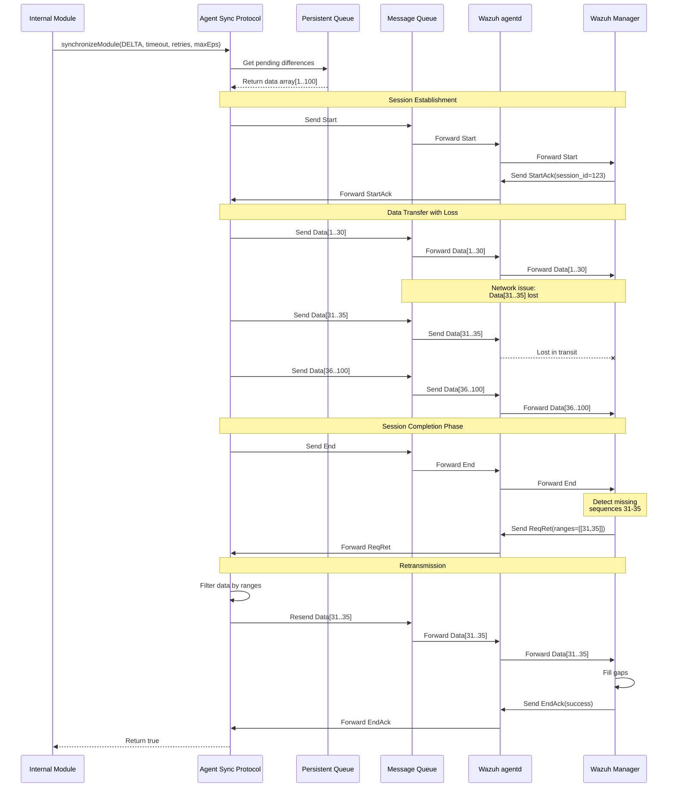

### Failed Synchronization with Retry

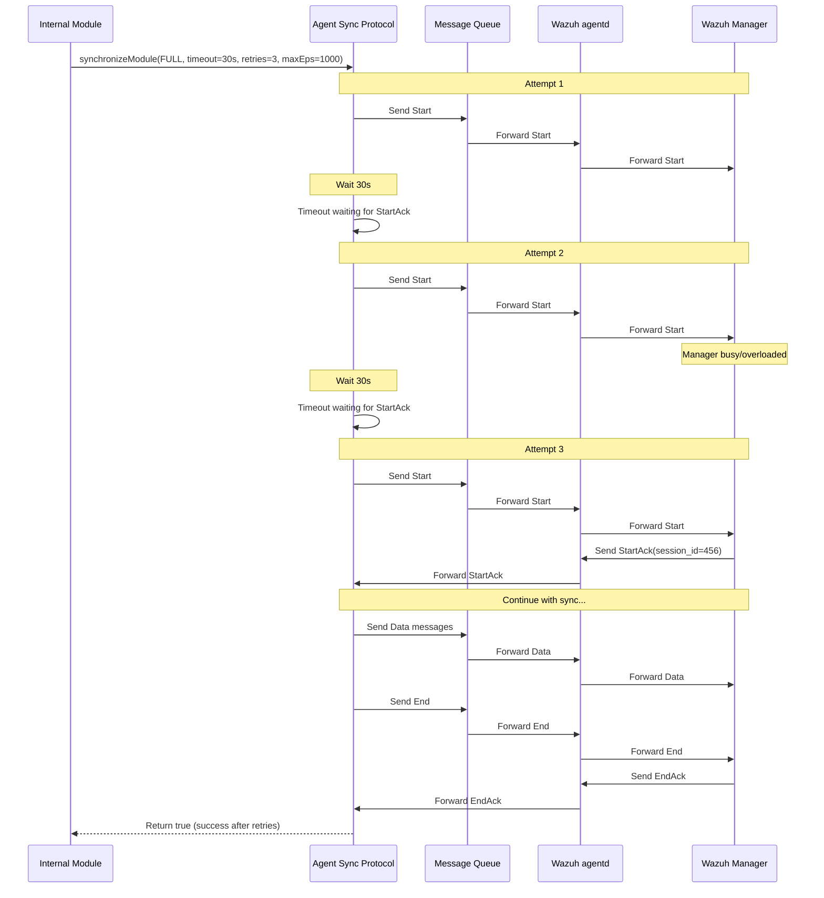

## Error Handling Scenarios

### Manager Error Response

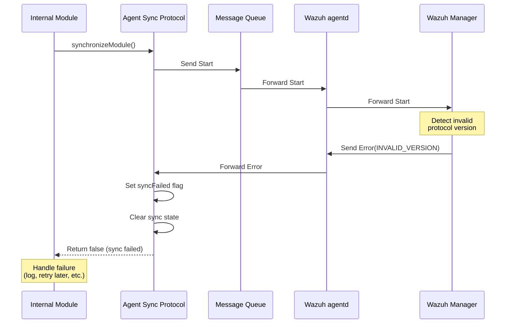

## Response Handling Flow

### Asynchronous Response Processing

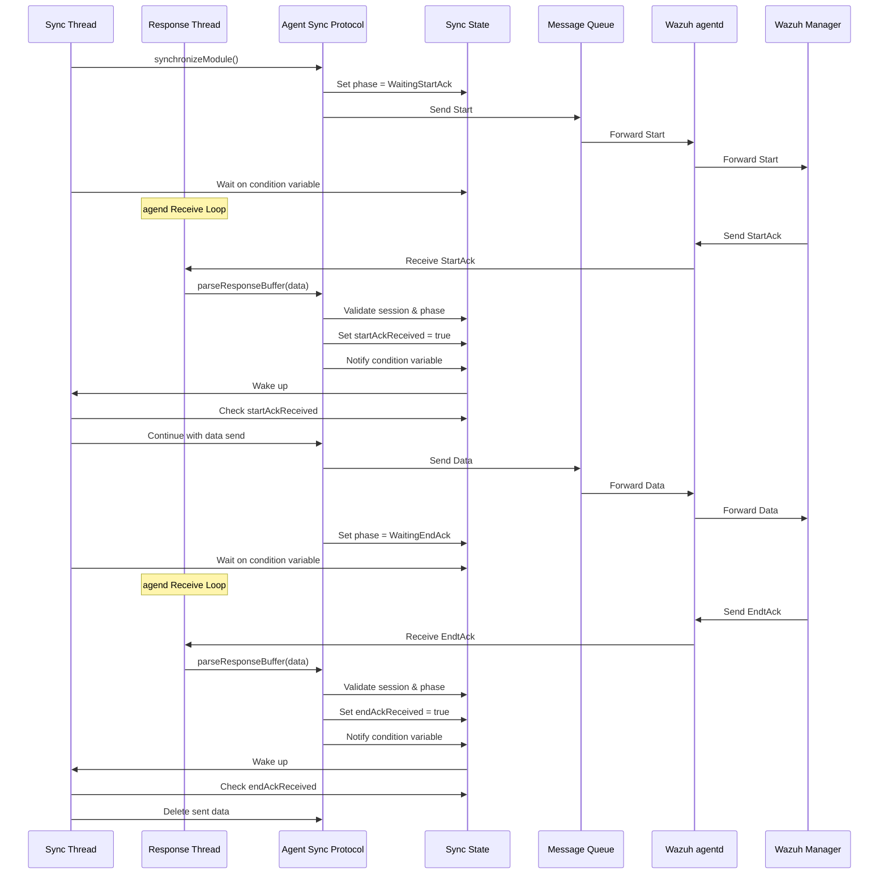

### Integrity Check Flow (requiresFullSync)

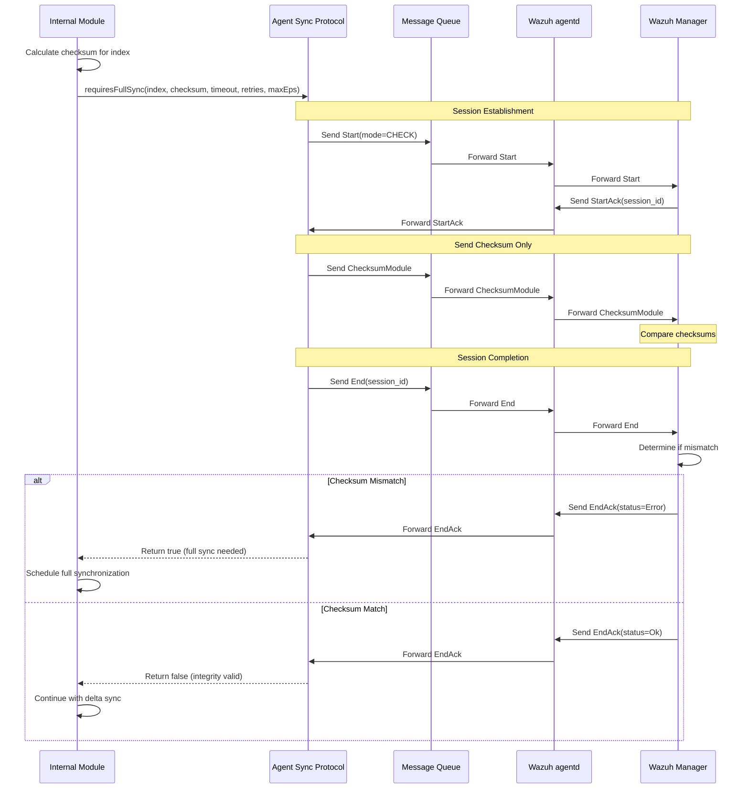

### In-Memory Recovery Flow

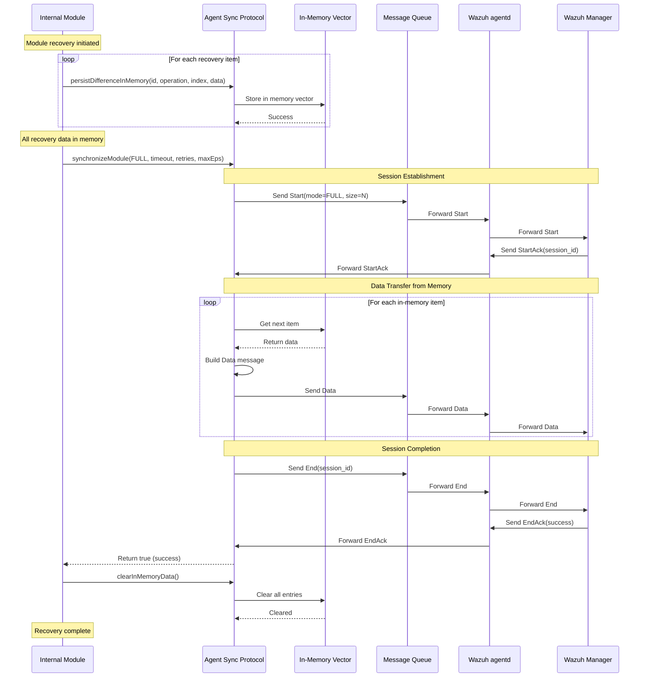

### Metadata/Groups Synchronization Flow

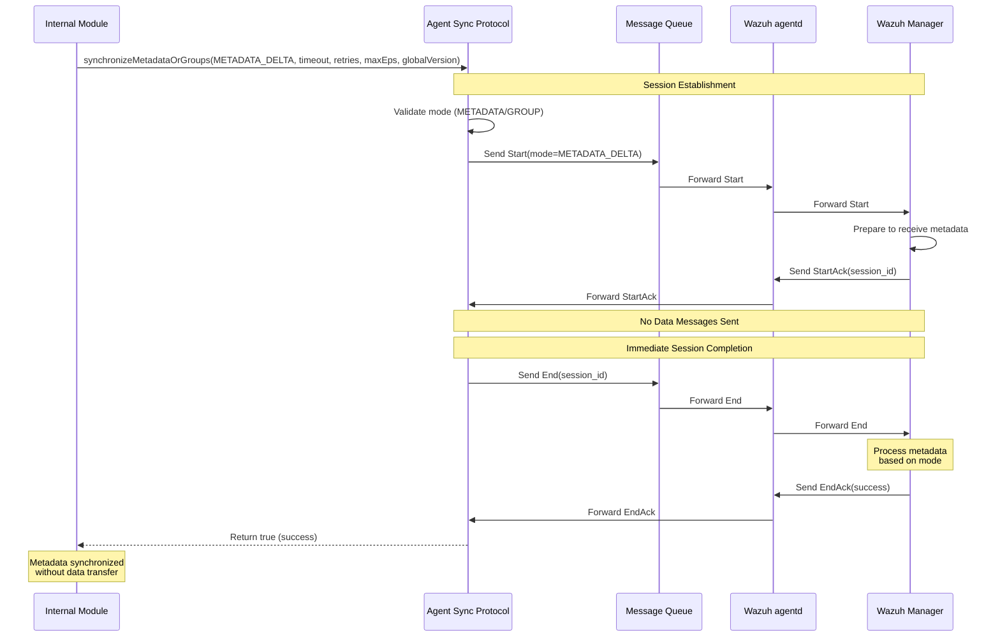

### Data Clean Notification Flow

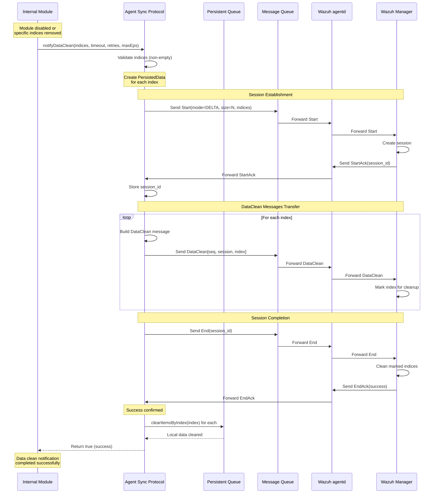
