# Sequence Diagrams

This document provides visual representations of the interactions between modules and the Agent Sync Protocol during various synchronization scenarios. Every scenario below sends **one** `FullSession` message and gets back **one** terminal answer — the HTTP result of the `/stateful` request that carried it, delivered back as an `HCRESULT:<session>:<code>:<body>` string and applied via `applyHttpResult()`. There is no FlatBuffer response message. See [Protocol Lifecycle](lifecycle.md) for the message-level detail behind these diagrams.

Participants used throughout:

- **Module** — the internal module (FIM/SCA/Syscollector/agent-info) driving the protocol.
- **ASP** — `AgentSyncProtocol`.
- **Queue** — the SQLite-backed persistent queue.
- **Transport** — `SyncSocketTransport`, which streams the session over the agent's local `queue-sync` socket.
- **AD** — `agentd`'s intake process, which hands the session to `https_client` and relays its HTTP result back as an `HCRESULT:<session>:<code>:<body>` string.
- **Manager** — the Wazuh Manager, reached over HTTPS.

## Module Integration Flow

### Initial Setup

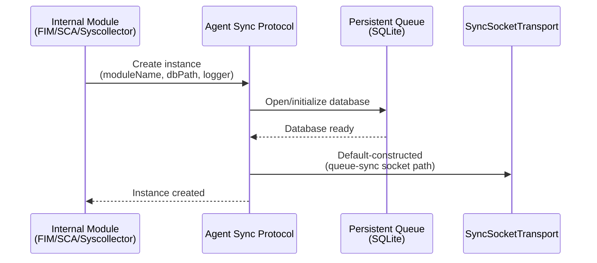
```mermaid
sequenceDiagram
    participant Module as Internal Module<br/>(FIM/SCA/Syscollector)
    participant ASP as Agent Sync Protocol
    participant Queue as Persistent Queue<br/>(SQLite)
    participant Transport as SyncSocketTransport

    Module->>ASP: Create instance<br/>(moduleName, dbPath, logger)
    ASP->>Queue: Open/initialize database
    Queue-->>ASP: Database ready
    ASP->>Transport: Default-constructed<br/>(queue-sync socket path)
    ASP-->>Module: Instance created
```

### Data Persistence Flow

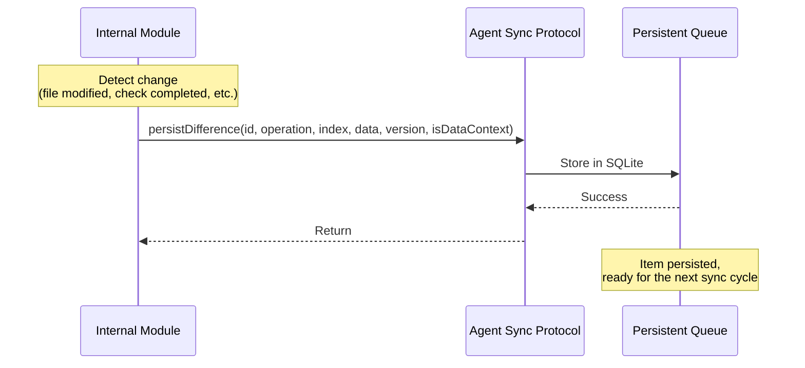
```mermaid
sequenceDiagram
    participant Module as Internal Module
    participant ASP as Agent Sync Protocol
    participant Queue as Persistent Queue

    Note over Module: Detect change<br/>(file modified, check completed, etc.)

    Module->>ASP: persistDifference(id, operation, index, data, version, isDataContext)
    ASP->>Queue: Store in SQLite
    Queue-->>ASP: Success
    ASP-->>Module: Return

    Note over Queue: Item persisted,<br/>ready for the next sync cycle
```

## Synchronization Flows

### Successful Delta Synchronization (mixed `DataValue` + `DataContext`)

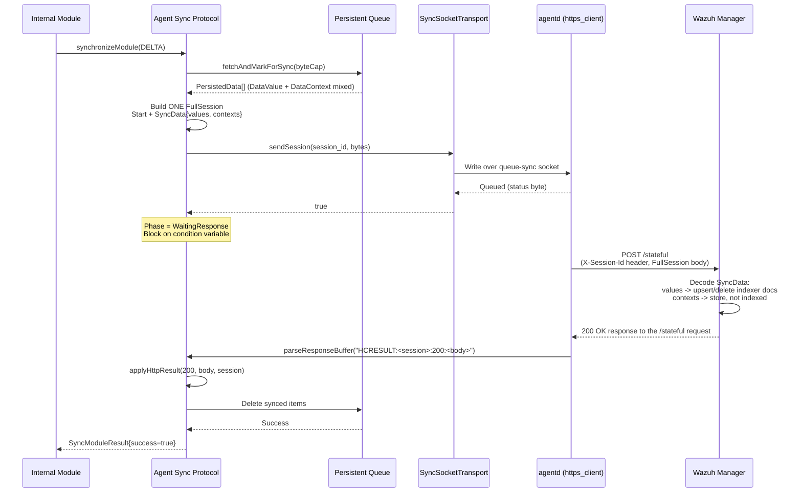
```mermaid
sequenceDiagram
    participant Module as Internal Module
    participant ASP as Agent Sync Protocol
    participant Queue as Persistent Queue
    participant Transport as SyncSocketTransport
    participant AD as agentd (https_client)
    participant Manager as Wazuh Manager

    Module->>ASP: synchronizeModule(DELTA)
    ASP->>Queue: fetchAndMarkForSync(byteCap)
    Queue-->>ASP: PersistedData[] (DataValue + DataContext mixed)

    ASP->>ASP: Build ONE FullSession<br/>Start + SyncData{values, contexts}
    ASP->>Transport: sendSession(session_id, bytes)
    Transport->>AD: Write over queue-sync socket
    AD-->>Transport: Queued (status byte)
    Transport-->>ASP: true

    Note over ASP: Phase = WaitingResponse<br/>Block on condition variable

    AD->>Manager: POST /stateful<br/>(X-Session-Id header, FullSession body)
    Manager->>Manager: Decode SyncData:<br/>values -> upsert/delete indexer docs<br/>contexts -> store, not indexed
    Manager-->>AD: 200 OK response to the /stateful request
    AD->>ASP: parseResponseBuffer("HCRESULT:<session>:200:<body>")
    ASP->>ASP: applyHttpResult(200, body, session)
    ASP->>Queue: Delete synced items
    Queue-->>ASP: Success

    ASP-->>Module: SyncModuleResult{success=true}
```

### Delta Sync Split Into Multiple Blocks

`Mode::DELTA` splits the queue into as many `FullSession`s as needed to stay under `FULLSESSION_MAX_BYTES`; each block is its own independent session with its own session id.

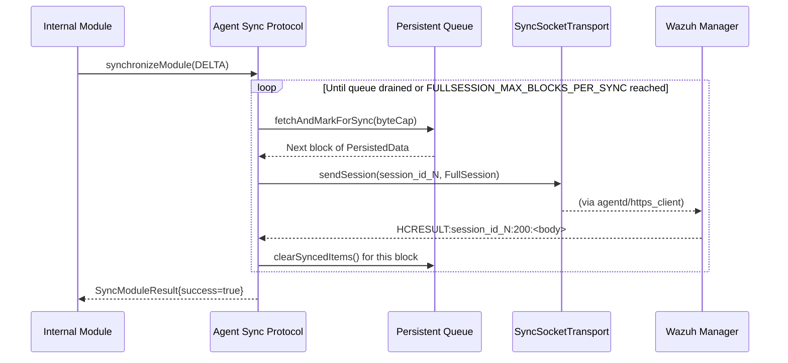
```mermaid
sequenceDiagram
    participant Module as Internal Module
    participant ASP as Agent Sync Protocol
    participant Queue as Persistent Queue
    participant Transport as SyncSocketTransport
    participant Manager as Wazuh Manager

    Module->>ASP: synchronizeModule(DELTA)

    loop Until queue drained or FULLSESSION_MAX_BLOCKS_PER_SYNC reached
        ASP->>Queue: fetchAndMarkForSync(byteCap)
        Queue-->>ASP: Next block of PersistedData
        ASP->>Transport: sendSession(session_id_N, FullSession)
        Transport-->>Manager: (via agentd/https_client)
        Manager-->>ASP: HCRESULT:session_id_N:200:<body>
        ASP->>Queue: clearSyncedItems() for this block
    end

    ASP-->>Module: SyncModuleResult{success=true}
```

### Integrity Check Flow (`requiresFullSync`)

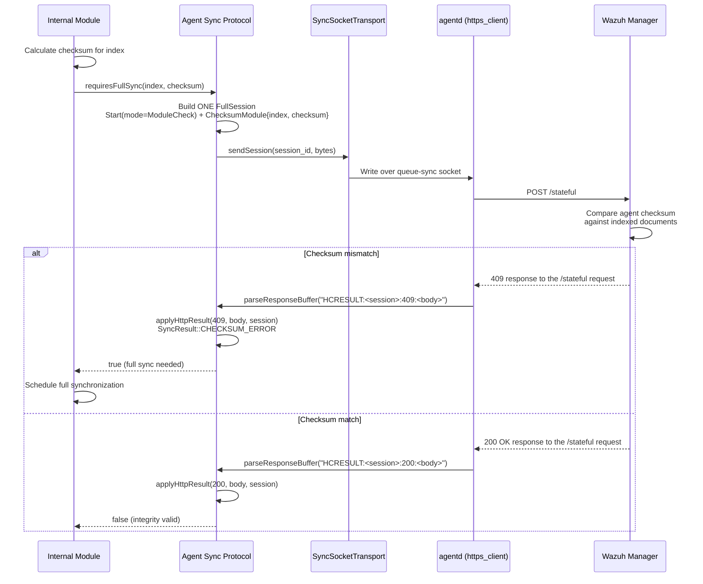
```mermaid
sequenceDiagram
    participant Module as Internal Module
    participant ASP as Agent Sync Protocol
    participant Transport as SyncSocketTransport
    participant AD as agentd (https_client)
    participant Manager as Wazuh Manager

    Module->>Module: Calculate checksum for index
    Module->>ASP: requiresFullSync(index, checksum)

    ASP->>ASP: Build ONE FullSession<br/>Start(mode=ModuleCheck) + ChecksumModule{index, checksum}
    ASP->>Transport: sendSession(session_id, bytes)
    Transport->>AD: Write over queue-sync socket
    AD->>Manager: POST /stateful

    Manager->>Manager: Compare agent checksum<br/>against indexed documents

    alt Checksum mismatch
        Manager-->>AD: 409 response to the /stateful request
        AD->>ASP: parseResponseBuffer("HCRESULT:<session>:409:<body>")
        ASP->>ASP: applyHttpResult(409, body, session)<br/>SyncResult::CHECKSUM_ERROR
        ASP-->>Module: true (full sync needed)
        Module->>Module: Schedule full synchronization
    else Checksum match
        Manager-->>AD: 200 OK response to the /stateful request
        AD->>ASP: parseResponseBuffer("HCRESULT:<session>:200:<body>")
        ASP->>ASP: applyHttpResult(200, body, session)
        ASP-->>Module: false (integrity valid)
    end
```

### Metadata/Groups Synchronization Flow

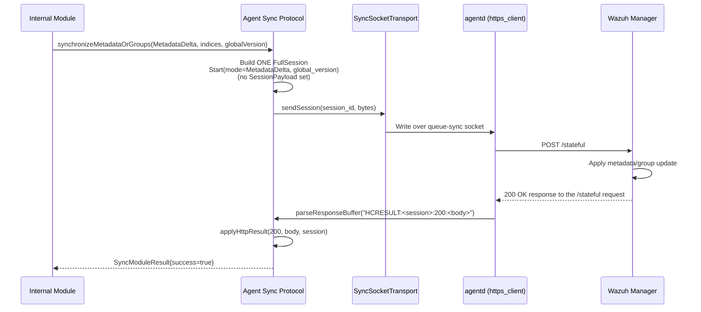
```mermaid
sequenceDiagram
    participant Module as Internal Module
    participant ASP as Agent Sync Protocol
    participant Transport as SyncSocketTransport
    participant AD as agentd (https_client)
    participant Manager as Wazuh Manager

    Module->>ASP: synchronizeMetadataOrGroups(MetadataDelta, indices, globalVersion)

    ASP->>ASP: Build ONE FullSession<br/>Start(mode=MetadataDelta, global_version)<br/>(no SessionPayload set)
    ASP->>Transport: sendSession(session_id, bytes)
    Transport->>AD: Write over queue-sync socket
    AD->>Manager: POST /stateful

    Manager->>Manager: Apply metadata/group update

    Manager-->>AD: 200 OK response to the /stateful request
    AD->>ASP: parseResponseBuffer("HCRESULT:<session>:200:<body>")
    ASP->>ASP: applyHttpResult(200, body, session)
    ASP-->>Module: SyncModuleResult{success=true}
```

### Data Clean Notification Flow

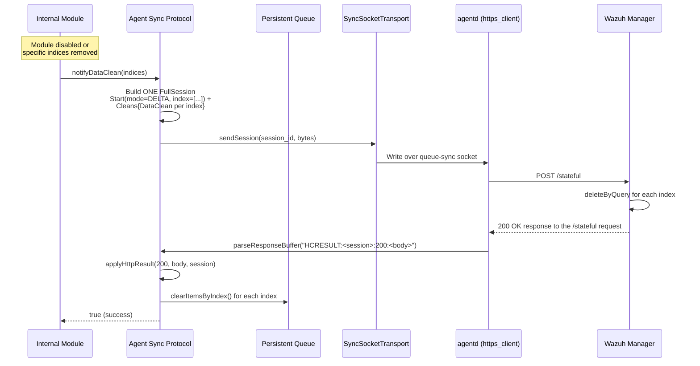
```mermaid
sequenceDiagram
    participant Module as Internal Module
    participant ASP as Agent Sync Protocol
    participant Queue as Persistent Queue
    participant Transport as SyncSocketTransport
    participant AD as agentd (https_client)
    participant Manager as Wazuh Manager

    Note over Module: Module disabled or<br/>specific indices removed

    Module->>ASP: notifyDataClean(indices)

    ASP->>ASP: Build ONE FullSession<br/>Start(mode=DELTA, index=[...]) +<br/>Cleans{DataClean per index}
    ASP->>Transport: sendSession(session_id, bytes)
    Transport->>AD: Write over queue-sync socket
    AD->>Manager: POST /stateful

    Manager->>Manager: deleteByQuery for each index

    Manager-->>AD: 200 OK response to the /stateful request
    AD->>ASP: parseResponseBuffer("HCRESULT:<session>:200:<body>")
    ASP->>ASP: applyHttpResult(200, body, session)
    ASP->>Queue: clearItemsByIndex() for each index

    ASP-->>Module: true (success)
```

### Full-Replace Recovery Flow (DataClean + DELTA)

There is no in-memory recovery API or `Mode::FULL` anymore (see [Protocol Lifecycle](lifecycle.md#full-replace-recovery-dataclean-then-delta) for why). Recovery is a `notifyDataClean()` call followed by an ordinary persisted-queue `Mode::DELTA` sync of the fresh snapshot:

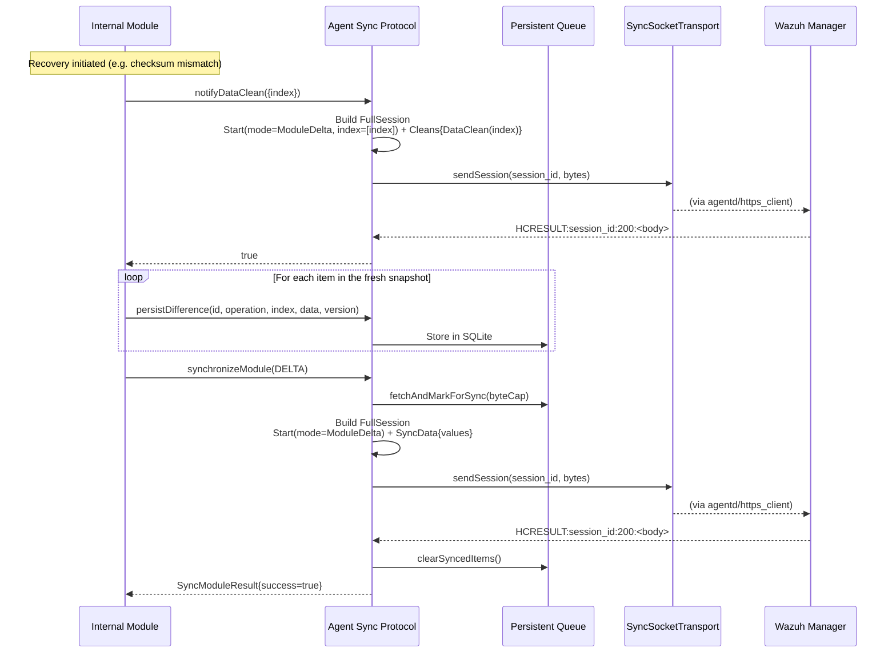
```mermaid
sequenceDiagram
    participant Module as Internal Module
    participant ASP as Agent Sync Protocol
    participant Queue as Persistent Queue
    participant Transport as SyncSocketTransport
    participant Manager as Wazuh Manager

    Note over Module: Recovery initiated (e.g. checksum mismatch)

    Module->>ASP: notifyDataClean({index})
    ASP->>ASP: Build FullSession<br/>Start(mode=ModuleDelta, index=[index]) + Cleans{DataClean(index)}
    ASP->>Transport: sendSession(session_id, bytes)
    Transport-->>Manager: (via agentd/https_client)
    Manager-->>ASP: HCRESULT:session_id:200:<body>
    ASP-->>Module: true

    loop For each item in the fresh snapshot
        Module->>ASP: persistDifference(id, operation, index, data, version)
        ASP->>Queue: Store in SQLite
    end

    Module->>ASP: synchronizeModule(DELTA)
    ASP->>Queue: fetchAndMarkForSync(byteCap)
    ASP->>ASP: Build FullSession<br/>Start(mode=ModuleDelta) + SyncData{values}
    ASP->>Transport: sendSession(session_id, bytes)
    Transport-->>Manager: (via agentd/https_client)
    Manager-->>ASP: HCRESULT:session_id:200:<body>
    ASP->>Queue: clearSyncedItems()

    ASP-->>Module: SyncModuleResult{success=true}
```

## Error Handling Scenarios

### Manager Reports Offline / Not Ready

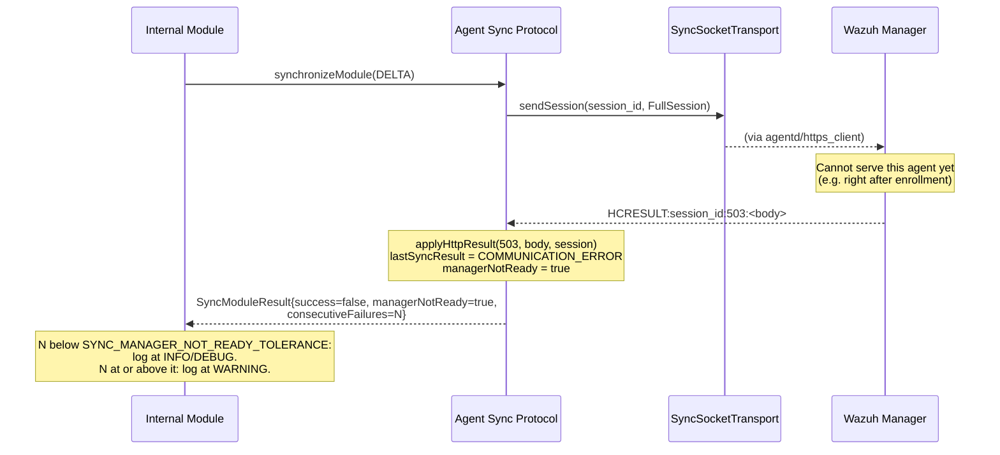
```mermaid
sequenceDiagram
    participant Module as Internal Module
    participant ASP as Agent Sync Protocol
    participant Transport as SyncSocketTransport
    participant Manager as Wazuh Manager

    Module->>ASP: synchronizeModule(DELTA)
    ASP->>Transport: sendSession(session_id, FullSession)
    Transport-->>Manager: (via agentd/https_client)

    Note over Manager: Cannot serve this agent yet<br/>(e.g. right after enrollment)

    Manager-->>ASP: HCRESULT:session_id:503:<body>
    Note over ASP: applyHttpResult(503, body, session)<br/>lastSyncResult = COMMUNICATION_ERROR<br/>managerNotReady = true

    ASP-->>Module: SyncModuleResult{success=false, managerNotReady=true,<br/>consecutiveFailures=N}
    Note over Module: N below SYNC_MANAGER_NOT_READY_TOLERANCE:<br/>log at INFO/DEBUG.<br/>N at or above it: log at WARNING.
```

### Manager Error Response

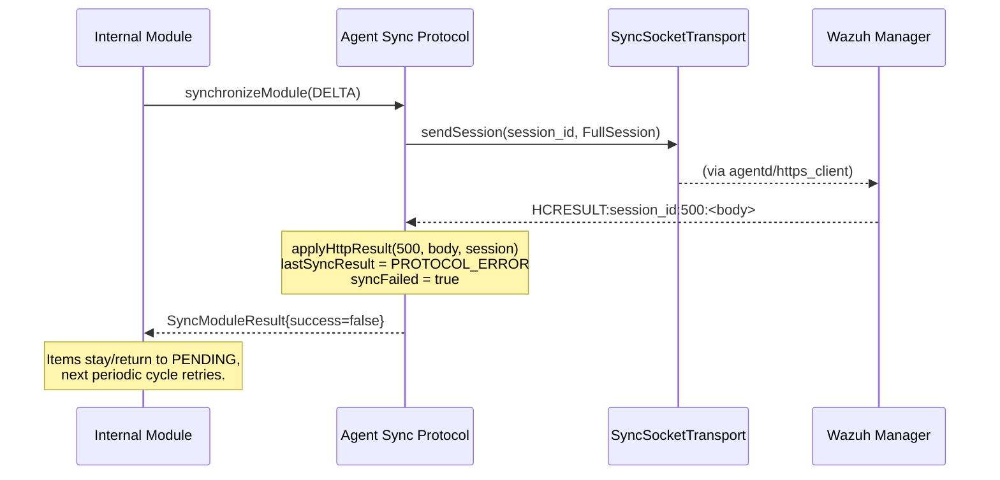
```mermaid
sequenceDiagram
    participant Module as Internal Module
    participant ASP as Agent Sync Protocol
    participant Transport as SyncSocketTransport
    participant Manager as Wazuh Manager

    Module->>ASP: synchronizeModule(DELTA)
    ASP->>Transport: sendSession(session_id, FullSession)
    Transport-->>Manager: (via agentd/https_client)

    Manager-->>ASP: HCRESULT:session_id:500:<body>
    Note over ASP: applyHttpResult(500, body, session)<br/>lastSyncResult = PROTOCOL_ERROR<br/>syncFailed = true

    ASP-->>Module: SyncModuleResult{success=false}
    Note over Module: Items stay/return to PENDING,<br/>next periodic cycle retries.
```

### Stop Requested While Waiting for a Response

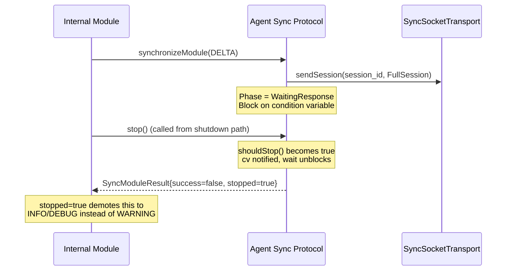
```mermaid
sequenceDiagram
    participant Module as Internal Module
    participant ASP as Agent Sync Protocol
    participant Transport as SyncSocketTransport

    Module->>ASP: synchronizeModule(DELTA)
    ASP->>Transport: sendSession(session_id, FullSession)
    Note over ASP: Phase = WaitingResponse<br/>Block on condition variable

    Module->>ASP: stop() (called from shutdown path)
    Note over ASP: shouldStop() becomes true<br/>cv notified, wait unblocks

    ASP-->>Module: SyncModuleResult{success=false, stopped=true}
    Note over Module: stopped=true demotes this to<br/>INFO/DEBUG instead of WARNING
```

## Response Handling Flow

### The HCRESULT Path Into `AgentSyncProtocol`

There is a single, terminal path by which the manager's verdict reaches the protocol: the HTTP result of the `/stateful` request that carried the session, bridged back as an `HCRESULT:<session>:<code>:<body>` string and applied through `applyHttpResult()`. There is no FlatBuffer response message.

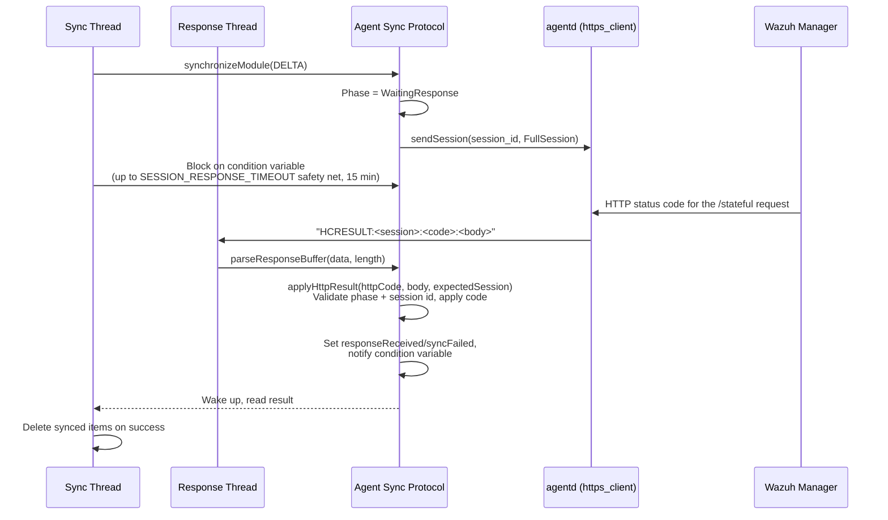
```mermaid
sequenceDiagram
    participant SyncThread as Sync Thread
    participant ResponseThread as Response Thread
    participant ASP as Agent Sync Protocol
    participant AD as agentd (https_client)
    participant Manager as Wazuh Manager

    SyncThread->>ASP: synchronizeModule(DELTA)
    ASP->>ASP: Phase = WaitingResponse
    ASP->>AD: sendSession(session_id, FullSession)
    SyncThread->>ASP: Block on condition variable<br/>(up to SESSION_RESPONSE_TIMEOUT safety net, 15 min)

    Manager->>AD: HTTP status code for the /stateful request
    AD->>ResponseThread: "HCRESULT:<session>:<code>:<body>"
    ResponseThread->>ASP: parseResponseBuffer(data, length)
    ASP->>ASP: applyHttpResult(httpCode, body, expectedSession)<br/>Validate phase + session id, apply code

    ASP->>ASP: Set responseReceived/syncFailed,<br/>notify condition variable
    ASP-->>SyncThread: Wake up, read result
    SyncThread->>SyncThread: Delete synced items on success
```
