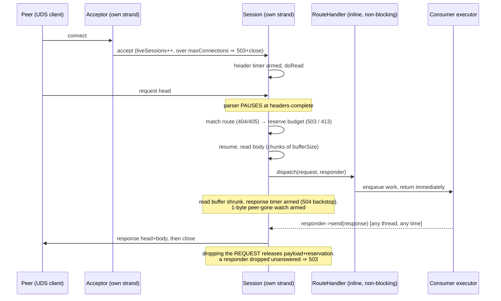
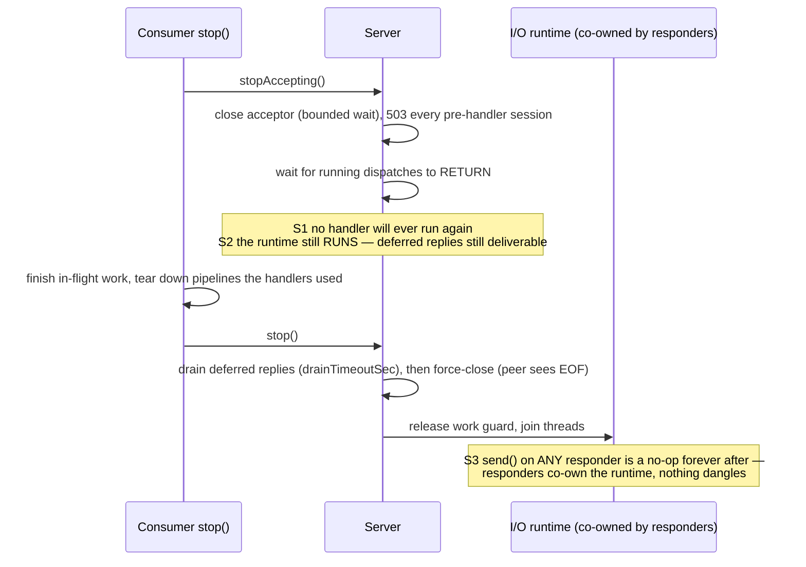
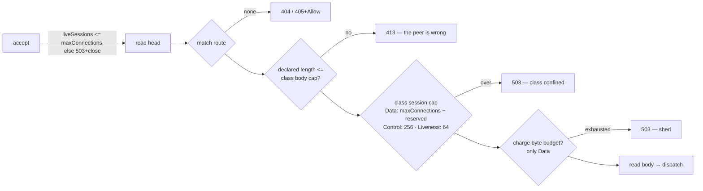

# Architecture

Three mechanisms carry the design: an asynchronous request pipeline with deferred
responses, a two-phase shutdown with named guarantees, and route classes that let one
server host a sheddable data plane without starving control traffic.

*Diagram source of truth: `src/shared_modules/uds_http_server/README.md`.*

## Request pipeline

One connection, from accept to reply — the deferred path included. A handler may return
without answering, keep its responder, and `send()` minutes later from any thread;
`send()` is exactly-once and is a defined no-op after `stop()`.

## Two-phase shutdown (S1/S2/S3)

Designed to fit a daemon's 30-second stop window: `stopAccepting()` first (S1 — no
handler will ever run again; S2 — the runtime still runs, so deferred replies remain
deliverable), the consumer tears down its own pipelines, then `stop()` (S3 — `send()`
on any responder is a no-op forever after).

## Route classes (QoS)

The decisive mechanism is `reservedControlConnections`: the Data class's session cap
resolves to `maxConnections − reserved`, so the data plane alone can never drive
occupancy up to the accept-time cap — Control and Liveness always find a slot. The
honest residual: class membership is unknowable before the request head is read, so
connections racing between accept and classification occupy global slots class-blind;
the hard "control always answers" guarantee holds while the concurrency of new data
connects stays below the reserve. A Control route that does real work still sheds its
own capacity module-side (bounded queue → 503); the class only guarantees the data
plane cannot starve it.
