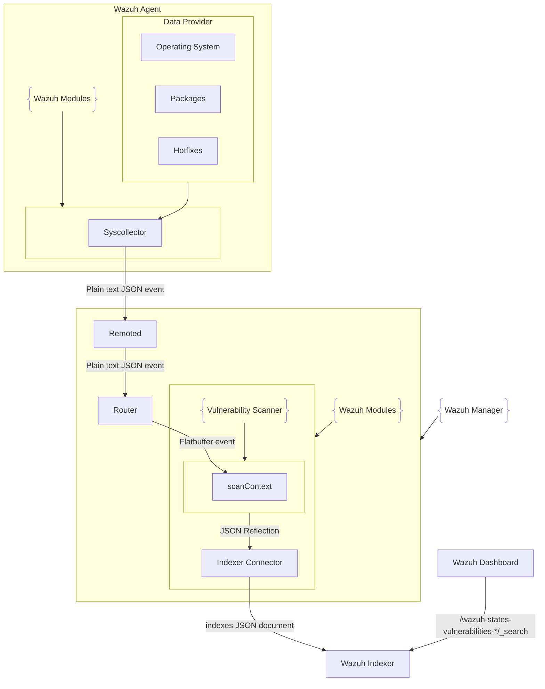

# Arquitecture

The Vulnerability Scanner module processes incoming messages and index them in the Wazuh Indexer. It integrates several design patterns (Facade, Factory Method, and Chain of Responsibility) to modularize responsibilities and simplify maintenance. Below is an overview of the main components and their roles.

## Main Components

- **`src/wazuh_modules/vulnerability_scanner/src/vulnerabilityScannerFacade.cpp`**
  - The main class that provides the starting point for the vulnerability scanner functionality. 
  - This section of the code is in charge to verify whether or not a compressed database exist in a defined path to speed up the CVE local database availability.
  - Initialize Router communication for sync, deltas and wazuh-db events.
  - Initialize DatabaseFeedManager submodule and the Indexer Connector dependency module.
  - Create dispatching thread to handle incoming event, delayed events and vulnerability reports.

- **`src/wazuh_modules/vulnerability_scanner/src/scanOrchestrator/`**
  This implementation uses the `Chain of Responsibility` design pattern to represent different stages for detection based on the event type.

  We can enumerate the following cases:
  - ScannerType::PackageInsert: The scanner receives an event of a new detected package in the system. 
  - ScannerType::PackageDelete: The scanner receives an event of a package deletion. The package was uninstalled from the system and should no longer be reported as vulnerable.
  - ScannerType::HotfixInsert: Similar case of a package insert, but only for Windows. This specific event may solve an existent vulnerability.
  - ScannerType::HotfixDelete: For this case, the deletion may trigger the detection of a vulnerability.
  - ScannerType::Os: OS event that may trigger vulnerability detections for OS (for Windows and MacOS only).
  - ScannerType::IntegrityClear: Remove all existent data for specified component (OS or packages).
  - ScannerType::ReScanAllAgents: Triggered if the module is enabled after being disabled.
  - ScannerType::ReScanSingleAgent: Triggers a rescan for a single agent if the agent database is upgraded.
  - ScannerType::CleanupSingleAgentData: Clean action during the removal of an agent.
  - ScannerType::CleanupAllAgentData: Clean action to remove all agent data.
  - ScannerType::GlobalSyncInventory: Triggers a synchronization between the indexer local database and the information in the Wazuh Indexer.

- **`src/wazuh_modules/vulnerability_scanner/src/databaseFeedManager/`**
  Submodule in charge of process the information downloaded from CTI. Between the responsibilities of this implementation we have: 

  - Parse, process and create CTI information to create feed database.
    - Parse CVE5 formatted information.
    - Create CVSS, description and other related tables to augmentate the vulnerability indexed information, and alert reports.
    - Parse and process mapping details and translation information for OS and packages.
    - Parse and process offset information to keep the CVE database up to date.

## High-Level diagram

