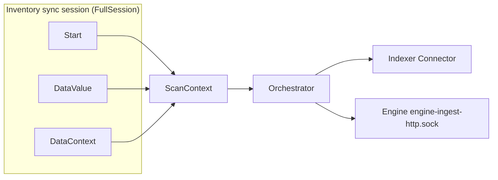
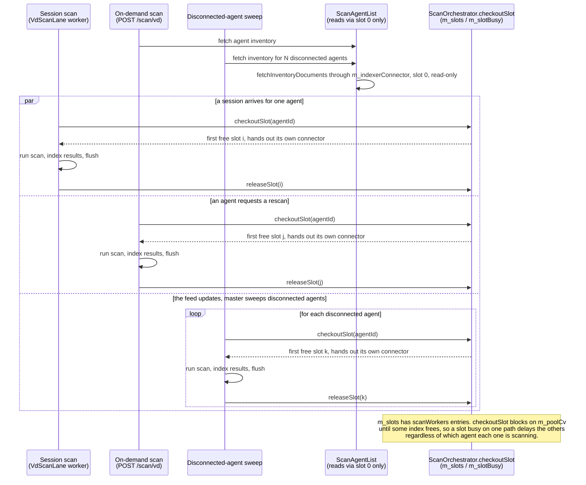
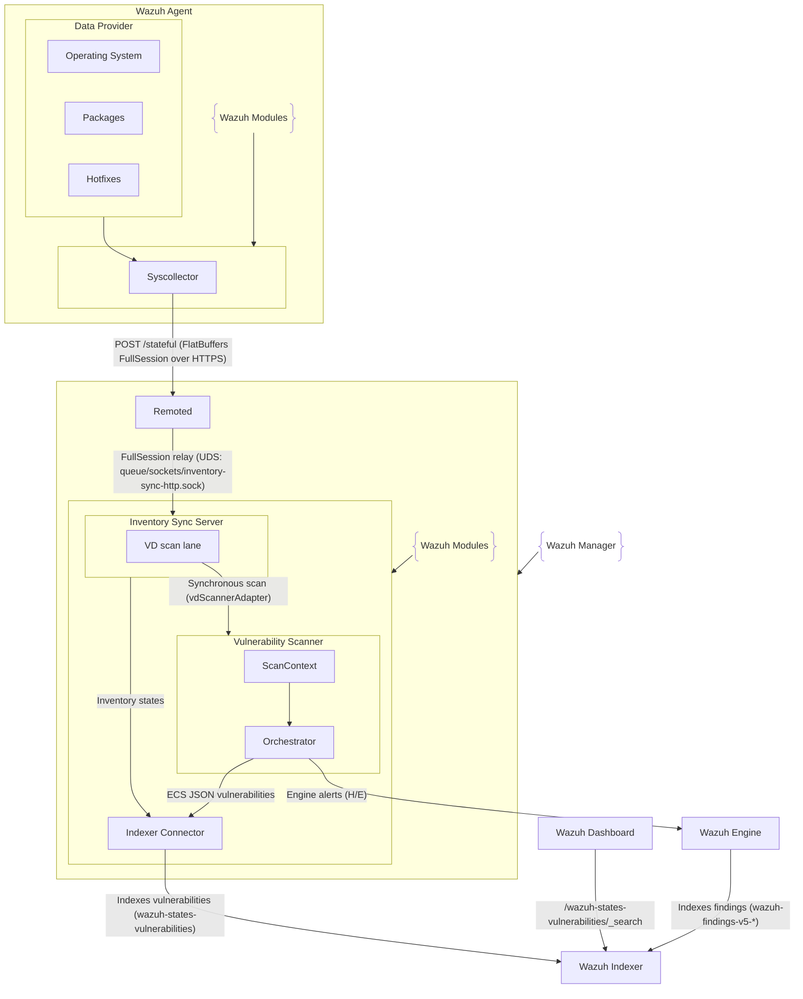

# Architecture

The Vulnerability Scanner module consumes the synchronization sessions the Inventory Sync Server receives and indexes the detection results in the Wazuh Indexer. It integrates several design patterns (Facade, Factory Method, and Chain of Responsibility) to modularize responsibilities and simplify maintenance. Below is an overview of the main components and their roles.

## Processing flow

The renewed detection flow normalizes inventory data into batches that drive detection and reporting:

Inventory Sync Server -> ScanContext -> Orchestrator -> Indexer + Engine

```mermaid
flowchart LR
  subgraph InventorySyncSession["Inventory sync session (FullSession)"]
    Start[Start]
    DataValue[DataValue]
    DataContext[DataContext]
  end
  Start --> ScanContext
  DataValue --> ScanContext
  DataContext --> ScanContext
  ScanContext --> Orchestrator
  Orchestrator --> Indexer[Indexer Connector]
  Orchestrator --> Engine[Engine engine-ingest-http.sock]
```

### Pipeline and triggers

The manager-side pipeline is session-driven. A whole session arrives at the Inventory Sync Server as one `Message{FullSession}`, and vulnerability-detection sessions run through the server's VD scan lane, which executes the scan orchestrator synchronously BEFORE the session is indexed — a `200` to the agent guarantees both the scan and the ingest:

Start/DataValue/DataContext -> Inventory Sync Server (VD scan lane) -> ScanOrchestrator -> Indexer + Engine

Orchestration selection is based on `Start.option` and the indices present in the session:

- `VDFirst`: Full inventory in `DataValue` only (OS, packages, hotfixes).
- `VDSync` `FullScanWithDiff`: `DataValue` contains OS + package upserts/deletes, and the session also includes OS/hotfix indices.
- `VDSync` package delta: `DataValue` contains package upserts/deletes only; `DataContext` includes OS.

## Main Components

- **`src/wazuh_modules/vulnerability_scanner/src/vulnerabilityScannerFacade.cpp`**
The entry point for the vulnerability scanner. It initializes CTI feed databases, the Indexer Connector, and the scan orchestrator. It also manages the local state database used to track installed content versions.

- **`src/shared_modules/content_manager/src/components/IndexerDownloader.hpp`**
  Downloads the CTI feed from the Indexer. Before starting a download, it checks the CTI consumer status and waits until it becomes `idle`. If the status is empty or `updating`, the downloader postpones the operation and retries later.

- **`src/wazuh_modules/vulnerability_scanner/src/scanOrchestrator/`**
  This implementation uses the `Chain of Responsibility` design pattern to represent different stages for detection based on the sync session's batches (Start, DataValue, DataContext). It builds the `ScanContext`, runs package/OS/hotfix detection for full scans and deltas, and emits results to the indexer and engine.

- **`src/wazuh_modules/inventory_sync_server/`**
  Inventory Sync Server is the upstream module: it receives a whole synchronization session as one `Message{FullSession}` over remoted's `POST /stateful` route, indexes the inventory states, and hands the session's package data to the scanner's VD lane (`src/wazuh_modules/inventory_sync_server/src/vd/vdScannerAdapter.cpp` calls the scanner's neutral entry points) once the session is complete.

- **`src/wazuh_modules/vulnerability_scanner/src/databaseFeedManager/`**
  Submodule in charge of processing the information downloaded from CTI. Key responsibilities include:

  - Parse and store CTI information to build the feed database.
  - Parse CVE5 formatted information.
  - Create CVSS, description, and other related tables to augment the vulnerability indexed information and alert reports.
  - Parse and process mapping details and translation information for OS and packages.
  - Parse and process offset information to keep the CVE database up to date.
  - Validate that the local feed database is complete before marking it as ready for scans.

## Feed update readiness

The feed update path now separates remote readiness from local readiness:

- The Indexer download starts only when the CTI consumer status is `idle`.
- Once the download completes, the local feed is marked as ready only if the required global maps are present in the local RocksDB feed database.

This prevents VD from starting scans with a partially downloaded or locally incomplete feed.

## Feed-update rescan (`/scan/vd` + `rescanDisconnectedAgents`)

When the CTI feed finishes updating, every agent eventually needs a fresh scan against the new
data — but with stateless HTTPS, no manager node can assume it "owns" a fixed set of agents to push
that rescan to (the old TCP/UDP architecture's node-affinity model, where each node queried
global.db for its own agents and rescanned all of them on every feed update, has no equivalent once
any request can land on any node). Two independent, on-demand mechanisms replace it, both entirely
without inter-node coordination:

- **Connected agents detect the change themselves.** `VulnerabilityScannerFacade::start()`
  registers a post-update callback on `DatabaseFeedManager` that, once a feed update actually
  changed something, calls `rescanDisconnectedAgents()` (below) — that's the *disconnected*-agent
  path. *Connected* agents never get pushed anything: they learn the feed moved by comparing the
  `vd_feed_offset` remoted includes in every `/control` notify response against their own stored
  value, and — if it's higher — call `POST /scan/vd` on whichever node the load balancer routes
  them to. `triggerAgentScan(agentId)` handles that request: it looks up the agent's current
  metadata, builds a `ScanContext` for just that one agent, and runs the same `FullScan`
  orchestration chain (above) any other feed-update-triggered rescan uses. See
  [remoted's README](../../../../src/remoted/remoted_module/README.md#scan-endpoint-post-scanvd--srcscanvd)
  for the full `/scan/vd` request/response contract — remoted is a synchronous passthrough that
  relays this module's admission verdict to the agent; the bounded dispatch queue whose single
  worker calls `triggerAgentScan()` lives here (`scanDispatcher.hpp`).
- **Disconnected agents are swept once, by the master only.**
  `rescanDisconnectedAgents()` fetches every agent whose `connection_status` is `disconnected` from
  global.db (`BuildDisconnectedAgentListContext` — deliberately narrower than the old node-affinity
  sweep's "every agent," since connected agents are already covered by the on-demand path above) and
  runs `FullScan` for each. It no-ops on a worker node (`ScanContext::clusterIsWorker()`) — disconnected
  agents aren't tied to any particular node, so only the master (or the single node, without a
  cluster) may sweep them, or every node would redundantly rescan the same agents on every feed
  update.

Both paths funnel through the same admission gate before a scan actually runs:
`checkScanReadiness()` (VD's own `POST /vulnerability-detector/scan` admission calls it, and
`triggerAgentScan()` calls it again as the authoritative check, since readiness can change between
enqueue and execution) now also requires a healthy indexer host
(`IndexerConnectorSync::isAvailable()`, a per-host `GET /_cat/health` poll every 60 s; healthy
means at least one host green or yellow) — no healthy host returns
`ScanTriggerResult::IndexerUnavailable` instead of admitting the scan. The scan dispatcher's single
worker (`scanDispatcher.hpp`) HOLDS the queue on that outcome instead of draining it — nothing
popped, nothing dropped — re-checking every 30 s (debug1 for the first two checks, then a
throttled WARN naming how long and how many scans are held, and an INFO once a host answers
healthy again). A thrown inventory read (OS, packages or hotfixes) is classified by the same
health view: `isAvailable() == false` marks the scan `IndexerUnavailable` (held, retried once the
indexer returns) and `true` marks it `ScanFailed` (logged and dropped — retrying a scan's own
failure risks a poison loop; the agent's durable pending state re-requests on its next notify
anyway). One 4xx is exempt: a search answered with `index_not_found_exception` is an EMPTY
inventory, not a failed read — nothing was ever synced to that index (a fleet with no Windows
agent never creates the hotfixes index at all), so it takes the ordinary empty-inventory path
instead of failing every feed-update scan on such fleets. This is also what fixes `rescanDisconnectedAgents()`'s completion line, which used to
report success even when the indexer was down and now honestly logs `status=error` with the
failed-agent count.

Two limits of this gate are known and left as indexer_connector-level follow-ups rather than fixed
here: a sustained 429 does not lose work but blocks the single worker, since the connector retries
both reads and writes with no attempt cap and `isAvailable()` doesn't cover it (`_cat/health` still
answers); and the health view can be up to ~65 s stale, so a failure inside that window classifies
as `ScanFailed` and is dropped rather than held — no work is lost, since the agent re-requests and
admission starts answering `indexer_unavailable` once the view catches up.

The syscollector_vd sync path (VDFirst/VDSync sessions, handled by `inventory_sync_server`, not
this module's HTTP surface) carries the same offset-matching contract: each session's `Start.feed_offset`
must equal this node's current feed offset or the session is rejected with `409 version_mismatch`
before it ever reaches the orchestrator — see
[inventory_sync_server's README](../../../../src/wazuh_modules/inventory_sync_server/README.md#the-vd-scan-lane-srcvd)
for that side of the check.

Both `/scan/vd` and the flatbuffer path validate against the *same* underlying offset
(`DatabaseFeedManager::getLastOffset()`, surfaced to remoted over UDS by `VdClient` — see remoted's
README linked above), so a request is only ever accepted by a node whose feed genuinely matches
what the caller expects; a mismatch always returns the node's real current offset so the caller can
retry with the corrected value instead of guessing.

## Orchestration chains

The orchestrator builds the following chains (via `FactoryOrchestrator`) and selects them based on `Start.option` and the indices present in the session:

- **PackagesDelta** (VDSync package-only delta):
  `PackageScanner -> EventGetCve -> EventDetailsBuilder -> EventSendReport -> ResultIndexer`
- **FirstFullScan** (VDFirst):
  `OsScanner -> PackageScanner -> EventDetailsBuilder -> EventSendReport -> ResultIndexer`
- **FullScan** (VDSync FullScanWithDiff, triggered when OS or hotfix indices are present):
  `EventGetContext -> OsScanner -> PackageScanner -> EventDetailsBuilder -> EventSendReport -> ResultIndexer`

## Concurrency

`VulnerabilityScannerFacade` owns one `std::shared_mutex`, shared by reference with both
`DatabaseFeedManager` and `ScanOrchestrator`. `DatabaseFeedManager` takes it exclusively only
while a feed update is being applied (`reloadGlobalMaps()`) and shares it for read-only feed
queries; `ScanOrchestrator` takes the *shared* side for the whole duration of a scan
(`runScanFromViews()`/`runScanAfterFeedUpdate()`), so any number of scans may run concurrently,
but never at the same time as a feed reload. Every read a scan performs against the feed
database and its global maps (vendor/CPE/CNA mappings, the L2 translation cache) is therefore
safe only because those reads happen while *some* side of this one mutex is held, and because the
L2 translation cache's own read path stays read-only (no LRU-order mutation) on the scan path.

A shared lock alone is not sufficient for real concurrency: `ScanOrchestrator` keeps a small pool
of `Slot`s (one per concurrent scan slot), each bundling its own
`PackageDelta`/`FirstFullScan`/`FullScan` orchestration chains and its own `IndexerConnectorSync`.
This exists because `PackageScanner` (a stage shared by every chain) carries per-instance mutable
state — running statistics and its own L1 translation cache — and because `IndexerConnectorSync`
serializes bulk writes internally; sharing either across concurrent scans would race. A scan call
checks out a free slot for its duration and returns it afterward. The slot count (the
`scanWorkers` setting, mirroring `inventory_sync_server`'s `vd_workers`) is what actually lets
scans of different agents run at once; it defaults to half the host's cores (minimum 1) and an
explicit value always overrides that default. `DatabaseFeedManager` and its global maps remain
the one collaborator every slot shares.

RocksDB read concurrency (the feed database's `get`/`seek` calls, used by every slot) relies on
RocksDB's own documented guarantee that concurrent reads against one `DB*` handle are safe with
no concurrent writer — an external-library assumption this module does not itself enforce.

### Scan concurrency across callers

Three independent paths can trigger a scan at the same time — a session scan from `VdScanLane`
(`inventory_sync_server`), an on-demand `/scan/vd` request (`triggerAgentScan()`), and the
master-only disconnected-agent sweep (`rescanDisconnectedAgents()`, see
[Feed-update rescan](#feed-update-rescan-scanvd--rescandisconnectedagents) above). All three read
inventory through the same fixed slot-0 connector (`m_indexerConnector`, i.e.
`m_scanConnectors.front()`) via `ScanAgentList`, then compete for the slot pool described above:

```mermaid
sequenceDiagram
    participant Session as Session scan<br/>(VdScanLane worker)
    participant OnDemand as On-demand scan<br/>(POST /scan/vd)
    participant Sweep as Disconnected-agent sweep
    participant SAL as ScanAgentList<br/>(reads via slot 0 only)
    participant SO as ScanOrchestrator.checkoutSlot<br/>(m_slots / m_slotBusy)

    OnDemand->>SAL: fetch agent inventory
    Sweep->>SAL: fetch inventory for N disconnected agents
    SAL->>SAL: fetchInventoryDocuments through m_indexerConnector, slot 0, read-only

    par a session arrives for one agent
        Session->>SO: checkoutSlot(agentId)
        SO-->>Session: first free slot i, hands out its own connector
        Session->>Session: run scan, index results, flush
        Session->>SO: releaseSlot(i)
    and an agent requests a rescan
        OnDemand->>SO: checkoutSlot(agentId)
        SO-->>OnDemand: first free slot j, hands out its own connector
        OnDemand->>OnDemand: run scan, index results, flush
        OnDemand->>SO: releaseSlot(j)
    and the feed updates, master sweeps disconnected agents
        loop for each disconnected agent
            Sweep->>SO: checkoutSlot(agentId)
            SO-->>Sweep: first free slot k, hands out its own connector
            Sweep->>Sweep: run scan, index results, flush
            Sweep->>SO: releaseSlot(k)
        end
    end

    Note over SO: m_slots has scanWorkers entries. checkoutSlot blocks on m_poolCv<br/>until some index frees, so a slot busy on one path delays the others<br/>regardless of which agent each one is scanning.
```

A separate, per-agent mutual-exclusion fence (`ScanCoordinatorRegistry`, unrelated to this slot
pool) also stops a session scan and a feed-update rescan from targeting the SAME agent at once —
see [inventory-sync-server's architecture.md](../inventory-sync-server/architecture.md#the-vulnerability-detection-scan-lane)
for that mechanism.

## Data models used by VD

### ScanContext

`ScanContext` is the per-session state container built from the sync session's batches. It stores:

- Current OS metadata (from `Start` + OS `DataValue`/`DataContext`).
- Package and hotfix inventories for detection.
- `osDeleted` data to mark OS CVEs as solved.
- `CVEDetectionResult` entries and their operations (upsert/delete).
- ECS JSON events generated for indexer and engine output.

### CVEDetectionResult

`CVEDetectionResult` is the source of truth for detections. Each entry carries the affected component, CVE id, and the operation (`upsert` or `delete`) that drives both indexing and engine reporting.

### ECS vulnerability documents

VD generates ECS JSON documents (no internal alert struct) that are:

- indexed into `wazuh-states-vulnerabilities` by `ResultIndexer`.
- reused to build engine events in `EventSendReport`.

## Data stores and outputs

- The Inventory Sync Server keeps no local session store — it applies the session straight to the Indexer, into:
  `wazuh-states-inventory-system`, `wazuh-states-inventory-packages`, and `wazuh-states-inventory-hotfixes`.
- VD builds ECS documents and indexes them into `wazuh-states-vulnerabilities`.
- VD sends alert events to the engine through `engine-ingest-http.sock` using the H/E protocol (`Content-Type: application/x-wev1`, queue id `v`).

## Operational notes

- OS scan is supported only for Windows and Darwin. Linux OS scan is not supported (the kernel is treated as a package).
- `host.os.full` is built from OS `name` + `version` (macOS uses `codename`), and `host.os.version` from `major.minor.patch.build`.
- `package.path` and `package.type` are indexed as `null` when empty.

## High-Level diagram

```mermaid
flowchart TD

subgraph WazuhManager[" "]
  Remoted["Remoted"]
  subgraph WazuhModulesM[" "]
    subgraph InventorySyncServer["Inventory Sync Server"]
      VDLane["VD scan lane"]
    end
    subgraph VulnerabilityScanner["Vulnerability Scanner"]
      ScanContext["ScanContext"]
      Orchestrator["Orchestrator"]
      ScanContext --> Orchestrator
    end
    IndexerConnector["Indexer Connector"]
    InventorySyncServer -- "Inventory states" --> IndexerConnector
    Orchestrator -- "ECS JSON vulnerabilities" --> IndexerConnector
  end
  C@{ shape: braces, label: "Wazuh Modules" } --> WazuhModulesM
  Remoted -- "FullSession relay (UDS: queue/sockets/inventory-sync-http.sock)" --> InventorySyncServer
  VDLane -- "Synchronous scan (vdScannerAdapter)" --> VulnerabilityScanner
end
B@{ shape: braces, label: "Wazuh Manager" } --> WazuhManager
IndexerConnector -- "Indexes vulnerabilities (wazuh-states-vulnerabilities)" --> WazuhIndexer
Orchestrator -- "Engine alerts (H/E)" --> WazuhEngine
subgraph WazuhAgent["Wazuh Agent"]
  subgraph Providers["Data Provider"]
    OS["Operating System"]
    Packages["Packages"]
    Hotfixes["Hotfixes"]
  end
  subgraph WazuhModulesA[" "]
    Syscollector["Syscollector"]
  end
  A@{ shape: braces, label: "Wazuh Modules" } --> WazuhModulesA
  Syscollector -- "POST /stateful (FlatBuffers FullSession over HTTPS)" --> Remoted
end
Providers --> Syscollector
WazuhIndexer["Wazuh Indexer"]
WazuhEngine["Wazuh Engine"]
WazuhEngine -- "Indexes findings (wazuh-findings-v5-*)" --> WazuhIndexer
WazuhDashboard["Wazuh Dashboard"]
WazuhDashboard -- /wazuh-states-vulnerabilities/_search --> WazuhIndexer
```
