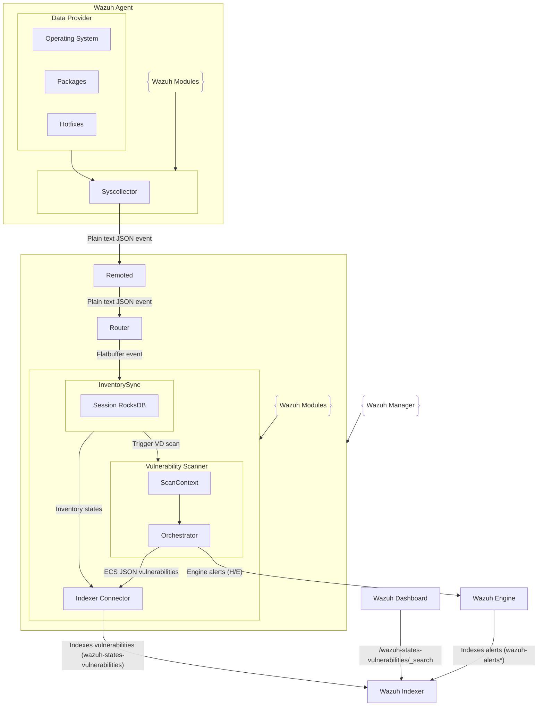

# Architecture

The Vulnerability Scanner module consumes InventorySync sessions and indexes the detection results in the Wazuh Indexer. It integrates several design patterns (Facade, Factory Method, and Chain of Responsibility) to modularize responsibilities and simplify maintenance. Below is an overview of the main components and their roles.

## Processing flow

The renewed detection flow normalizes inventory data into batches that drive detection and reporting:

InventorySync -> ScanContext -> Orchestrator -> Indexer + Engine

### Pipeline and triggers

The manager-side pipeline is session-driven. InventorySync stores Start/DataValue/DataContext in RocksDB, and once the session closes it triggers the scan orchestrator:

Start/DataValue/DataContext -> InventorySync (session RocksDB) -> ScanOrchestrator -> Indexer + Engine

Orchestration selection is based on `Start.option` and the indices present in the session:

- `VDFirst`: Full inventory in `DataValue` only (OS, packages, hotfixes).
- `VDSync` `FullScanWithDiff`: `DataValue` contains OS + package upserts/deletes, and the session also includes OS/hotfix indices.
- `VDSync` package delta: `DataValue` contains package upserts/deletes only; `DataContext` includes OS.

## Main Components

- **`src/wazuh_modules/vulnerability_scanner/src/vulnerabilityScannerFacade.cpp`**
The entry point for the vulnerability scanner. It initializes CTI feed databases, the Indexer Connector, and the scan orchestrator. It also manages the local state database used to track installed content versions.

- **`src/wazuh_modules/vulnerability_scanner/src/scanOrchestrator/`**
  This implementation uses the `Chain of Responsibility` design pattern to represent different stages for detection based on InventorySync batches (Start, DataValue, DataContext). It builds the `ScanContext`, runs package/OS/hotfix detection for full scans and deltas, and emits results to the indexer and engine.

- **`src/wazuh_modules/inventory_sync/src/inventorySyncFacade.hpp`**
  InventorySync is the upstream module that receives the Start/DataValue/DataContext messages, stores them in RocksDB by session, indexes inventory states, and triggers VD runs once the session is complete.

- **`src/wazuh_modules/vulnerability_scanner/src/databaseFeedManager/`**
  Submodule in charge of processing the information downloaded from CTI. Key responsibilities include:

  - Parse and store CTI information to build the feed database.
  - Parse CVE5 formatted information.
  - Create CVSS, description, and other related tables to augment the vulnerability indexed information and alert reports.
  - Parse and process mapping details and translation information for OS and packages.
  - Parse and process offset information to keep the CVE database up to date.

## Orchestration chains

The orchestrator builds the following chains (via `FactoryOrchestrator`) and selects them based on `Start.option` and the indices present in the session:

- **PackagesDelta** (VDSync package-only delta):
  `PackageScanner -> EventGetCve -> EventDetailsBuilder -> EventSendReport -> ResultIndexer`
- **FirstFullScan** (VDFirst):
  `OsScanner -> PackageScanner -> EventDetailsBuilder -> EventSendReport -> ResultIndexer`
- **FullScan** (VDSync FullScanWithDiff, triggered when OS or hotfix indices are present):
  `EventGetContext -> OsScanner -> PackageScanner -> EventDetailsBuilder -> EventSendReport -> ResultIndexer`

## Data models used by VD

### ScanContext

`ScanContext` is the per-session state container built from InventorySync batches. It stores:

- Current OS metadata (from `Start` + OS `DataValue`/`DataContext`).
- Package and hotfix inventories for detection.
- `osDeleted` data to mark OS CVEs as solved.
- `CVEDetectionResult` entries and their operations (upsert/delete).
- ECS JSON events generated for indexer and engine output.

### CVEDetectionResult

`CVEDetectionResult` is the source of truth for detections. Each entry carries the affected component, CVE id, and the operation (`upsert` or `delete`) that drives both indexing and engine reporting.

### ECS vulnerability documents

VD generates ECS JSON documents (no internal alert struct) that are:

- indexed into `wazuh-states-vulnerabilities` by `ResultIndexer`.
- reused to build engine events in `EventSendReport`.

## Data stores and outputs

- InventorySync keeps the session data in RocksDB and indexes inventory states into:
  `wazuh-states-inventory-system`, `wazuh-states-inventory-packages`, and `wazuh-states-inventory-hotfixes`.
- VD builds ECS documents and indexes them into `wazuh-states-vulnerabilities`.
- VD sends alert events to the engine through `queue-http.sock` using the H/E protocol (`Content-Type: application/x-wev1`, queue id `v`).

## Operational notes

- OS scan is supported only for Windows and Darwin. Linux OS scan is not supported (the kernel is treated as a package).
- `host.os.full` is built from OS `name` + `version` (macOS uses `codename`), and `host.os.version` from `major.minor.patch.build`.
- `package.path` and `package.type` are indexed as `""` when empty.

## High-Level diagram

