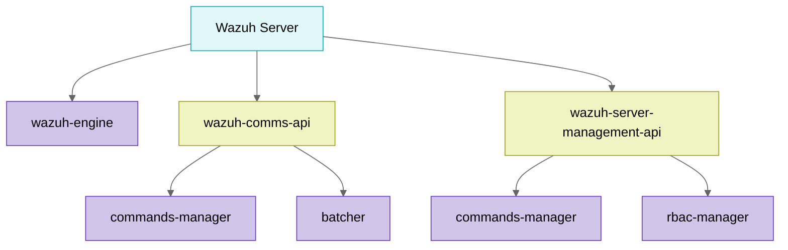

# Wazuh

# Wazuh Server
## Introduction

The Wazuh server is the core that receives, processes, 
and stores all the security telemetry generated by the agents deployed on the endpoints. 
Internally, it consists of an analysis engine (`wazuh-engine`), a communications API (`wazuh-comms-api`); 
and a management API (`wazuh-server-management-api`).

These three child daemons are orchestrated by a parent process, 
which also starts a small internal UNIX server to request the configuration from other processes.
Simultaneously, a monitor periodically checks that none of the child processes have become zombies and that 
each retains the expected number of threads, thus ensuring continued stability. 

When a stop signal arrives, the parent server sends SIGTERM to each component, 
waits for its graceful shutdown, cleans up the PID files, and terminates, ensuring that no orphaned 
processes or half-processed data are left behind.

### Communications API

The API allows: JWT authentication, obtaining commands, processing persistent and async events from agents, 
downloading files from agents, and scanning for vulnerabilities.


The API consists of a `commands-manager` socket, which is responsible for 
providing an endpoint to expose local server commands to the various API processes, and the `batcher`, a 
process responsible for batching multiple requests sent to the Indexer, combining them into batches based on a 
specific size, detailed in the configuration.

### Management API

The API allows you to manage agents (add, remove, restart, group), configure group policies, 
and control access using JWT authentication and RBAC permissions. It offers operations such as update verification, 
log monitoring, and remote configuration, integrating with scripts, CLI tools, or the Wazuh Web Interface (WUI). It 
requires temporary tokens obtained through basic authentication to securely interact with the environment.


The API is composed of several components, such as the `commands-manager` socket responsible for exposing local server
commands to the various API processes and the `rbac-manager` responsible for Role-based access control.

## Server process overview



## Configuration Overview

This document provides a structured overview of the Wazuh application configuration using Python models. Each section corresponds to a specific component of the application and how it should be defined in the YAML configuration file.

---

## Main Configuration (`Config`)

The `Config` class is the main entry point for the application's configuration.

```yaml
server:
  ...
indexer:
  ...
engine:
  ...
management_api:
  ...
communications_api:
  ...
```

* `server`: Configuration for the Wazuh server.
* `indexer`: Configuration for the indexer (Elasticsearch, OpenSearch, etc.).
* `engine`: Configuration for the engine component.
* `management_api`: Configuration for the management API.
* `communications_api`: Configuration for the communications API.

---

## Server Configuration (`ServerConfig`)

```yaml
server:
  update_check: false
  logging:
    level: info
  cti:
    update_check: true
    url: https://cti.wazuh.com
```

* `update_check`: Enables/disables update checks.
* `logging`: Logging level (info, debug, debug2).
* `cti`: Configuration options for CTI.
  * `update_check`: Enables update check for CTI.
  * `url`: CTI service URL.

---

## Indexer Configuration (`IndexerConfig`)

```yaml
indexer:
  hosts:
    - host: 127.0.0.1
      port: 9200
  username: admin
  password: secret
  ssl:
    use_ssl: true
```

* `hosts`: List of indexer nodes.
* `username`: The username for indexer authentication.
* `password`: The password for indexer authentication.
* `ssl`: SSL configuration
  * `use_ssl`: Whether to use SSL for the indexer.
  * `key`: The path to the SSL key file
  * `certificate`: The path to the SSL certificate file
  * `certificate_authorities`: List of paths to the CA certificate file
  * `verify_certificates`: Whether to verify the server TLS certificates or not
---

## Engine Configuration (`EngineConfig`)

```yaml
engine:
  tzdv_automatic_update: false
  client:
    api_socket_path: /run/wazuh-server/engine.socket
    retries: 3
    timeout: 10.0
  logging:
    level: info
```

* `tzdv_automatic_update`: Enables automatic updates.
* `client`: Engine client configuration.
  * `api_socket_path`: The path to the API socket.
  * `retries`: The number of retry attempts.
  * `timeout`: The timeout duration in seconds.
* `logging`: Engine logging configuration.
  * `level`: The logging level. Possible values (trace, debug, info, warning, error, critical).

---

## Management API Configuration (`ManagementAPIConfig`)

```yaml
management_api:
  host: localhost
  port: 55000
  drop_privileges: true
  max_upload_size: 10485760
  jwt_expiration_timeout: 900
  rbac_mode: white
  intervals:
    request_timeout: 10
  ssl:
    key: /path/to/key.pem
    cert: /path/to/cert.pem
  cors:
    enabled: false
    source_route: "*"
    expose_headers: "*"
    allow_headers: "*"
    allow_credentials: false
  access:
    max_login_attempts: 50
    block_time: 300
    max_request_per_minute: 300
  logging:
    level: debug
    format:
      - plain
```

* `host`: The host address for the Management API.
* `port`: The port number for the management API.
* `drop_privileges`: Whether to drop privileges after starting the API.
* `max_upload_size`: The maximum upload size in bytes.
* `jwt_expiration_timeout`: The expiration timeout for JWT in seconds.
* `rbac_mode`: The role-based access control mode. Possible values (white, black).
* `intervals`: Configuration for the API timeouts and intervals.
  * `request_timeout`: The timeout for requests in seconds.
* `ssl`: The API SSL configuration.
  * `key`: The path to the SSL key file.
  * `cert`: The path to the SSL certificate file.
  * `use_ca`: Whether to use a CA certificate.
  * `ca`: The path to the CA certificate file.
  * `ssl_protocol`: The SSL protocol to use. Possible values (TLS, TLSv1, TLSv1.1, TLSv1.2, auto)
  * `ssl_ciphers`: The SSL ciphers to use.
* `logging`: The API logging configuration.
  * `level`: The logging level. Possible values (debug, info, warning, error, critical).
  * `format`: The format for the logging output. Possible values (plain).
* `cors`: Configuration for Cross-Origin Resource Sharing.
  * `enabled`: Whether CORS is enabled.
  * `source_route`: The source route for CORS requests.
  * `expose_headers`: The headers that are exposed to the client.
  * `allow_headers`: The headers that are allowed in requests.
  * `allow_credentials`: Whether to allow credentials in CORS requests.
* `access`: Configuration for access control settings.
  * `max_login_attempts`: The maximum number of failed login attempts allowed.
  * `block_time`: The duration in seconds to block an IP after reaching the max login attempts.
  * `max_request_per_minute`: The maximum number of request allower per minute.


---

## Communications API Configuration (`CommsAPIConfig`)

```yaml
communications_api:
  host: localhost
  port: 27000
  workers: 4
  batcher:
    max_elements: 5
    max_size: 3000
    wait_time: 0.15
  ssl:
    key: /path/to/key.pem
    cert: /path/to/cert.pem
    ssl_ciphers: ""
  logging:
    level: debug
    format:
      - plain
```

* `host`: The host address for the Communications API.
* `port`: The port number for the Communications API.
* `workers`: The number of worker threads.
* `logging`: Configuration for the Communications API logging.
  * `level`: The logging level. Possible values (debug, info, warning, error, critical).
  * `format`: The format for the logging output. Possible values (plain).
* `batcher`: Configuration for the Batcher process.
  * `max_elements`: Max number of elements the batch can hold.
  * `max_size`: Max size in bytes the batch can hold.
  * `wait_time`: The time in seconds to wat before sending the batch.
* `ssl`: The API SSL configuration.
  * `key`: The path to the SSL key file.
  * `cert`: The path to the SSL certificate file.
  * `use_ca`: Whether to use a CA certificate.
  * `ca`: The path to the CA certificate file.
  * `ssl_protocol`: The SSL protocol to use. Possible values (TLS, TLSv1, TLSv1.1, TLSv1.2, auto)
  * `ssl_ciphers`: The SSL ciphers to use.

---
