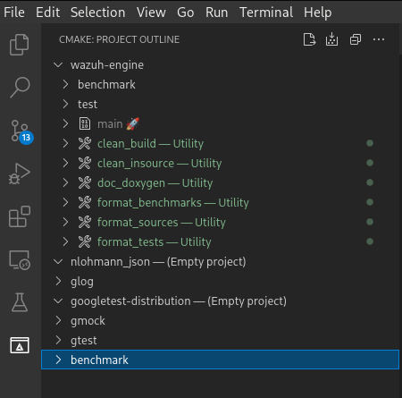

# Engine development enviroment

1. [Project structure](#structure)
1. [Adding tests](#addtest)
1. [Adding benchmarks](#addbench)
1. [Cmake dependencies](#cmakedep)
1. [Visual studio code integration](#VSC)
    1. [CMake and c++](#CMAKECPP)
    1. [Astyle formatter](#astyle)
    1. [Gtest integration](#gtest)
    1. [Debugging main with gdb](#debug)
1. [Documentation generation](#docxygen)
1. [Building manually](#buildmanual)
1. [License](#license)

<a name="structure"></a>
## Project structure
```bash
engine/
├── benchmark
│   ├── CMakeLists.txt
│   └── source
│       └── dummy_benchmark.cpp
├── build
|   └── ...
├── cmake
│   └── CPM.cmake
├── CMakeLists.txt
├── docs
│   ├── Doxyfile.in
│   └── ...
├── README.md
├── source
│   ├── main.cpp
│   ├── shared
|   ├── sub_module_0
|   └── sub_module_n
└── test
    ├── CMakeLists.txt
    └── source
        └── dummy_test.cpp
```

<a name="addtest"></a>
## Adding tests
Test are located inside `<root_dir>/test/source` folder, to add tests simply create new cpp file inside said folder. Check [google/gtest](https://github.com/google/googletest) documentation in order to build tests using gtest.

<a name="addbench"></a>
## Adding benchmarks
Test are located inside `<root_dir>/benchmark/source` folder, to add benchmarks simply create new cpp file inside said folder. Check [google/benchmark](https://github.com/google/benchmark) documentation in order to build micro-benchmarks using google benchmark.

<a name="cmakedep"></a>
## CMake dependencies
Dependencies are managed through [CPM](https://github.com/cpm-cmake/CPM.cmake).
To add CPM to your current project, simply add the [latest release](https://github.com/cpm-cmake/CPM.cmake/releases/latest) of `CPM.cmake` or `get_cpm.cmake` to your project's `cmake` directory.
The command below will perform this automatically.

```bash
mkdir -p cmake
wget -O cmake/CPM.cmake https://github.com/cpm-cmake/CPM.cmake/releases/latest/download/get_cpm.cmake
```

To add dependencies check the [CPM wiki](https://github.com/cpm-cmake/CPM.cmake/wiki/More-Snippets).

<a name="VSC"></a>
## Visual studio code integration
Recommended editor settings:
```
"settings": {
    // Editor settings
    "editor.wordWrap": "on",
    "editor.rulers": [
        100
    ],
    "files.trimTrailingWhitespace": true,
    "files.insertFinalNewline": true,
    "files.trimFinalNewlines": true,
}
```
Plugins:
- [google test and benchmark integration](https://marketplace.visualstudio.com/items?itemName=matepek.vscode-catch2-test-adapter)
- [c++ extension pack](https://marketplace.visualstudio.com/items?itemName=ms-vscode.cpptools-extension-pack)
- [c++ astyle beautifier](https://marketplace.visualstudio.com/items?itemName=chiehyu.vscode-astyle)

<a name="CMAKECPP"></a>
### CMake and C++
In order to integrate CMake and c++ with VSCode we need to install the [c++ extension pack](https://marketplace.visualstudio.com/items?itemName=ms-vscode.cpptools-extension-pack) plugin. Once installed we need to configure CMake running the following command on the palette bar (`crtl + shift + p`):
```
CMake: Configure
```
A prompt to select compiler will appear and once selected it will generate all the building files needed and download all CPM dependencies. We can select CMake build variant, targets, executable and tests on the bottom menu:


We can also see build information on the dedicated CMake section on the left side menu:



<a name="astyle"></a>
### Astyle formatter
We need to [install astyle](http://astyle.sourceforge.net/install.html) and [c++ astyle beautifier](https://marketplace.visualstudio.com/items?itemName=chiehyu.vscode-astyle) plugin. Once installed we need to add the following configuration to our project:
```
"settings": {
    // astyle settings
    "astyle.cmd_options": [
        "--options=${workspaceFolder}/.vscode/astyle.config"
    ]
}
```
And create `astyle.config` file inside `.vscode` folder using Wazuh style guidelines:
```
--style=allman
--formatted
--indent=spaces=4
--indent-classes
--indent-switches
--indent-cases
--indent-namespaces
--indent-col1-comments
--max-instatement-indent=120
--break-blocks
--pad-oper
--pad-header
--pad-comma
--align-pointer=type
--align-reference=type
--convert-tabs
--max-code-length=200
--preserve-date
--suffix=none
--recursive
```

<a name="gtest"></a>
### Gtest integration
Installing the [google test and benchmark integration](https://marketplace.visualstudio.com/items?itemName=matepek.vscode-catch2-test-adapter) plugin we can also see on the left side menu the tests interface:


Further configuration will be provided to enhance testing functionality through this plugin.

<a name="debug"></a>
## Debugging main with gdb
Add a `launch.json` to `vscode` folder:
```
{
    // Use IntelliSense to learn about possible attributes.
    // Hover to view descriptions of existing attributes.
    // For more information, visit: https://go.microsoft.com/fwlink/?linkid=830387
    "version": "0.2.0",
    "configurations": [
        {
            "name": "main",
            "type": "cppdbg",
            "request": "launch",
            "program": "${workspaceFolder}/build/main",
            "args": [],
            "stopAtEntry": false,
            "cwd": "${workspaceFolder}/build",
            "environment": [],
            "externalConsole": false,
            "MIMode": "gdb",
            "setupCommands": [
                {
                    "description": "Enable pretty-printing for gdb",
                    "text": "-enable-pretty-printing",
                    "ignoreFailures": true
                }
            ],
            "miDebuggerPath": "/usr/bin/gdb"
        }
    ]
}
```
Once added target can be selected through run and debug(Crtl+Shift+D).

<a name="docxygen"></a>
## Documentation generation
Documentation is generated with docxygen, currently html and latex outputs are generated inside `build` folder.

<a name="buildmanual"></a>
## Building manually
To build manually from root folder:
```bash
mkdir build
cd build
cmake ..
make
```

To run tests:
```bash
cd build
make test
```
<a name="license"></a>
## License
Wazuh Engine is distributed under the AGPLv3 license. See [LICENSE-engine](LICENSE-engine) and [COPYING-engine](COPYING-engine) for more details.
