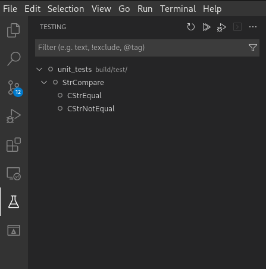

# Engine development enviroment

1. [Project structure](#structure)
    1. [Benchamarck](#benchamarck)
    1. [Build](#build)
    1. [Docs](#docs)
    1. [Source](#source)
    1. [Test](#test)
    1. [Tools](#tools)
1. [Directory description](#directory-description)
1. [Engine Compilation](#engine-compilation)
    1. [Install cmake](#install-cmake)
    1. [Install vcpkg](#install-vcpkg)
    1. [Building engine](#building-engine)
1. [License](#license)

<a name="structure"></a>
## Project structure
```bash
engine/
├── benchmark
├── build
|   └── ...
├── CMakeLists.txt
├── docs
├── source
├── test
├── tools
```

## Benchamarck

Dedicated to the implementation of performance tests and benchmarking. Contains source code files necessary to evaluate the performance of various system components. The tests developed in this folder allow identifying bottlenecks and optimizing the efficiency of operations, contributing to the continuous improvement of the system.

<a name="VSC"></a>
## Visual studio code integration
Recommended editor settings:
```
"settings": {
    // Editor settings
    "editor.wordWrap": "on",
    "editor.rulers": [
        100
    ],
    "files.trimTrailingWhitespace": true,
    "files.insertFinalNewline": true,
    "files.trimFinalNewlines": true,
}
```
Plugins:
- [google test and benchmark integration](https://marketplace.visualstudio.com/items?itemName=matepek.vscode-catch2-test-adapter)
- [c++ extension pack](https://marketplace.visualstudio.com/items?itemName=ms-vscode.cpptools-extension-pack)
- [c++ astyle beautifier](https://marketplace.visualstudio.com/items?itemName=chiehyu.vscode-astyle)

<a name="CMAKECPP"></a>
### CMake and C++
In order to integrate CMake and c++ with VSCode we need to install the [c++ extension pack](https://marketplace.visualstudio.com/items?itemName=ms-vscode.cpptools-extension-pack) plugin. Once installed we need to configure CMake running the following command on the palette bar (`crtl + shift + p`):
```
CMake: Configure
```
- We can select CMake build variant, targets, executable and tests on the bottom menu.
- We can also see build information on the dedicated CMake section on the left side menu.

<a name="astyle"></a>
### Astyle formatter
We need to [install astyle](http://astyle.sourceforge.net/install.html) and [c++ astyle beautifier](https://marketplace.visualstudio.com/items?itemName=chiehyu.vscode-astyle) plugin. Once installed we need to add the following configuration to our project:
```
"settings": {
    // astyle settings
    "astyle.cmd_options": [
        "--options=${workspaceFolder}/.vscode/astyle.config"
    ]
}
- **Make a new directory to hold vcpkg and extract the tar.gz file**:
```bash
mkdir /home/$USER/engine/vcpkg
tar xf vcpkg.tar.gz --strip-components=1 -C /home/$USER/engine/vcpkg
```
- **Build vcpkg**:
```bash
/home/$USER/engine/vcpkg/bootstrap-vcpkg.sh
```
And create `astyle.config` file inside `.vscode` folder using Wazuh style guidelines:
```
--style=allman
--formatted
--indent=spaces=4
--indent-classes
--indent-switches
--indent-cases
--indent-namespaces
--indent-col1-comments
--max-instatement-indent=120
--break-blocks
--pad-oper
--pad-header
--pad-comma
--align-pointer=type
--align-reference=type
--convert-tabs
--max-code-length=200
--preserve-date
--suffix=none
--recursive
```

<a name="gtest"></a>
### Gtest integration
Installing the [google test and benchmark integration](https://marketplace.visualstudio.com/items?itemName=matepek.vscode-catch2-test-adapter) plugin we can also see on the left side menu the tests interface:



Further configuration will be provided to enhance testing functionality through this plugin.

<a name="debug"></a>
## Debugging main with gdb
Add a `launch.json` to `vscode` folder:
```
{
    // Use IntelliSense to learn about possible attributes.
    // Hover to view descriptions of existing attributes.
    // For more information, visit: https://go.microsoft.com/fwlink/?linkid=830387
    "version": "0.2.0",
    "configurations": [
        {
            "name": "main",
            "type": "cppdbg",
            "request": "launch",
            "program": "${workspaceFolder}/build/main",
            "args": [],
            "stopAtEntry": false,
            "cwd": "${workspaceFolder}/build",
            "environment": [],
            "externalConsole": false,
            "MIMode": "gdb",
            "setupCommands": [
                {
                    "description": "Enable pretty-printing for gdb",
                    "text": "-enable-pretty-printing",
                    "ignoreFailures": true
                }
            ],
            "miDebuggerPath": "/usr/bin/gdb"
        }
    ]
}
```
Once added target can be selected through run and debug(Crtl+Shift+D).

<a name="docxygen"></a>
## Documentation generation
Documentation is generated with docxygen, currently html and latex outputs are generated inside `build` folder.

<a name="buildmanual"></a>
## Building manually
This project use [CMake](https://cmake.org) and [VCPKG](https://vcpkg.io)
#### Step 1: Install Dependencies
```bash
apt install curl zip unzip tar -y
apt install build-essential clang-format -y
apt install pkg-config -y
apt install lzip -y
```
#### Step 2: Install CMake 3.30
```bash
cd $HOME
wget https://github.com/Kitware/CMake/releases/download/v3.24.4/cmake-3.24.4-linux-x86_64.sh
chmod +x cmake-3.24.4-linux-x86_64.sh
./cmake-3.24.4-linux-x86_64.sh
export PATH=$HOME/cmake-3.24.4-linux-x86_64/bin:$PATH
```
#### Step 3: Install vcpkg
```bash
git clone https://github.com/microsoft/vcpkg.git
cd vcpkg
./bootstrap-vcpkg.sh
export VCPKG_ROOT=$(pwd)
export PATH=$VCPKG_ROOT:$PATH
```
#### Step 4: Install Wazuh Engine
```bash
git clone --recurse-submodules https://github.com/wazuh/wazuh.git  
cd wazuh/src/engine
cmake --preset=relwithdebinfo
cmake --build build -j$(nproc)
```

<a name="license"></a>
## License
Wazuh Engine is distributed under the AGPLv3 license. See [LICENSE-engine](LICENSE-engine) and [COPYING-engine](COPYING-engine) for more details.
