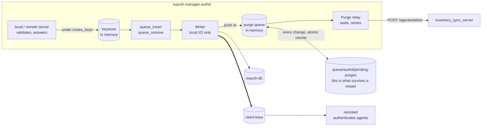
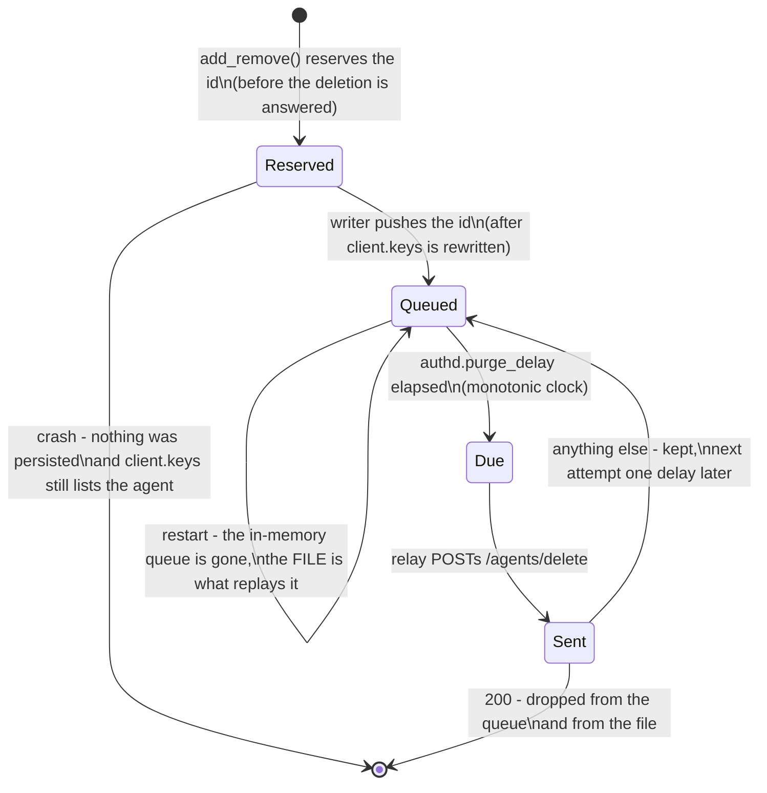

# os_auth (authd)

The manager's enrollment service. It owns the agent keystore: it hands out ids and keys, persists
them to `client.keys`, mirrors every registration into wazuh-db, and — when an agent is removed —
makes sure that agent's documents leave the indexer too.

Three documentation layers cover authd, each with its own job:

- **This README** — the developer's map: the [requirements catalog](#requirements) and
  [design decisions](#design-decisions-d1d8), how the threads divide the work, which invariants are
  load-bearing, and *why* it is built this way ([threads](#threads),
  [agent removal](#agent-removal), [invariants](#invariants), [developer FAQ](#developer-faq)).
- **[`docs/ref/modules/authd/`](../../docs/ref/modules/authd/README.md)** — the operator-facing
  reference: [overview](../../docs/ref/modules/authd/README.md),
  [architecture](../../docs/ref/modules/authd/architecture.md) (the diagrams: the two stores, the
  enrollment sequence, the force-guard chain, cluster forwarding, the removal path) and
  [configuration](../../docs/ref/modules/authd/configuration.md).
- **[`inventory_sync_server`](../wazuh_modules/inventory_sync_server/README.md)** — the peer on the
  other side of the deletion route; its
  [agent deletion section](../wazuh_modules/inventory_sync_server/README.md#agent-deletion-endpointsdeleteagentendpoint)
  documents what a `200` promises.

## Requirements

What the module has to do, and where each requirement is answered. A row marked **superseded** is
kept on purpose: the original requirement is still the reason the current design exists, and deleting
it would erase why.

### Functional (RF)

| # | Requirement | Status |
|---|---|---|
| RF-1 | Serve enrollment on the TLS port (1515), over the local socket, and through remoted's authenticated `POST /enroll` — one implementation, three doors | kept ([enrollment](#enrollment)) |
| RF-2 | Assign each agent a unique id and generate its key; answer the caller with both | kept (`OS_AddNewAgent`, `w_auth_add_agent`) |
| RF-3 | Validate name, IP, groups and agent version before any keystore mutation | kept |
| RF-4 | Authenticate the enroller by shared password and/or TLS client certificate, each independently optional | kept (`use_password`, `ssl_agent_ca`/`ssl_verify_host`) |
| RF-5 | Refuse a duplicate name, IP or id unless the `<force>` guards all allow the takeover | kept ([force replacement](#force-replacement)) |
| RF-6 | Persist the keystore to `client.keys` and mirror every registration into wazuh-db | kept (the [writer](#threads)) |
| RF-7 | Remove an agent from the keystore, `client.keys`, wazuh-db, its rids counter and its timestamp | kept ([agent removal](#agent-removal)) |
| RF-8 | Delete a removed agent's documents from the indexer, retriably | kept — **relayed, not inline** (D3); the endpoint is inventory-sync's `POST /agents/delete` |
| RF-9 | Forward enrollment to the master on a worker node; the master decides | kept (`local_add_clustered`, `w_request_agent_add_clustered`) |
| RF-10 | Accept an insertion that names an explicit id (`manage_agents`, `POST /agents/insert`) | kept, but **refuses rather than reassigns** when the id is taken (`9012`) or owes a purge (`9018`) — D6 |
| RF-11 | Answer the indexer purge synchronously so the caller learns whether the documents are gone | **superseded by D3** — the `200` means *queued*; waiting for the flush wedged the writer |
| RF-12 | Survive a restart without losing work the system has no other record of | kept ([the state file](#the-state-file)) |
| RF-13 | Expose the enrollment password to workers as the cluster syncs it down | kept (the authpass watcher; fails closed until the file arrives) |

### Non-functional (RNF)

| # | Requirement | Where it is answered |
|---|---|---|
| RNF-1 | **An enrollment must never wait on the indexer.** remoted authenticates from `client.keys`, so anything slow in the writer's pass delays every agent, including unrelated ones | the purge queue + relay thread (D3); invariant 1 |
| RNF-2 | No I/O under `mutex_keys` | the purge queue has its own mutex and condvar; invariant 2 |
| RNF-3 | A queued purge is never lost — not to a restart, not to a crash, not to an unreachable indexer | [the state file](#the-state-file), written before the relay is woken; invariant 3 |
| RNF-4 | An id is never handed out twice, across restarts and across a rebuilt counter | `last_id` in the state file + in-memory reservation; invariant 4 |
| RNF-5 | Fail towards "cleaned up later", never towards "deleted something alive" | every ordering decision in the removal path; invariant 5 |
| RNF-6 | Deterministic shutdown: no thread can park the daemon on a network budget | `running` is checked inside the relay's retry sleeps; the relay stops sending rather than draining |
| RNF-7 | Every refusal is observable and attributable to one guard | one message per guard in `w_auth_replace_agent()`; the `9001–9018` table |
| RNF-8 | Unit-testable orchestration without a live indexer or manager | seams + the suites in [Tests](#tests) |

### Contract with inventory_sync_server (REQ-PURGE)

The deletion route is a contract between two modules; both sides depend on these:

| # | Requirement |
|---|---|
| REQ-PURGE-1 | The purge is **idempotent** — a missing index or an already-purged agent counts as success, so repeating it is free |
| REQ-PURGE-2 | It is **at least once**, never at most once: authd retries until accepted and persists across restarts |
| REQ-PURGE-3 | A `200` means *recorded and queued*, not *documents gone*. The purge's own outcome is observable in inventory-sync's log, never on this wire |
| REQ-PURGE-4 | The purge is **delayed** by `authd.purge_delay` so it outlives the index refresh, the cluster sync and the keepalive tolerance — whatever it misses survives forever |
| REQ-PURGE-5 | Deletion orders FIFO against that agent's in-flight sessions; the caller does not serialize it |

## Design decisions (D1–D8)

| # | Decision | Rationale |
|---|---|---|
| D1 | **One in-memory keystore behind one mutex** is the authority inside authd; `client.keys` is a projection of it, never a second source of truth | Duplicate checks, the agent limit and id assignment all need the same instantaneous view; two stores that can disagree would need reconciliation nobody would get right |
| D2 | **The writer is the only thread that persists `client.keys`**, and it rewrites the file whole through a temp + rename | One writer means no locking discipline to get wrong on the file, and an atomic rename means a reader never sees a torn keystore |
| D3 | **The indexer purge is relayed by a second thread**, never called from the writer | A delete-by-query on populated `wazuh-states-*` legitimately outlives any budget worth setting; doing it inline blocked every key write and locked out enrollment fleet-wide |
| D4 | **The purge queue is persisted before the relay is woken** | If the process dies in between, the next start replays an entry that was never sent — failing towards "purge twice", which is free (REQ-PURGE-1) |
| D5 | **`client.keys` is rewritten before the purge is recorded**, never the other way round | The reverse order can leave a queued purge for an agent that is still alive |
| D6 | **An id whose purge is pending is refused, not reassigned** (`9018`) | The purge matches by agent id and nothing in a state document distinguishes one owner from the next; cancelling a queued purge is never the answer |
| D7 | **A replacement is a deletion, and never reuses the id** | It goes through the same `add_remove()` + `OS_DeleteKey()` path, so it inherits every guarantee above instead of needing its own |
| D8 | **The `<force>` guards are all-or-nothing and each logs its own refusal** | An operator debugging a rejected enrollment needs to know *which* guard refused; a single generic "rejected" is unactionable |

## Layout

| Path | Contents |
|---|---|
| `src/main-server.c` | `main()`, the thread bodies (remote server, writer, purge relay), the deletion relay to inventory-sync |
| `src/local-server.c` | the local Unix-socket protocol: `add`, `remove`, `get`, and their error table |
| `src/auth.c` | shared state (`keys`, `config`, the queues), enrollment validation, force-replacement, the pending-purge queue and its file |
| `src/config.c` | `<auth>` block plus the `authd.*` internal options |
| `include/auth.h` | everything the two servers and the threads share |

`main-server.c` is deliberately **excluded from `authd_lib`**, the static library the unit tests link
against (see [`CMakeLists.txt`](CMakeLists.txt)). Anything that needs coverage therefore belongs in
`auth.c` or `local-server.c`, not in `main-server.c` — that is why the pending-purge queue lives in
`auth.c` even though only `main-server.c`'s relay thread consumes it.

## Threads

| Thread | Role |
|---|---|
| Local server | serves `queue/sockets/auth.sock`: `add` / `remove` / `get`, for the server API and for remoted's `/enroll` route |
| Remote server | TLS enrollment on port 1515, when `remote_enrollment` is enabled |
| Writer | the only thread that persists `client.keys`; also removes rows from wazuh-db and hands indexer purges to the relay |
| Purge relay | sends the queued purges to inventory-sync, after their delay, and owns every retry |

The writer runs on the master only (a worker node has no keystore to persist), and the relay is
created next to it because the writer is its only producer.



### The invariant that shapes the split

**The writer thread must never wait on anything it does not own.** It is the only thread that writes
`client.keys`, and remoted authenticates agents by reading that file — so anything slow in the
writer's pass delays *every* enrollment, including agents that have nothing to do with the work in
progress.

This is not hypothetical. The indexer purge used to be a synchronous call inside that pass, with a
30 s timeout and three attempts: on a fleet-wide removal against a loaded indexer the writer spent up
to 94 s per agent, `client.keys` was not rewritten while it waited, and remoted answered `401` to
every freshly enrolled agent until the whole batch drained. Recovery was a manager restart, which
silently dropped whatever was still queued.

## Enrollment

Three doors converge quickly: the TLS port on 1515, remoted's authenticated `/enroll` route and the
server API — the last two both arriving over the local socket. On a worker node an enrollment is
forwarded to the master (`local_add_clustered`), so the checks below always run there. The serving
thread validates the request, and under `mutex_keys`:

1. checks for duplicate id, name and IP, applying the [force](#force-replacement) rules;
2. adds the entry to the in-memory keystore (`OS_AddNewAgent`), which assigns the id;
3. appends the new key to `queue_insert`, sets `write_pending` and signals `cond_pending`;
4. releases the mutex and answers the caller with the key.

The agent has a usable key at that point, but **remoted does not know about it yet**: the key reaches
`client.keys` on the writer's next pass, and remoted reloads the file on its own cadence. Enrollment
latency is therefore the writer's pass time plus remoted's reload — which is exactly why nothing slow
may live in that pass.

## Agent removal

Removing an agent touches four places, and only the first three are immediate:

| # | What is removed | Who reads it afterwards | When |
|---|---|---|---|
| 1 | the entry in the in-memory keystore (`OS_DeleteKey`) | authd itself: duplicates, agent limit | on the request |
| 2 | the `client.keys` file (rewritten whole) | remoted | next writer pass |
| 3 | the row in wazuh-db, the rids counter, the timestamp | the server API | next writer pass |
| 4 | the agent's documents in the indexer | the dashboard | after `authd.purge_delay` |

### Two doors, one path

A removal is requested in two ways, and after `add_remove()` they are indistinguishable:

- **`DELETE /agents`** through the server API, which reaches `local_remove()`. One request per agent:
  the framework loops, so a bulk delete arrives as N sequential socket round trips.
- **An enrollment whose name already exists**, which reaches `w_auth_replace_agent()`. That function
  logs *"Removing old agent"*, calls `add_remove()` and `OS_DeleteKey()` — the same two calls the API
  path makes.

The second one matters for scale: **a fleet that re-enrolls with names that already exist generates
one deletion per agent, without anyone calling the API.** Any reasoning about deletion load has to
account for it.

### The queue and the relay

`add_remove()` only records the pending work: it appends a node holding copies of the id, the name and
the IP to `queue_remove`. The writer then, per node, removes the counter, the timestamp and the
wazuh-db row, and calls `purge_queue_push()` — a `strdup`, a list append and a signal. It does not
call inventory-sync itself.

**What the `200` means.** The route answers at admission: `200 {"status":"queued"}` says the deletion
was recorded and will be purged, and nothing more. There is no completion signal back to authd by
design — waiting for one is what used to block the writer — so authd's ownership of a deletion ends at
that `200`, and the purge's own outcome lives in modulesd's log. `503` and every other status mean
"still ours".

The relay pops the head once it is due, sends `POST /agents/delete`, and:

- on acceptance, drops the entry and rewrites the file;
- on anything else, keeps the entry and pushes its next attempt one delay into the future.

**A queued purge always runs.** It is never cancelled, and never dropped except by an operator
deleting the state file: the entry is the only record that those documents still have to go.

### The delay

A purge waits at least `authd.purge_delay` seconds (default 120, see
[configuration](../../docs/ref/modules/authd/configuration.md#authdpurge_delay)) because it has to
outlast three intervals: the index refresh (~1 s), the cluster integrity sync (9 s) and the master's
keepalive tolerance (120 s). A `_delete_by_query` is a *search*, so it cannot match documents the
indexer has not made searchable yet, and a cluster worker that still holds the previous `client.keys`
keeps writing that agent's data. **Whatever the purge misses survives forever** — the agent is gone,
so nothing overwrites it.

Two clocks are involved on purpose:

- `requested_at`, wall clock, is what gets **persisted**, and it is only used to work out how much of
  the delay is left after a restart;
- `due_mono`, monotonic, is what decides whether an entry is due. An NTP correction while the daemon
  runs can neither bring a purge forward nor park it in a future the wall clock has already left.

The relay's condition variable is initialised on `CLOCK_MONOTONIC` for the same reason, with a
fallback for a platform that refuses the attribute.

### The state file

`queue/authd/pending-purges`, rewritten whole through a temporary and an atomic rename — the same way
`OS_WriteKeys` persists `client.keys`:

```
last_update 1787582136
last_id 161
purge 003 1787582014
```

- `last_update` — when the file was last written. If the clock is **earlier** than this on startup,
  every stored timestamp is untrustworthy and they are all re-stamped, so each entry waits its full
  delay again rather than firing on a delay that never elapsed.
- `last_id` — the highest agent id ever handed out. See below.
- `purge <id> <epoch>` — one pending purge.

Unknown labels are ignored, so a later version can add lines without this parser rejecting a file it
merely does not fully understand.

Ordering is load-bearing: the `purge` line is written **after** `client.keys` has been rewritten,
never before. Failing the other way would leave a queued purge for an agent that is still alive.

That ordering leaves a window, though: the deletion is answered as soon as the key leaves memory, while
the `purge` line only appears once the writer has run. An insertion naming that id in between would find
it free in both checks — gone from the keystore, not yet in the queue. So the id is **reserved in
memory** by `add_remove()`, the single point both the local socket and a force-replacement go through,
and the writer hands that reservation over to the queue when it pushes the real entry. The reservation
is deliberately not persisted: if the process dies before the writer runs, `client.keys` was never
rewritten either, so the agent is still listed there and holds its id legitimately.



### Why an id is never reused

`last_id` exists because the purge matches by **agent id**, and nothing in a state document
distinguishes one owner of an id from the next: the documents carry no timestamp, and two of the three
indices in the deletion scope carry no agent name either. So a purge that arrives while a new agent
holds the same id would delete that agent's documents.

An id is therefore refused from the instant the agent is deleted, not from the instant the purge is
queued — see the reservation above.

Within one run the counter only increments, so an id cannot be reused. Across a restart the counter is
rebuilt from `client.keys` — which no longer lists the agents that were just deleted — so it could
walk backwards over exactly the ids whose purges are still pending. On startup it is therefore raised
to `max(last_id, highest id in client.keys)`, and the change is logged at info level because it is
what explains a jump in the ids handed out.

`queue/` survives an upgrade and a plain package removal. A full purge of the package, or an install
into a clean tree, takes the file with it: the counter starts over while the indexer still holds the
previous fleet's documents. **Deleting a manager should include deleting its indexer data.**

### Insertion with a chosen id

`POST /agents/insert` is the one path where the caller names the id, and it is refused rather than
served when the id is not free to reuse:

| Situation | Error |
|---|---|
| the id still owes a purge | `9018 Agent ID has a pending deletion` (`1763` through the server API) |
| the id belongs to an existing agent | `9012 Duplicate ID` |

The second one is a **behaviour change**: `force` no longer replaces an agent when the id is given
explicitly. Replacing by the same id would queue a purge for an id that receives a new owner in the
same operation, and cancelling that purge is not an option — see the FAQ.

## Force replacement

The `<force>` sub-block decides whether an enrollment may take over a name or IP that already exists.
All guards are evaluated together and every one has to allow it. With the defaults (`enabled` yes,
`key_mismatch` yes, `disconnected_time` 1 h, `after_registration_time` 1 h) the existing agent is
replaced when it has never connected or has been disconnected for at least an hour, was registered at
least an hour ago, and the enrolling agent presents a different key. **A connected agent is never
replaced.**

Two consequences worth knowing:

- **A replacement is a deletion**, with everything on this page applying to it.
- **A replacement never reuses the id.** The replacing agent is a new registration with a new id.

The guards also explain a rejection that looks like a bug and is not: right after a manager is
rebuilt, an agent re-enrolling against a registration created minutes ago is refused with *"doesn't
comply with the registration time to be removed"* until `after_registration_time` has passed.

## Invariants

1. **Nothing slow runs in the writer's pass.** No network, no unbounded wait. The relay exists for that.
2. **No I/O under `mutex_keys`.** The purge queue has its own mutex and condition variable; the
   enrollment path must never contend with the relay.
3. **A queued purge always runs.** Never cancelled; refused insertions are the price.
4. **An id is never handed out twice.**
5. **Fail towards "cleaned up later", never towards "deleted something alive".** Every ordering
   decision in the removal path follows from this.
6. **The indexer purge is at least once.** It is idempotent (a missing index counts as success), so
   repeating it is free and losing it is not.

## Configuration

The `<auth>` block and the `authd.*` internal options are documented in
[`docs/ref/modules/authd/configuration.md`](../../docs/ref/modules/authd/configuration.md).
The ones that shape the behaviour described here:

| Option | Default | Effect |
|---|---|---|
| `authd.purge_delay` | `120` | seconds a deletion waits before its indexer purge is relayed |
| `<force>` | enabled | when an enrollment may take over an existing name or IP |
| `<purge>` | `no` | when `yes`, removed keys are dropped from `client.keys` instead of being kept as `!name` lines |

## Logs worth knowing

| Line | Meaning |
|---|---|
| `Recovered N pending agent deletion(s)` | startup replayed the state file |
| `Raising the agent id counter from X to Y` | the counter would have gone backwards; ids are not reused |
| `The deletion of agent 'N' was accepted by the inventory sync server` | the purge is now inventory-sync's responsibility |
| `The deletion of agent 'N' could not be relayed ... will be retried in S s` | first failure for that entry; later ones are debug |
| `The pending deletion queue is full` | the cap was hit; that deletion has to be repeated |
| `Shutting down with N pending agent deletion(s)` | they stay in the file and are retried on the next start |
| `Agent ID 'N' still has a pending deletion, rejecting the insertion` | the `9018` path |

## Tests

| Suite | Covers |
|---|---|
| `unit_tests/os_auth/test_purge_queue.c` | the pending-purge queue and its file: persistence, the id mark, the clock rules, shutdown |
| `unit_tests/os_auth/test_auth_validate.c` | force replacement and its guards |
| `unit_tests/os_auth/test_auth_add.c` | id and key assignment |
| `unit_tests/os_auth/test_auth.c` | password handling |
| `unit_tests/os_auth/test_auth_parse.c` | the enrollment message parser |
| `unit_tests/os_auth/test_authd-config.c` | the `<auth>` block |

Two things to know before writing a case here. The log functions are wrapped, so **every** line the
code under test emits has to be declared — and an undeclared one aborts cmocka from inside whatever
lock the code was holding, which hangs the run rather than failing it. And `main-server.c` is not in
`authd_lib`, so the relay thread itself is only exercised in a running manager.

## Operational notes

- **A deletion is confirmed to the caller long before it is complete.** `DELETE /agents` answers as
  soon as the key leaves memory; wazuh-db follows on the next writer pass and the indexer up to
  `authd.purge_delay` later. Tooling that deletes and immediately asserts on the indexer has to wait.
- **`client.keys` is rewritten whole**, never edited in place, and the write is atomic. There is no
  supported way to remove one agent by editing the file: authd rewrites it from memory on the next
  pass and the edit is lost.
- **Deleting a manager should include deleting its indexer data**, or a rebuilt manager hands out ids
  whose documents are still in the indexer.
