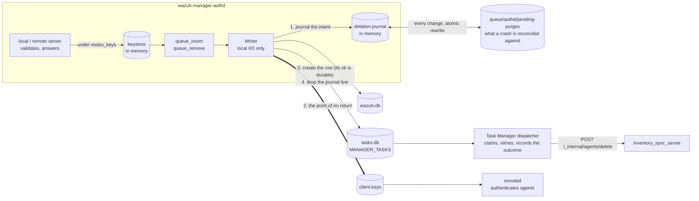

# os_auth (authd)

The manager's enrollment service. It owns the agent keystore: it hands out ids and keys, persists
them to `client.keys`, mirrors every registration into wazuh-db, and — when an agent is removed —
makes sure that agent's documents leave the indexer too.

Three documentation layers cover authd, each with its own job:

- **This README** — the developer's map: the [requirements catalog](#requirements) and
  [design decisions](#design-decisions-d1d8), how the threads divide the work, which invariants are
  load-bearing, and *why* it is built this way ([threads](#threads),
  [agent removal](#agent-removal), [invariants](#invariants), [developer FAQ](#developer-faq)).
- **[`docs/ref/modules/authd/`](../../docs/ref/modules/authd/README.md)** — the operator-facing
  reference: [overview](../../docs/ref/modules/authd/README.md),
  [architecture](../../docs/ref/modules/authd/architecture.md) (the diagrams: the two stores, the
  enrollment sequence, the force-guard chain, cluster forwarding, the removal path) and
  [configuration](../../docs/ref/modules/authd/configuration.md).
- **[`inventory_sync_server`](../wazuh_modules/inventory_sync_server/README.md)** — the peer on the
  other side of the deletion route; its
  [agent deletion section](../wazuh_modules/inventory_sync_server/README.md#agent-deletion-endpointsdeleteagentendpoint)
  documents what a `200` promises.

## Requirements

What the module has to do, and where each requirement is answered. A row marked **superseded** is
kept on purpose: the original requirement is still the reason the current design exists, and deleting
it would erase why.

### Functional (RF)

| # | Requirement | Status |
|---|---|---|
| RF-1 | Serve enrollment on the TLS port (1515), over the local socket, and through remoted's authenticated `POST /enroll` — one implementation, three doors | kept ([enrollment](#enrollment)) |
| RF-2 | Assign each agent a unique id and generate its key; answer the caller with both | kept (`OS_AddNewAgent`, `w_auth_add_agent`) |
| RF-3 | Validate name, IP, groups and agent version before any keystore mutation | kept |
| RF-4 | Authenticate the enroller by shared password and/or TLS client certificate, each independently optional | kept (`use_password`, `ssl_agent_ca`/`ssl_verify_host`) |
| RF-5 | Refuse a duplicate name, IP or id unless the `<force>` guards all allow the takeover | kept ([force replacement](#force-replacement)) |
| RF-6 | Persist the keystore to `client.keys` and mirror every registration into wazuh-db | kept (the [writer](#threads)) |
| RF-7 | Remove an agent from the keystore, `client.keys`, wazuh-db, its rids counter and its timestamp | kept ([agent removal](#agent-removal)) |
| RF-8 | Delete a removed agent's documents from the indexer, retriably | kept — **recorded, not relayed** (D3): authd creates a durable Task Manager row and the dispatcher executes it against inventory-sync's `POST /_internal/agents/delete` |
| RF-9 | Forward enrollment to the master on a worker node; the master decides | kept (`local_add_clustered`, `w_request_agent_add_clustered`) |
| RF-10 | Accept an insertion that names an explicit id (`manage_agents`, `POST /agents/insert`) | kept, but **refuses rather than reassigns** when the id is taken (`9012`), owes a purge (`9018`), or is outside the storable range (`9020`) — D6, D9 |
| RF-11 | Answer the indexer purge synchronously so the caller learns whether the documents are gone | **superseded by D3** — authd's ownership ends at the durable row; the purge's own outcome is the task's status, not this daemon's business |
| RF-12 | Survive a restart without losing work the system has no other record of | kept ([the state file](#the-state-file)) |
| RF-13 | Expose the enrollment password to workers as the cluster syncs it down | kept (the authpass watcher; fails closed until the file arrives) |
| RF-14 | Reject an id, whether caller-supplied or auto-assigned, that would not fit the width `client.keys` and the database store it in | kept (`OS_IsValidAgentInsertID`, `OS_ADDAGENT_LIMIT_REACHED`) — D9 |

### Non-functional (RNF)

| # | Requirement | Where it is answered |
|---|---|---|
| RNF-1 | **An enrollment must never wait on the indexer.** remoted authenticates from `client.keys`, so anything slow in the writer's pass delays every agent, including unrelated ones | the deletion becomes a task row rather than a network call (D3); invariant 1 |
| RNF-2 | No I/O under `mutex_keys` | the journal has its own mutex; invariant 2 |
| RNF-3 | A recorded purge is never lost — not to a restart, not to a crash, not to an unreachable indexer | [the journal](#the-journal) plus [startup reconciliation](#startup-reconciliation); invariant 3 |
| RNF-4 | An id is never handed out twice, across restarts and across a rebuilt counter | `last_id` in the state file + in-memory reservation; invariant 4 |
| RNF-5 | Fail towards "cleaned up later", never towards "deleted something alive" | every ordering decision in the removal path; invariant 5 |
| RNF-6 | Deterministic shutdown: no thread can park the daemon on a network budget | there is no network call left in this daemon's deletion path; the writer's wazuh-db calls are bounded by `authd.wdb_timeout` |
| RNF-7 | Every refusal is observable and attributable to one guard | one message per guard in `w_auth_replace_agent()`; the `9001–9021` table |
| RNF-8 | Unit-testable orchestration without a live indexer or manager | seams + the suites in [Tests](#tests) |

### Contract with inventory_sync_server (REQ-PURGE)

The deletion is a contract between three modules now — authd records it, the Task Manager executes
it, inventory-sync applies it — and all three depend on these:

| # | Requirement |
|---|---|
| REQ-PURGE-1 | The purge is **idempotent** — a missing index or an already-purged agent counts as success, so repeating it is free |
| REQ-PURGE-2 | It is **at least once**, never at most once: the task row survives restarts and has no attempt budget to exhaust |
| REQ-PURGE-3 | The row reads `completed` only once the delete-by-query has run **and flushed**. This is what changed: the old route answered at admission, so `completed` would have meant "inventory-sync accepted it" |
| REQ-PURGE-4 | The purge is **delayed** by `authd.purge_delay` so it outlives the index refresh, the cluster sync and the keepalive tolerance — whatever it misses survives forever. The delay is now the row's initial `NEXT_ATTEMPT_AT` |
| REQ-PURGE-5 | Deletion orders FIFO against that agent's in-flight sessions; neither authd nor the dispatcher serializes it |

## Design decisions (D1–D10)

| # | Decision | Rationale |
|---|---|---|
| D1 | **One in-memory keystore behind one mutex** is the authority inside authd; `client.keys` is a projection of it, never a second source of truth | Duplicate checks, the agent limit and id assignment all need the same instantaneous view; two stores that can disagree would need reconciliation nobody would get right |
| D2 | **The writer is the only thread that persists `client.keys`**, and it rewrites the file whole through a temp + rename | One writer means no locking discipline to get wrong on the file, and an atomic rename means a reader never sees a torn keystore |
| D3 | **The indexer purge is a durable Task Manager row**, never a network call from this daemon | A delete-by-query on populated `wazuh-states-*` legitimately outlives any budget worth setting. A relay thread solved the blocking, but left the obligation in one process's memory: a modulesd or authd crash lost it silently, and nothing ever asked again |
| D4 | **The journal line is written before `client.keys`, the row is created after** | The line costs no external dependency, so it cannot block a key write; the row is what the system will act on, so it must not exist for an agent still on disk. A crash between them is resolved by [reconciliation](#startup-reconciliation), failing towards "purge twice" — which is free (REQ-PURGE-1) |
| D5 | **The row is created only if `OS_WriteKeys` succeeded** | The writer logs a failed key write and falls through to the removal loop, so without an explicit gate authd would record purges for agents that are still listed on disk |
| D6 | **An id whose purge is pending is refused, not reassigned** (`9018`) | The purge matches by agent id and nothing in a state document distinguishes one owner from the next; cancelling a recorded purge is never the answer |
| D7 | **A replacement is a deletion, and never reuses the id** | It goes through the same `add_remove()` + `OS_DeleteKey()` path, so it inherits every guarantee above instead of needing its own |
| D8 | **The `<force>` guards are all-or-nothing and each logs its own refusal** | An operator debugging a rejected enrollment needs to know *which* guard refused; a single generic "rejected" is unactionable |
| D9 | **An id, caller-supplied or auto-assigned, is range-checked before it can reach either store** — never after | Both `client.keys` and the database keep the id in a signed 32-bit int; an unchecked value above `INT32_MAX` wraps silently at write time, and the two stores wrapped independently, leaving one agent with two disjoint identities and no supported way to query or delete the result |
| D10 | **A deletion is refused at the REQUEST when the backlog is full** (`9021`), not discovered later | One line past that point the agent has left the keystore and the caller has been told it succeeded, so there is nothing left to refuse and nobody to tell. The old code found the overflow in the writer and could only choose between dropping the purge silently and orphaning the documents |

## Layout

| Path | Contents |
|---|---|
| `src/main-server.c` | `main()`, the thread bodies (remote server, writer), the deletion's phase 3/4 and startup reconciliation |
| `src/local-server.c` | the local Unix-socket protocol: `add`, `remove`, `get`, and their error table |
| `src/auth.c` | shared state (`keys`, `config`, the queues), enrollment validation, force-replacement, the deletion journal and the reusable-id guard |
| `src/config.c` | `<auth>` block plus the `authd.*` internal options |
| `include/auth.h` | everything the two servers and the threads share |

`main-server.c` is deliberately **excluded from `authd_lib`**, the static library the unit tests link
against (see [`CMakeLists.txt`](CMakeLists.txt)). Anything that needs coverage therefore belongs in
`auth.c` or `local-server.c`, not in `main-server.c` — that is why the deletion journal lives in
`auth.c` even though only `main-server.c`'s writer thread drives it.

## Threads

| Thread | Role |
|---|---|
| Local server | serves `queue/sockets/auth.sock`: `add` / `remove` / `get`, for the server API and for remoted's `/enroll` route |
| Remote server | TLS enrollment on port 1515, when `remote_enrollment` is enabled |
| Writer | the only thread that persists `client.keys`; also removes rows from wazuh-db and records each deletion as a Task Manager row |

The writer runs on the master only — a worker node has no keystore to persist, and therefore no
deletions to record. **There is no longer a thread in this daemon that talks to the network.**



### The invariant that shapes the split

**The writer thread must never wait on anything it does not own.** It is the only thread that writes
`client.keys`, and remoted authenticates agents by reading that file — so anything slow in the
writer's pass delays *every* enrollment, including agents that have nothing to do with the work in
progress.

This is not hypothetical. The indexer purge used to be a synchronous call inside that pass, with a
30 s timeout and three attempts: on a fleet-wide removal against a loaded indexer the writer spent up
to 94 s per agent, `client.keys` was not rewritten while it waited, and remoted answered `401` to
every freshly enrolled agent until the whole batch drained. Recovery was a manager restart, which
silently dropped whatever was still queued.

A relay thread fixed the blocking and left the second half of the problem standing: the obligation
still lived only in one process's memory and one file that only that process replayed. The purge now
becomes a row in `tasks.db` instead, which is why the only external call left in the writer's pass is
one bounded wazuh-db round trip — the same socket it already used for `wdb_remove_agent`.

## Enrollment

Three doors converge quickly: the TLS port on 1515, remoted's authenticated `/enroll` route and the
server API — the last two both arriving over the local socket. On a worker node an enrollment is
forwarded to the master (`local_add_clustered`), so the checks below always run there. The serving
thread validates the request, and under `mutex_keys`:

1. checks for duplicate id, name and IP, applying the [force](#force-replacement) rules;
2. adds the entry to the in-memory keystore (`OS_AddNewAgent`), which assigns the id;
3. appends the new key to `queue_insert`, sets `write_pending` and signals `cond_pending`;
4. releases the mutex and answers the caller with the key.

The agent has a usable key at that point, but **remoted does not know about it yet**: the key reaches
`client.keys` on the writer's next pass, and remoted reloads the file on its own cadence. Enrollment
latency is therefore the writer's pass time plus remoted's reload — which is exactly why nothing slow
may live in that pass.

## Agent removal

Removing an agent touches four places, and only the first three are immediate:

| # | What is removed | Who reads it afterwards | When |
|---|---|---|---|
| 1 | the entry in the in-memory keystore (`OS_DeleteKey`) | authd itself: duplicates, agent limit | on the request |
| 2 | the `client.keys` file (rewritten whole) | remoted | next writer pass |
| 3 | the row in wazuh-db, the rids counter, the timestamp | the server API | next writer pass |
| 4 | the agent's documents in the indexer | the dashboard | a Task Manager task, first eligible after `authd.purge_delay` |

### Two doors, one path

A removal is requested in two ways, and after `add_remove()` they are indistinguishable:

- **`DELETE /agents`** through the **server API**, which reaches `local_remove()`. One request per agent:
  the framework loops, so a bulk delete arrives as N sequential socket round trips.
- **An enrollment whose name already exists**, which reaches `w_auth_replace_agent()`. That function
  logs *"Removing old agent"*, calls `add_remove()` and `OS_DeleteKey()` — the same two calls the API
  path makes.

The second one matters for scale: **a fleet that re-enrolls with names that already exist generates
one deletion per agent, without anyone calling the API.** Any reasoning about deletion load has to
account for it.

### The four phases

`add_remove()` only records the pending work: it appends a node holding copies of the id, the name and
the IP to `queue_remove`, and **reserves the id**. Everything else happens on the writer's next pass,
in an order that is entirely about which failures are survivable:

| # | Phase | Where | What a failure costs |
|---|---|---|---|
| 0 | **Admit or refuse** | the request thread, before `OS_DeleteKey()` | the deletion is refused (`9021`) and the agent is untouched |
| 1 | **Journal the intent** | writer, before `OS_WriteKeys()` | a warning; the entries are still in memory and the phases continue |
| 2 | **`OS_WriteKeys()`** | writer | logged, and **phase 3 is skipped** — see below |
| 3 | **Create the task row** | writer, over its own wazuh-db socket | the journal line stays; the next cycle retries it |
| 4 | **Drop the journal line** | writer, on wazuh-db's acknowledgement | the line stays; the next start re-creates the row and the id collides, which is success |

**Phase 0 has to be on the request thread.** One line past it, `add_remove()` and `OS_DeleteKey()`
have run: the agent is out of the in-memory keystore and the caller has already been told the
deletion succeeded. From there, there is nothing left to refuse and nobody to tell — which is why the
old code, discovering a full queue in the writer, could only choose between dropping the purge
silently and logging it while the documents were orphaned.

**Phase 1 is local on purpose.** Creating the row here instead would put a wazuh-db round trip in
front of every `client.keys` write, so a database outage would block enrollment: exactly the wedge
this design exists to remove.

**Phase 3 is gated on phase 2, and the gate is load-bearing.** The writer *logs* a failed
`OS_WriteKeys()` and falls through to the removal loop — it always has — so without an explicit check
authd would create purge rows for agents that are still listed on disk. The in-memory keystore cannot
serve as that check: `OS_DeleteKey()` already ran, so it says "deleted" while the file says "alive".

**Phase 3's `ok` is a durability acknowledgement**, not a buffered write: the Task Manager's create
command commits inside its own wazuh-db command. That is precisely what lets phase 4 drop the line.
Dropping it on a merely-buffered ok would leave a window in which wazuh-db's death loses the row *and*
the record that it was owed.

Every wazuh-db call the writer makes carries `authd.wdb_timeout`. With an unbounded client a wedged
database would **hang** the writer, and a stuck writer has no next cycle to self-heal from; bounded,
the same failure is just a phase that did not complete.

### What authd's ownership ends at

At the durable row, and nothing further. There is no completion signal back to this daemon by design
— waiting for one is what used to block the writer. The Task Manager's dispatcher owns every retry
from there, against a task type that has **no attempt budget**: once `client.keys` is written the
agent is gone and nobody will raise the obligation again, so the row must never be given up on.

**A recorded purge always runs.** It is never cancelled, and never dropped except by an operator
deleting the row.

### The delay

A purge waits at least `authd.purge_delay` seconds (default 120, see
[configuration](../../docs/ref/modules/authd/configuration.md#authdpurge_delay)) because it has to
outlast three intervals: the index refresh (~1 s), the cluster integrity sync (9 s) and the master's
keepalive tolerance (120 s). A `_delete_by_query` is a *search*, so it cannot match documents the
indexer has not made searchable yet, and a cluster worker that still holds the previous `client.keys`
keeps writing that agent's data. **Whatever the purge misses survives forever** — the agent is gone,
so nothing overwrites it.

It is expressed as the row's initial `NEXT_ATTEMPT_AT`, derived from the journalled `requested_at`.
It stays a *delay* rather than becoming a *condition* because none of the three intervals it covers is
something this daemon can observe.

The monotonic clock the relay needed is gone with it: nothing in authd waits for a purge to become
due any more, so there is no timed wait an NTP correction could move. What survives is the one rule
that was never about the relay — if the clock is **earlier** on startup than the journal's own
`last_update`, every stored timestamp is untrustworthy and they are all re-stamped, so each deletion
waits its full delay again rather than running on a delay that never elapsed.

### The journal

`queue/authd/pending-purges` is no longer a queue with its own scheduler. It is a **handoff journal**
holding only the ids currently between phase 1 and phase 4, and it is normally **empty**: it drains at
wazuh-db speed rather than at indexer speed. It is rewritten whole through a temporary and an atomic
rename — the same way `OS_WriteKeys` persists `client.keys`:

```
last_update 1787582136
last_id 161
last_seq 4
purge 003 1787582014 4
```

- `last_update` — when the file was last written; the clock-jump check above reads it.
- `last_id` — the highest agent id ever handed out. See below.
- `last_seq` — the highest journal sequence ever assigned.
- `purge <id> <epoch> <seq>` — one deletion in progress.

Unknown labels are ignored, so a later version can add lines without this parser rejecting a file it
merely does not fully understand. Lines from a release that had no sequences are still read, and are
**numbered by position** rather than handed the next value from `last_seq`: position is deterministic
across a crash during the conversion, a running counter is not, and re-numbering would derive
different task ids and produce duplicate rows for one deletion.

**The sequence is why the row's id is safe to derive twice.** A deletion's `TASK_ID` is
`SHA-256("mt:del:" <agent id> ":" <journal_seq>)`, so phase 3 and startup reconciliation derive the
same id and the second creation collides harmlessly — which is what makes recovery a no-op instead of
a duplicate. A wall-clock stamp could not do that job: two genuine deletions of one agent in the same
second would derive one id, and the second would be silently swallowed as "already recorded" — against
a `completed` row still inside the retention window just as easily as against a live one. Sequences
are never reused and never reset.

### Startup reconciliation

Every crash point in the phase sequence is resolved on the next start, by comparing each surviving
journal line against the `client.keys` that has just been read:

| Crashed | Line | `client.keys` | Resolves to |
|---|---|---|---|
| before phase 1 | no | agent present | nothing owed |
| between 1 and 2 | yes | agent **present** | drop the line; the agent is alive |
| `OS_WriteKeys` failed | yes | agent **present** | drop the line; phase 3 was correctly skipped |
| between 2 and 3 | yes | agent gone | **create the row** — the window this design closes |
| between 3 and 4 | yes | agent gone | create again; the id collides, which is the expected path |
| after phase 4 | no | agent gone | the row is already committed |

Rows two and three are indistinguishable from here and resolve identically, which is why the gate on
`OS_WriteKeys` needs no separate record: an agent still in `client.keys` was never deleted, whichever
of the two happened.

### The reservation, and the window it covers

The deletion is answered as soon as the key leaves memory, while the journal line only appears once
the writer has run. An insertion naming that id in between would find it free in both checks — gone
from the keystore, not yet journaled. So the id is **reserved in memory** by `add_remove()`, the
single point both the local socket and a force-replacement go through, and the reservation is released
at phase 1, when the journal takes over as the durable record. No instant is left uncovered.

The reservation is deliberately not persisted: if the process dies before the writer runs,
`client.keys` was never rewritten either, so the agent is still listed there and holds its id
legitimately.

```mermaid
stateDiagram-v2
    [*] --> Reserved: add_remove() reserves the id\n(before the deletion is answered)
    Reserved --> Journaled: phase 1, before client.keys is rewritten
    Reserved --> [*]: crash - nothing was persisted\nand client.keys still lists the agent
    Journaled --> [*]: reconciliation - the agent is still enrolled,\nso the deletion never became final
    Journaled --> Recorded: phase 3 - the row is committed in tasks.db
    Recorded --> [*]: phase 4 - the journal line is dropped
    Recorded --> Recorded: restart - reconciliation re-creates the row;\nthe id collides, which is success
```



### The reusable-id guard

`purge_is_pending()` sits on the explicit-id enrollment path, so it must not become an unconditional
wazuh-db query. It answers from three in-memory sources and falls through to the database only on a
hit:

| Source | Meaning | Cost |
|---|---|---|
| the reservation list | admitted, not yet journaled | memory |
| the journal | journaled, row not yet confirmed | memory |
| the pending-id set | a row exists, as far as authd knows | memory, then **one** query on a hit |

- **Miss → not pending.** The common case never opens a socket.
- **Hit → check that one row's status, once.** The set cannot simply never shrink: the old queue *was*
  the live set, so an id became reusable the moment its purge succeeded, and under this design authd
  never observes completion. A set that only grew would refuse an explicit-id re-insert for the whole
  process lifetime — months.
- **Terminal or absent → not pending, and drop the id from the set.** Absent is reachable rather than
  hypothetical: an id enters the set at phase 1, `OS_WriteKeys` then fails, phase 3 is skipped, and
  reconciliation drops the line without ever creating a row.
- **Query failed → pending.** Refusing reuse is an error an operator can work around; allowing it
  risks an outstanding purge deleting a new agent's documents, which nothing repairs.

The set is **seeded at startup** from the non-terminal deletion rows wazuh-db still holds. Until that
seed succeeds, every explicit-id insertion is refused, because an incomplete seed would accept an id
that still owes a purge. The retry is lazy — the next explicit-id insertion attempts it — rather than
on a timer: that insertion is the only thing the seed gates, and on an idle manager a timer would be
the sole thing keeping the retry alive. Auto-assigned ids are unaffected: `keys.id_counter` comes from
the journal's `last_id` and needs no database.

### Refusing a deletion

Phase 0 refuses with `9021` (`1766` through the server API) when either bound is reached:

| Term | What it bounds | Why both |
|---|---|---|
| journal length **+ reservations** | deletions in flight through the phases | phase 0 runs on request threads while phase 1 appends at writer time, so a burst would each see "not full", all pass, and overflow where refusal is no longer possible. The reservations *are* the admitted-but-not-yet-journaled set |
| `manager_task_max_pending_deletes` | deletion rows still waiting to reach the indexer | the journal bounds admission-in-flight, not row count; rows accumulate independently, and the retention ceiling only evicts *terminal* rows while these are pending |

The second term is refreshed once per writer cycle — one query per cycle, not per agent — and **fails
open**: a failed measurement keeps the previous value, because a wazuh-db outage must not block agent
deletion. During such an outage the journal term is the only live bound, which is what it is sized
for. The same option is read by the Task Manager, which enforces it authoritatively at creation; one
key, so the two halves cannot drift.

### Why an id is never reused

`last_id` exists because the purge matches by **agent id**, and nothing in a state document
distinguishes one owner of an id from the next: the documents carry no timestamp, and two of the three
indices in the deletion scope carry no agent name either. So a purge that arrives while a new agent
holds the same id would delete that agent's documents.

An id is therefore refused from the instant the agent is deleted, not from the instant the row is
created — see [the reservation](#the-reservation-and-the-window-it-covers) above.

Within one run the counter only increments, so an id cannot be reused. Across a restart the counter is
rebuilt from `client.keys` — which no longer lists the agents that were just deleted — so it could
walk backwards over exactly the ids whose purges are still pending. On startup it is therefore raised
to `max(last_id, highest id in client.keys)`, and the change is logged at info level because it is
what explains a jump in the ids handed out.

The counter is a signed 32-bit int, the same width `client.keys` and the database store the id in,
so a manager that is long-lived or churns through enough agents can drive it to `INT_MAX` on its own
— no out-of-range input anywhere. `OS_AddNewAgent()` refuses to increment past that point rather than
wrapping to a negative id, reusing the same `OS_ADDAGENT_LIMIT_REACHED` sentinel an ordinary
`max_agents` refusal returns: the enrollment fails with `9013 Maximum number of agents reached` (the
local socket) or the plain-text `ERROR: Agent limit (N) reached` (anonymous enrollment on 1515), and
nothing is written to either store. This is unreachable from remoted's `/enroll` route today only in
the sense that a fleet has to be large or long-lived enough to exhaust ~2.1 billion ids first; there is
no format check that could rule it out the way an out-of-range explicit id can be rejected up front.

`queue/` survives an upgrade and a plain package removal. A full purge of the package, or an install
into a clean tree, takes the file with it: the counter starts over while the indexer still holds the
previous fleet's documents. **Deleting a manager should include deleting its indexer data.**

### Insertion with a chosen id

`POST /agents/insert` is the one path where the caller names the id, and it is refused rather than
served when the id is not valid, or not free to reuse:

| Situation | Error |
|---|---|
| the id is outside `[1, 2147483647]`, or `0` (reserved for the manager) | `9020 Invalid agent ID` — checked first, before any keystore lookup |
| the id still owes a purge | `9018 Agent ID has a pending deletion` (`1763` through the server API) |
| the id belongs to an existing agent | `9012 Duplicate ID` |
| the startup seed has not succeeded yet | `9018` as well — an unseeded set cannot judge any id free |

The second one is a **behaviour change**: `force` no longer replaces an agent when the id is given
explicitly. Replacing by the same id would queue a purge for an id that receives a new owner in the
same operation, and cancelling that purge is not an option — see the FAQ.

## Force replacement

The `<force>` sub-block decides whether an enrollment may take over a name or IP that already exists.
All guards are evaluated together and every one has to allow it. With the defaults (`enabled` yes,
`key_mismatch` yes, `disconnected_time` 1 h, `after_registration_time` 1 h) the existing agent is
replaced when it has never connected or has been disconnected for at least an hour, was registered at
least an hour ago, and the enrolling agent presents a different key. **A connected agent is never
replaced.**

Two consequences worth knowing:

- **A replacement is a deletion**, with everything on this page applying to it.
- **A replacement never reuses the id.** The replacing agent is a new registration with a new id.

The guards also explain a rejection that looks like a bug and is not: right after a manager is
rebuilt, an agent re-enrolling against a registration created minutes ago is refused with *"doesn't
comply with the registration time to be removed"* until `after_registration_time` has passed.

## Invariants

1. **Nothing unbounded runs in the writer's pass.** The one external call left is a wazuh-db round
   trip capped by `authd.wdb_timeout`; a failure there is a phase that did not complete, not a stall.
2. **No I/O under `mutex_keys`.** The journal has its own mutex; the enrollment path must never
   contend with the writer's phases.
3. **A recorded purge always runs.** Never cancelled, and its task type has no attempt budget;
   refused insertions and refused deletions are the price.
4. **An id is never handed out twice.**
5. **Fail towards "cleaned up later", never towards "deleted something alive".** Every ordering
   decision in the removal path follows from this.
6. **The indexer purge is at least once.** It is idempotent (a missing index counts as success), so
   repeating it is free and losing it is not.

## Configuration

The `<auth>` block and the `authd.*` internal options are documented in
[`docs/ref/modules/authd/configuration.md`](../../docs/ref/modules/authd/configuration.md).
The ones that shape the behaviour described here:

| Option | Default | Effect |
|---|---|---|
| `authd.purge_delay` | `120` | seconds a deletion waits before its indexer purge may run; the task row's initial `NEXT_ATTEMPT_AT` |
| `authd.wdb_timeout` | `10` | seconds authd allows for one wazuh-db round trip. Bounded so a wedged database cannot hang the writer |
| `wazuh_modules.manager_task_max_pending_deletes` | `20000` | deletion rows outstanding before phase 0 refuses new deletions. The Task Manager's key, read by both halves so they cannot drift |
| `<force>` | enabled | when an enrollment may take over an existing name or IP |
| `<purge>` | `no` | when `yes`, removed keys are dropped from `client.keys` instead of being kept as `!name` lines |

## Logs worth knowing

| Line | Meaning |
|---|---|
| `Recovered N agent deletion(s) that were interrupted...` | reconciliation found rows that were owed and is creating them — the window this design closes |
| `Dropped N journaled deletion(s) whose agents are still listed in client.keys` | those deletions never became final; nothing is owed |
| `Converted N deletion(s) from the previous file format` | a journal written before sequences existed; they were numbered by position |
| `Raising the agent id counter from X to Y` | the counter would have gone backwards; ids are not reused |
| `The deletion of agent 'N' could not be recorded...` | phase 3 failed; the journal line stays and the next cycle retries |
| `Refusing the deletion: N are already in progress` / `...still waiting to be applied` | phase 0 said no (`9021`); the agent is untouched |
| `N agent id(s) still owe an indexer deletion` | the startup seed; those ids will not be handed out again until it finishes |
| `Shutting down with N agent deletion(s) still being recorded` | they stay in the journal and are reconciled on the next start |
| `Agent ID 'N' still has a pending deletion, rejecting the insertion` | the `9018` path |
| `Unable to add agent: NAME. Agent limit (N) reached.` | also fires when `id_counter` reached `INT_MAX`; the enrollment is refused instead of wrapping to a negative id |

## Tests

| Suite | Covers |
|---|---|
| `unit_tests/os_auth/test_purge_journal.c` | the deletion journal and its file: the phases' bookkeeping, sequences, reconciliation, phase 0's bounds and the reusable-id guard |
| `unit_tests/os_auth/test_auth_validate.c` | force replacement and its guards |
| `unit_tests/os_auth/test_auth_add.c` | id and key assignment |
| `unit_tests/os_auth/test_auth.c` | password handling |
| `unit_tests/os_auth/test_auth_parse.c` | the enrollment message parser |
| `unit_tests/os_auth/test_authd-config.c` | the `<auth>` block |
| `unit_tests/os_auth/test_local-server.c` | the local-socket `add`/`remove`/`get` protocol: malformed key/id rejection (`9019`/`9020`), clustered forwarding |
| `unit_tests/shared/test_agent_validate_op.c` | outside `os_auth`, but pins the id-assignment logic this module depends on: `OS_AddNewAgent()`'s key generation and `INT_MAX` counter guard, `OS_IsValidAgentInsertID()`'s range check |

Two things to know before writing a case here. The log functions are wrapped, so **every** line the
code under test emits has to be declared — and an undeclared one aborts cmocka from inside whatever
lock the code was holding, which hangs the run rather than failing it. And `main-server.c` is not in
`authd_lib`, so the phase ORDER itself — which is the writer thread — is only exercised in a running
manager; what is unit-testable is every decision the phases delegate to `auth.c`. The two wazuh-db
calls are `--wrap`ped, because what those cases are about is how the ANSWERS are read: a real socket
would make "the row is outstanding" and "the query failed" the same case.

## Operational notes

- **A deletion is confirmed to the caller long before it is complete.** `DELETE /agents` answers as
  soon as the key leaves memory; wazuh-db follows on the next writer pass and the indexer no earlier
  than `authd.purge_delay` after that. Tooling that deletes and immediately asserts on the indexer has
  to wait — but the deletion is now *recorded*, so waiting is all it has to do.
- **A deletion can be refused.** `9021` / `1766` means the backlog is too deep; the agent is untouched
  and the request can be retried once it drains. This is new, and it is the price of never orphaning
  documents again.
- **`client.keys` is rewritten whole**, never edited in place, and the write is atomic. There is no
  supported way to remove one agent by editing the file: authd rewrites it from memory on the next
  pass and the edit is lost.
- **Deleting a manager should include deleting its indexer data**, or a rebuilt manager hands out ids
  whose documents are still in the indexer.
