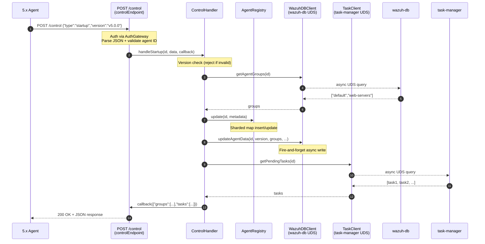
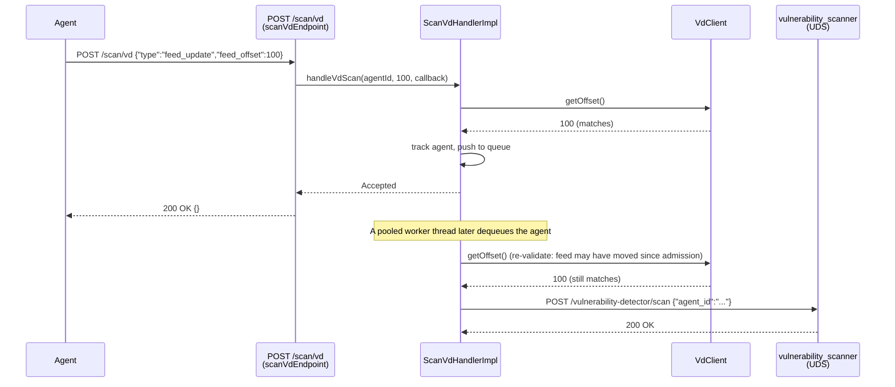
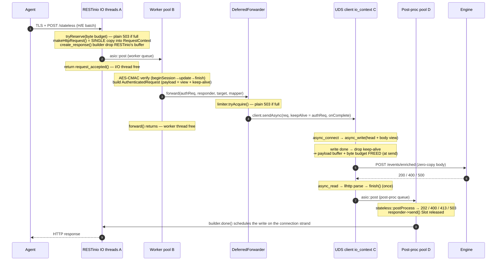

# remoted module (C++ worker bridge)

A self-contained C++17 module that `remoted` launches in its own thread, receiving a
configuration struct to initialize itself. It mirrors the pattern `modulesd` uses for
`inventory_sync_server` / `vulnerability_scanner`, but integrates via **direct link**
instead of `dlopen`, and passes configuration as a **typed C struct** instead of
a serialized `cJSON`.

This is the isolation boundary between remoted's C code and C++: everything under this
directory is C++, and the only file remoted's C sources include is
[`include/remoted_module.h`](include/remoted_module.h).

## Layout

```
remoted_module/
├── include/                        # public surface (the only C↔C++ contact)
│   ├── remoted_module.h            # C-ABI: config struct + start/stop
│   └── remotedModule.hpp           # public C++ Singleton facade
├── src/
│   ├── remotedModule.cpp           # extern "C" shims + facade delegation + log sink definition
│   ├── remotedModuleFacade.hpp     # worker thread + lifecycle; owns the HTTP server + auth + endpoints
│   ├── auth/                       # ns remoted::auth — framework-agnostic AES-CMAC auth (see below)
│   ├── common/                     # ns remoted::common — leaf utilities with no layer of their own:
│   │                               #   logThrottle.hpp (rate-limited logging), zstdDecoder.hpp/.cpp,
│   │                               #   vdClient.hpp/.cpp (cached VD feed-offset UDS client, see below)
│   ├── decoding/                   # ns remoted::decoding — Content-Encoding policy (see below)
│   ├── http_server/                # ns remoted::http — transport-agnostic HTTP(S) sub-layer (see below)
│   ├── endpoints/                  # ns remoted::endpoints — endpoint contract + auth gateway (see below)
│   │   ├── controlEndpoint.hpp/.cpp    # POST /control JSON dispatch (see below)
│   │   └── scanVdEndpoint.hpp/.cpp     # POST /scan/vd JSON dispatch (see below)
│   ├── control/                    # ns remoted::control — 5.x agent control messages (/control)
│   ├── scanvd/                     # ns remoted::scanvd — on-demand VD re-scan queue (/scan/vd, see below)
│   └── downstream/                 # ns remoted::downstream — async UDS forwarding + limiter (see below)
├── test/unit/                      # GoogleTest tests (C-ABI black-box + HTTP server + auth + gateway)
└── tools/
    ├── send_stateless.py           # CLI to sign + POST /stateless for manual/E2E testing (see below)
    ├── send_agent_json.py          # CLI to sign + POST /stats and /config, and check the answer
    │                               #   (the deletion has no remoted route: see
    │                               #    inventory_sync_server/tools/send_delete_agent.py)
    ├── send_control.py             # CLI to sign + POST /control (startup/notify/shutdown scenarios)
    └── send_scan_vd.py             # CLI to sign + POST /scan/vd, incl. offset match/mismatch (see below)
```

Each internal concern is a folder under `src/` (namespaced, PRIVATE, reachable by prefix —
`"auth/...`", `"decoding/...`", `"http_server/...`", `"endpoints/...`", `"control/...`",
`"downstream/...`" — since `src/` is on the include path). New endpoints get their own folder under `src/endpoints/<name>/`.

## HTTP(S) server sub-layer (`src/http_server/`)

Transport only. The module exposes an HTTPS endpoint behind a **transport-agnostic interface** so
the underlying library (today RESTinio, likely `Boost.Beast + Boost.Asio` later) can be swapped
without touching any registered endpoint.

```
src/http_server/
├── IHttpServer.hpp          # neutral interface + types (Method/HttpRequest/HttpResponse/
│                            #   IHttpResponder/HttpServerConfig). No transport types leak here.
├── inFlightBudget.hpp       # global in-flight byte budget + RAII Reservation (backpressure/503)
├── httpServerConfig.hpp/.cpp# buildHttpServerConfig(): C-ABI struct -> HttpServerConfig (+ fallbacks)
├── httpServerFactory.hpp    # makeHttpServer() -> the single transport swap point
└── RestinioHttpServer.hpp/.cpp # RESTinio + OpenSSL implementation (PImpl hides RESTinio in the .cpp)
```

- **Endpoint registration:** `addRoute(Method, path, handler)` before `start()`.
- **Two-phase shutdown:** `stopAccepting()` closes the acceptor and drains the handler worker pool
  while deliberately leaving the I/O runtime alive (so an in-flight deferred reply can still be
  delivered); `stop()` calls `stopAccepting()` first, then releases the I/O runtime. See *Deferred
  forwarding*'s Lifecycle note below for why the order matters.
- **Async handlers (non-blocking I/O threads):** a raw handler is
  `void(std::shared_ptr<const HttpRequest>, std::shared_ptr<IHttpResponder>)`. Each request is
  dispatched to a bounded worker pool with a **deferred response**, so RESTinio's I/O threads never
  block on slow handler work (disk, calls to other APIs). A handler may respond inline or capture the
  request and responder, offload the blocking work, and call `responder->send(...)` later from any
  thread. The request is a `shared_ptr<const>` so it can travel across deferred pipeline stages;
  keeping it alive keeps its in-flight byte reservation charged (see below).
- **Memory management (layered):** the worker-pool queue is unbounded on its own, so four layers
  bound memory:
    1. **In-flight byte budget** — the transport reserves each request's payload (`body + a small
       per-request overhead`) against a global budget *before* handing it to the worker pool. When
       the budget is exhausted the request is shed with a plain **`503 Service Unavailable`**
       (server-capacity load-shedding, not per-client rate-limiting; no `Retry-After` — the agent
       runs its own retry/backoff) instead of queueing, giving the backpressure the raw asio pool lacks. The reservation is an RAII token living in the request's
       shared context alongside the single payload copy; it is released the instant the context's
       last owner drops it. The **handler controls that**: dropping the request shared_ptr (or calling
       `AuthenticatedRequest::payload.release()`) frees the payload buffer AND the reservation together
       — even while a deferred reply is still outstanding, since the responder no longer co-owns the
       buffer (see *Single-copy payload*). Configured via remoted (`max_inflight_bytes`). Routes
       registered with `countAgainstBudget=false` (the liveness `GET /`) are **exempt**, so the probe
       stays `200` under memory pressure instead of being shed (which would make an LB pull the node).
       The same budget also backs **body decoding** (`decoding/bodyDecoder.hpp`): a
       `Content-Encoding: zstd` request additionally reserves the decoder's own buffers (briefly) and
       its decompressed output (for as long as the payload lives), via
       `IHttpServer::tryReserveInFlightBytes()` and `Reservation::grow()`. So a compressed request
       holds up to three concurrent reservations — wire body, decoder buffers, decoded output — which
       is correct: all three are genuinely in memory at that moment. Exhausting the budget there
       answers **`413`** (the request is too big for the capacity free *right now*), not `503`.
    2. **`maxBodySize`** — per-request read-phase cap (RESTinio rejects an oversized `Content-Length`
       early by closing the connection). *Note:* RESTinio 0.7.9 has no dynamic pre-body hook, so the
       budget is charged once the body is already buffered; `maxBodySize` is what bounds a single
       request's peak.
    3. **`maxParallelConnections`** — bounds simultaneous connections, so the read-phase peak (bodies
       still arriving, before they reach the budget) is bounded by `maxParallelConnections *
       maxBodySize`.
    4. **Deferred-work limiter** (`max_deferred_requests`) — a **count**-based sibling of the byte
       budget (`downstream/deferredWorkLimiter.hpp`) that bounds how many requests are **parked
       awaiting a downstream service**. A `Slot` is acquired before forwarding and held (RAII) until
       the reply is sent; when full, the forwarder sheds with the same plain **`503`**. This is the
       second phase of a two-phase backpressure: the byte budget covers *receive + send* (and is
       released once the payload has been sent), the deferred limiter covers *the wait*.
- **Single-copy payload + early release:** the payload is copied exactly **once** — into the shared
  `RequestContext`. RESTinio's original buffer is freed on the I/O thread right after (the responder
  is a pre-created `response_builder` that no longer holds the request handle), the auth middleware
  streams the AES-CMAC **without buffering** the body, and `AuthenticatedRequest::payload` is a
  zero-copy `string_view` into that single copy (kept alive by a keep-alive to the context). A
  handler can therefore **forward the payload, release it + its budget, and still reply later**:
  `payload.release()` (or dropping the request) drops the buffer + reservation while the responder
  survives to answer the agent when a downstream service responds. The small identity fields
  (`agentId`, `method`, `requestTarget`) are owned, so they outlive an early release.
  > Because the byte budget is released at forward, a request *parked waiting on a downstream service*
  > no longer counts against `max_inflight_bytes` — the **deferred-work limiter** (above) is what
  > bounds that phase.
- **Configuration** (via the C-ABI struct; no environment-variable fallback anywhere anymore).
  Four groups of fields, each field falling back to a built-in default when `<=0`/empty:
    1. RESTinio tuning: `io_threads`, `http_worker_threads`, `http_read_timeout`,
       `http_write_timeout`, `http_request_timeout`, `http_max_url_size`,
       `http_max_header_name_size`, `http_max_header_value_size`, `http_max_header_count`,
       `http_max_pipelined_requests`, `http_concurrent_accepts`, `http_buffer_size` -- `remoted`
       populates these from the `remoted.http_*` internal options in `secure.c` (already
       range-validated there). `io_threads`/`http_worker_threads` are thread-count fields: a
       `<=0` value resolves via `cpp_get_nproc()` (`shared_modules/utils/proc.hpp`, cgroup-aware
       on Linux) in `httpServerConfig.cpp::resolveThreadCount()` -- see *Request lifecycle
       example* below for the exact multiplier per pool.
    2. `<remote><https>` settings, wired from the parsed config in `secure.c`'s
       `w_remoted_build_module_config()`: `port`, `bind_address`, `http_max_body_size`,
       `ca_path`, `ciphers`, `verification_mode`, `dual_stack`. `certificate_path`/
       `private_key_path` are file paths (not PEM content) opened by the module itself, after
       `remoted` has already dropped root privileges (`Privsep_SetUser()`) -- so both files (and
       `ca_path`, when configured) must be readable by the unprivileged user `remoted` runs as.
    3. Memory-management: `max_inflight_bytes` (bytes; default 256 MiB),
       `max_parallel_connections` (default 512) and `max_deferred_requests` (default 256) --
       populated from the `remoted.max_inflight_bytes`/`remoted.max_parallel_connections`/
       `remoted.max_deferred_requests` internal options in `secure.c` (same pattern as group 1).
       The transport still clamps the in-flight budget up to at least one max-size request at
       start(), so a too-small value can't reject everything.
    4. Downstream client + auth middleware tuning: `downstream_connect_timeout`,
       `downstream_write_timeout`, `downstream_response_timeout`, `downstream_io_threads`,
       `downstream_post_process_threads`, `downstream_max_response_body_size`,
       `auth_max_request_age`, `auth_max_future_skew`, `auth_max_body_size` -- populated from the
       `remoted.downstream_*`/`remoted.auth_*` internal options in `secure.c` and translated by
       `remoted::downstream::buildDownstreamConfig()` (`downstream/downstreamConfig.cpp`) and
       `remoted::auth::buildAuthConfig()` (`auth/authTypes.cpp`) respectively; the facade calls
       both in `startHttpServer()` instead of default-constructing `DownstreamConfig{}`/
       `AuthConfig{}`. The first three are seconds in the C-ABI struct, converted to milliseconds
       internally. `downstream_io_threads`/`downstream_post_process_threads` are thread-count
       fields (`cpp_get_nproc()` on `<=0`, same as group 1). See *Deferred forwarding* and
       *Agent<->manager auth middleware* below.
  See [HTTPS Events API](../../../docs/ref/modules/remoted/https-events-api.md#configuration) for
  the full reference (defaults, allowed ranges).
- **Restart-friendly bind:** the RESTinio acceptor sets `SO_REUSEADDR`
  (`acceptor_options_setter`), so a manager restart rebinds the port immediately instead of
  failing with `EADDRINUSE` while the previous socket lingers in `TIME_WAIT`.
- **Swapping the library:** implement a new `IHttpServer` and return it from `makeHttpServer()`;
  nothing else changes.

## Endpoints (`src/endpoints/`)

Ties the transport and the auth layer together and defines the endpoint contract; future endpoints
each get a folder here.

```
src/endpoints/
├── endpoint.hpp/.cpp        # shared contract: type aliases (Method/HttpResponse/IHttpResponder/
│                            #   AuthenticatedRequest) + the async AuthenticatedHandler typedef,
│                            #   plus errorResponseFor(AuthError) (the {"error","code"} response shape)
├── authGateway.hpp/.cpp     # runs the auth middleware, then hands the verified request + responder
│                            #   to the endpoint handler. Authentication only — body decoding is an
│                            #   injected IBodyDecoder it knows nothing about
├── statelessEndpoint.hpp/.cpp # /stateless policy: identity check + downstream target + post-processing
├── statefulEndpoint.hpp/.cpp # /stateful policy: opaque inventory-sync sessions, contract passthrough
├── statsEndpoint.hpp/.cpp    # /stats policy: forwards to modulesd's inventory sync server
└── configEndpoint.hpp/.cpp  # /config policy (DUMMY): near-duplicate of statsEndpoint, on purpose
└── downloadEndpoint.hpp/.cpp  # /download policy: request grammar + resource resolution + file streaming
```

- **Endpoint handler (async):**
  `using AuthenticatedHandler = std::function<void(std::shared_ptr<const remoted::auth::AuthenticatedRequest>, std::shared_ptr<IHttpResponder>)>;`
  It runs on the worker pool after auth succeeds and **owns delivering the response** — inline or
  later (async), by calling `responder->send(...)` exactly once. The verified request is a
  `shared_ptr<const>` so the handler can retain it across deferred stages; its body is a zero-copy
  `payload.bytes()` view, and `payload.release()` frees the body + byte budget early (keeping the
  responder) once it has been forwarded — see *Single-copy payload* above.
- **`AuthGateway`** owns one `AuthMiddleware` and exposes
  `addAuthenticatedRoute(IHttpServer&, Method, path, AuthenticatedHandler)`. It registers a raw
  async route whose worker-thread body runs the full validation (`beginSession → update → finish`,
  always synchronous — AES-CMAC over CPU, off the I/O threads), maps any `AuthError` through
  `errorResponseFor()` (which wraps `publicErrorFor()`) to the client status/message on failure, and
  on success calls the handler with the verified `AuthenticatedRequest` and the responder. It is
  **authentication only**: body decoding is an `IBodyDecoder` handed to its constructor, so the gateway
  never learns which encodings exist, how one is decoded, or how the memory that costs is accounted
  for — only that the step can fail with an `AuthError`. The
  facade registers **`POST /stateless`** with `stateless::makeHandler(forwarder, socketPath)`: once
  auth succeeds it cross-checks the payload's identity, then forwards the H/E batch to the engine
  over UDS (see *Deferred forwarding*) and replies from the downstream result
  (`202`/`400`/`413`/`503`); `400`/`401`/`413` auth rejections come straight from the gateway.
- **Per-endpoint policy (`statelessEndpoint.hpp/.cpp`):** each endpoint owns *what* it forwards and
  *how* it maps the answer, kept out of the generic `downstream/` machinery. `stateless::target(socket)`
  builds the engine ingest `DownstreamTarget` (`POST /events/enriched`, `application/x-ndjson`) and
  `stateless::postProcess(err, resp)` is the `PostProcessor` (the mapping above). A new endpoint adds
  its own `target`/`postProcess` (and, once there are several, its own `endpoints/<name>/` folder).
  `stateless::validatePayloadIdentity(req)` is a pure, pre-forward check: it parses the body's `H
  <json>` line with RapidJSON (`rapidjson::Document::Parse(data, length)` — non-in-situ, since the
  payload is a `string_view` into a shared, non-NUL-terminated buffer — plus `rapidjson::Pointer` for
  `/wazuh/agent/id`) and compares it, as a number, against the authenticated `agentId` (also parsed
  as a number, so `"001"` and `"1"` match). Anything that isn't a clean match — missing/malformed
  header, non-numeric on either side, or a real mismatch — collapses to `AuthError::PayloadAgentMismatch`;
  there is no partial-validation path an agent could use to skip the check.
  `stateless::makeHandler(forwarder, socketPath)` wires `validatePayloadIdentity` in front of
  `forwarder.forward(...)`: on failure it answers via `errorResponseFor()` and never forwards; this is
  the single `AuthenticatedHandler` the facade registers for `/stateless`.
- **`POST /stats` and `POST /config` (`statsEndpoint`, `configEndpoint`) — DUMMIES.** Same authenticated
  pipeline as `/stateless`, but forwarded to **modulesd's inventory sync server**
  (`queue/sockets/inventory-sync.sock`) instead of the engine. Everything around them is real —
  AES-CMAC auth, admission control, deferred forwarding, the UDS round trip, the response mapping —
  but neither side interprets the document yet: modulesd only checks it is a JSON object and stamps
  `wazuh.agent.id` and `@timestamp` onto it. Three things differ from `/stateless`:
  - **They forward the authenticated agent id as an `X-Wazuh-Agent-Id` header.** Unlike an H/E batch,
    these documents do not carry the id, and modulesd is what writes it in — so it has to receive it.
    That is why `DownstreamTarget`/`DownstreamRequest` grew a `headers` field. The value comes from the
    Authorization header the gateway already verified, never from the body, so a document claiming a
    different agent cannot override it.
  - **`postProcess` passes the downstream body through on success** (`200` + modulesd's JSON), unlike
    `/stateless` which discards it. Failure statuses are still collapsed to fixed local messages, so an
    arbitrary downstream string is never reflected back to an agent.
  - **The only endpoint-level validation is "body is not empty" → `400`.** Parsing is modulesd's job;
    doing it on both sides would walk the payload twice on the hot path. Rejecting an empty body here
    still saves a deferred-work slot and a UDS round trip.

  They are **deliberate near-duplicates** rather than one shared unit registered on two paths. They are
  the same shape only because both are dummies; their real payloads, validation and downstream
  semantics will diverge, and separating them now makes that divergence a change to one file. Keep them
  in sync until they must not be.
- **`POST /stateful` (`statefulEndpoint`) — inventory synchronization sessions.** Same authenticated
  pipeline, same downstream service as `/stats`/`/config`, but the body is the agent's FlatBuffer
  `Message{FullSession}` (`application/octet-stream`) and remoted treats it as **opaque** — no
  identity parsing here; the sync server cross-checks the FlatBuffer's `Start.agentid` against the
  forwarded `X-Wazuh-Agent-Id` (403 on mismatch). Two policy differences from every other endpoint:
  - **The downstream result IS the session result**, so `postProcess` passes the sync contract's
    statuses and bodies through verbatim (`200` ok/noop, `400`, `403`, `409` checksum mismatch,
    `413`, `500` scan failed, `503` + `Retry-After`). The bodies are produced by the manager's own
    sync server (never echoed agent input), which is what makes reflecting them safe; anything
    outside that set — plus every transport failure — still collapses to a neutral `503`. Of the
    downstream headers only a digits-only `Retry-After` on a `503` is relayed (the one header in the
    contract); this is why `DownstreamResponse` grew a `headers` field (names lower-cased, capped by
    `kMaxResponseHeaderBytes`).
  - **A dedicated, longer response deadline** (`remoted.downstream_stateful_response_timeout`,
    default 20 s) flows into the target's `responseTimeoutMs` override: sessions are validated,
    indexed and flushed *within* the request, unlike the enqueue-style endpoints on the global 5 s
    default. Its default budget (2+5+20 s) deliberately stays inside `http_request_timeout` (30 s);
    raising it past that requires raising the request cap too (the facade warns at startup).
- **Handler exceptions → 500:** if an endpoint handler throws, the gateway catches it, logs a
  warning and answers `500` (`{"error":"Internal server error","code":500}`), so an exception never
  escapes onto the worker-pool thread (which would `std::terminate`). The responder's send-once
  guarantee makes the 500 a no-op if the handler had already replied.

## Control endpoint (`POST /control`) — `src/control/`

The `/control` endpoint handles **5.x agent lifecycle and keepalive messages** (startup, notify,
shutdown) over the authenticated HTTPS channel, replacing the legacy TCP text-format control messages
that 4.x agents still use. It performs version validation, updates agent status in wazuh-db, and
fetches pending tasks from task-manager for the agent.

```
src/control/
├── controlTypes.hpp          # DTOs: AgentId, StartupData, NotifyData, ShutdownData, HostInfo, HttpResponse
├── controlConfig.hpp/.cpp    # ControlConfig + buildControlConfig() from C-ABI fields
├── metrics.hpp               # ControlMetrics (atomic counters: startup/notify/shutdown/errors)
├── controlHandler.hpp/.cpp   # ControlHandler: core business logic for all three message types
├── agentRegistry.hpp/.cpp    # AgentRegistry: thread-safe sharded map (agent metadata cache + eviction)
├── wazuhDBClient.hpp/.cpp    # WazuhDBClient: async UDS client to wazuh-db (agent status/data updates)
├── taskClient.hpp/.cpp       # TaskClient: async UDS client to task-manager (pending task fetch)
├── mergedMgWatcher.hpp/.cpp  # MergedMgWatcher: inotify + poll watcher for var/multigroups/*.mg changes
└── hashCache.hpp/.cpp        # HashCache: LRU cache for merged.mg file hashes (avoids repeated disk reads)
```

### Architecture

The `/control` endpoint is **synchronous** from the HTTP handler's perspective (replies immediately),
but internally **async** for database and task-manager operations via dedicated UDS clients. Unlike
`/stateless`, which forwards the entire request body downstream and waits, `/control` parses the
agent's message, updates the agent registry, triggers async database writes, and replies with task
data — all while keeping the HTTP handler thread free.



### Message types

1. **`startup`** — agent sends on connect or after config reload
   - **Request**: `{"type":"startup","version":"5.0.0"}`
   - Validates agent version (rejects if `< manager` when `allow_higher_versions=false`)
   - Marks agent as connected in wazuh-db (global.db)
   - Records connection timestamp
   - Fetches agent groups from wazuh-db
   - **Response**:
     ```json
     {
       "limits": {
         "fim": {"file": 100000, "registry_key": 100000, "registry_value": 100000},
         "syscollector": {"packages": 50000, "processes": 50000, ...},
         "sca": {"checks": 10000}
       },
       "cluster": {"name": "wazuh-cluster"},
       "agent": {"groups": ["default", "web-servers"]}
     }
     ```
   - On version mismatch: updates wazuh-db status_code to `invalid_version` and returns `400 {"error":"invalid_version"}`

2. **`notify`** — periodic keepalive (agent polls every 10 seconds; hot path)
   - **Request**:
     ```json
     {
       "type": "notify",
       "agent": {"version": "5.0.0"},
       "host": {
         "hostname": "ubuntu-test",
         "architecture": "x86_64",
         "ip": "192.168.1.100",
         "os": {"name": "Ubuntu", "version": "20.04", "platform": "ubuntu", "type": "linux"}
       }
     }
     ```
   - Optional host metadata (OS, architecture, hostname, IP) — sent on first keepalive or when values change
   - Updates agent registry with last activity timestamp
   - Conditionally writes to wazuh-db (throttled by `keepaliveThrottleSec`, default 300s):
     - **Full update** (`updateAgentData`): when host metadata is present in the request
     - **Lightweight keepalive** (`updateKeepalive`): when no host metadata in the request
   - Calculates `settings_hash` (SHA256 of limits + cluster + groups from agent's startup data)
   - Calculates `config_hash` (SHA256 of agent's `merged.mg` shared config file)
   - Queries task-manager for pending tasks (`status='pending'`); if found, marks as `delivered` (local only, no cluster broadcast)
   - Reads this node's current Vulnerability Detection feed offset via `VdClient` (cached, see
     `common/vdClient.hpp` below) and includes it as `vd_feed_offset` — always present, 0 if the VD
     module has never completed a feed update or is temporarily unreachable
   - **Response (no tasks)**:
     ```json
     {
       "agent": {"groups": ["web-servers"], "config_hash": "e3b0c44..."},
       "settings_hash": "d7a8fbb...",
       "vd_feed_offset": 12345678
     }
     ```
   - **Response (with tasks)**: same as above plus `"tasks": [{"task_id":"...","task_type":"active_response","payload":{...}}]`
   - **Agent behavior**: compares `settings_hash` (if different → new startup), compares `config_hash` (if different → downloads `merged.mg` via `/download`), processes tasks, compares `vd_feed_offset`
     against its stored value (if strictly higher → request a re-scan via `POST /scan/vd`, see below)
   - **Design note**: Version is NOT validated on notify (only on startup) to keep the hot path fast

3. **`shutdown`** — agent sends on clean exit
   - **Request**: `{"type":"shutdown"}`
   - Updates agent registry
   - Sets connection status to `disconnected` in wazuh-db (global.db)
   - Records disconnection timestamp
   - **Response**: `{}` (empty JSON object)

### Components

#### ControlHandler (`controlHandler.hpp/.cpp`)

Core business logic. Owns references to all clients (wazuh-db, task-manager) and the agent registry.
Implements `handleStartup()`, `handleNotify()`, `handleShutdown()` with the logic above.

Wazuh-db writes are throttled per agent via `lastKeepaliveUpdateSec` (in `AgentRegistry`) to avoid
flooding wazuh-db with writes every 10 seconds. Full updates (`updateAgentData`) are sent when the
agent includes host metadata in the notify request; lightweight keepalives (`updateKeepalive`) are
sent otherwise. Both respect the `keepaliveThrottleSec` window (default 300s).

Version comparison uses a local `compareVersions()` function for semantic versioning (e.g., `"v5.0.0"`
vs `"v4.9.2"`), stripping leading `v`/`V` and ignoring everything after `-` or `+`.

#### AgentRegistry (`agentRegistry.hpp/.cpp`)

Thread-safe **sharded hash map** (`std::unordered_map` per shard, each with its own `shared_mutex`)
that caches agent metadata to avoid repeated wazuh-db lookups on every keepalive. Each `AgentEntry`
stores:
- `groups` — agent's assigned groups (vector of strings)
- `groupsRefreshedAtSec` — timestamp of last groups refresh
- `lastKeepaliveUpdateSec` — timestamp of last wazuh-db write (for throttling)
- `lastActivitySec` — timestamp of last control message (any type)
- `createdAtSec` — timestamp of first insertion into registry

Supports:
- `update(id, updateFn)` — atomic read-modify-write via a lambda (returns the new entry)
- `get(id)` — read-only lookup (returns `shared_ptr<const AgentEntry>`)
- `evictExpiredEntries(ttlSec)` — periodic cleanup (two-phase: read-lock scan, then write-lock erase)

Sharding (8 shards) minimizes lock contention on high-frequency keepalives from many agents.

#### WazuhDBClient (`wazuhDBClient.hpp/.cpp`)

Async UDS client to `queue/sockets/wdb` with a **dedicated worker thread** and **bounded request queue**.
Exposes:
- `getAgentGroups(id, callback)` — synchronous UDS round-trip (startup only, not on hot path)
- `updateAgentData(...)` — fire-and-forget async write (full agent metadata)
- `updateKeepalive(...)` — fire-and-forget async write (lightweight)
- `updateStatusCode(...)` — fire-and-forget async write (e.g., invalid_version rejection)

Internally:
- Maintains a persistent connection (reconnects on error)
- Request queue with `max_queue_size` — drops requests with `SocketError::QueueFull` when full
- Per-request deadline (`deadline_ms`) — reports `SocketError::Timeout` if wazuh-db doesn't respond
- Uses `LogThrottle` to avoid flooding logs with repeated errors (connection failures, timeouts, queue full)

#### TaskClient (`taskClient.hpp/.cpp`)

Async UDS client to `queue/sockets/task` with same architecture as `WazuhDBClient`. Fetches pending
upgrade/command tasks for an agent via `getPendingTasks(id, callback)`. Returns a vector of `Task`
objects (id, type, payload JSON). Uses the same bounded queue + deadline + error throttling pattern.

#### MergedMgWatcher (`mergedMgWatcher.hpp/.cpp`)

Watches `var/multigroups/*.mg` for changes (inotify + poll fallback) to detect group shared file
updates. When a `.mg` file changes, it:
1. Hashes the file
2. Compares against the cached hash (`HashCache`)
3. If changed, marks all agents in that group for config invalidation (via callback)

This is the signal that triggers agents in a group to re-fetch their shared configuration when
`merged.mg` is updated.

#### HashCache (`hashCache.hpp/.cpp`)

Simple LRU cache (`std::list` + `std::unordered_map`) for file path → SHA256 hash. Avoids re-reading
and re-hashing the same `.mg` file on every agent keepalive. Configurable `maxSize` (default 256).
Thread-safe via a single `std::mutex`.

#### VdClient (`common/vdClient.hpp/.cpp`)

Cached UDS client for the Vulnerability Detection module's feed offset, shared verbatim between
`/control` (populates `vd_feed_offset`) and `/scan/vd` (validates the agent's requested offset —
see [Scan endpoint](#scan-endpoint-post-scanvd--srcscanvd) below for the full picture, including why
this client never blocks a concurrent caller behind a slow VD module).

#### controlEndpoint (`endpoints/controlEndpoint.hpp/.cpp`)

The HTTP endpoint registration. Parses the JSON body (validates it's an object with a `"type"` field),
extracts the agent ID from the authenticated request, and dispatches to the appropriate
`ControlHandler` method. Returns:
- `400` — invalid_body, invalid_json, invalid_agent_id, unknown_message_type
- `200` — success + JSON response body

Uses `LogThrottle` for error conditions (invalid body/JSON/agent ID, unknown type) to avoid log
flooding from malformed agent requests.

### Configuration

Via `ControlConfig` (`controlConfig.hpp/.cpp`), populated from C-ABI struct fields in
`remoted_module_config_t` (see `secure.c`):
- `managerVersion` — manager's semantic version (for version comparison)
- `allowHigherVersions` — whether to accept agents with version > manager
- `isWorkerNode` — true on worker nodes (affects sync_status values)
- `agentRegistryTtlSec` — how long to keep idle agents in the registry (default 3600s)
- `agentRegistryEvictionIntervalSec` — how often to run eviction (default 300s)
- `wdbSocketPath` — path to wazuh-db UDS socket (default `queue/sockets/wdb`)
- `wdbQueueSize` — wazuh-db client queue size (default 1024)
- `wdbDeadlineMs` — wazuh-db request timeout (default 5000ms)
- `taskSocketPath` — path to task-manager UDS socket (default `queue/sockets/task`)
- `taskQueueSize` — task-manager client queue size (default 256)
- `taskDeadlineMs` — task-manager request timeout (default 5000ms)

Built via `remoted::control::buildControlConfig()` in the facade's startup.

### Metrics

`ControlMetrics` (`metrics.hpp`) tracks:
- `startupCount` — total `POST /control {"type":"startup"}` messages
- `notifyCount` — total `POST /control {"type":"notify"}` messages
- `shutdownCount` — total `POST /control {"type":"shutdown"}` messages
- `wdbErrorCount` — wazuh-db operation failures (connection, timeout, queue full)
- `taskFetchCount` — successful task fetches from task-manager
- `taskFetchErrorCount` — task-manager operation failures

All atomic `uint64_t`. Exposed via `RemotedModuleFacade::getMetrics()` (future: add a `GET /metrics`
endpoint to surface these).

### Error handling

- **Version rejection**: `400 {"error":"invalid_version"}` + wazuh-db update (status_code=`invalid_version`)
- **Database errors**: `500 {"error":"database_error"}` (wazuh-db down or timeout)
- **Queue full** (wazuh-db or task-manager): drops the operation, logs warning (throttled), continues
- **Invalid JSON/malformed request**: `400` with specific error code (invalid_body, invalid_json, etc.)

All errors use `LogThrottle` (90-second windows) to avoid log flooding:
- WARN-level: version rejections, wdb errors, queue full, timeouts
- DEBUG2-level: per-request success logs (startup, notify, shutdown)

### Thread safety

- **AgentRegistry**: sharded with per-shard `shared_mutex` (concurrent reads, exclusive writes)
- **WazuhDBClient / TaskClient**: single worker thread per client, requests queued via `std::queue` + mutex + CV
- **ControlHandler**: stateless (all state in registry + clients), thread-safe via client APIs
- **HashCache**: single `std::mutex` protecting LRU list + map

The HTTP handler threads call `ControlHandler` concurrently; the handler coordinates via the registry
and clients, which are all thread-safe internally.

### Lifecycle

1. **Startup**: `RemotedModuleFacade::start()` builds `ControlConfig`, creates all clients
   (wazuh-db, task-manager), creates the registry, creates `ControlHandler`, and registers
   `POST /control` via `controlEndpoint::makeHandler(handler)`.
2. **Runtime**: HTTP worker threads process `/control` requests concurrently. The registry eviction
   thread runs periodically (every `agentRegistryEvictionIntervalSec`). Wazuh-db and task-manager
   clients maintain persistent connections (reconnect on error).
3. **Shutdown**: `RemotedModuleFacade::stop()` stops the HTTP server (drains in-flight requests),
   then stops the wazuh-db and task-manager clients (drains their queues), then destroys the
   registry (eviction thread stops automatically on destruction).

## Scan endpoint (`POST /scan/vd`) — `src/scanvd/`

`/scan/vd` is the on-demand Vulnerability Detection re-scan request: an agent that notices (via
`/control`'s `vd_feed_offset`, above) that this node's feed has moved past what it last synced
against asks this node to re-scan it. It replaces the pre-HTTPS mechanism, where each node held a
persistent connection to a fixed set of agents and, on every feed update, queried global.db for
"its" agents and rescanned all of them — a mechanism that assumed a stable agent-to-node mapping
that stateless HTTPS load balancing no longer provides.



### Components

#### scanVdEndpoint (`endpoints/scanVdEndpoint.hpp/.cpp`)

The HTTP endpoint registration. Parses the JSON body (`type`, `feed_offset`), validates the agent
ID, and dispatches to `ScanVdHandler::handleVdScan()`. Maps each `ScanVdOutcome` to its wire
response:
- `Accepted` → `200 {}`
- `VersionMismatch` → `409 {"error":"version_mismatch","current_version":N}`
- `QueueFull` → `503 {"error":"scan_queue_full"}`
- `InvalidAgent` → `400 {"error":"invalid_agent_id"}`
- Request-shape errors (empty/oversized body, malformed JSON, missing/invalid `type` or
  `feed_offset`) → `400` with a specific `error` code (see
  [https-events-api.md](../../../docs/ref/modules/remoted/https-events-api.md#scan-endpoint-post-scanvd))

Body cap is 4 KiB (`kMaxScanVdBodySize`), far tighter than `/control`'s 64 KiB — a scan request only
ever carries `type` and `feed_offset`.

#### ScanVdHandlerImpl (`scanvd/scanVdHandler.hpp/.cpp`)

Core business logic: an offset-gated admission check plus a small worker-pool queue that actually
triggers the scan against the `vulnerability_scanner` module.

- **Admission** (`handleVdScan`, called synchronously from the HTTP handler thread): rejects
  `agentId == 0` outright; queries `VdClient::getOffset()` and rejects with `VersionMismatch` unless
  the request's `feed_offset` matches exactly; otherwise tracks the agent (a per-agent state map
  keyed by agent ID — a fresh request for an already-tracked agent just refreshes the tracked
  offset instead of queuing a duplicate entry) and pushes it onto the ready queue. Rejects with
  `QueueFull` above a configurable tracked-agent cap (production default: 10000).
- **Worker pool** (`scanWorkerPoolSize()`, sized to the host's available CPUs via `cpp_get_nproc()`):
  each worker re-validates the offset immediately before calling `POST
  /vulnerability-detector/scan` on the VD module (over the *same* modulesd UDS socket `VdClient`
  uses for `/offset` — see below) — the feed may have moved on again while the request sat queued,
  in which case the task is silently discarded (the agent will notice the newer offset on its next
  `/control` notify and re-request; no error is returned for this since the original HTTP response
  was already sent at admission time). A pool larger than one bounds the "blast radius" of one
  agent's worst-case wait (the VD module's scan call can legitimately block up to ~30s draining a
  syscollector VDFirst/VDSync session already in flight for the same agent, before it even starts
  scanning) — it doesn't reflect how many scans the VD module can truly run in parallel, which is
  exactly one, since
  `ScanOrchestrator::runScanAfterFeedUpdate()` holds an exclusive lock for the whole scan regardless
  of how many worker threads call it concurrently.
- **Retry**: a *retryable* failure (VD module briefly unready, network error) gets exponential
  backoff (1s, 2s, 4s) up to 3 attempts, then the tracked state is dropped — the agent's next
  `/control` notify will still show the (unaffected) higher offset and it will re-request.

#### VdClient (`common/vdClient.hpp/.cpp`)

Already introduced under [Control endpoint](#control-endpoint-post-control--srccontrol) above,
since it's the same client instance — this is the rest of its contract. `getOffset()`:

1. Returns the cached offset immediately if still within TTL (default 30s).
2. Otherwise, exactly one caller becomes the "refresher" and performs the actual UDS round trip to
   `GET /vulnerability-detector/offset`; every other concurrent caller gets the last-known-good
   cached value instead of blocking behind it. This matters because `/control` is a hot path (every
   connected agent's `notify`, every ~10s) — without single-flight, a slow or hung VD module could
   serialize the entire node's control-plane throughput down to roughly one request per query
   latency.
3. On a failed refresh, the last known-good value is returned (0 if none was ever obtained), and
   the next attempt is gated to a short, separate `failureRetryInterval` (default 5s) rather than
   the normal 30s TTL — recovers quickly once VD comes back, without hammering it (or serializing
   every caller) on every single call during an outage.

### Metrics

`ScanVdMetrics` (`scanvd/scanVdMetrics.hpp`) tracks, per the design doc's Phase 4 observability
goals: `requestsTotal`, `versionMismatchCount`, `queueFullCount`, `invalidAgentCount`,
`acceptedCount`, `scanSucceededCount`, `scanRetriedCount`, `scanRetriesExhaustedCount`,
`scanPermanentFailureCount`, `scanDiscardedCount` (offset moved on while queued). All atomic
`uint64_t`, incremented inline at each outcome — same shape as `ControlMetrics`.

### Lifecycle

`ScanVdHandlerImpl` shares its `VdClient` instance with `ControlHandler` (constructed once in
`RemotedModuleFacade::start()` and passed to both), so the two endpoints never see different
offsets due to independent cache state. Its worker threads are joined in its destructor (queue
drains are not attempted — an in-flight scan trigger already committed to the VD module completes
or times out on its own; anything still purely queued is simply dropped).

## Streamed responses — `POST /download`

Most endpoints answer with one in-memory body. `/download` serves `merged.mg` and WPK packages,
which can be hundreds of megabytes, so it streams with **HTTP chunked transfer encoding** (64 KiB
chunks) and memory that does not grow with file size.

- **Declared at registration, not per response.** The transport creates a request's response builder
  when the request is dispatched — that is what lets it release the received body before the request
  is queued — and a builder's output mode is fixed at creation. So a streaming route registers with
  `ResponseMode::Streamable`; its responder then keeps the request handle and builds *buffered* for
  an error (a 404 is a normal response, not a chunked one) or *chunked* for a transfer. The cost is
  that the received request survives into the worker queue, which is why it is opt-in per route.
  `IHttpResponder::stream()` has a fail-loud default (answer `500`) so a `Buffered` mis-registration
  is obvious instead of silently buffering a large body.
- **Pull, not push.** The handler hands the transport an `IByteSource`; the transport drives the
  loop, because only it owns both the connection's I/O strand and the worker pool. Read a chunk on a
  worker, write it, and read the next only once the write completes. One chunk is resident, and a
  worker slot is held only for the duration of a single read — never for the whole transfer.
  Measured on a live manager: 2 GiB streamed for a 0.6 MiB RSS delta.
- **Failure is truncation, not a short success.** A read error propagates out of `read()` and the
  builder is dropped *without* `done()`, so the terminating `0\r\n\r\n` is never sent and the agent
  sees an incomplete body it will retry. Returning 0 instead would emit the terminator and hand over
  a truncated file that looks complete. RESTinio always fires the write callback (with
  `write_was_not_executed` if the connection died first), so an aborted transfer always releases its
  descriptor — verified: 25 mid-transfer disconnects left the fd count unchanged.
- **`resource_id` is what the agent asks for, and the manager serves exactly that.** A `config`
  request names either one group (`etc/shared/<group>/merged.mg`) or several, comma-separated —
  wazuh's own multigroup form — which resolves to `var/multigroups/<sha256(resource_id)[:8]>/merged.mg`.
  A `wpk` request names a filename and gets `var/upgrade/<filename>`. The multigroup form is what
  lets an agent in several groups fetch its *effective* configuration rather than one member
  group's, and it needs no database: the selector is hashed exactly as wazuh-db names the directory.
  There is no group lookup and no membership check (protocol decision on #38022), so **any
  authenticated agent can fetch any group's or multigroup's merged configuration**. `/control` must
  report `config_hash` over the file this resolves to for the selector it hands the agent, or that
  agent re-downloads on every notify.
- **Containment differs per form.** The multigroup selector is *hashed, never joined*, so it cannot
  traverse by construction. The single-group and WPK forms **do** join agent input into a path, so
  there the grammars are the boundary: no `/`, not `.` or `..`, no leading dot, and for a WPK a
  `.wpk` suffix. With no separator admitted, the joined path has exactly one component below the
  base directory, and `openRegularFile()`'s `O_NOFOLLOW` stops that component being a symlink.
  Loosening either grammar would break that and require a `realpath()` containment check instead.

## Body decoding (`src/decoding/`)

```
src/decoding/
├── iBodyDecoder.hpp     # ContentEncoding enum + parseContentEncoding() + the IBodyDecoder interface
└── bodyDecoder.hpp/.cpp # BodyDecoder: the ONLY place in the module that knows compression exists
```

Split interface/implementation the same way `auth/` does (`IAgentKeystore` + `Keystore`), so the
gateway depends on the abstraction and the concrete decoder stays swappable and separately testable.
It is its own layer rather than part of `endpoints/` because it is not an endpoint: it is one
cross-cutting step every authenticated route runs.

The facade composes a `BodyDecoder` into the gateway's constructor as a **required** dependency, so
it is configured **once per gateway rather than per route**: every authenticated endpoint gets
decoding and none can accidentally opt out. `zstd` is the only accepted encoding (**gzip is not
supported** — see the benchmark note in
[HTTPS Events API](../../../docs/ref/modules/remoted/https-events-api.md#content-encoding-zstd));
anything else, including `zstd` when `remoted.http_content_encoding_enabled` is off, is `415`. A body
that isn't a valid/complete zstd frame is `400`.
- **Runs strictly AFTER the MAC is verified.** The AES-CMAC covers the exact wire bytes (the
  compressed body), which is what lets the signature be checked without decoding anything — so an
  unauthenticated peer never reaches the decoder and cannot spend our CPU or memory on it.
- **Both of the decoder's memory costs are charged to the in-flight byte budget as real
  reservations, not merely capped** (see *Memory management* above). (1) The buffers zstd allocates
  before producing any output, reserved at exactly what *this* frame's header declares it needs
  (`ZSTD_getFrameHeader` + `ZSTD_decodingBufferSize_min`) and released as soon as decoding returns,
  since zstd frees them by then. (2) The output buffer, charged for the memory it really takes from
  the allocator and always reserved *before* it grows, then bundled into the new payload's
  keep-alive so it stays charged for exactly as long as the payload is held. Reserving rather than
  checking a figure is what stops N concurrent requests from each reading the same "free" number
  and together overshooting the budget; a frame that doesn't fit is `413` (retryable, unlike the
  `400`/`415` above).
- **Why the output is charged by capacity, not by bytes written.** `std::string` grows by doubling,
  so charging what was written let the buffer over-allocate uncharged — measured at **45% under**
  for an 11 MiB body (11 MiB charged, 16 MiB actually held), which pushed the effective memory
  ceiling that much above the configured one. Now: a frame's header normally declares its
  decompressed size, so that is charged once and the buffer sized to it exactly — one allocation,
  no over-allocation, nothing to copy as it fills. A frame that omits the size (streaming
  compression with no pledged size) grows in doubling blocks, each charged before being allocated,
  so the over-allocation is charged rather than hidden.

## Deferred forwarding (async UDS) — `src/downstream/`

Endpoints process a request, forward it to another service over a Unix-domain HTTP socket, and reply
to the agent once that service answers. First target: the engine's event ingress —
`queue/sockets/queue-http.sock`, `POST /events/enriched` (HTTP over UDS; replies `200` accepted /
`400` bad batch / `500` orchestrator down) — and a `/stateless` body already **is** the H/E batch it
expects, so the forwarder is near pass-through with auth in front.

```
src/downstream/
├── deferredWorkLimiter.hpp   # count-based RAII limiter (parked-request cap; see Memory management)
├── downstreamConfig.hpp/.cpp # events socket (fixed) + C-ABI-driven connect/write/response timeouts,
│                            #   io/post threads, max response body (buildDownstreamConfig())
├── IDownstreamClient.hpp     # async forward interface + DTOs (DownstreamRequest/Response/Error)
├── asioUdsHttpClient.hpp/.cpp# standalone-Asio impl (UDS connect-per-request) + llhttp response parse
└── deferredForwarder.hpp/.cpp# limiter + client + per-endpoint post-processing pool orchestration
```

- **`IDownstreamClient::sendAsync(request, bodyKeepAlive, onComplete)`** — the `AsioUdsHttpClient`
  holds `bodyKeepAlive` only until the **send** completes, then drops it → the payload + byte budget
  are freed at send time (not the round-trip). Async on standalone Asio (`asio::local::stream_protocol`,
  connect-per-request, `Connection: close`), request framed by hand, response parsed with the vendored
  **llhttp**; sends **zero-copy** from our single buffer and parks **no** thread per in-flight request
  (one small `io_context` serves many). Each phase has its own deadline **and its own error value** —
  `DownstreamError::{ConnectTimeout,WriteTimeout,ResponseTimeout}` — so a log line can name the
  tunable that governs whichever one elapsed. `DownstreamTarget::responseTimeoutMs` (`<=0` → the
  configured default) lets one endpoint wait minutes for a slow async handler without every other
  endpoint tolerating the same delay before a hung downstream is noticed; the facade warns at startup
  if an endpoint's connect+write+response budget exceeds `http_request_timeout`, which caps the whole
  request and would otherwise cut the wait short.
- **`DeferredForwarder::forward(req, responder, target, postProcess)`** — acquires a
  `DeferredWorkLimiter::Slot` (plain `503` when full; the agent retries), sends via the client, and on
  completion **offloads** the per-endpoint `PostProcessor` onto its own pool (so the client's I/O
  threads stay free), which builds and delivers the reply, then releases the slot. `DownstreamTarget`
  carries the `socketPath`, so one forwarder serves **many endpoints and many sockets**.
- **`PostProcessor`** is the *type*; concrete post-processors are **endpoint policy** and live in
  `endpoints/`, not here (e.g. `endpoints::stateless::postProcess`: send/connect/timeout → **503**;
  downstream `2xx` → **202 Accepted**; `400` → **400**; `413` → **413**; `5xx`/other → **503**). A
  `PostProcessor` may be non-trivial (inspect the downstream body, apply business logic).
- **Lifecycle**: the client owns its own `io_context` + thread(s) (RESTinio keeps its loop private);
  the forwarder owns the post-processing pool. The builder-only responder is thread-safe, so the reply
  is delivered from the post-processing thread. `IHttpServer::stopAccepting()` closes the acceptor and
  drains the handler worker pool **while deliberately leaving the HTTP transport's I/O runtime
  alive** -- only then does the facade stop the downstream client and drain the forwarder (so any
  reply already in flight can still be delivered safely), and only after *that* does it fully
  `stop()` the transport (releasing the I/O runtime). Getting this order backwards is a real
  use-after-free: a `RestinioResponder` handed to an in-flight forward keeps the agent's connection
  alive independently of the server object, but calling `send()` on it after the transport's I/O
  runtime is gone touches freed memory. See `RemotedModuleFacade::stop()` for the exact 4-phase
  sequence, and `test/unit/shutdownRace_test.cpp` for the end-to-end regression test (run it under
  ASan -- `-DFSANITIZE=ON` -- for it to be a meaningful check).

## Request lifecycle example — a `POST /stateless`, end to end

How a payload flows, which threads/queues it crosses, and how `IDownstreamClient`, `AsioUdsHttpClient`
and `DeferredForwarder` interact. A `/stateless` request crosses **four execution contexts**; each hop
between them is an `asio::post(...)` — i.e. a queue.

| # | Context | Threads (config) | `<=0` default |
|---|---|---|---|
| **A** | RESTinio I/O threads | `io_threads` | `cpp_get_nproc()` |
| **B** | Transport worker pool (`asio::thread_pool`) | `http_worker_threads` | `2 * cpp_get_nproc()` (oversubscribed: work here can block) |
| **C** | Downstream client `io_context` (`AsioUdsHttpClient`) | `downstream_io_threads` | `cpp_get_nproc()` |
| **D** | Post-processing pool (`DeferredForwarder`) | `downstream_post_process_threads` | `cpp_get_nproc()` |

All four are thread-count fields: a caller value `<=0` resolves via `cpp_get_nproc()`
(`shared_modules/utils/proc.hpp`, cgroup-aware on Linux) instead of a fixed built-in constant, so
the pool sizes track the host/cgroup's available CPUs (`httpServerConfig.cpp::resolveThreadCount()`
for **A**/**B**, `downstreamConfig.cpp`'s local `resolveThreadCount()` for **C**/**D**). **B** uses
a `2x` multiplier because its own doc comment ("blocking work offload") means threads there can
block (CMAC verification, `client.keys` file I/O), unlike the purely async I/O reactors **A**/**C**.

### End-to-end flow



### Step by step

1. **[A] Ingress.** RESTinio accepts the TLS connection and reads the full request into its own buffer
   (bounded by `http_max_body_size` and `max_parallel_connections`). The route handler runs on the I/O
   thread: it reserves the payload against the **byte budget** (plain `503` if exhausted), copies the
   body **once** into a shared `RequestContext` (with its `Reservation`), builds a `RestinioResponder`
   (`create_response()` moves the connection into a builder), and **drops the RESTinio handle** — freeing
   RESTinio's original buffer here. Then it `asio::post`s to the worker pool and returns immediately.
2. **[B] Auth + handler.** A worker thread runs the `AuthGateway` wrapper: full AES-CMAC verification
   (synchronous — CPU, off the I/O threads). On failure it replies `400`/`401`/`413`. On success it
   builds an `AuthenticatedRequest` whose `payload` is a **zero-copy view** into the single buffer plus
   a keep-alive to the context, and calls the `/stateless` handler (`stateless::makeHandler`'s
   closure), which first runs `validatePayloadIdentity()` (parses the `H` line, cross-checks
   `wazuh.agent.id` against the authenticated agent id — `400` on a mismatch/malformed header,
   without ever calling `forward()`), then calls `DeferredForwarder::forward(...)`.
3. **[B] forward().** Acquires a `DeferredWorkLimiter` slot (plain `503` if full), then
   `client->sendAsync(dreq, keepAlive = std::move(authReq), completion)`. `forward()` returns and the
   **worker thread is free** — the request is now in flight holding only the byte reservation (via the
   keep-alive), the deferred slot, and the responder builder.
4. **[C] Async UDS.** `AsioUdsHttpClient` runs a per-request `Session` (its own strand) on the client
   `io_context`: connect → `async_write(head + body view)` (zero-copy). **On write-complete it drops
   the keep-alive** → the context (single body copy) and its `Reservation` are destroyed → the
   **byte budget is freed at send time**. Then it reads and parses the response with llhttp and calls
   the completion (once).
5. **[C]→[D] Completion.** The completion does **not** post-process on the I/O thread; it `asio::post`s
   to the **post-processing pool**, keeping the client's I/O threads free for other in-flight requests.
6. **[D] Reply.** A post-pool thread runs `stateless::postProcess` (maps the downstream result to
   `202`/`400`/`413`/`503`) and calls `responder->send(...)`; the builder's `done()` marshals the write
   back onto the RESTinio connection strand ([A]), which writes the reply to the agent. Destroying the
   task **releases the deferred slot**.

### Who does what


- **`IDownstreamClient`** — the interface / mock seam. Its contract: `sendAsync` drops `bodyKeepAlive`
  when the **send** completes and invokes `onComplete` **exactly once**. `DeferredForwarder` depends
  only on this interface.
- **`AsioUdsHttpClient`** — the async I/O engine (context C). Owns the `io_context` + thread(s); per
  request drives a `Session` state machine (connect → write → read → llhttp parse → timeouts) on its
  own strand, holding itself alive via a `shared_ptr` through the callback chain. It is the component
  that frees the payload at write-complete.
- **`DeferredForwarder`** — the orchestrator / glue between the endpoint handler and the client. Gates
  the limiter (503 when full), calls the client, and offloads the per-endpoint `PostProcessor` to its
  own pool (context D) to build the reply and release the slot. Owns the post-processing pool.

### What each resource costs and for how long

| Resource | Acquired at | Released at | Held during |
|---|---|---|---|
| **Single payload copy** (`RequestContext` body) | [A] `makeHttpRequest` | [C] **write-complete** | worker queue + auth + forward + connect + write |
| **Byte-budget reservation** | [A] `tryReserve` | with the buffer (same context) | same as above |
| **Deferred-work slot** | [B] `forward()` | [D] after the reply (post-task destroyed) | connect + write + **downstream wait** + post-process |
| **Responder** (builder) | [A] | after `send()` in [D] | the whole trip (thread-safe, send-once) |

Two complementary backpressure phases: the **byte budget** bounds *receive→send* (released at send),
the **deferred limiter** bounds *the wait for the downstream*.

### Notes

- **RESTinio's buffer is freed early** (step 1, on the I/O thread), before queueing to the worker pool
  — so while the request waits in the worker queue only **our** single copy exists.
- **`forward()` never blocks**: it returns as soon as it hands off to the client; no worker/`io_context`
  thread is parked waiting for the downstream (the client's `io_context` multiplexes many in-flight
  requests without a thread each).
- **The `AuthenticatedRequest` metadata (`agentId`, …) is freed at send too** (it *is* the keep-alive).
  `stateless::postProcess` doesn't need it; a future post-processor that does must copy it out **before**
  `forward()` (capture it in the `PostProcessor` closure).
- **`send()` is cross-thread safe**: it is called from a post-pool thread [D]; the builder marshals the
  actual socket write onto the RESTinio connection strand [A].

## Agent<->manager auth middleware (`src/auth/`)

Framework-agnostic implementation of the agent<->manager request authentication protocol:
canonical request construction, incremental AES-CMAC, timestamp window and constant-time
comparison. `authTypes.hpp` holds the shared contract (`AuthenticatedRequest`/`Payload`/`AuthError`/
`publicErrorFor`/`AuthConfig`) and `iAgentKeystore.hpp` the key-lookup interface; `authMiddleware`,
`cmac`, `keystore` are the implementation. It knows nothing about RESTinio or sockets
-- the `AuthGateway` (in `endpoints/`) is the only adapter between it and our transport. Depends on
OpenSSL (linked into `remoted_module`). The middleware **streams** the AES-CMAC and never buffers the
body: the verified body is exposed as a zero-copy `Payload` view that the `AuthGateway` attaches from
the transport's single request buffer.

`AuthConfig`'s tunables (`maxRequestAgeSeconds`, `maxFutureSkewSeconds`, `maxBodySize`) are
populated from the matching C-ABI fields (`auth_max_request_age`, `auth_max_future_skew`,
`auth_max_body_size`, in turn read from the `remoted.auth_*` internal options in `secure.c`) via
`remoted::auth::buildAuthConfig()` (`auth/authTypes.cpp`), which the facade calls instead of
default-constructing `AuthConfig{}`. `supportedProtocolVersion` stays fixed (`"1"`) -- it's a
protocol constant, not an ops tuning knob. See *Configuration* above.

Unit tests under `test/unit/` (`cmac_test.cpp`, `authMiddleware_test.cpp`,
`keystore_test.cpp`); `authMiddleware_test.cpp` exercises `AuthMiddleware` against a
scratch `client.keys` file it writes to `/tmp`, through `Keystore` -- there is no
in-memory stand-in.

**Agent key lookup:** `Keystore` reads `etc/client.keys` directly and parses it
the same way the manager's own `OS_ReadKeys()` does (id/name/ip/key columns, `#`/`!`-marked removed
entries skipped), independent of remoted's C `keystore`. This was a deliberate choice over reaching
into remoted's live `keystore`: remoted loads it in `W_ENCRYPTION_KEY` mode (see `secure.c`), which
never keeps the raw pre-shared key in memory -- only a derived key for the legacy message cipher --
so the raw key needed for signing has to come from the file itself. The key column is treated as
lowercase hex and hex-decoded as-is (no further derivation); it must decode to 16, 24 or 32 bytes to
work as an AES-CMAC key. client.keys has no "disabled but present" state -- a removed entry is simply
absent -- so `AuthError` has no separate inactive-agent case; an unknown and a removed agent are
indistinguishable and both resolve to `AuthError::UnknownAgent`.

**Hot-reload:** `Keystore` runs a background watcher thread (RAII -- started at the end of the
constructor, stopped and joined in the destructor) so an agent enrolled or removed after startup is
picked up without restarting `remoted`. Two triggers feed the same check: an `inotify` subscription
on the file (`IN_MODIFY`/`IN_CLOSE_WRITE`/`IN_MOVE_SELF`/`IN_DELETE_SELF`, re-armed on the same path
if an atomic rename-replace invalidates the watch descriptor) reacts immediately, and a periodic
fallback poll (`poll()`'s own timeout doubles as the interval) catches anything the subscription
ever missed -- both converge on the same `fileLooksChanged()` gate. Change detection compares the
file's **content hash** (`Utils::hashFile()`, `shared_modules/utils/hashHelper.h`), not mtime: mtime
is only second-granularity, so two rewrites landing in the same wall-clock second would otherwise
look identical. `reload()` itself is guarded against adopting a line caught mid-write: it hashes the
file before and after parsing and discards+retries (a few times, briefly) if they don't match, so a
concurrent rewrite can only ever flip the in-memory table between two complete, consistent states,
never a torn mix of both -- see `test/unit/keystore_test.cpp`'s `ReloadNeverAdoptsATornMixOfTwoValidContents`
for the regression test. The poll/fallback interval is `remoted_module_config_t::keystore_refresh_interval`,
which `secure.c` populates from the classic pipeline's own `remoted.keyupdate_interval` (its
`rem_keyupdate_main` thread, `secure.c`) rather than a second, redundant internal option.

**Agent ids are numeric (`AgentId = std::uint32_t`, `authTypes.hpp`):** an agent id is always numeric
by design, so `Keystore`'s id→key table is keyed by `AgentId`, not by string. A `client.keys` line
whose id column doesn't parse as a non-negative integer (fully consuming the field, via
`std::from_chars`) is skipped like any other malformed line -- it can never match a real lookup, and
the rest of the file still loads normally. The `Authorization` header's `<agent-id>` segment is
likewise restricted to digits at parse time (`parseAuthorization()`); anything else fails immediately
as `AuthError::MalformedAuthorization`, before it ever reaches the Keystore. The **string** form of
the agent id (as it appeared on the wire) still flows through unchanged where it matters --
`AuthenticatedRequest::agentId` and the AES-CMAC canonical bytes are untouched by this -- only the
Keystore's key type and the lookup argument are numeric.

## Contract

```c
void remoted_module_start(full_log_fnc_t callbackLog, const remoted_module_config_t* configuration);
void remoted_module_stop(void);
```

- `start()` launches the worker thread and returns immediately; the module owns the thread.
- `stop()` signals the worker (atomic flag + condition_variable) and joins it. Safe to call
  when never started.
- All exceptions are caught at the `extern "C"` boundary — nothing throws into C. Both wrappers
  catch `std::exception` **and** `(...)`: a non-`std::exception` crossing into remoted's C code
  would hit no handler at all and `std::terminate` the daemon.
- Logging is routed back into remoted's `wazuh-manager.log ` via the `full_log_fnc_t` callback
  (remoted passes `mtLoggingFunctionsWrapper`) and the `LOGFN_*` macros.

## Diagnostics — `src/common/logThrottle.hpp`

Every condition where an operator may need to change a setting is logged, and named with the setting
to change (`"…Consider increasing the value of 'max_deferred_requests'."`). The rules:

- **Operator-actionable → `LOGFN_WARN`, throttled.** Byte budget exhausted (`max_inflight_bytes`),
  deferred slots exhausted (`max_deferred_requests`), each downstream failure kind
  (`downstream_connect_timeout` / `_write_timeout` / `_response_timeout` /
  `_max_response_body_size`), clock skew (`auth_max_request_age` / `auth_max_future_skew`), body cap
  (`auth_max_body_size`), an unusable `client.keys` key, and an authenticated agent claiming a
  different agent id.
- **Client-fault 4xx → `LOGFN_DEBUG2`, unthrottled.** Malformed/unauthenticated requests. An
  unauthenticated peer controls how many of these it triggers, so logging them at WARN would be a
  log-amplification vector against `wazuh-manager.log ` — and a bad MAC from an internet scanner is noise.
  Visible with `remoted.debug=2` when someone is actually diagnosing a client.
- **`LogThrottle`** (`src/common/logThrottle.hpp`) enforces one line per 90 s per condition —
  matching remoted's own C throttles — and folds the suppressed count into the emitted line, so
  nothing is silently lost. One instance **per condition**, never shared: a permanently-failing
  condition must not mask a newly-appearing one. It deliberately does **not** log (it only decides),
  which is what keeps `loggerHelper.h` out of headers the test binary includes, and makes the
  decision unit-testable on its own.

`endpoints/endpoint.cpp`'s `errorResponseFor()` is the single funnel for all auth rejections: it logs
the reason **before** `publicErrorFor()` collapses seven distinct credential failures into one
generic 401. Downstream failures are logged in `deferredForwarder.cpp`'s completion callback, where
the raw `DownstreamError` is still available — `stateless::postProcess` turns them all into one 503,
so by the time the agent is answered the cause is gone.

RESTinio's own diagnostics reach `wazuh-manager.log` too, via `WazuhRestinioLogger`
(`http_server/RestinioHttpServer.cpp`), which replaces `restinio::null_logger_t` — whose methods are
`constexpr void {}`, i.e. every transport diagnostic was previously discarded *at compile time*. This
covers TLS handshake failures, malformed HTTP, `EADDRINUSE`, and every `http_max_*` breach — but
**none of it appears by default**: both `warn()` and `error()` are logged at `LOGFN_DEBUG1`,
throttled (visible with `remoted.debug>=1`). RESTinio's own notion of "error" is a per-connection
protocol/socket event (a truncated read, a malformed parse, a header/URL over its limit) driven
overwhelmingly by client behavior — a portscanner, or deliberately-malformed negative-test traffic
like `tools/send_stateless.py --all` — not "the manager is broken" in the sense this module reserves
`LOGFN_ERROR` for. The one genuinely rare, operator-facing case (the acceptor failing to bind) is
already surfaced distinctly by our own cert/key pre-check and `RemotedModuleFacade::start()`, which
logs and rethrows on failure (there is no retry: remoted must not start without HTTPS up), so
demoting RESTinio's own duplicate report of it costs nothing. The throttle matters even at DEBUG1:
`Log::isDebugEnabled()` filters nothing today (`Log::GLOBAL_LOG_LEVEL` is `0` fixed), so the message
builder — an allocation — runs unconditionally per call unless bounded; the real `dbg_flag` filter
is further downstream. `trace`/`info` are left as `constexpr {}` no-ops for a different reason: with
a real logger type RESTinio selects a generic logging overload that materializes a closure and a
try/catch frame at ~30 per-request call sites, measurable even when the body does nothing.
**The message is always passed as an argument to `"%s"`, never as the format string** — `LogFn`
forwards its format to `_log()`'s `vfprintf`, and RESTinio's builders embed client-controlled data
(request target, header values), so using it as a format would be a remote format-string bug.

## Integration in remoted

- Build wiring: `add_subdirectory(remoted_module)` + `remoted_module` added to
  `target_link_libraries(remoted_lib ...)` in `src/remoted/CMakeLists.txt`.
- Lifecycle: `HandleSecure()` (in `src/remoted/src/secure.c`) builds a
  `remoted_module_config_t`, calls `remoted_module_start(...)`, and registers
  `remoted_module_stop` with `atexit`.

## Tests

Unit tests (built when `UNIT_TEST` is enabled) live in `test/unit/`: `remotedModule_test.cpp`
(C-ABI black-box), `httpServer_test.cpp` (transport config incl. in-flight-budget/max-connections
resolution + responder contract incl. a shared request surviving a deferred handler),
`inFlightBudget_test.cpp` (reserve/release accounting, exhaustion, RAII move-once, disabled mode,
concurrency), `deferredWorkLimiter_test.cpp` (count-based limiter: acquire-to-capacity, RAII/move
release, disabled mode, concurrency), `deferredForwarder_test.cpp` (mock client: slot-full→503,
target/body forwarded, post-processor result delivered + slot released, keep-alive release),
`statelessEndpoint_test.cpp` (endpoint policy: `target()` + `postProcess()` mapping 202/400/413/503;
`validatePayloadIdentity()` mismatch/malformed-header/non-numeric/leading-zero-normalization cases;
`makeHandler()` short-circuits before `forward()` on a validation failure and still forwards +
post-processes on success), `statsEndpoint_test.cpp` and `configEndpoint_test.cpp` (the two
forwarding endpoints, one file each mirroring their near-duplicate implementations: the target's
socket/path/content-type, the `X-Wazuh-Agent-Id` header, the `serviceName` used in failure logs, the
full `postProcess` mapping table, **that no downstream body is ever reflected to an agent** — `/stats`
answers a fixed `{}`, `/config` still passes its dummy's enriched echo through — and that an empty body
answers 400 without ever reaching `forward()`),
`asioUdsHttpClient_test.cpp` (in-process UDS stub: response parse, connect/timeout errors, keep-alive,
**and that caller-supplied headers are actually serialized onto the wire without displacing
Content-Type/Content-Length** — the assertion that the agent id really reaches modulesd),
`payload_test.cpp` (zero-copy `Payload`: view validity,
keep-alive pinning, explicit `release()` + RAII), `authGateway_test.cpp` (gateway: 400/401 paths, valid-auth success + payload
view, payload outliving dispatch + release keeping metadata, handler-exception → 500), plus the auth
core `cmac_test.cpp`, `authMiddleware_test.cpp` (incl. a non-numeric `Authorization` agent-id →
`MalformedAuthorization`), `keystore_test.cpp` (incl. a non-numeric `client.keys` id line being
skipped without blocking the rest of the file).

VD re-scan coverage: `vdClient_test.cpp` (a real `httplib::Server` fake VD backend — cache hit
within TTL, single-flight refresh under a concurrent caller with the lock released during the UDS
round trip, stale-value fallback and bounded retry gating on a failed query, recovery clearing the
failure state), `scanVdEndpoint_test.cpp` (JSON dispatch in isolation against a fake
`ScanVdHandler`: every rejection code, the `ScanVdOutcome` → response mapping), `scanVdHandler_test.cpp`
(the queue/dedup/backoff state machine against a real `VdClient` + fake VD backend: version
mismatch, retry-with-backoff, permanent failure, queue-full at capacity, an offset change during an
in-flight attempt triggering an automatic re-scan with the new offset, and a purely-queued task
being discarded — never reaching the VD backend at all — when the offset moves on before it's
dequeued), and `controlScanVdE2E_test.cpp` (the one test that goes over a **real** TLS
`RestinioHttpServer` + real `AuthGateway` + real `ControlHandler`/`ScanVdHandlerImpl`, with only
wazuh-db/task-manager/VD faked — confirms `vd_feed_offset` and the `/scan/vd` 200/409 responses
survive actual HTTP/TLS/JSON serialization, not just the handler logic the other files exercise
directly).

```bash
ctest --test-dir <build> -R remoted_module_utest -V
```

### Manual / end-to-end (`tools/send_stateless.py`, `tools/send_download.py`)

Signs and sends `POST /stateless` requests exactly as `AuthMiddleware` expects (AES-CMAC over the
canonical byte sequence, agent key read straight from `client.keys`). Requires
`pip install requests cryptography`.

```bash
python3 tools/send_stateless.py            # one valid signed request -> 200
python3 tools/send_stateless.py --tamper   # modified body -> 401 (InvalidMac)
python3 tools/send_stateless.py --all      # every success/failure scenario with expected codes,
                                            # incl. payload_agent_mismatch -> 400 (PayloadAgentMismatch)
# options: --url (default https://127.0.0.1:1517), --agent-id, --body, --client-keys
```

### Manual / end-to-end (`tools/send_agent_json.py`)

Same signing, for `POST /stats` and `POST /config`. This one is the end-to-end check of the *whole*
forwarding path.

**It verifies the body, not just the status code.** Both endpoints now behave the same way: they
validate the agent's `modules`-keyed report, index one document per agent (`wazuh-agent-stats` /
`wazuh-agent-config`) and answer the protocol's empty acknowledgment — so a `200` carrying anything
but `{}` is a FAIL. Neither echoes the enriched document any more.

That is all the tool can assert. Confirming the document actually landed means reading it yourself
with `GET wazuh-agent-stats/_doc/<agent_id>` or `GET wazuh-agent-config/_doc/<agent_id>` on the
indexer — which is also the only way to see a write the indexer rejected, since both writes are
fire-and-forget and the agent gets its `200` either way. The write is asynchronous, so the document
appears shortly *after* the `200`, not with it.

Requires `wazuh-manager-modulesd` running with the `inventory_sync_server` module; without it every
forwarded request answers `503` and the tool says so explicitly (distinct from remoted itself being
unreachable, which it also reports separately).

```bash
python3 tools/send_agent_json.py                          # one signed /stats -> 200 + {}
python3 tools/send_agent_json.py --endpoint config        # same, against /config -> 200 + {}
python3 tools/send_agent_json.py --body '{"cpu":42}'      # no `modules` object -> 400, both endpoints
python3 tools/send_agent_json.py --tamper                 # modified body -> 401 (InvalidMac)
python3 tools/send_agent_json.py --all                    # 16 scenarios x BOTH endpoints
# options: --url, --agent-id, --body, --client-keys, --endpoint {stats,config}
```

`--all` runs every scenario against **both** endpoints on purpose: they are deliberate near-duplicates
in the C++, so covering both is what proves the duplication is actually wired up on each path. It
covers the endpoint-specific rejections (empty body → 400 short-circuited by remoted before any UDS
round trip; non-object and malformed JSON → 400 from modulesd) plus every auth-layer failure. It does
**not** repeat the transport-level limits (oversized URL/header/count → dropped connection) — those are
endpoint-independent and already covered by `send_stateless.py --all`.

> The signing helpers are duplicated between the two scripts rather than shared, so each stays a
> single file you can copy onto a manager and run. If the canonical string ever changes on the C++
> side, both copies fail loudly with `401 InvalidMac` rather than silently mis-signing.

### Manual / end-to-end (`tools/send_control.py`, `tools/send_scan_vd.py`)

Same signing convention, for the VD re-scan pair: `send_control.py` covers `/control`
(startup/notify/shutdown, including the auth-layer scenarios), and `send_scan_vd.py` covers
`/scan/vd` specifically.

```bash
python3 tools/send_control.py --type notify                # prints the vd_feed_offset it got back
python3 tools/send_control.py --all                         # every /control success/failure scenario

python3 tools/send_scan_vd.py --auto-offset                 # looks up the current offset via
                                                              # /control first, then a matching request -> 200
python3 tools/send_scan_vd.py --feed-offset 1                # a deliberately wrong offset -> 409,
                                                              # prints the manager's real current_version
python3 tools/send_scan_vd.py --all                          # every /scan/vd success/failure scenario
# options: --url (default https://127.0.0.1:9443), --agent-id, --client-keys
```

`send_scan_vd.py --auto-offset` is the tool doing what a real agent does before ever calling
`/scan/vd`: read the current offset off a live `/control` notify response rather than requiring you
to already know it.
