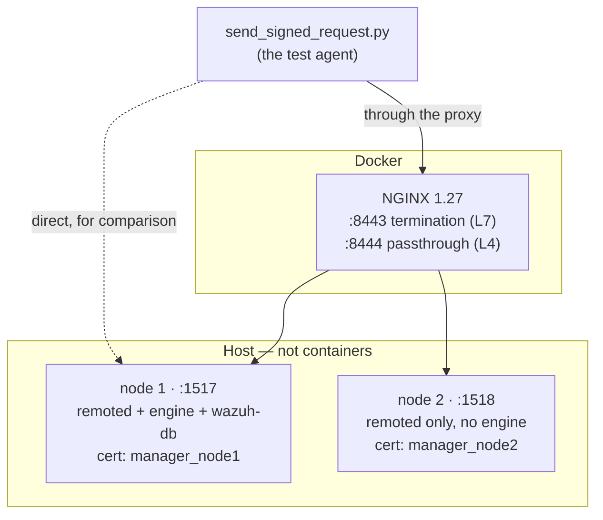
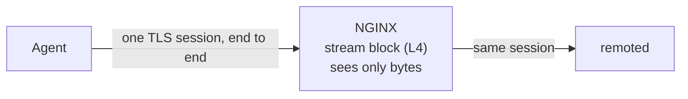
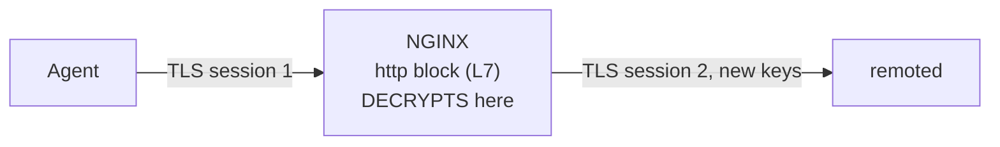

# Load balancer / reverse proxy test lab for the HTTPS events API (`:1517`)

Reproducible lab for the spike *"verify whether the protocol remains secure and operational when
deployed behind load balancers and reverse proxies"*. Every check maps to a requirement from that
issue; **section 6 is the mapping**.

It complements the two sibling tools in `../`: `send_stateless.py` and `send_agent_json.py` each sign
and send one canonical request. This lab adds what those cannot do — an actual proxy in front, a
second manager node, exact control over the signed request target, and request replay.

**You do not need to know NGINX to use this.** [`nginx/both_topologies.conf`](nginx/both_topologies.conf)
is commented line by line and opens with an explanation of how an `nginx.conf` is structured.

## Two commands

```bash
./setup_lab.sh            # set up everything, idempotently -- safe to re-run
./run_issue_checks.sh     # run every check, PASS/FAIL against the documented outcome
```

Expected today: **57 passed, 0 failed**. A `FAIL` means either a regression or a lab that is not
set up as section 5 expects.

Those two run everything against **NGINX**. The same lab also runs under **HAProxy** — same nodes,
same PKI, same probe, same ports — which is a third command:

```bash
./start_haproxy.sh both_topologies    # swap NGINX for HAProxy and re-measure by hand
```

Whichever you start stops the other one: they serve the same ports on purpose (see section 11 for
what the two proxies do differently).

> remoted supports exactly two client-verification modes, `none` and `certificate`. A third one
> existed while this spike ran; the lab measured that it rejected every client certificate — no
> agent could connect — and that its peer-address check could not have identified agents anyway,
> because behind a proxy the peer is the proxy. It was removed as a result. What the suite checks
> now is that an unsupported value is ignored with a warning rather than taking the listener down.

---

## 1. Why a load balancer changes anything

Every agent request carries a signature computed with the agent's pre-shared key
(`etc/client.keys`) over a canonical string — see `src/auth/authMiddleware.cpp` (`beginSession`):

```
WAZUH-REQUEST\n <protocol-version>\n <METHOD>\n <raw request target>\n <agent id>\n <timestamp>\n <body>
```

Two consequences drive the whole lab:

1. **The signature covers the request target and the body, byte for byte.** Any intermediary that
   rewrites either one invalidates every request → `401`.
2. **Anything *not* in that string is unprotected.** Other headers can be changed without the
   signature noticing.

## 2. What the lab runs



The managers run **on the host, not in containers**: the installed tree is several GB, so
containerising it is disproportionate here. Node 2 is a **hard link** of the remoted binary and
costs about 3 MB.

**Node 2 deliberately has no engine.** Authentication happens *before* the request is forwarded
downstream, which makes node 2 a clean authentication oracle:

| Node 2 answers | Meaning |
|---|---|
| `503` | the signature was **accepted** (only the downstream is missing) |
| `401` | the signature was **rejected** |

It also lets the two nodes identify themselves by status code, with no log parsing. Node 2 is what
covers the issue's *"duplicate delivery across manager nodes"*, *"shared replay state in clustered
deployments"* and *"load-balanced deployments"* requirements.

## 3. The two topologies

The single most important distinction. Think of TLS as a sealed envelope: **does the proxy open it?**



**Passthrough** — the proxy cannot see or alter HTTP. The agent validates **remoted's** certificate,
and the agent's client certificate reaches remoted intact, so agent mTLS works. But the proxy is
blind: it cannot filter, cannot cap sizes, and can only balance whole connections. Equivalent to an
AWS **NLB**.



**Termination** — the proxy sees and can alter everything, and can balance per request. The agent
validates the **load balancer's** certificate. The agent's client certificate **dies at the proxy**:
TLS session keys are negotiated between exactly two endpoints, so it cannot be carried into the
second session. Equivalent to an AWS **ALB**.

> `remoted` has **no plaintext mode** — the listener is TLS-only with TLS 1.3 as the minimum. So the
> issue's fourth scenario, "terminate at the balancer and talk plaintext to the backend", is not
> implementable: termination always means **re-encryption** (`proxy_pass https://`).

## 4. Reading the results

Almost every finding is proved by *which* status code comes back. Learn these five:

| Code | Meaning |
|---|---|
| `202` | signature valid **and** event ingested by the engine |
| `401` | signature rejected — **authentication failed** |
| `400` | signature **valid**, body not understood — **authentication passed** |
| `503` | signature **valid**, engine unavailable — **authentication passed** |
| `502` | the proxy could not reach the node — never reached authentication |

**When a manipulation returns `400` or `503` instead of `401`, it got past authentication.** That is
the pattern behind several findings.

---

## 5. Setting up

Requirements: an installed manager under `/var/wazuh-manager`, Docker, `curl` (only for the
HTTP/2 checks), and Python with `pip install -r requirements.txt` — if the modules live in a
venv, pass it with `./run_issue_checks.sh --python /path/to/venv/bin/python3`.

Nothing else is needed: the NGINX and HAProxy images are pulled on first use, and
`setup_lab.sh` generates its own PKI, so a fresh copy of this directory is self-contained.

```bash
./setup_lab.sh                 # certificates, install them, node 2, NGINX -- idempotent
./setup_lab.sh --regenerate    # ...starting from a fresh CA
```

It leaves one thing to you: node 1's `wazuh-db` and engine belong to your installed manager, so if
they are not running it says so rather than starting them behind your back:

```bash
/var/wazuh-manager/bin/wazuh-manager-db
/var/wazuh-manager/bin/wazuh-manager-analysisd   # this IS the engine (same binary as wazuh-engine)
```

> **The trap `setup_lab.sh` exists to prevent:** regenerating the certificates creates a **new CA**,
> which silently invalidates the certificate already installed in the manager and the one baked into
> node 2. Everything then fails with `502` (NGINX refuses to validate the backend) and TLS alerts
> (the manager refuses the agent certificate), and the cause is nowhere near the symptom. The script
> always reinstalls every certificate from the current PKI, so this cannot happen.

Smoke test:

```bash
./send_signed_request.py                                         # direct      -> 202
./send_signed_request.py --url https://127.0.0.1:8443            # termination -> 202
./send_signed_request.py --url https://127.0.0.1:8444            # passthrough -> 202
./send_signed_request.py --url https://127.0.0.1:8443 --tamper   #             -> 401
```

### How NGINX is started

The `.conf` files are only configuration *content*; they start nothing. NGINX runs as a Docker
container with one of them mounted over its own config. `start_load_balancer.sh` is just:

```bash
docker run -d --name remoted-lb --network host \
    -v <this directory>:/lab:ro \
    -v <the chosen .conf>:/etc/nginx/nginx.conf:ro \
    nginx:1.27
```

The script swaps scenarios in one command:

```bash
./start_load_balancer.sh both_topologies
./start_load_balancer.sh                 # no arguments: lists the scenarios
```

---

## 6. How each issue requirement is covered

Run `./run_issue_checks.sh` to reproduce every row.

| Issue requirement | How | Result |
|---|---|---|
| **Scenario 1** — direct connection baseline | probe against `:1517`, plus the 20-scenario battery of `../send_stateless.py --all` | `202` valid, `401` tampered, 20/20 |
| **Scenario 2** — TLS passthrough | `both_topologies.conf`, port `:8444` | `202` valid, `401` tampered |
| **Scenario 3** — TLS termination and re-encryption | same config, port `:8443` | `202` valid, `401` tampered. `../send_stateless.py --all` gives 15/20, the 5 deltas being transport-limit cases where only the error code changes (3 of the 5 are still enforced by remoted) |
| **Scenario 4** — termination, plaintext backend | source check: the listener is `restinio::tls_traits_t`, no plaintext variant | **not implementable.** Needs a code change; the security implication is that agent traffic would travel in the clear on the internal network |
| **Health checks** (issue: AWS section) | `GET /` with `--no-auth`, every topology and both nodes | `200` everywhere: remoted registers an unauthenticated liveness probe (`remotedModuleFacade.hpp`), exempt from the byte budget. AWS target group: path `/`, matcher `200`; a plain TCP check also works. **Caveat: it is liveness, not pipeline health** — node 2 answers `200` while every event gets `503` |
| **Modes** — where validation happens, which identity | `openssl s_client` against each port | passthrough presents **remoted's** certificate (identical to direct); termination presents the **balancer's** |
| **Modes** — `none` | all topologies | works everywhere |
| **Modes** — `certificate` | all three paths, with and without a client certificate | passthrough works properly (no cert → TLS alert, cert → `202`). **Termination returns `202` even with NO client certificate** — remoted verified the proxy, not the agent |
| **Modes** — `full` | every topology, with `agent.crt` (SAN carries the address it connects from) and `agent_wrong_ip.crt` (same certificate, SAN says `10.99.99.99`) | direct and passthrough judge **the agent**: `202` when the SAN carries the peer address, `403` when it does not — on every route, the unauthenticated health check included. Under termination **every** agent gets `202`, including one presenting no certificate at all, because the certificate judged is the proxy's. `breaks_full_mode_proxy_cert_ip.conf` is the other half: a proxy certificate that does not carry its own address answers `403` to a flawless agent. The first implementation rejected *everything* in every topology (`SSL_get_fd()` returns −1 because asio wires the SSL object onto memory BIOs); the address now comes from the connection-state listener |
| **TLS session resumption under mTLS** | `--resume-session` against `:1517` in all three modes | 🔴 **found by this lab, ✅ fixed.** With `certificate` or `full`, a connection resuming a previous TLS session **failed the handshake** (`internal error`, alert 80); with `none` the same resumption succeeded. Proxies resume by default (NGINX's `proxy_ssl_session_reuse`), so mTLS to the backend produced **intermittent 502s** — intermittent because a pooled keep-alive connection needs no handshake, and only connections opened afterwards hit it. Cause: OpenSSL refuses to resume on a server that requests client certificates unless `SSL_CTX_set_session_id_context()` has been called, and `createTlsContext()` never called it. It was **pre-existing and not specific to `full`** — `certificate` failed identically and is the older mode — so the fix is in the TLS context and both modes now serve resumed sessions |
| **Modes** — unsafe combinations | above | `certificate` under termination gives a false sense of security: it authenticates the balancer |
| **Modes** — which certificates go where | `generate_test_certificates.sh` is the inventory: `load_balancer` (validated by the agent under termination), `manager_node1/2` (validated under passthrough), `agent` (client, mTLS), `proxy_client` (what NGINX presents to remoted), and the two controls for `full`: `agent_wrong_ip` and `proxy_client_wrong_ip`, identical to their counterparts except that their SAN holds an address the peer does not connect from | — |
| **Proxy** — HTTP method | signed; NGINX does not rewrite methods | no impact |
| **Proxy** — raw request target | `breaks_signature_path_rewrite.conf` | 🔴 rewriting the path → `401` on every request. **remoted cannot be published under a path prefix.** The rule is `proxy_pass https://backend;` with no URI component |
| **Proxy** — query string | `--target '/stateless?foo=bar&x=1'` | preserved verbatim → `202` |
| **Proxy** — request body | `--tamper`, every topology | rejected with `401` ✅ (explicit acceptance criterion) |
| **Proxy** — transfer encoding | only bytes are signed, not framing | no impact |
| **Proxy** — content encoding | `--strip-content-encoding` / `--add-content-encoding` | 🔴 **not signed**: `400` rather than `401` proves the signature validated and the event was silently dropped |
| **Proxy** — header normalization | extra headers added | no impact; the module reads only 3 headers, case-insensitively |
| **Proxy** — connection handling | `--keepalive`; plus `safe_merge_slashes_on.conf` | keep-alive works, and `merge_slashes on` (the NGINX default) does **not** break the signature |
| **Proxy** — PROXY protocol | `breaks_handshake_proxy_protocol.conf` | 🔴 **breaks the TLS handshake of every agent at once**: the PROXY line lands where remoted expects the ClientHello. Same failure mode as `proxy_protocol_v2` on an AWS NLB. Never enable it; passthrough deployments therefore do not see the agent IP |
| **HTTP/2** (what an ALB speaks to clients) | `termination_http2.conf` + `curl --http2` driven by `--print-auth` | `202` over h2: the h2 → HTTP/1.1 conversion cannot break the signature (the canonical string exists identically in both versions; framing is not signed). HTTP/1.1-only clients keep working on the same port via ALPN |
| **Idle timeout** (issue: timeouts and connection limits) | `termination_idle_timeout.conf`, `--keepalive --interval` | inside the timeout: `202`; after an idle gap beyond it the proxy has closed the connection and the next send fails at transport level — clean and immediate, nothing consumed, so reconnect-and-resend duplicates nothing. Emulates the ALB's 60 s idle timeout |
| **Replay** — within the timestamp window | `--repeat 10` with one signature | **10× `202`**. No protection beyond the timestamp; window measured at **330 s** |
| **Replay** — retries by agents, proxies or balancers | `two_nodes_no_retry` vs `two_nodes_with_retry`, node 2 down | 🔴 without retry **one request is lost**; with retry **the same request reaches two nodes** |
| **Replay** — duplicate delivery across manager nodes | byte-identical request (`--timestamp`) to both nodes, with two controls | 🔴 node 2 authenticates a request already consumed by node 1 |
| **Replay** — shared replay state in clusters | follows from the row above | a per-node replay cache would be **useless** behind a balancer: it needs shared state, or per-agent affinity |
| **Replay** — at-least-once compatibility | the failover trade-off | a legitimate retry and a malicious replay are **byte-identical**, so a nonce that *rejects* duplicates breaks retries. It would have to answer idempotently, or deduplicate downstream by event id |
| **AWS compatibility** | ⏳ **partially covered** — the rest needs an account | NGINX reproduces both AWS models locally (`stream` = NLB, `http` = ALB), and the AWS-specific behaviours that can be emulated now are: HTTP/2 (h2 to clients, HTTP/1.1 to targets), the idle timeout, PROXY protocol (v1 measured; v2 is a binary header with the same failure mode), and health checks. Three items still cannot be emulated: ALB's backend TLS policy is not configurable (**test this first — it may rule ALB out entirely**), NLB client-IP preservation, and the `X-Amzn-Mtls-*` header names |

## 7. File reference

Everything is in this directory; nothing outside it is needed. Read the files in this order the
first time: this README, then `nginx/both_topologies.conf` (or `haproxy/both_topologies.cfg`),
which is commented line by line and is where the deployment rules actually live.

| File | Purpose |
|---|---|
| `setup_lab.sh` | **Start here.** Sets the whole lab up in one idempotent command. |
| `run_issue_checks.sh` | **Then this.** Every check, PASS/FAIL against the documented outcome. |
| `send_signed_request.py` | The probe: signs and sends with exact control over the target; can replay. |
| `generate_test_certificates.sh` | Creates the CA and the five certificates the lab needs, plus the combined `.pem` files HAProxy wants. |
| `start_load_balancer.sh` | Starts or restarts **NGINX** with the chosen `nginx/*.conf` scenario. |
| `start_haproxy.sh` | Starts or restarts **HAProxy** with the chosen `haproxy/*.cfg` scenario, on the same ports. Validates the config before starting. |
| `add_second_manager.sh` | Builds node 2 on `:1518` (remoted only, ~3 MB, hard-linked binary). |
| `set_manager_verification_mode.sh` | Switches `<verification_mode>` (`none`, `certificate`, `full`, or an invalid value on purpose) and restarts remoted. |
| `cleanup.sh` | Undoes everything the lab touched outside this directory. |
| `lib_manager_paths.sh` | Sourced by the scripts above, not run. Works out which files in the manager hold remoted's certificate and key, by reading its configuration instead of hardcoding names. |
| `package_lab.sh` | **Use this to hand the lab over.** Zips it while excluding `certs/` and `backup/` — the lab's CA key and a copy of the manager's real private key — and then verifies the archive instead of trusting the exclusion. Never `zip -r` this directory by hand. |

### NGINX scenarios

| Config | For |
|---|---|
| `both_topologies.conf` | **Read this one.** Both topologies at once, commented line by line. The recommended configuration. |
| `two_nodes_no_retry.conf` | Two nodes, retries off — to observe real balancing and the lost request on failover. |
| `two_nodes_with_retry.conf` | Two nodes, retries on — to observe failover with nothing lost. |
| `duplicates_non_idempotent.conf` | Adds the `non_idempotent` value, which is what actually opts POSTs into being retried **after delivery** — the only way to get real duplicate delivery out of NGINX. |
| `breaks_signature_path_rewrite.conf` | **Meant to fail.** Publishes remoted under a path prefix. |
| `breaks_handshake_proxy_protocol.conf` | **Meant to fail.** Passthrough with `proxy_protocol on;` — proves why it must never be enabled. |
| `safe_merge_slashes_on.conf` | Proves `merge_slashes on` does *not* break the signature. |
| `termination_without_client_cert.conf` | Termination where NGINX presents no client certificate of its own. |
| `breaks_full_mode_proxy_cert_ip.conf` | **Meant to fail.** Termination where the proxy's certificate does not carry the address the proxy connects from — every agent gets `403` under `verification_mode=full`. |
| `termination_http2.conf` | Termination speaking HTTP/2 to the agent and HTTP/1.1 to remoted — what an AWS ALB does. |
| `termination_idle_timeout.conf` | Termination with a 3 s idle timeout — the ALB's 60 s idle timeout, scaled down to be testable. |

### HAProxy scenarios

Started with `./start_haproxy.sh <name>` instead of `./start_load_balancer.sh`, on the same ports.
Each one is the twin of the NGINX scenario with the same name, so results are directly comparable.

| Config | For |
|---|---|
| `both_topologies.cfg` | **Read this one.** Both topologies at once, commented line by line, with the NGINX equivalent of every directive. |
| `two_nodes.cfg` | Two nodes: balancing, **active** health checks and failover on HAProxy's own defaults (which lose nothing and duplicate nothing). |
| `duplicates_retry_on_503.cfg` | Opts into duplicate delivery with `retry-on 503` — the twin of `nginx/duplicates_non_idempotent.conf`. |
| `breaks_signature_path_rewrite.cfg` | **Meant to fail.** An explicit `http-request set-path`; note how deliberate it has to be here, versus one stray slash in NGINX. |
| `breaks_handshake_proxy_protocol.cfg` | **Meant to fail.** `send-proxy` breaks every agent's handshake, exactly as NGINX's `proxy_protocol on` does. |
| `termination_http2.cfg` | h2 to the agent, HTTP/1.1 to remoted (`alpn h2,http/1.1`). |
| `termination_idle_timeout.cfg` | 3 s idle timeout (`timeout client`). |

### Why the probe exists instead of reusing `send_stateless.py`

`send_stateless.py` hardcodes `target = "/stateless"` per scenario and signs and sends in one step,
which is right for its job but cannot express these tests. `send_signed_request.py` adds: the target
is signed **and sent verbatim** (detects proxy normalisation); `--repeat` resends the **same signed
bytes**; `--timestamp` pins an absolute timestamp so two invocations are byte-identical (replay
across nodes); `--keepalive` reuses one connection (per-connection vs per-request balancing), and
combined with `--interval` it measures idle timeouts; `--strip-content-encoding` /
`--add-content-encoding` change that header **after** signing; `--client-cert` presents a client
certificate; `--no-auth` sends no `Authorization` header (health checks, unsigned-request
rejection); and `--print-auth` prints a valid `Authorization` header instead of sending, so other
clients — `curl --http2`, which the probe cannot speak — can send a validly signed request. It uses
raw `http.client` rather than `requests`, because `requests`/`urllib3` normalise the URL and would
destroy what we are measuring.

## 8. Not covered

| Gap | Why it matters |
|---|---|
| **AWS ALB / NLB** | Needs an account. HTTP/2, idle timeout, PROXY protocol and health checks are now emulated locally; see the last row of section 6 for the three items that cannot be. |
| **Double ingestion** | Duplicate *delivery* is proved (the NGINX log shows one request reaching two nodes); duplicate *ingestion* would need an engine on both nodes. |
| **Counting events at the destination** | The engine does not log ingested events by default, so duplicates are counted from response codes and `$upstream_addr`. Raising `WAZUH_LOG_LEVEL` would give ground truth. |
| **Load and concurrency** | Nothing exercises the capacity limits (in-flight byte budget, `max_parallel_connections`, deferred-work slots) or the `503` back-pressure through a proxy. |
| **A real cluster** | The nodes share `client.keys` by copy, which is the end state a cluster produces, but the synchronisation itself — and the window where a freshly enrolled agent gets `401` from a lagging node — is untested. |
| ~~**HAProxy**~~ | ✅ **Now covered** — `./start_haproxy.sh both_topologies`, same nodes and PKI. See section 11. What is *not* automated: `run_issue_checks.sh` drives NGINX, so the HAProxy scenarios are run by hand. |
| **IPv6 and dual-stack** | `<bind_addr>` accepts IPv6 and `<dual_stack>` exists; neither is exercised. |
| **A readiness (not liveness) health check** | `GET /` answers `200` even on a node whose engine is down and drops every event with `503`. A balancer needs an endpoint that reflects pipeline health to stop routing to such a node; remoted does not have one. |
| **Invalid certificates** | The TLS matrix uses valid certificates only; expired, wrong-CA and mismatched-SAN cases are not covered. |
| **Literal clock skew** | Exercised through the tolerance option instead, because `libfaketime` is incompatible with this binary. |
| **Latency overhead** | No measurement of what the proxy adds per request, which is the first thing a customer asks. |

## 9. Tearing down

```bash
./cleanup.sh
```

Stops the NGINX container, stops and removes node 2, restores the manager files from `backup/`, and
empties the test `client.keys`. It does **not** stop node 1's daemons.

## 10. Gotchas worth knowing

- **`wazuh-manager-analysisd` *is* the engine** (identical binary to `src/build/engine/wazuh-engine`).
  There is no installed binary called `wazuh-engine`, which makes it look missing.
- `remoted` takes **~15 s** to open the listener: it retries `queue/db/wdb` first. Not fatal.
- Node 2 needs a **`queue/rids/<agent id>` file per agent** or it dies with `CRITICAL (1103)`.
- Both nodes share the binary name, so `pkill -f wazuh-manager-remoted` **kills both**. The scripts
  scope the pattern to the full path.
- A `pkill -f` typed on a command line **also kills the shell running it**, because that shell's own
  command line contains the pattern. That is why restarts live in `.sh` files.
- With `openssl s_client ... </dev/null` a client-certificate rejection is **invisible**: under
  TLS 1.3 the client certificate is processed after the first flight, so the failure only surfaces
  once real data is sent. Always send an actual request.
- The timestamp-window boundary is accurate to about a second, because the server evaluates its own
  clock after the probe stamps the request. `run_issue_checks.sh` keeps its offsets clear of the edge
  on purpose.
- Generated certificates and `backup/` are git-ignored: they hold private keys and machine-specific
  state.
- `backup/` captures whatever is installed the **first** time `setup_lab.sh` runs. If an earlier
  manual session had already swapped the manager's certificate or config, *that* is what
  `cleanup.sh` restores — not the installer's originals. Both scripts also back up and restore the
  CA, and cleanup warns if the restored config references a CA file that no longer exists (which
  would leave remoted unable to start).
- **The scripts never hardcode the certificate paths.** `lib_manager_paths.sh` reads
  `<certificate>` and `<key>` out of the manager's own configuration and falls back to today's
  defaults (`etc/certs/remoted.pem`, `etc/certs/remoted-key.pem`) only when they are unset. Those
  names have already been renamed once, and getting them wrong is a nasty failure: the
  certificates land where remoted does not read them, the listener comes up with the installer's
  self-signed one instead, and the symptoms appear one hop away (502 at the proxy, TLS alert at
  the backend). The CA the lab installs is deliberately its own file, `etc/certs/lab-ca.pem`, and
  never `etc/certs/root-ca.pem`: that name is also the indexer connector's CA in the shipped
  configuration templates, and overwriting it would break the manager's link to the indexer.
- **Both proxies serve the same `:8443`/`:8444` on purpose**, so only one can run at a time. Each
  start script stops the other's container, and — after this bit me — also verifies that *its own*
  container is running, not merely that the port answers: the port answering while the other proxy
  owns it is exactly how a measurement gets attributed to the wrong proxy.

---

## 11. NGINX or HAProxy?

Both work, and for everything that matters they behave **identically**: signature survives in both
topologies, target forwarded verbatim, headers harmless, zstd fine, keep-alive fine, `GET /` health
check fine, L7 spreads per request while L4 pins per connection, HTTP/2 works, the idle timeout
behaves the same, and PROXY protocol breaks the handshake on both.

The differences are in what each gives you **by default** — all measured on this lab:

| | NGINX | HAProxy |
|---|---|---|
| Accidental path rewriting | one stray slash on `proxy_pass` rewrites the path → `401` on everything | never rewrites unless you write an explicit `http-request set-path` rule |
| Body size limit | **1 MB default** → the proxy answers `413` to events remoted would accept (needs `client_max_body_size 20m`) | no limit by default (measured: same 2 MB body → NGINX `413`, HAProxy `202`) |
| Health checks | passive only in NGINX OSS: it spends a real client request to notice a node is gone (one request lost per failover) | **active** every 2 s: the dead node leaves rotation before client traffic reaches it (nothing lost) |
| Certificate + key | two separate directives | **one concatenated `.pem`** (`generate_test_certificates.sh` writes them) |
| Config line continuation | supported (`\`) | **does not exist** — the `server` line must be one physical line |
| Layer selection | two different blocks (`stream{}` / `http{}`) | one keyword (`mode tcp` / `mode http`) |
| Retries by default | will not retry a POST once sent | will not retry anything already delivered |
| Validate before starting | `nginx -t` | `haproxy -c` (run automatically by `start_haproxy.sh`) |

**Neither duplicates by default** — both only retry what was never delivered. Getting real duplicate
delivery requires opting in: `non_idempotent` in NGINX's `proxy_next_upstream`, or `retry-on 503`
in HAProxy. The two scenarios named `duplicates_*` exist to demonstrate exactly that.

**Recommendation:** either is fine. HAProxy avoids two configuration mistakes that are easy to make
and hard to diagnose in NGINX (the path and the `413`). If NGINX is already in place — and Wazuh
documents it for ports 1514/1515 — there is no reason to migrate: just follow the rules marked `[!]`
in `nginx/both_topologies.conf`, which exist precisely to cover those two traps.

Directive translation, to port a config from one to the other:

| Concept | NGINX | HAProxy |
|---|---|---|
| Layer 4 / layer 7 | `stream{}` / `http{}` block | `mode tcp` / `mode http` |
| Server certificate | `ssl_certificate` + `ssl_certificate_key` | `bind ... ssl crt <combined pem>` |
| Backend group | `upstream` + `proxy_pass` | `backend` + `server` |
| TLS to the backend | `proxy_ssl_protocols TLSv1.3` | `ssl-min-ver TLSv1.3` on the `server` line |
| Verify the backend | `proxy_ssl_verify on` + `proxy_ssl_trusted_certificate` | `verify required` + `ca-file` |
| Name to verify against | `proxy_ssl_name` | `verifyhost` |
| SNI | `proxy_ssl_server_name on` | `sni str(<name>)` |
| Client cert to the backend | `proxy_ssl_certificate` (+ `_key`) | `crt <combined pem>` on the `server` line |
| Body size limit | `client_max_body_size` | (none; unlimited by default) |
| Client idle timeout | `keepalive_timeout` | `timeout client` |
| Wait for the backend's answer | `proxy_read_timeout` | `timeout server` |
| Retry on another node | `proxy_next_upstream` | `retry-on` + `retries` + `option redispatch` |
| Active health check | (NGINX Plus only) | `check` + `option httpchk` |
| Real client IP header | `proxy_set_header X-Forwarded-For` | `option forwardfor` |
| PROXY protocol (⚠️ never enable) | `proxy_protocol on` | `send-proxy` / `send-proxy-v2` |
| Offer HTTP/2 | `http2 on` | `alpn h2,http/1.1` on `bind` |
