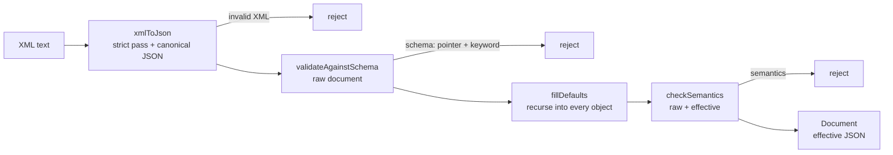

# manager_config — loader of the manager configuration (`etc/wazuh-manager.conf`)

Manager-only C++17 static library that turns `etc/wazuh-manager.conf` (strict XML) into the **effective
configuration** (parsed XML, validated against the embedded JSON Schema, defaults filled, cross-field
semantics checked) and exposes it as canonical JSON to the C daemons (`manager_config_c.h`) and as a C++
class (`manager_config.hpp`). It replaces the pseudo-XML `ReadConfig`/`os_xml` path and the "bypass"
readers of the manager (`<logging>`, `<cluster>`, `<indexer>`). `agent.conf` and the agent stay on
`os_xml`.

Consumers: `bin/wazuh-manager-conf` (also run by the installer to validate the generated file); the C
daemons remoted, authd, wazuh-db and modulesd through libconfig's `w_mconf_*()`
(`src/config/src/mconf-config.c`: one load per process without file checks, `-t` validates with them,
`getconfig` returns the effective sections); the cluster getters and the logging format inside libwazuh
through the `w_mconf_hook_*` provider; the engine (`wazuh-manager-analysisd`) through the C++ API —
`src/engine/source/base/src/managerConfig.cpp` links the `manager_config` target, loads the document
once and registers it as the section provider of `libwazuhshared.so`; `wazuh-server.sh` (`validate`
before any daemon `-t`, `get cluster.node_type`, `get auth.disabled`); and the Python framework
(`wazuh.core.manager_conf` consumes `dump`/`validate` of the CLI — there is no second implementation of
the language).

## Requirements

| # | Requirement | Where |
|---|---|---|
| RF-1 | Strict XML: exactly one `<wazuh_config>` root; entities decoded; raw `&`, `--` inside comments, legacy `<! !>` comments and a second root are rejected with the offending line | `src/xmlToJson.cpp` |
| RF-2 | Canonical JSON with the schema's types: `yes`/`no` → boolean, digits → integer where allowed, repeated or comma-separated values → arrays, the attribute forms of the dialect (`<backup database="…">`, `<disconnected_time enabled="…">`) → nested objects, lowercase enums normalized | `src/xmlToJson.cpp` |
| RF-3 | Validation against the embedded draft-04 schema; the first error is reported with its JSON pointer and keyword | `src/schemaValidate.cpp` |
| RF-4 | Defaults declared in the schema are filled into the effective document (a missing section = its defaults) | `src/defaults.cpp` |
| RF-5 | Uniform, fatal cross-field rules: certificate/key pairing, no `.`/`..` prefix segments, distinct listener ports, existence of the HTTPS/authd certificate files (relative to the manager home; `indexer.ssl.*` is not checked — the installer never creates those files, the connector reports them at runtime) | `src/semantics.cpp` |
| RF-6 | `sectionJson()` / `documentJson()` canonical JSON (cJSON-parseable); C API without exceptions or C++ types across the boundary | `src/manager_config.cpp`, `src/manager_config_c.cpp` |
| RNF-1 | C++17, STATIC, manager only, pugixml + rapidjson PRIVATE | `CMakeLists.txt` |
| RNF-2 | Schema embedded at build time (`generated/embeddedSchema.hpp`) | `CMakeLists.txt` |
| RNF-3 | Input limits: 1 MiB, depth 16; no DTD/external entities (pugixml has no DTD processing at all) | `src/xmlToJson.hpp` |

## Design decisions

- **Schema as the single source of truth** (`schema/wazuh-manager.schema.json`): types, ranges, enums, defaults and
  descriptions of the 65 leaf options — byte-identical to the YAML PoC's schema, so the 5.1 XML→YAML conversion is a
  backend swap. Draft-04 because it is what rapidjson's validator implements and what the Python framework uses
  (`jsonschema.Draft4Validator`). Definitions (`duration`, `size`, `port`…) are reused through `allOf: [{$ref}]`.
- **Schema-driven typing** over the pugixml DOM: the target type of every element decides the conversion, so
  `<disabled>no</disabled>` is the boolean `false`, `<port>1514</port>` is an integer, `<protocol>tcp,udp</protocol>`
  and `<hosts><host>…</host></hosts>` are arrays, and `true`/`false` fail with `type` ("booleans are yes/no").
  Text is otherwise kept verbatim — whitespace included — so the schema names what is wrong.
- **Strictness pass over the raw text** before conversion: pugixml tolerates an unescaped `&` that is not a valid
  reference and `--` inside comments; both are rejected with their line, like every malformed-XML error
  (`invalid XML: … (line N)`, computed from pugixml's byte offset).
- **Validate the raw document, then fill defaults, then check semantics.** The effective document may therefore contain
  values the schema would reject on input for an optional section a consumer treats as non-fatal when absent (e.g.
  `remote.legacy` disabled and unconfigured): the schema's own root `required` (`cluster`, `indexer`)
  covers the sections that are never optional in practice, so a `validate` failure at PUT time replaces a startup
  crash for those; there is no more general re-validation of the effective document.
- **Defaults algorithm**: for every property of an object schema missing in the document, insert its
  `default` when declared (property or resolved `$ref`), else an empty object when it is an object schema; recurse into
  object properties. Options without `default` (`verification_mode`, `ciphers`, `max_body_size`, `dual_stack`) stay absent:
  absence is meaningful ("module default / inferred").
- **Ports**: a disabled listener (`remote.legacy.enabled: no`, `auth.disabled: yes`) does not reserve its port.
- **Files**: `LoadOptions::checkFiles` (default on) resolves relative paths against `LoadOptions::home`; unit tests turn it
  off or create the files under a temporary home. Only `remote.https.*` and `auth.ssl_*` are checked.
- **`cluster.key` is required and has no default**: a well-known default key would be a shared secret; the installer
  always generates one. `cluster` and `indexer` are the only `required` properties at the document root:
  every manager runs as a cluster node, and `wazuh-manager-analysisd` cannot start with zero indexer hosts,
  so a document that omits either section, or one whose `<cluster>` omits `<key>`, fails with `required` at
  `validate` time instead of leaving the effective document with a gap that only breaks a daemon on restart.
- **`remote.legacy.local_ip` has no default**: the installer omits it for an IPv6 listener so that remoted applies its own
  default.
- **An empty file is invalid** (XML needs a root); the minimal valid document is
  `<wazuh_config><cluster><key>...32 alphanumeric...</key></cluster><indexer><hosts><host>scheme://host:port</host>
  </hosts></indexer></wazuh_config>` — every other option keeps its schema default.

## Architecture

`Document::parse()` (`src/manager_config.cpp`) runs the pipeline in one direction, stopping at the
first error:



Semantics rules read from the **raw** document where a schema default would otherwise mask the
operator's intent (certificate/key pairing — see Design decisions), and from the **effective** one
everywhere else (port collisions, file existence). The effective document is never re-validated
against the schema after `fillDefaults`: a `required` property with no default (`cluster`, `indexer`,
`cluster.key`, `indexer.hosts`) is what makes an absent section fail at the `validateAgainstSchema`
step instead of silently defaulting into a broken effective document.

## Layout

```
manager_config/
├── CMakeLists.txt                 # STATIC lib, schema embedding, tests under UNIT_TEST
├── schema/wazuh-manager.schema.json
├── include/manager_config/{manager_config.hpp, manager_config_c.h}
├── src/{xmlToJson,schemaValidate,defaults,semantics,manager_config,manager_config_c}.cpp
└── tests/
    ├── unit/managerConfig_test.cpp   # target manager_config_utest
    ├── vectors/{valid,invalid}/*.conf + expected/*.json   # shared with parity.py
    └── parity.py                     # jsonschema Draft4 must agree with the library on every vector
```

## Consumer contract

- **Two APIs, one implementation**: C++ (`manager_config.hpp`, `Document::load`/`Document::parse`) for
  the engine and `bin/wazuh-manager-conf`; a C ABI (`manager_config_c.h`, `mconf_load`/`mconf_load_ex`/
  `mconf_validate`) for the C daemons through libconfig's `w_mconf_*()` wrappers
  (`src/config/src/mconf-config.c`). Both call the same `Document::parse()` pipeline — there is no
  second validator to keep in sync.
- **Link**: `target_link_libraries(<your_target> PRIVATE manager_config)`. STATIC + PIC (RNF-1/RNF-2);
  the schema is embedded in **your** binary at build time (`generated/embeddedSchema.hpp`) — a schema
  change (e.g. a new `required` entry) only takes effect for a consumer after it is rebuilt and
  reinstalled, not merely after `bin/wazuh-manager-conf` is.
- **File checks**: `LoadOptions::checkFiles` / `mconf_load_ex`'s `check_files` (default on) resolve
  certificate/key paths against `home` and fail if they don't exist. Daemon start-up loads with
  `check_files == 0` (P44) — file existence is `-t`'s and `wazuh-manager-conf validate`'s job, not the
  plain loader's, so a daemon can come up with an as-yet-uncreated certificate and let `-t` catch it.
- **`mconf_t` is immutable** after `mconf_load_ex()` returns: concurrent `mconf_section_json()` /
  `mconf_document_json()` calls on one handle need no external locking. Do not add mutation on the C++
  side without re-checking every caller that relies on this (modulesd reads sections from arbitrary
  threads at arbitrary times).
- **Errors**: C++ callers get `Error{pointer, message}` (`what()` renders `"<pointer>: <message>"`, or
  just the message when `pointer` is empty); C callers get -1 and a filled `err` buffer. Render the
  pointer to the operator as-is — it is the schema location of the offending option, not a bug.
- **Ownership**: `mconf_section_json()`/`mconf_document_json()` return a `malloc`'d C string the caller
  `free()`s; `mconf_free()` releases the handle.

## Tests

```bash
cmake -S $WAZUH_REPO/src -B $WAZUH_REPO/src/build -DUNIT_TEST=ON
cmake --build $WAZUH_REPO/src/build -j --target manager_config_utest
$WAZUH_REPO/src/build/shared_modules/manager_config/tests/unit/manager_config_utest
$TMP_PY_VENV/bin/python3 tests/parity.py schema/wazuh-manager.schema.json tests/vectors
```

`ctest --test-dir $WAZUH_REPO/src/build -R manager_config` runs `manager_config_utest` and
`manager_config_parity` (registered when the venv exists). `parity.py` carries its own strict
ElementTree-based XML→dict loader with the same schema-driven typing: it is the reference for the Python
framework and the seed of the 5.0→5.1 conversion tool.

## Errors

| Situation | Message |
|---|---|
| file missing / oversized | plain message (the CLI maps it to `(1239)` in a later stage) |
| malformed XML, raw `&`, `--` in a comment, second root, wrong root | `invalid XML: … (line N)` / specific message with the line, empty JSON pointer |
| schema / semantics | JSON pointer + violated keyword (`/remote/https/port: does not satisfy 'maximum' …`); consumers render it as `(1244): Invalid configuration at '<pointer>': <reason>` |
