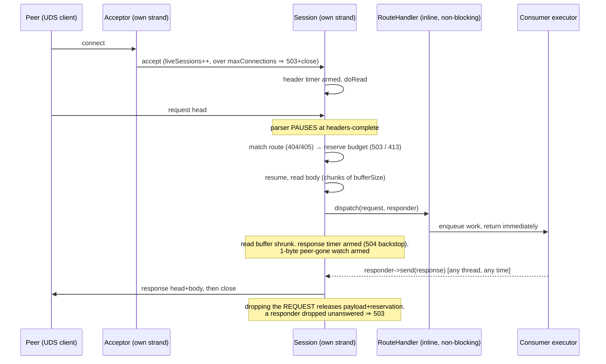
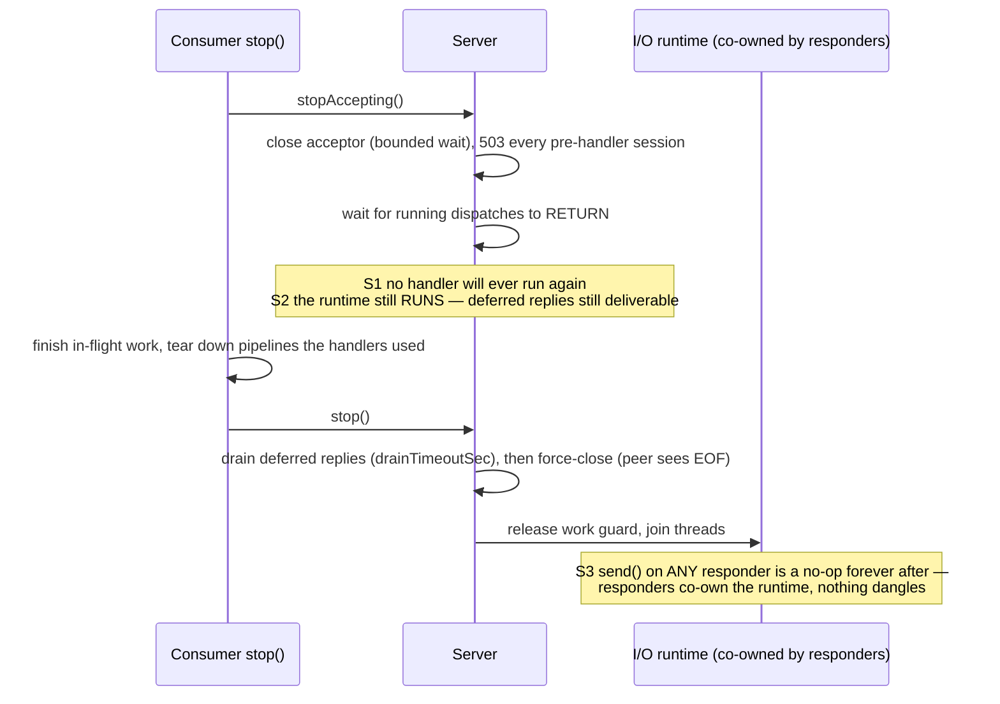
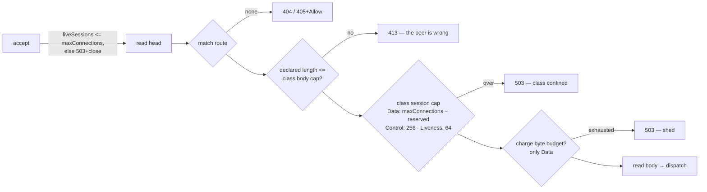

# uds_http_server — shared HTTP/1.1-over-UDS server

The manager's shared HTTP-over-Unix-domain-socket **server** transport: asynchronous end to
end, with deferred responses, an in-flight byte budget with real load shedding, and a
two-phase shutdown with named guarantees. Extracted verbatim from
`wazuh_modules/inventory_sync_server` (where it was designed and hardened); that module is its
first consumer. Intended consumers: manager daemons that serve local peers over
`queue/sockets/*` — inventory sync, the vulnerability scanner's `vd-http.sock`, remoted_module's
local admin socket.

What it deliberately is NOT: remoted's agent-facing TCP/TLS server (a protocol PEER of this
library, not a layer of it), and not a general web framework — one request per connection,
exact-match routing, no TLS, no keep-alive, no chunked encoding.

Operator/integrator docs: `docs/ref/modules/utils/uds-http-server/` (status semantics,
architecture, integration guide). This library has no standalone configuration — the
transport knobs are documented in each consumer's `configuration.md`.

## Requirements

### Functional

| # | Requirement |
|---|---|
| RF-1 | Serve HTTP/1.1 over a Unix domain socket; routes are `method + exact path` (no wildcards, patterns or params — consumers that need variable segments restructure the route, the way inventory sync carries the agent id in a header) |
| RF-2 | **Deferred responses**: a handler may return without answering, retain its `IHttpResponder`, and call `send()` minutes later from any thread. `send()` is exactly-once; after `stop()` — or destruction — it is a defined no-op. A dropped responder is detected and answered 503 |
| RF-3 | **In-flight byte budget**: reserve `Content-Length + derived per-request overhead` at headers-complete; exhausted ⇒ 503; a request declaring more than could ever be admitted ⇒ 413 at headers. Per-route exemption for liveness probes |
| RF-4 | Connection cap with an explicit 503-and-close at accept |
| RF-5 | Two-phase shutdown with guarantees S1/S2/S3 (below), budgeted to fit a daemon's 30 s stop window |
| RF-6 | **Injected identity**: `logTag`, `serverName` (rendered as "`<name>` server / connection(s) / request(s)" in every diagnostic), `serverHeader` (the `Server:` response header), and optional internal-option hints for the two capacity diagnostics — so each consumer's lines read in its own vocabulary, and the extraction changed no log line of its first consumer |
| RF-7 | **Diagnostics snapshot** (`diagnostics()`): budget available/in-flight bytes, in-flight request count, live sessions — relaxed atomic loads, callable at any point between construction and destruction. Consumers publish these as `wazuh_metrics` pull metrics; the library itself does not depend on wazuh_metrics |
| RF-8 | Fixed status semantics: 400/404/405+`Allow`/411/413/414/431/500/503/504, with throttled per-condition diagnostics (one storm cannot suppress another kind's first line) |
| RF-9 | Safe socket ownership: pre-flight check (`socketPathIsUsable`), refusal to unlink a non-socket, explicit chmod (0660 default), no parent-directory creation, inode-guarded unlink at teardown |

### Non-functional

| # | Requirement |
|---|---|
| RNF-1 | **C++17 floor**: consumers include a strict-C++17 module (remoted_module). `target_compile_features(PUBLIC cxx_std_17)` is the consumer-facing floor; the archive's own TUs and the whole test target are PINNED to 17 so the floor is enforced by every build |
| RNF-2 | **STATIC + PIC, never SHARED**: `Log::GLOBAL_LOG_FUNCTION` is per-DSO (hidden visibility); archived into each consumer `.so`, every copy logs through its own module's sink with no injection mechanism |
| RNF-3 | Transport deps (standalone asio 1.38.x, llhttp) stay PRIVATE behind the PImpl; no public header names them. `makeUdsHttpServer()` is the single transport swap point |
| RNF-4 | Manager-only (its `ext_asio`/`ext_llhttp` deps are gated `IS_LINUX AND NOT IS_AGENT`) |
| RNF-5 | Handlers run inline on I/O threads and MUST NOT BLOCK; blocking work goes to a consumer-owned executor and answers through the responder |
| RNF-6 | One-shot lifecycle: `start()` once per instance; a consumer that cycles builds a new instance per cycle |

## Design decisions

| Decision | Rationale |
|---|---|
| Exact-match routing only | Variable segments invite application logic into the router; the in-tree precedent (agent id in `X-Wazuh-Agent-Id`) predates the library and works |
| One request per connection, `Connection: close` always | Simplifies the deferral machinery and the peer-gone watch; every in-tree client (libcurl `uhttp_*`, cpp-httplib, httpx, the asio downstream client) reconnects transparently |
| Chunked ⇒ 411 | Delimitation is `Content-Length`-only: the budget must know the size at headers-complete |
| Budget charges a DERIVED overhead | `maxHeaderCount × (nameSize + valueSize) + bufferSize + fixed` — a constant would drift the moment an operator raised a limit |
| No dynamic route registration | Routes are immutable after `start()`, which is what makes the hot-path table scan lock-free. The one seemingly-dynamic consumer (content updates on demand) is dynamic at the handler level, not the route level |
| Identity via config, not template/macros | The extraction requirement was byte-identical logs for the first consumer; a handful of `%s` templates plus injected strings achieves it with zero per-consumer builds |
| `diagnostics()` instead of built-in metrics | Keeps the library free of the metrics dependency; each consumer publishes through its own `wazuh::metrics::IManager` as pull metrics |

## Architecture

Request pipeline — one connection, from accept to reply (deferred path included):



Two-phase shutdown — the S1/S2/S3 guarantees:



Route classes (QoS) — how one server hosts a sheddable data plane without starving anyone:



The decisive mechanism is `reservedControlConnections`: Data's session cap resolves to
`maxConnections − reserved`, so the data plane ALONE can never drive occupancy up to the
accept-time cap — Control and Liveness always find a slot. The honest residual: class
membership is unknowable before the head is read, so connections racing BETWEEN accept and
classification occupy global slots class-blind; the hard "control always answers" guarantee
holds while the concurrency of new data connects stays below the reserve (rejections beyond
that are transient accept races). A Control route that does real work still sheds its own
capacity module-side (bounded queue → 503); the class only guarantees the data plane cannot
starve it.

Threading: one shared `asio::io_context` wrapped in a `Runtime` co-owned by the server, every
session and every responder (that shared ownership is what makes a posthumous `send()` defined);
N I/O threads (`ioThreads`, default nproc) in a resume-on-exception loop; the acceptor on its
own strand with `concurrentAccepts` chains; **every session on its own strand** with handlers
explicitly re-bound — an accepted socket inherits the acceptor's strand, so without re-binding
all connections would serialize (this comment is load-bearing; see `Session` in the source).

## Layout

| File | Responsibility |
|---|---|
| `include/uds_http_server/IUdsHttpServer.hpp` | The whole public contract: types, config, responder + shutdown guarantees, `TransportDiagnostics`. Read this first |
| `include/uds_http_server/udsHttpServerFactory.hpp` | `makeUdsHttpServer()` — the transport swap point |
| `include/uds_http_server/logThrottle.hpp` | Lock-free per-window log throttle (returns a decision; never logs itself) |
| `include/uds_http_server/socketPathCheck.hpp` | Bind-feasibility pre-flight for fail-fast startups |
| `src/asioUdsHttpServer.{hpp,cpp}` | The entire implementation: asio + llhttp behind the PImpl |
| `src/requestParser.{hpp,cpp}` | llhttp wrapper + limits; asio-free and logger-free so tests drive it with byte strings |
| `src/inFlightBudget.hpp` | Lock-free byte budget with RAII reservations (private: observed through `diagnostics()`) |

## Consumer contract

- **Link**: `target_link_libraries(<your_module> PRIVATE wazuh_uds_http_server)`. STATIC +
  PIC; your `.so` must define its own `Log::GLOBAL_LOG_FUNCTION` (every module already does).
- **Identity**: fill `logTag`, `serverName`, `serverHeader` and — if your capacity knobs are
  internal options — the two hint fields, so diagnostics name YOUR module and YOUR options.
- **Socket path**: no default; empty makes `start()` throw. Use a relative path (daemons
  `chdir()`/`chroot()` into the install dir).
- **Handlers never block** (RNF-5): enqueue to your executor, reply via the responder. The
  request `shared_ptr` carries the byte reservation — keep it alive exactly as long as you
  need the payload, drop it before replying if you are done with the bytes.
- **Shutdown order**: `stopAccepting()` FIRST, then tear down whatever handlers reach, then
  `stop()`. That ordering is what S1/S2 exist for.
- **Diagnostics as metrics**: publish `diagnostics()` fields as `wazuh_metrics` pull metrics.
  Mind the pull lifetime rule (pulls cannot be unregistered): capture a `weak_ptr` resolved
  under your own lock, register once, and let an expired target read as zeros — see
  `registerTransportDiagnostics()` in inventory sync's facade for the reference wiring.
- **Restarting**: build a fresh instance per start cycle; `start()` throws if reused.

## Test suite map

`test/` builds `uds_http_server_utest` — pinned to C++17 (the floor's enforcement point) —
with its own `main()` (`testMain.cpp`) that owns the binary's log sink; no module bootstrap.

| File | Pins |
|---|---|
| `udsHttpServer_test.cpp` | Routing, 404/405+`Allow`, query handling, socket modes under a hostile umask, stale-socket unlink + non-socket refusal, 411/413/414/431, slowloris, deferrals from other threads, 300 concurrent deferrals on 2 I/O threads, budget release on request drop, connection-cap 503, handler throw ⇒ 500, dropped responder ⇒ 503, never-answered ⇒ 504, no head-of-line blocking, requests outliving the server, inode-guarded unlink |
| `udsShutdown_test.cpp` | S1/S2/S3 verbatim: replies between the two phases, `send()` after stop AND after destruction, drain window, force-close as EOF, concurrent stop races |
| `requestParser_test.cpp` | The parser alone, byte-by-byte split boundaries, every limit, chunked ⇒ 411 |
| `inFlightBudget_test.cpp` | Reservation RAII, move semantics, concurrent exactness |
| `routeClasses_test.cpp` | The QoS model end to end: data saturation not shedding Control/Liveness, class body caps (413 at headers), class session caps releasing on close, the reserved headroom under a flood (and its documented residual), the bool-shim mapping, per-route overrides, per-class diagnostics |
| `transportDiagnostics_test.cpp` | `diagnostics()` before/during/after; identity injection rendering the consumer vocabulary byte-for-byte; the capacity-hint sentence appearing only when configured |
| `serverDiagnostics_test.cpp` | Operator-visible (throttled) lines per rejection class |
| `logThrottle_test.cpp`, `socketPathCheck_test.cpp` | The helpers |

Plain `add_test` on purpose: the suite has process-wide state (single log sink, static
throttle windows); one process per case would change the behaviour under test.

```bash
cmake --build build -j --target uds_http_server_utest
build/shared_modules/uds_http_server/test/uds_http_server_utest
```
