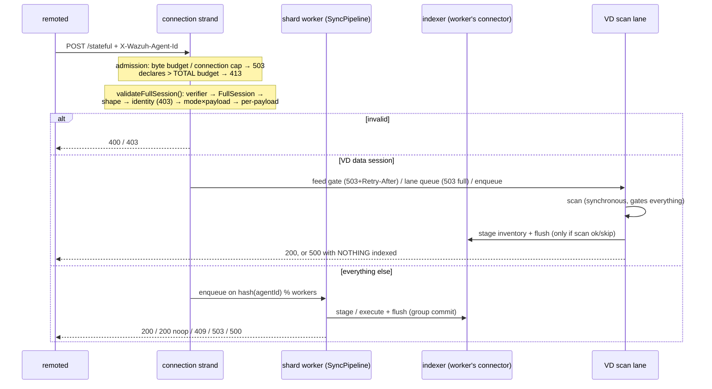
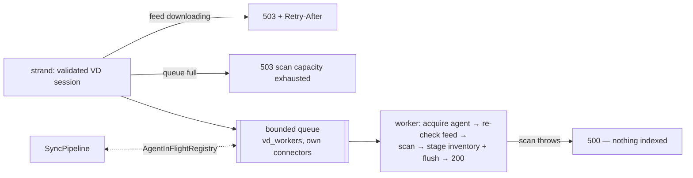

# inventory_sync_server

Manager-side synchronization service for agent state data. A whole synchronization session
travels as ONE FlatBuffers `Message{FullSession}` request — relayed by remoted's authenticated
`POST /stateful` route over this module's Unix-domain HTTP socket — and the HTTP response IS the
session result. There are no acknowledgment messages, no retransmission protocol, and no local
session store: re-applying a session is idempotent, so the whole retry story is "the agent
re-POSTs".

The module also hosts the whole-agent deletion endpoint (`DELETE /agents`, called by authd) and
runs vulnerability-detection sessions through a scan lane where the scan **gates** indexing: a
`200` for a VD session guarantees the scan ran AND the inventory was flushed.

Operator-facing documentation lives in `docs/ref/modules/inventory-sync-server/` (architecture,
API reference, configuration, schemas, test tools). This README is the developer's map: how the
pieces fit, which invariants are load-bearing, and where to touch what.

## Layout

```
inventory_sync_server/
├── include/
│   ├── inventory_sync_server.h        # C ABI: config struct + start/stop (the ONLY shared header)
│   ├── inventorySyncServer.hpp        # C++ convenience wrapper over the C ABI
│   └── inventorySyncServerTestHooks.hpp # factory-override hooks for tests (indexer fakes)
├── src/
│   ├── inventorySyncServer.cpp        # extern "C" entry points -> facade
│   ├── inventorySyncServerFacade.hpp  # lifecycle: worker thread, startup gate, build/teardown order
│   ├── schema/syncSchema.hpp          # THE binding to the generated FlatBuffers code (alias fb::)
│   ├── common/                        # clusterIdentity, logThrottle, socketPathCheck, metricNames (D18)
│   ├── http_server/                   # HTTP/1.1-over-UDS transport (asio + llhttp, own interface)
│   ├── endpoints/                     # route policies: syncEndpoint (POST /stateful),
│   │                                  #   deleteAgentEndpoint (DELETE /agents), stats, config
│   ├── indexer/                       # seam over the shared indexer_connector: interfaces + adapters
│   ├── sync/                          # the ingestion pipeline:
│   │   ├── fullSessionValidator.*     #   request-level validation (verifier, identity, shape)
│   │   ├── sessionProcessor.*         #   per-session application (stage bulks, immediates, deletes)
│   │   ├── syncPipeline.*             #   sharded workers + group commit + batch cut
│   │   ├── stateIndexAllowlist.hpp    #   which indices an agent session may touch
│   │   └── syncQueryBuilder.hpp       #   the update/check queries (metadata, groups, cluster scope)
│   └── vd/                            # the vulnerability-detection lane:
│       ├── IVdScanner.hpp             #   what the lane needs from a scanner (feedReady, scan)
│       ├── vdScannerFactory.hpp       #   declares makeProductionVdScanner()
│       ├── vdScannerAdapter.cpp       #   the ONE TU that includes the scanner's headers
│       ├── vdScanLane.*               #   bounded queue + workers: scan -> ok -> index -> respond
│       ├── agentInFlightRegistry.hpp  #   per-agent cross-lane exclusion (pipeline <-> lane)
│       └── serverScanCoordinator.hpp  #   what feed-update scans see of in-flight sessions
├── test/unit/                         # one GTest binary: inventory_sync_server_utest
├── testtool/                          # inventory_sync_server_testtool (VD integration driver)
└── tools/send_sync.py                 # stdlib-only UDS smoke sender
```

Two style rules keep the layout navigable: every submodule is included by prefix
(`"sync/syncPipeline.hpp"`, `"vd/vdScanLane.hpp"` — `src/` is on the include path), and the
schema is only ever named through `invsync::schema::fb` (see [Schema](#schema)).

## C ABI

`include/inventory_sync_server.h` is the only header modulesd's C shim
(`wazuh_modules/src/wm_inventory_sync_server.c`) sees:

```c
int  inventory_sync_server_start(full_log_fnc_t callbackLog,
                                 const inventory_sync_server_config_t* configuration);
void inventory_sync_server_stop(void);
```

The config is a typed POD struct rather than a `cJSON*` blob: every field is a scalar or a path,
so a typo in a key name is a compile error rather than a silently-ignored option. The one
exception is `indexer` — the `<indexer>` block travels verbatim as nested `const cJSON*` because
its schema belongs to the shared indexer connector, and mirroring it field-by-field here would
mean chasing that schema forever. The extern "C" layer converts it once (print/parse) into the
`nlohmann::json` the connectors consume.

Sentinel convention: an int `<= 0` or an empty string means "the caller has no opinion, use the
module default" — so every default lives in exactly one place, this module. Ranges are enforced
by the shim at CONFIGURATION time (`getDefine_Int_default` aborts on out-of-range), which is what
makes `wazuh-modulesd -t` catch bad values instead of the module dying later.

`start()` returning non-zero (or the .so failing to load) is treated by the shim as fatal to
modulesd: a manager that looks healthy while silently lacking inventory ingress is worse than one
that refuses to start.

## Lifecycle (the facade)

`InventorySyncServerFacade` (singleton, `src/inventorySyncServerFacade.hpp`) owns one worker
thread and the canonical cooperative-shutdown lifecycle (atomic flag + condition_variable +
join). Its start path is split in two phases on purpose:

- **Phase A — synchronous, fail-fast**: validate the socket path (a path that can never bind is
  fatal, not retriable), resolve every tunable, snapshot the config. Errors here are returned to
  the shim, which refuses the module.
- **Phase B — asynchronous, retried**: build the indexer stack and the processing stages, then
  open the socket. This runs on the worker thread and is retried on every heartbeat
  (`INVENTORY_SYNC_SERVER_HEARTBEAT_SECS`, 60 s), because its usual failure mode — an indexer
  that has not started yet — heals on its own.

Phase B builds in dependency order, and each successfully built stage is memoised so a retry
never rebuilds what already works:

1. `IndexerSession` (shared by both connectors) — its constructor validates the `<indexer>`
   configuration synchronously and throws on nonsense, but does NOT require the indexer to be
   reachable. That split is the startup gate's contract: **gate on "configuration is valid",
   never on "host is up"**, so the indexer is free to start after modulesd.
2. The **async** connector (used by `/stats` and `/config`) and the **sync** connector slots.
   The pipeline gets ONE sync connector PER WORKER (worker 0's connector doubles as the
   admission-check slot the endpoint sees); the VD lane gets its own set.
3. `AgentInFlightRegistry` — created FIRST among the processing stages and reset LAST, because
   both the pipeline and the lane hold release listeners pointing into it.
4. `SyncPipeline` (with the registry), then — when the scanner is linked — the `VdScanLane`, the
   production `IVdScanner` adapter, and the `ServerScanCoordinator` registration.
5. The HTTP server, with routes capturing every dependency **weakly**.

The weak captures are the shutdown design: `stop()` walks the stages in reverse (coordinator
unregister → lane stop → scanner reset → pipeline stop → registry reset → connectors → session),
and a request that races the teardown finds an expired `weak_ptr` and answers `503` instead of
touching freed state. Two details of that order are non-obvious and load-bearing:

- The pipeline abandons an OPEN batch on stop — everything staged-but-unflushed is answered `503`
  WITHOUT flushing, because shutdown must not wait on indexer I/O and the agents simply re-POST.
- The registry is reset only after both consumers are joined; resetting it earlier would leave
  release listeners with dangling `this` pointers across a stop/start cycle.

### The connector flush-interval override

The pipeline's and the lane's sync connectors are created with `flush_interval_seconds` forced to
3600, regardless of configuration (`PIPELINE_CONNECTOR_FLUSH_INTERVAL_SECS`). This is
correctness, not tuning: the shared connector's TIMER flush silently discards the buffer on
failure, and if a timer flush could race the worker's own flush, a worker could answer `200` for
data that was silently dropped. The workers own every flush — that is the entire durability
contract behind "200 means flushed". The `..._indexer_sync_flush_interval_seconds` internal
option is therefore accepted-but-ignored for these connectors (documented as such).

Two config families feed the connectors and must not be crossed: the `<indexer>` block (hosts,
TLS, credentials — owned by the shared connector) and the module's `indexer_sync_*` /
`indexer_async_*` internal-option overlays (buffer sizes, retry ceilings — owned here). The
adapter in `src/indexer/indexerConnectorConfig.*` is where the overlay is applied.

## The request path



### Validation (`sync/fullSessionValidator.*`)

Runs entirely on the connection strand — CPU-only, O(body bytes), no I/O — in a fixed order so
every rejection is deterministic: FlatBuffers verifier → root must be `FullSession` → shape
(start present, module non-empty) → identity (agent id NUMERICALLY equal to the authenticated
header value; cluster name byte-equal to the manager's → `403`) → mode × payload matrix →
per-payload rules (`SyncData` needs ≥ 1 value, `Cleans` ≥ 1 item, `ChecksumModule` an allowlisted
index and a checksum). The output is a `ValidatedSession`: small `Start` fields are OWNED copies,
while the payload stays a pointer into the request body — whoever carries it across threads must
keep the `HttpRequest` alive, which is exactly what a pipeline `Item` does (and holding the
request also holds its in-flight byte reservation).

`padAgentId()` left-pads to 3 characters — the historical `wazuh.agent.id` form every document
`_id` and every query uses. `isNumericAgentId()` is shared with the deletion endpoint, which
validates the same header the same way.

### The pipeline (`sync/syncPipeline.*`, `sync/sessionProcessor.*`)

One worker (and ONE private `IndexerConnectorSync`) per shard; a session lands on
`hash(agentId) % workers`. Per-agent ordering is therefore a property of the topology, not of a
lock: two requests of the same agent traverse the same FIFO. Sessions classify into two kinds:

- **BulkData** (`ModuleDelta` × `SyncData`): `stageBulk()` walks the values — pre-scanning for
  invalid operations (a bad enum is a `400` BEFORE anything is staged), skipping per-document
  problems with a WARN (a bad document never fails the request), building
  `_id = {cluster}_{agent}_{id}`, overlaying authoritative `wazuh.*` fields so a payload cannot
  impersonate another agent, and using the versioned-upsert form when `version > 0`. Staged
  sessions join the worker's open batch; the **group commit** flushes when the batch bytes reach
  the threshold or the shard's queue drains, and only then answers every batched session `200`.
- **Immediate** (cleans, checksum, metadata/groups, deletions): executes its own I/O and responds
  alone. The worker **cuts the open batch first** — an immediate's effects (deletes, a checksum
  read) must not overtake bulk writes of an earlier session of the same agent.

Failure mapping is centralized in the worker: a connector failure answers `503` when
`isAvailable()` says the indexer is the problem (agent retries, like any not-ready) and `500`
otherwise (agent still retries; the log is operator-actionable). A staging failure poisons the
open batch — everything is answered through the same mapping and the connector buffer drained —
because a half-staged session inside a shared buffer is unrecoverable state; idempotent re-POSTs
are what make that safe.

The checksum verification (`executeChecksum`) pages the agent's documents with `search_after`
(1000 per page, deterministic order), aggregates SHA-1, and answers `200`/`409
{"status":"checksum_mismatch"}`. One attempt, no retry loop.

### The allowlist (`sync/stateIndexAllowlist.hpp`)

The per-document authorization layer: agent sessions may only touch
`wazuh-states-inventory-*`, `wazuh-states-fim-*`, `wazuh-states-sca`(`-*`), and — clean-only —
`wazuh-states-vulnerabilities` (its documents are produced exclusively by the scanner). Documents
outside it are skipped with a WARN; a session whose every document was skipped answers a no-op
`200`. Whole-agent deletions use the `wazuh-states-*` pattern instead: they are manager-initiated
(authd), not agent sessions, and must reach indices no current session writes.

## The VD scan lane (`src/vd/`)

Sessions with `Start.option` ∈ {`VDFirst`, `VDSync`} and a `SyncData` payload ride a dedicated
lane so the scan can gate the response. VD-flagged `Cleans`/`ChecksumModule` have nothing to scan
and follow the normal pipeline.



The lane worker's dispatch order is the D-contract in code: acquire the agent in the registry
(non-reentrant — a second session of the same agent waits), re-check connector availability,
re-check `feedReady()` (the admission check may be stale for a queued item — answering
`503 + Retry-After` here keeps the invariant that a not-ready feed never processes anything),
run the scan inside a try/catch (a throw answers `500` with ZERO indexing), then stage the
inventory bulk and `flush()` — one session per flush, no group commit in this lane — and answer
`200`.

**`IVdScanner`** is the lane's entire view of the scanner: `feedReady()` and
`scan() -> Ok | Skipped`. `feedReady()` is `!isInitialized() || isFeedReady()` — a DISABLED
scanner passes the gate and `scan()` reports `Skipped`, so inventory keeps flowing with VD off
(and a feed-update fleet scan that already covers the agent is the other legitimate skip; both
still index and answer `200`). The production adapter lives in exactly one translation unit,
`vdScannerAdapter.cpp`, because the scanner's headers pull include-dir baggage the rest of this
module must not inherit; the boundary itself is the scanner's neutral view interface
(`vulnerabilityScannerSync.hpp` — flat `string_view`/span structs, no FlatBuffers types in either
direction).

**`AgentInFlightRegistry`** is the cross-lane exclusion map. Pipeline acquisitions are
REENTRANT (group commit holds several staged sessions of one agent; each release drops one
count); lane acquisitions are not. Releases are lane-checked so a pipeline release can never free
a scan hold. The pipeline's `popDispatchable()` skips (parks, in order) items of an agent the
lane holds — per-agent FIFO without head-of-line blocking the shard's other agents — and the
registry's release listeners wake the parked shards. `couldAcquire()` is the const mirror the
worker's cv predicate uses; `pause/resume` + `waitUntilIdle` serve the coordinator below.

**`ServerScanCoordinator`** registers with the scanner's coordination registry so feed-update
fleet scans and session scans never race: it exposes which agents have sessions in flight, can
pause an agent (with a bounded quiesce wait, configurable for tests) and drain what is running.
On `stop()` it unregisters FIRST, before the lane dies under the scanner's feet.

## Agent deletion (`endpoints/deleteAgentEndpoint.*`)

`DELETE /agents` — plus a `POST /agents/delete` alias with the SAME handler, because the C-side
HTTP helper (`uhttp_*`, libcurl) only speaks POST and authd is the production caller. UDS-local
only; remoted has no downstream route to it.

The handler validates the `X-Wazuh-Agent-Id` header (missing/non-numeric → `400`), gates on
indexer availability (→ `503`; the caller retries rather than losing the deletion), and enqueues
a `SyncPipeline::Item` with `Kind::DeleteAgent` on the TARGET agent's shard — the deletion orders
FIFO against that agent's in-flight sessions, and respects a scan in flight through the same
registry. The worker treats it like an immediate: batch cut, then
`deleteByQuery("wazuh-states-*", agent, cluster)` + `flush()` → `200 {"status":"ok"}`. A missing
index counts as success inside the connector, so repeating a deletion is harmless — which is the
callers' whole retry contract.

## Transport (`src/http_server/`)

A hand-written HTTP/1.1 server over standalone asio + llhttp, behind the module's own
`IUdsHttpServer` interface (so the library never leaks into handlers). The details that matter:

- **Per-connection strands.** An accepted socket inherits the acceptor's executor; without
  re-binding each session to its own strand, every connection would serialize onto the acceptor's
  strand and the I/O thread count would buy nothing.
- **Admission at headers-complete.** Route resolution (404/405+Allow), then the declared
  `Content-Length` plus a DERIVED per-request overhead is reserved from the in-flight byte budget
  (over the available budget → `503`; declaring more than the TOTAL budget → `413` — with no
  explicit `max_body_size`, the parser's effective cap is the budget minus the overhead, so the
  413 arrives at headers, before any body byte). Only then is the body read.
- **Deferred responses by contract.** Handlers get an `IHttpResponder` they may answer from any
  thread, later; `send()` is send-once and thread-safe; the byte reservation lives until the
  response is delivered. A peer that disconnects while its response is deferred is detected and
  released immediately.
- **Two-phase shutdown.** `stopAccepting()` guarantees no handler runs again while the I/O
  runtime stays alive (so late `send()`s from workers are safe); `stop()` then drains bounded,
  force-closes the rest, joins. Every wait is named and sized to fit inside the daemon's
  shutdown budget.
- **Throttled diagnostics.** Every rejection class keeps one 90-second-windowed log line whose
  first occurrence always emits — transitions are visible immediately, floods are not.

## Endpoints (`src/endpoints/`)

| Route | Handler | Notes |
|---|---|---|
| `POST /stateful` | `syncEndpoint` | The ingestion route. Strand-side: header + body checks, `validateFullSession`, VD routing (feed gate → lane), indexer admission gate, pipeline enqueue. Everything else is the workers'. |
| `DELETE /agents`, `POST /agents/delete` | `deleteAgentEndpoint` | See above. |
| `POST /stats`, `POST /config` | `statsEndpoint` / `configEndpoint` | Validate the agent's `modules`-keyed report, overlay the authoritative identity (agent id from the header, cluster identity, timestamp — never from the body) and index ONE document per agent (`wazuh-agent-stats` / `wazuh-agent-config`, agent id as document id, replace-on-push). Full contract in [the API reference](../../../docs/ref/modules/inventory-sync-server/api-reference.md). |
| `GET /` | inline in the facade | Liveness probe, exempt from the byte budget so it answers under memory pressure. |
| `GET /metrics` | `metricsEndpoint` | The D18 statistics dump (`wazuh_metrics::dumpJson` of the module's registry). Budget-exempt like the probe: metrics matter most under pressure. NOT `/stats` — that is the agent-stats ingest route. |

Every route captures its dependencies weakly and answers `503` when they are gone — the
shutdown-safety story in one line. The identity header is `x-wazuh-agent-id`
(`syncEndpoint::agentIdHeader()`, lower-case because the transport normalizes header names); its
absence is a contract violation by the caller, not agent input, and answers `400`.

## Schema

`src/schema/syncSchema.hpp` is the single binding to the generated FlatBuffers code: it includes
`flatbuffers/include/inventorySync_generated.h` (generated from
`shared_modules/utils/flatbuffers/schemas/inventorySync.fbs` by the `compile_schemas_input`
target) and aliases `namespace fb = Wazuh::SyncSchema`. All module code says
`invsync::schema::fb::...` — if the schema's namespace or location ever moves again, this alias
is the one line that changes. The contract itself (tables, pinned enum values, validity matrix)
is documented in `docs/ref/modules/inventory-sync-server/flatbuffers.md` and pinned by
`schemaRoundtrip_test.cpp`.

## Tests

One GTest binary, `inventory_sync_server_utest` (`test/CMakeLists.txt` globs `test/unit/*.cpp` —
**after adding a test file, re-run CMake configure and check the test COUNT went up**; a stale
glob silently runs the old suite and has bitten this module before). The suite is built on three
shared fixtures:

- **`testIndexerConnectorFakes.hpp`** — installable factory fakes for the session and both
  connectors, all recording into ONE `ConnectorEvents` timeline (`m_syncOps`: op/id/index/data
  per call, plus flush counters, canned search responses, failure injection via `m_syncThrowOn`,
  and open/close gates to hold a flush or a scan mid-flight). The fake VD scanner records `"scan"`
  into the SAME timeline, which is what lets tests assert the D-contract orderings literally:
  "scan appears before bulkIndex", "a failed scan produces zero ops".
- **`testSessionBuilder.hpp`** — FlatBuffers builders for every session shape (including a
  forgeable raw operation byte for the invalid-enum tests).
- **`udsTestClient.hpp` / `testLogRecorder.hpp`** — a raw UDS HTTP client (the peer's exact wire
  shape) and a log-line recorder for asserting operator-visible behavior.

What lives where, roughly: request-level validation (`fullSessionValidator_test`), per-session
application (`sessionProcessor_test`), workers/ordering/group-commit/failure mapping
(`syncPipeline_test`), strand-side routing and gates (`syncEndpoint_test`), the lane's D-contract
and the cross-lane interlock (`vdScanLane_test`), deletion (`deleteAgentEndpoint_test`), the
startup gate and teardown order (`indexerGating_test`), schema pinning (`schemaRoundtrip_test`),
transport (`udsHttpServer_test`, `udsShutdown_test`, `requestParser_test`, `inFlightBudget_test`)
— and `statefulEndpointE2E_test`, which boots the REAL module through the C ABI and drives the
full contract matrix over a real socket with only the indexer faked.

```bash
cmake --build build -j --target inventory_sync_server_utest
ctest --test-dir build -R inventory_sync_server_utest -V     # or run the binary with --gtest_filter
```

## Tools

- `tools/send_sync.py` — stdlib-only smoke sender for a live socket (health probe, every
  transport rejection on demand). See `docs/ref/modules/inventory-sync-server/test-tools.md`.
- `testtool/` — `inventory_sync_server_testtool`, the vulnerability-detection integration driver:
  boots the real scanner + this server in one process, converts JSON descriptions into
  `FullSession` buffers and POSTs them to the real socket. Used by
  `wazuh_modules/vulnerability_scanner/qa/test_efficacy_log.py`.

## Statistics (D18)

The facade owns one `wazuh::metrics::Manager` (`src/shared_modules/metrics/`, linked as the
`wazuh_metrics` target) created ONCE and never reset in `stop()` — counters must survive the HTTP
server's restart retries. Everything downstream resolves its instruments from it at construction
(`common/metricNames.hpp` is the catalog): the pipeline (request counters by code, shed total,
bulk-flush counters, per-shard depth/bytes gauges, session-duration histograms), the session
processor (docs indexed/skipped, bytes ingested), the VD lane (lane depth/time, scan duration,
scans ok/failed/skipped, capacity and Retry-After totals) and the sync endpoint (its inline
rejections). Constructors take the manager as an optional trailing parameter; a null falls back
to a private disconnected manager, so instrumentation stays branch-free and tests need no change.

Three invariants worth keeping: every response is counted exactly ONCE, at the site that sends it
(a refusal counted by `enqueue()`/`tryEnqueue()` is only the *cause* counter — `shed`/`capacity`
— never the request counter, which the endpoint counts when it answers); shard/lane depths are
GAUGES the workers update, never pull metrics (a pull would capture a `this` that dies in
`stop()` while the manager persists — there is no `remove()`); and `Item::enqueuedAt` is stamped
by the endpoint, so a default (epoch) timestamp means "no duration sample", which keeps
hand-built test items out of the histograms.

## Operational notes

- Log tags: the module logs under `wazuh-manager-modulesd:inventory-sync-server` with `:sync`,
  `:endpoints`, `:server`, `:vd` and per-indexer-object suffixes, so a misbehaving stage names
  itself. The startup line to look for:
  `inventory sync server listening on 'queue/sockets/inventory-sync.sock' (routes: ...)`.
- The socket is `queue/sockets/inventory-sync.sock`, mode 0660, fixed by design (internal options
  carry only ints, so there is no path mechanism to misconfigure; tests override it through the
  C-ABI field).
- The heartbeat logs indexer availability TRANSITIONS only (WARN gone / INFO back), and retries a
  failed phase-B start with an escalating report (ERROR once, debug for an hour, WARN hourly).
- On the remoted side, this module's `503`s surface as retriable answers to the agent and one
  throttled WARN naming the downstream service; a `404/405` there means the two sides run
  mismatched route tables and is logged as exactly that.
- Everything here is manager-only. The agent-side producer of `FullSession` buffers lives with
  the agent's sync protocol, against the same `.fbs` contract.
