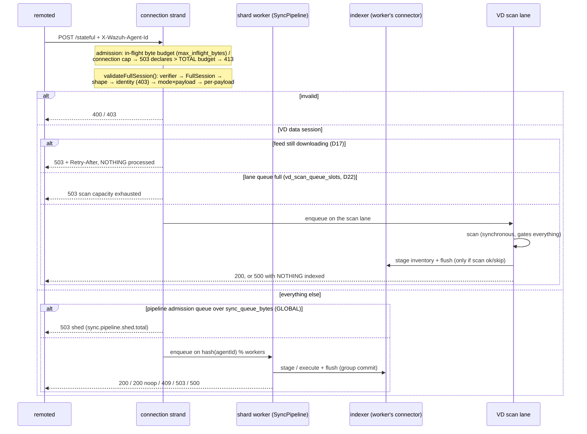
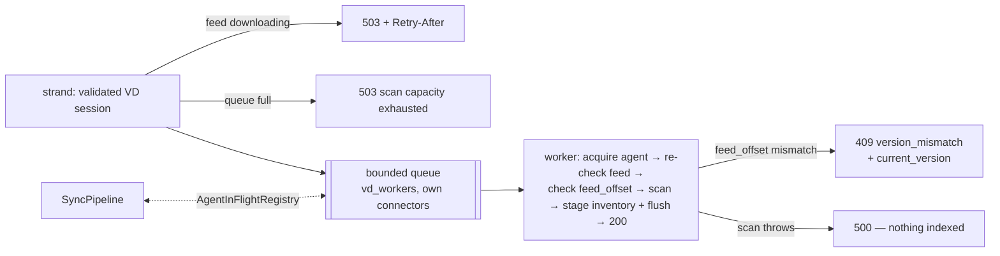

# inventory_sync_server

Manager-side synchronization service for agent state data. A whole synchronization session
travels as ONE FlatBuffers `Message{FullSession}` request — relayed by remoted's authenticated
`POST /stateful` route over this module's Unix-domain HTTP socket — and the HTTP response IS the
session result. There are no acknowledgment messages, no retransmission protocol, and no local
session store: re-applying a session is idempotent, so the whole retry story is "the agent
re-POSTs".

The module also hosts the whole-agent deletion endpoint (`DELETE /agents`, called by authd) and
runs vulnerability-detection sessions through a scan lane where the scan **gates** indexing: a
`200` for a VD session guarantees the scan ran AND the inventory was flushed.

Three documentation layers cover this module, each with its own job:

- **This README** — the developer's map: how the pieces fit, which invariants are load-bearing,
  where to touch what, and WHY it is built this way ([requirements](#requirements),
  [design decisions](#design-decisions-d1d22), [developer FAQ](#developer-faq)).
- **[`docs/ref/modules/inventory-sync-server/`](../../../docs/ref/modules/inventory-sync-server/README.md)**
  — the operator- and integrator-facing reference:
  [architecture](../../../docs/ref/modules/inventory-sync-server/architecture.md),
  [API reference](../../../docs/ref/modules/inventory-sync-server/api-reference.md),
  [configuration](../../../docs/ref/modules/inventory-sync-server/configuration.md),
  [schemas](../../../docs/ref/modules/inventory-sync-server/flatbuffers.md),
  [test tools](../../../docs/ref/modules/inventory-sync-server/test-tools.md).
- **[`tools/manager_benchmark/`](../../../tools/manager_benchmark/README.md)** — the load and
  contract harness that measures this module end to end (see
  [Load & benchmarking](#load--benchmarking)).

## Requirements

Distilled (and translated) from the migration's design corpus, where they were extracted from the
legacy module's observable behavior before this rewrite. They are inlined here because the corpus
is not part of the repository, and the D-numbers they cite are the [design decisions](#design-decisions-d1d22)
below. Status: **kept** = the module provides it; **superseded by D-n** = deliberately replaced.

### Functional (RF)

| # | Requirement | Status |
|---|---|---|
| RF-1 | Ingest synchronizations from the 5 agent producers (syscollector, syscollector-VD, FIM, SCA, agent-info) across every `Mode` | kept |
| RF-2 | Per-document Upsert/Delete with a mandatory `id` and optional external versioning (`version > 0` → versioned upsert) | kept |
| RF-3 | `ModuleFull` = delete-and-reindex per declared index; `ModuleDelta` = apply the delta | **superseded by D19** — no `ModuleFull`; a full resync is `Cleans` + `ModuleDelta` |
| RF-4 | `DataClean`: per-index deletion on the agent's request — the ONLY cleanup path for `wazuh-states-vulnerabilities` | kept |
| RF-5 | `DataContext`: session data for VD that is NEVER indexed | kept |
| RF-6 | `ModuleCheck`: checksum-of-checksums (SHA-1 of the ordered concatenation of `checksum.hash.sha1`), answering ok/mismatch/error | kept (single attempt — D16) |
| RF-7 | Metadata/Group delta with the `state.document_version <= global_version` guard + check repair; mutual exclusion with same-agent data sessions | kept (exclusion is free: shard FIFO) |
| RF-8 | Answer with the `Status` semantics the agent implements, including `Processing` vs terminal | **superseded by D2** — the HTTP response IS the result; no ack messages |
| RF-9 | VD orchestration: trigger VDFirst/VDSync with their gates (feed ready, `feed_offset` validation, VDFirst dedup) and expose in-flight-session queries + per-agent lock to the scanner | kept (as the scan lane + `ServerScanCoordinator`) |
| RF-10 | Whole-agent deletion sweeping the agent's indices, retriable | kept, and widened past the original `wazuh-states-*` to `AGENT_DELETION_SCOPE` (`DELETE /agents`; authd is the only producer — D21) |
| RF-11 | `_id = {cluster}_{agent}_{id}` and cluster scoping on every operation | kept |
| RF-12 | Admission limits: session cap and a global byte budget | kept (`max_inflight_bytes`, `max_parallel_connections`, `sync_queue_bytes`) |
| RF-13 | Recovery on agent restart (new session replaces the old) and on modulesd restart (transient state is discardable) | kept (trivially: there is no session state — D1/D9) |

### Non-functional (RNF)

| # | Requirement | Where it lands |
|---|---|---|
| RNF-1 | Preserve the 9 security controls: anti-spoofing, index allowlists, authoritative `wazuh.*` overlay, strict JSON, `external_gte` guard, idempotency, admission quota, cluster isolation | [Validation](#validation-syncfullsessionvalidator), [the allowlist](#the-allowlist-syncstateindexallowlisthpp), the overlay in `sessionProcessor` |
| RNF-2 | No head-of-line blocking: no sleeps or unbounded waits on the completion path | sharding + the VD lane; a slow agent/scan delays only its shard/lane |
| RNF-3 | Explicit backpressure at admission and ingestion (no silent drops) | the four `503` gates; every refusal is an HTTP answer |
| RNF-4 | Every abort observable by the agent | deferred responders always answer (weak captures → `503`; batch abandoned on stop → `503`) |
| RNF-5 | Deterministic teardown; no half-built startup states | [Lifecycle](#lifecycle-the-facade): phased build, reverse teardown, startup gate |
| RNF-6 | Unit-testability of the orchestration | seams: `IIndexerConnectorSync`, `IVdScanner`, test hooks ([Tests](#tests)) |
| RNF-7 | Observability: effective config and metrics exposed | debug dump of every tunable + `GET /metrics` ([Statistics](#statistics-d18)) |
| RNF-8 | An explicit interface toward VD instead of shared internals | `IVdScanner` + the scanner's neutral views (D20) |
| RNF-9 | The keystore socket's fate decided OUTSIDE this module | the `keystore_server` module (D11) |
| RNF-10 | Satisfy the indexer-connector synchronization contract (REQ-SYNC below) — preconditions, not nice-to-haves, once the endpoint is synchronous | the pipeline's connector-per-worker design |

### Indexer-connector synchronization (REQ-SYNC)

The connector-locking contract extracted from the legacy module's failure modes; the sharded
pipeline satisfies it structurally rather than by discipline:

| # | Requirement | How |
|---|---|---|
| REQ-SYNC-1 | Locking contract explicit and verifiable, not a caller convention | one PRIVATE connector per worker — no shared staging to lock |
| REQ-SYNC-2 | Never HTTP nor sleeps under the staging mutex | staging and I/O both live on the worker; nothing else contends |
| REQ-SYNC-3 | Completion notifies with per-session ownership, not a global vector + flag | `registerNotify` is NOT used at all; `flush()` returning is the signal |
| REQ-SYNC-4 | Ack only after the WHOLE session is durable | group commit answers after its flush; "200 means flushed" |
| REQ-SYNC-5 | The completion path must not hold the connector lock waiting on third parties | scans run on their own lane; immediates cut the batch and own their I/O |
| REQ-SYNC-6 | Bounded retries (no infinite 429 loop holding the agent's connection) | connector retry ceilings are configuration; a stuck shard delays only its agents |
| REQ-SYNC-7 | Preserve the wait-free availability monitor | one shared `IndexerSession`, one monitor per process |
| REQ-SYNC-8 | Redesign the notify/flag model BEFORE parallelizing completion | moot: there is no notify model to misuse |

### VD handoff (REQ-VDQ)

| # | Requirement | Status |
|---|---|---|
| REQ-VDQ-1 | Enqueue AFTER building the scan context, in RAM, byte-bounded | kept (the lane queues validated sessions; contexts are built in the worker from the request body) |
| REQ-VDQ-2 | Per-agent FIFO, one scan in flight per agent | kept (`AgentInFlightRegistry`) |
| REQ-VDQ-3 | Feed/dedup gating moved to admission/consumer — the producer never blocks waiting for the feed | kept (feed gate answers `503 + Retry-After` at admission — D17) |
| REQ-VDQ-4 | No silent drop; degrade with explicit coalescing | **superseded by D22** — the lane is short and synchronous; a full lane answers `503` and the agent re-POSTs (nothing to coalesce) |
| REQ-VDQ-5 | Redefine the ack contract for VD sessions (scan decoupled from ack) | **superseded by D22** — the OPPOSITE was chosen: the scan gates the response; `200` guarantees scan + ingest |
| REQ-VDQ-6 | Two-phase shutdown: stop admitting → drain/abort → reset the orchestrator | kept (lane stop before scanner reset; coordinator unregisters first) |
| REQ-VDQ-7 | REAL scan parallelism needs scanner work (shared_lock + per-worker chains), not just a queue | **pending** — `vd_workers` defaults to 1 until the scanner stops serializing scans globally |
| REQ-VDQ-8 | Feed-update coordination reformulated over queue state, not module internals | kept (`ServerScanCoordinator` answers from lane + registry state) |
| REQ-VDQ-9 | No RocksDB in the VD path (or at all) | kept (D9 — the module has NO local store) |
| REQ-VDQ-10 | Queue observability: depth, ages, outcomes, durations | kept (`vd.lane.*`, `vd.scans.*` metrics — see [Statistics](#statistics-d18)) |

## Design decisions (D1–D22)

The numbered decisions the requirements above refer to, in their original numbering. The
[official architecture page](../../../docs/ref/modules/inventory-sync-server/architecture.md)
carries the narrative version of the load-bearing ones; this is the complete catalog.

| # | Decision |
|---|---|
| D1 | The whole session in ONE request (`FullSession`) — no GapSet, no retransmission protocol |
| D2 | The result IS the HTTP response (status + JSON body); no FlatBuffers ack messages |
| D3 | No session/idempotency id: re-applying a session is idempotent; dedup would be manager-internal and is unnecessary |
| D4 | `seq` fields are unused — order is the vector's order |
| D5 | No body cap of its own: `max_body_size` defaults to unlimited; the effective session limit is `max_inflight_bytes` (declaring more than the TOTAL budget ⇒ `413`) |
| D6 | `mode=ModuleDelta` + `payload=Cleans` is accepted — the mode is non-significant for cleanups; routing is by payload |
| D7 | One checksum per request, enforced by the SCHEMA (`SessionPayload` references `ChecksumModule` directly, no vector wrapper) |
| D8 | A valid `SyncData` has `values` ≥ 1 (`contexts` optional); contexts-only or empty ⇒ `400` |
| D9 | No RocksDB anywhere in the module: scan context is built from the request body in RAM |
| D10 | Whole-agent deletion becomes its own endpoint (revised by D21) |
| D11 | The keystore socket moves to its own minimal module (`keystore_server`) |
| D12 | The new schema lands even if it breaks the agent's build (parallel teams; `TARGET=manager` unaffected) |
| D13 | Ingress via remoted's authenticated `POST /stateful` (AES-CMAC per agent, opaque forward) |
| D14 | The server endpoint is `POST /stateful`, mirroring remoted's route name |
| D15 | The deletion endpoint is NOT exposed through remoted: UDS-local consumers only |
| D16 | Checksum verification is single-attempt — no retry loop (the legacy did 5×10 s) |
| D17 | CVE feed not ready ⇒ `503 + Retry-After` for VD sessions, rejected WITHOUT processing — nobody blocks waiting for the feed |
| D18 | Statistics deferred at first, shipped later against greppable placeholder markers (now [implemented](#statistics-d18)) |
| D19 | `Mode` has no `ModuleFull`: a full resync is composed as `Cleans` + `ModuleDelta` with the full dataset — no special case in the server. Acks/`End`/`seq`/batching were REMOVED from the schema, not merely unused |
| D20 | The server→VD boundary is FlatBuffers-free: the scanner's neutral C++ view structs — the scanner never includes this schema's header |
| D21 | Only authd deletes agents: the legacy `wm_database` delete path was removed, not migrated |
| D22 | VD scans are SYNCHRONOUS and gate the response: scan → ok → index → `200`; scan fails → `500` with nothing indexed; lane full → `503`; legitimate skip (scanner disabled) still indexes and answers `200`. Stronger than the legacy, which indexed even when the scan failed |

## Layout

```
inventory_sync_server/
├── include/
│   ├── inventory_sync_server.h        # C ABI: config struct + start/stop (the ONLY shared header)
│   ├── inventorySyncServer.hpp        # C++ convenience wrapper over the C ABI
│   └── inventorySyncServerTestHooks.hpp # factory-override hooks for tests (indexer fakes)
├── src/
│   ├── inventorySyncServer.cpp        # extern "C" entry points -> facade
│   ├── inventorySyncServerFacade.hpp  # lifecycle: worker thread, startup gate, build/teardown order
│   ├── schema/syncSchema.hpp          # THE binding to the generated FlatBuffers code (alias fb::)
│   ├── common/                        # clusterIdentity, logThrottle, socketPathCheck, metricNames (D18)
│   ├── http_server/                   # HTTP/1.1-over-UDS transport (asio + llhttp, own interface)
│   ├── endpoints/                     # route policies: syncEndpoint (POST /stateful),
│   │                                  #   deleteAgentEndpoint (DELETE /agents), stats, config
│   ├── indexer/                       # seam over the shared indexer_connector: interfaces + adapters
│   ├── sync/                          # the ingestion pipeline:
│   │   ├── fullSessionValidator.*     #   request-level validation (verifier, identity, shape)
│   │   ├── sessionProcessor.*         #   per-session application (stage bulks, immediates, deletes)
│   │   ├── syncPipeline.*             #   sharded workers + group commit + batch cut
│   │   ├── stateIndexAllowlist.hpp    #   which indices an agent session may touch
│   │   └── syncQueryBuilder.hpp       #   the update/check queries (metadata, groups, cluster scope)
│   └── vd/                            # the vulnerability-detection lane:
│       ├── IVdScanner.hpp             #   what the lane needs from a scanner (feedReady, scan)
│       ├── vdScannerFactory.hpp       #   declares makeProductionVdScanner()
│       ├── vdScannerAdapter.cpp       #   the ONE TU that includes the scanner's headers
│       ├── vdScanLane.*               #   bounded queue + workers: scan -> ok -> index -> respond
│       ├── agentInFlightRegistry.hpp  #   per-agent cross-lane exclusion (pipeline <-> lane)
│       └── serverScanCoordinator.hpp  #   what feed-update scans see of in-flight sessions
├── test/unit/                         # one GTest binary: inventory_sync_server_utest
├── testtool/                          # inventory_sync_server_testtool (VD integration driver
│                                      #   + the QA suite's --serve/--no-vd server harness)
├── qa/                                # integration QA: pytest over the real socket + OpenSearch
└── tools/                             # stdlib-only UDS drivers
    ├── send_sync.py                   #   smoke sender: health probe, every transport rejection
    └── send_delete_agent.py           #   DELETE /agents, with optional indexer before/after
```

Two style rules keep the layout navigable: every submodule is included by prefix
(`"sync/syncPipeline.hpp"`, `"vd/vdScanLane.hpp"` — `src/` is on the include path), and the
schema is only ever named through `invsync::schema::fb` (see [Schema](#schema)).

## C ABI

`include/inventory_sync_server.h` is the only header modulesd's C shim
(`wazuh_modules/src/wm_inventory_sync_server.c`) sees:

```c
int  inventory_sync_server_start(full_log_fnc_t callbackLog,
                                 const inventory_sync_server_config_t* configuration);
void inventory_sync_server_stop(void);
```

The config is a typed POD struct rather than a `cJSON*` blob: every field is a scalar or a path,
so a typo in a key name is a compile error rather than a silently-ignored option. The one
exception is `indexer` — the `<indexer>` block travels verbatim as nested `const cJSON*` because
its schema belongs to the shared indexer connector, and mirroring it field-by-field here would
mean chasing that schema forever. The extern "C" layer converts it once (print/parse) into the
`nlohmann::json` the connectors consume.

Sentinel convention: an int `<= 0` or an empty string means "the caller has no opinion, use the
module default" — so every default lives in exactly one place, this module. Ranges are enforced
by the shim at CONFIGURATION time (`getDefine_Int_default` aborts on out-of-range), which is what
makes `wazuh-modulesd -t` catch bad values instead of the module dying later.

`start()` returning non-zero (or the .so failing to load) is treated by the shim as fatal to
modulesd: a manager that looks healthy while silently lacking inventory ingress is worse than one
that refuses to start.

## Lifecycle (the facade)

`InventorySyncServerFacade` (singleton, `src/inventorySyncServerFacade.hpp`) owns one worker
thread and the canonical cooperative-shutdown lifecycle (atomic flag + condition_variable +
join). Its start path is split in two phases on purpose:

- **Phase A — synchronous, fail-fast**: validate the socket path (a path that can never bind is
  fatal, not retriable), resolve every tunable, snapshot the config. Errors here are returned to
  the shim, which refuses the module.
- **Phase B — asynchronous, retried**: build the indexer stack and the processing stages, then
  open the socket. This runs on the worker thread and is retried on every heartbeat
  (`INVENTORY_SYNC_SERVER_HEARTBEAT_SECS`, 60 s), because its usual failure mode — an indexer
  that has not started yet — heals on its own.

Phase B builds in dependency order, and each successfully built stage is memoised so a retry
never rebuilds what already works:

1. `IndexerSession` (shared by both connectors) — its constructor validates the `<indexer>`
   configuration synchronously and throws on nonsense, but does NOT require the indexer to be
   reachable. That split is the startup gate's contract: **gate on "configuration is valid",
   never on "host is up"**, so the indexer is free to start after modulesd.
2. The **async** connector (used by `/stats` and `/config`) and the **sync** connector slots.
   The pipeline gets ONE sync connector PER WORKER (worker 0's connector doubles as the
   admission-check slot the endpoint sees); the VD lane gets its own set.
3. `AgentInFlightRegistry` — created FIRST among the processing stages and reset LAST, because
   both the pipeline and the lane hold release listeners pointing into it.
4. `SyncPipeline` (with the registry), then — when the scanner is linked — the `VdScanLane`, the
   production `IVdScanner` adapter, and the `ServerScanCoordinator` registration.
5. The HTTP server, with routes capturing every dependency **weakly**.

The weak captures are the shutdown design: `stop()` walks the stages in reverse (coordinator
unregister → lane stop → scanner reset → pipeline stop → registry reset → connectors → session),
and a request that races the teardown finds an expired `weak_ptr` and answers `503` instead of
touching freed state. Two details of that order are non-obvious and load-bearing:

- The pipeline abandons an OPEN batch on stop — everything staged-but-unflushed is answered `503`
  WITHOUT flushing, because shutdown must not wait on indexer I/O and the agents simply re-POST.
- The registry is reset only after both consumers are joined; resetting it earlier would leave
  release listeners with dangling `this` pointers across a stop/start cycle.

### The connector flush-interval override

The pipeline's and the lane's sync connectors are created with `flush_interval_seconds` forced to
3600, regardless of configuration (`PIPELINE_CONNECTOR_FLUSH_INTERVAL_SECS`). This is
correctness, not tuning: the shared connector's TIMER flush silently discards the buffer on
failure, and if a timer flush could race the worker's own flush, a worker could answer `200` for
data that was silently dropped. The workers own every flush — that is the entire durability
contract behind "200 means flushed". The `..._indexer_sync_flush_interval_seconds` internal
option is therefore accepted-but-ignored for these connectors (documented as such).

Two config families feed the connectors and must not be crossed: the `<indexer>` block (hosts,
TLS, credentials — owned by the shared connector) and the module's `indexer_sync_*` /
`indexer_async_*` internal-option overlays (buffer sizes, retry ceilings — owned here). The
adapter in `src/indexer/indexerConnectorConfig.*` is where the overlay is applied.

## The request path



### Validation (`sync/fullSessionValidator.*`)

Runs entirely on the connection strand — CPU-only, O(body bytes), no I/O — in a fixed order so
every rejection is deterministic: FlatBuffers verifier → root must be `FullSession` → shape
(start present, module non-empty) → identity (agent id NUMERICALLY equal to the authenticated
header value; cluster name byte-equal to the manager's → `403`) → mode × payload matrix →
per-payload rules (`SyncData` needs ≥ 1 value, `Cleans` ≥ 1 item, `ChecksumModule` an allowlisted
index and a checksum). The output is a `ValidatedSession`: small `Start` fields are OWNED copies,
while the payload stays a pointer into the request body — whoever carries it across threads must
keep the `HttpRequest` alive, which is exactly what a pipeline `Item` does (and holding the
request also holds its in-flight byte reservation).

`padAgentId()` left-pads to 3 characters — the historical `wazuh.agent.id` form every document
`_id` and every query uses. `isNumericAgentId()` is shared with the deletion endpoint, which
validates the same header the same way.

### The pipeline (`sync/syncPipeline.*`, `sync/sessionProcessor.*`)

One worker (and ONE private `IndexerConnectorSync`) per shard; a session lands on
`hash(agentId) % workers`. Per-agent ordering is therefore a property of the topology, not of a
lock: two requests of the same agent traverse the same FIFO. Sessions classify into two kinds:

- **BulkData** (`ModuleDelta` × `SyncData`): `stageBulk()` walks the values — pre-scanning for
  invalid operations (a bad enum is a `400` BEFORE anything is staged), skipping per-document
  problems with a WARN (a bad document never fails the request), building
  `_id = {cluster}_{agent}_{id}`, overlaying authoritative `wazuh.*` fields so a payload cannot
  impersonate another agent, and using the versioned-upsert form when `version > 0`. Staged
  sessions join the worker's open batch; the **group commit** flushes when the batch bytes reach
  the threshold or the shard's queue drains, and only then answers every batched session `200`.
- **Immediate** (cleans, checksum, metadata/groups, deletions): executes its own I/O and responds
  alone. The worker **cuts the open batch first** — an immediate's effects (deletes, a checksum
  read) must not overtake bulk writes of an earlier session of the same agent.

Failure mapping is centralized in the worker: a connector failure answers `503` when
`isAvailable()` says the indexer is the problem (agent retries, like any not-ready) and `500`
otherwise (agent still retries; the log is operator-actionable). A staging failure poisons the
open batch — everything is answered through the same mapping and the connector buffer drained —
because a half-staged session inside a shared buffer is unrecoverable state; idempotent re-POSTs
are what make that safe.

The checksum verification (`executeChecksum`) pages the agent's documents with `search_after`
(1000 per page, deterministic order), aggregates SHA-1, and answers `200`/`409
{"status":"checksum_mismatch"}`. One attempt, no retry loop.

### The allowlist (`sync/stateIndexAllowlist.hpp`)

The per-document authorization layer: agent sessions may only touch
`wazuh-states-inventory-*`, `wazuh-states-fim-*`, `wazuh-states-sca`(`-*`), and — clean-only —
`wazuh-states-vulnerabilities` (its documents are produced exclusively by the scanner). Documents
outside it are skipped with a WARN; a session whose every document was skipped answers a no-op
`200`. Whole-agent deletions use `AGENT_DELETION_SCOPE` instead — `wazuh-states-*` plus
`wazuh-agent-config` and `wazuh-agent-stats`: they are manager-initiated (authd), not agent
sessions, and must reach every index holding the agent's documents, including ones no session
writes to. The two endpoints that WRITE those indices take their names from that same constant, so
the deletion scope cannot drift away from what is being written.

## The VD scan lane (`src/vd/`)

Sessions with `Start.option` ∈ {`VDFirst`, `VDSync`} and a `SyncData` payload ride a dedicated
lane so the scan can gate the response. VD-flagged `Cleans`/`ChecksumModule` have nothing to scan
and follow the normal pipeline.



The lane worker's dispatch order is the D-contract in code: acquire the agent in the registry
(non-reentrant — a second session of the same agent waits), re-check connector availability,
re-check `feedReady()` (the admission check may be stale for a queued item — answering
`503 + Retry-After` here keeps the invariant that a not-ready feed never processes anything),
check `Start.feed_offset` against `IVdScanner::currentFeedOffset()` for VD-flagged sessions
(answering `409 {"error":"version_mismatch","current_version":N}` — the same body shape as
remoted's `/scan/vd` REST endpoint, so an agent handles either 409 the same way — if the session
was built against a feed offset this node doesn't currently have; a non-VD session has no
meaningful `feed_offset` and skips this check entirely), run the scan inside a try/catch (a throw
answers `500` with ZERO indexing), then stage the inventory bulk and `flush()` — one session per
flush, no group commit in this lane — and answer `200`.

**`IVdScanner`** is the lane's entire view of the scanner: `feedReady()`, `currentFeedOffset()`
(this node's current VD feed offset, backing the `feed_offset` check above), and
`scan() -> Ok | Skipped`. `feedReady()` is `!isInitialized() || isFeedReady()` — a DISABLED
scanner passes the gate and `scan()` reports `Skipped`, so inventory keeps flowing with VD off
(the only legitimate skip; it still indexes and answers `200`). The production adapter lives in
exactly one translation unit,
`vdScannerAdapter.cpp`, because the scanner's headers pull include-dir baggage the rest of this
module must not inherit; the boundary itself is the scanner's neutral view interface
(`vulnerabilityScannerSync.hpp` — flat `string_view`/span structs, no FlatBuffers types in either
direction).

**`AgentInFlightRegistry`** is the cross-lane exclusion map. Pipeline acquisitions are
REENTRANT (group commit holds several staged sessions of one agent; each release drops one
count); lane acquisitions are not. Releases are lane-checked so a pipeline release can never free
a scan hold. The pipeline's `popDispatchable()` skips (parks, in order) items of an agent the
lane holds — per-agent FIFO without head-of-line blocking the shard's other agents — and the
registry's release listeners wake the parked shards. `couldAcquire()` is the const mirror the
worker's cv predicate uses; `pause/resume` + `waitUntilIdle` serve the coordinator below.

**`ServerScanCoordinator`** registers with the scanner's coordination registry so a
feed-update-triggered scan (per-agent, on-demand via `/scan/vd`, or the master-only sweep over
disconnected agents — see [vulnerability-scanner's
architecture.md](../../../docs/ref/modules/vulnerability-scanner/architecture.md#feed-update-rescan-scanvd--rescandisconnectedagents)
for both paths) and a session scan for the SAME agent never race: it exposes which agents have
sessions in flight, can pause an agent (with a bounded quiesce wait, configurable for tests) and
drain what is running. There is no fleet-wide coordination here — each feed-update rescan fences
only the one agent it is about to scan, the same way a lane session does. On `stop()` it
unregisters FIRST, before the lane dies under the scanner's feet.

## Agent deletion (`endpoints/deleteAgentEndpoint.*`)

`DELETE /agents` — plus a `POST /agents/delete` alias with the SAME handler, because the C-side
HTTP helper (`uhttp_*`, libcurl) only speaks POST and authd is the production caller. UDS-local
only; remoted has no downstream route to it.

The handler validates the `X-Wazuh-Agent-Id` header (missing/non-numeric → `400`), gates on
indexer availability (→ `503`; the caller retries rather than losing the deletion), and enqueues
a `SyncPipeline::Item` with `Kind::DeleteAgent` on the TARGET agent's shard — the deletion orders
FIFO against that agent's in-flight sessions, and respects a scan in flight through the same
registry. The worker treats it like an immediate: batch cut, then one
`deleteByQuery(index, agent, cluster)` for every index in `AGENT_DELETION_SCOPE`
(`wazuh-states-*`, `wazuh-agent-config`, `wazuh-agent-stats`), and one `flush()` →
`200 {"status":"ok"}`. A missing index counts as success inside the connector, so repeating a
deletion is harmless and stays quiet, which is the callers' whole retry contract.

**Two windows where a document can outlive the deletion.** Both are known, both are recorded by a
skipped test in `qa/test_delete_agent.py`, and repeating the deletion clears either one (it is
idempotent). Neither makes the deletion report failure — that is what makes them worth knowing:

- **The index refresh interval.** A `_delete_by_query` runs a SEARCH, so it only sees refreshed
  segments, and authd deletes immediately after removing the agent from `client.keys`. Whatever the
  agent's last session wrote inside that interval is invisible to the query, and with the agent gone
  nothing ever overwrites it. Refreshing each index first closed this, and was implemented — but
  `_refresh` needs `indices:admin/refresh`, which is outside the `crud`/`write` action groups, so the
  manager's least-privilege indexer role denies it and EVERY deletion failed with `403`. The refresh
  was removed until the privilege is granted; restoring it is a follow-up.
- **The async connector's queue.** `POST /config` and `POST /stats` are written through the
  ASYNCHRONOUS connector, whose queue drains on its own timer
  (`inventory_sync_server_indexer_async_flush_interval_seconds`, 20 s by default). The deletion runs
  on the sync connector and cannot drain that queue, so a report still queued when the deletion runs
  lands after the delete-by-query and recreates that agent's document. Closing it properly means
  ordering those two endpoints against the deletion the way `DELETE /agents` already is — as pipeline
  items on the agent's shard — which is the other follow-up.

## Transport (`src/http_server/`)

A hand-written HTTP/1.1 server over standalone asio + llhttp, behind the module's own
`IUdsHttpServer` interface (so the library never leaks into handlers). The details that matter:

- **Per-connection strands.** An accepted socket inherits the acceptor's executor; without
  re-binding each session to its own strand, every connection would serialize onto the acceptor's
  strand and the I/O thread count would buy nothing.
- **Admission at headers-complete.** Route resolution (404/405+Allow), then the declared
  `Content-Length` plus a DERIVED per-request overhead is reserved from the in-flight byte budget
  (over the available budget → `503`; declaring more than the TOTAL budget → `413` — with no
  explicit `max_body_size`, the parser's effective cap is the budget minus the overhead, so the
  413 arrives at headers, before any body byte). Only then is the body read.
- **Deferred responses by contract.** Handlers get an `IHttpResponder` they may answer from any
  thread, later; `send()` is send-once and thread-safe; the byte reservation lives until the
  response is delivered. A peer that disconnects while its response is deferred is detected and
  released immediately.
- **Two-phase shutdown.** `stopAccepting()` guarantees no handler runs again while the I/O
  runtime stays alive (so late `send()`s from workers are safe); `stop()` then drains bounded,
  force-closes the rest, joins. Every wait is named and sized to fit inside the daemon's
  shutdown budget.
- **Throttled diagnostics.** Every rejection class keeps one 90-second-windowed log line whose
  first occurrence always emits — transitions are visible immediately, floods are not.

## Endpoints (`src/endpoints/`)

| Route | Handler | Notes |
|---|---|---|
| `POST /stateful` | `syncEndpoint` | The ingestion route. Strand-side: header + body checks, `validateFullSession`, VD routing (feed gate → lane), indexer admission gate, pipeline enqueue. Everything else is the workers'. |
| `DELETE /agents`, `POST /agents/delete` | `deleteAgentEndpoint` | See above. |
| `POST /stats`, `POST /config` | `statsEndpoint` / `configEndpoint` | Validate the agent's `modules`-keyed report, overlay the authoritative identity (agent id from the header, cluster identity, timestamp — never from the body) and index ONE document per agent (`wazuh-agent-stats` / `wazuh-agent-config`, agent id as document id, replace-on-push). Full contract in [the API reference](../../../docs/ref/modules/inventory-sync-server/api-reference.md). |
| `GET /` | inline in the facade | Liveness probe, exempt from the byte budget so it answers under memory pressure. |
| `GET /metrics` | `metricsEndpoint` | The D18 statistics dump (`wazuh_metrics::dumpJson` of the module's registry). Budget-exempt like the probe: metrics matter most under pressure. NOT `/stats` — that is the agent-stats ingest route. |

Every route captures its dependencies weakly and answers `503` when they are gone — the
shutdown-safety story in one line. The identity header is `x-wazuh-agent-id`
(`syncEndpoint::agentIdHeader()`, lower-case because the transport normalizes header names); its
absence is a contract violation by the caller, not agent input, and answers `400`.

## Schema

`src/schema/syncSchema.hpp` is the single binding to the generated FlatBuffers code: it includes
`flatbuffers/include/inventorySync_generated.h` (generated from
`shared_modules/utils/flatbuffers/schemas/inventorySync.fbs` by the `compile_schemas_input`
target) and aliases `namespace fb = Wazuh::SyncSchema`. All module code says
`invsync::schema::fb::...` — if the schema's namespace or location ever moves again, this alias
is the one line that changes. The field-by-field contract (tables, pinned enum values) is
documented in [flatbuffers.md](../../../docs/ref/modules/inventory-sync-server/flatbuffers.md)
and pinned by `schemaRoundtrip_test.cpp`.

The shape, annotated — every absence is a design decision, not an omission:

```text
enum  Mode { ModuleDelta, ModuleCheck, MetadataDelta, MetadataCheck,
             GroupDelta, GroupCheck }                 // no ModuleFull (D19)
table DataValue      { operation, id, index, version, data }   // no seq, no session id (D3/D4)
table DataContext    { id, index, data }              // VD-only context, never indexed (RF-5)
table DataClean      { index }
table ChecksumModule { index, checksum }
table SyncData    { values: [DataValue]; contexts: [DataContext]; }
table Cleans      { items: [DataClean]; }
union SessionPayload { SyncData, Cleans, ChecksumModule }  // ChecksumModule DIRECT: "exactly one
                                                           // checksum" is enforced by the schema (D7)
table FullSession { start: Start; payload: SessionPayload; }   // no End table (D1/D2)
```

There are no ack tables, no `End`, no retransmission requests, no per-item sequence numbers and
no declared counts (`Start.size` was removed — the real counts are the vectors'): the legacy
protocol's fragmentation machinery was deleted from the wire, so no code path can quietly
resurrect it.

**Mode × payload matrix** (what `validateFullSession` accepts; anything else ⇒ `400`):

| `Start.mode` | Payload | Semantics |
|---|---|---|
| `ModuleDelta` | `SyncData` | apply the delta (upserts/deletes, optional versioning) |
| `ModuleDelta` | `Cleans` | per-index cleanup — routed by PAYLOAD, the mode is non-significant here (D6) |
| `ModuleCheck` | `ChecksumModule` | checksum-of-checksums verification, single attempt (D16) |
| `MetadataDelta` / `MetadataCheck` / `GroupDelta` / `GroupCheck` | absent (`NONE`) | agent-info metadata/groups update or check-repair across the agent's documents |

**Full resync without `ModuleFull` (D19)**: the agent composes it as two ordinary requests —
`FullSession{ModuleDelta, Cleans{module's indices}}` then `FullSession{ModuleDelta, SyncData{full
dataset}}`. The server has NO special case: both ride the normal pipeline, and the shard FIFO
guarantees their order. The window between them (empty index) is equivalent to the legacy's
internal delete-to-flush window — eventually consistent either way.

**What the server deliberately does NOT validate**: declared counts (none exist); duplicate or
out-of-order `id`s inside `values` (last-write-wins in vector order); a re-POST of the same
session (re-applied — idempotent by construction, D3). Per-document problems (unlisted index,
empty id, invalid JSON on upsert) skip that DOCUMENT with a WARN and never fail the request — a
session whose every document was skipped answers a no-op `200`.

## Tests

One GTest binary, `inventory_sync_server_utest` (`test/CMakeLists.txt` globs `test/unit/*.cpp` —
**after adding a test file, re-run CMake configure and check the test COUNT went up**; a stale
glob silently runs the old suite and has bitten this module before). The suite is built on three
shared fixtures:

- **`testIndexerConnectorFakes.hpp`** — installable factory fakes for the session and both
  connectors, all recording into ONE `ConnectorEvents` timeline (`m_syncOps`: op/id/index/data
  per call, plus flush counters, canned search responses, failure injection via `m_syncThrowOn`,
  and open/close gates to hold a flush or a scan mid-flight). The fake VD scanner records `"scan"`
  into the SAME timeline, which is what lets tests assert the D-contract orderings literally:
  "scan appears before bulkIndex", "a failed scan produces zero ops".
- **`testSessionBuilder.hpp`** — FlatBuffers builders for every session shape (including a
  forgeable raw operation byte for the invalid-enum tests).
- **`udsTestClient.hpp` / `testLogRecorder.hpp`** — a raw UDS HTTP client (the peer's exact wire
  shape) and a log-line recorder for asserting operator-visible behavior.

What lives where, roughly: request-level validation (`fullSessionValidator_test`), per-session
application (`sessionProcessor_test`), workers/ordering/group-commit/failure mapping
(`syncPipeline_test`), strand-side routing and gates (`syncEndpoint_test`), the lane's D-contract
and the cross-lane interlock (`vdScanLane_test`), deletion (`deleteAgentEndpoint_test`), the
startup gate and teardown order (`indexerGating_test`), schema pinning (`schemaRoundtrip_test`),
transport (`udsHttpServer_test`, `udsShutdown_test`, `requestParser_test`, `inFlightBudget_test`)
— and `statefulEndpointE2E_test`, which boots the REAL module through the C ABI and drives the
full contract matrix over a real socket with only the indexer faked.

```bash
cmake --build build -j --target inventory_sync_server_utest
ctest --test-dir build -R inventory_sync_server_utest -V     # or run the binary with --gtest_filter
```

## Tools

- `tools/send_sync.py` — stdlib-only smoke sender for a live socket (health probe, every
  transport rejection on demand). See
  [test-tools.md](../../../docs/ref/modules/inventory-sync-server/test-tools.md).
- `tools/send_delete_agent.py` — stdlib-only driver for `DELETE /agents`, speaking authd's bytes.
  `--verify` counts the agent's documents across the whole deletion scope before and after, which
  is the only way to see what the `200` did; `--witness` proves the deletion is per agent. Refuses
  an agent enrolled in `client.keys` unless `--force`.
- `testtool/` — `inventory_sync_server_testtool`, the vulnerability-detection integration driver:
  boots the real scanner + this server in one process, converts JSON descriptions into
  `FullSession` buffers and POSTs them to the real socket. Used by
  `wazuh_modules/vulnerability_scanner/qa/test_efficacy_log.py`. Stamps each VDFirst/VDSync
  session's `Start.feed_offset` from the scanner's actual current offset unless the input JSON
  sets one explicitly — queried fresh on every `503`-retry attempt, not just once, so a session
  built before the feed finished loading never goes stale by the time it's resent.

## Load & benchmarking

[`tools/manager_benchmark/`](../../../tools/manager_benchmark/README.md) is the load harness that
measures this module end to end — a Go sender reproducing the agent's wire (AES-CMAC signatures,
`FullSession` buffers, zstd in agent mode) over two transports:

- `--mode uds` POSTs straight to `queue/sockets/inventory-sync.sock`: the ingestion pipeline
  alone (validation, sharded workers, group commit, the VD lane).
- `--mode agent` enrolls a synthetic fleet and goes through remoted's relay, like a real fleet.

What it pins about THIS module (scenario map in
[SCENARIOS.md](../../../tools/manager_benchmark/SCENARIOS.md)):

- The **response contracts under pressure**: `contract_invalid_bodies` (the `400` paths),
  `contract_oversized_413` (the budget `413`), `contract_ramp_503` (the `sync_queue_bytes` shed,
  calibrated to trip on any hardware), `contract_feed_not_ready_retry` (the `503 + Retry-After`
  loop), `contract_vd_saturation` (the lane's capacity `503`), `contract_vd_version_mismatch` (the
  `feed_offset` gate's `409 version_mismatch`), `contract_delete_under_load`.
- **`feed_offset` for VDFirst/VDSync sessions**: `agent` mode learns it live from remoted's
  `/control` `vd_feed_offset` (the same signal a real agent uses); `uds` mode has no `/control` to
  learn it from, so pass `-vd-feed-offset` explicitly against a target whose feed offset is not 0
  — see [SCENARIOS.md](../../../tools/manager_benchmark/SCENARIOS.md) for which scenarios need it.
- **Real captured payloads** (`real_*` scenarios) for production-shaped sessions, including a full
  first connection at fidelity (the 27,726-document Windows FIM registry corpus in one session).
- Every run scrapes [`GET /metrics`](#statistics-d18) alongside the client-side counters, so
  client-observed behavior correlates with shard depths, sheds and lane timings — when touching
  the pipeline or the lane, `run_matrix.sh` regenerates the module's load report on your machine.

## Statistics (D18)

The facade owns one `wazuh::metrics::Manager` (`src/shared_modules/metrics/`, linked as the
`wazuh_metrics` target) created ONCE and never reset in `stop()` — counters must survive the HTTP
server's restart retries. Everything downstream resolves its instruments from it at construction
(`common/metricNames.hpp` is the catalog): the pipeline (request counters by code, shed total,
bulk-flush counters, per-shard depth/bytes gauges, session-duration histograms), the session
processor (docs indexed/skipped, bytes ingested), the VD lane (lane depth/time, scan duration,
scans ok/failed/skipped, capacity and Retry-After totals, `vd.offset_mismatch.total` for the
`feed_offset` gate above) and the sync endpoint (its inline rejections). Constructors take the manager as an optional trailing parameter; a null falls back
to a private disconnected manager, so instrumentation stays branch-free and tests need no change.

Three invariants worth keeping: every response is counted exactly ONCE, at the site that sends it
(a refusal counted by `enqueue()`/`tryEnqueue()` is only the *cause* counter — `shed`/`capacity`
— never the request counter, which the endpoint counts when it answers); shard/lane depths are
GAUGES the workers update, never pull metrics (a pull would capture a `this` that dies in
`stop()` while the manager persists — there is no `remove()`); and `Item::enqueuedAt` is stamped
by the endpoint, so a default (epoch) timestamp means "no duration sample", which keeps
hand-built test items out of the histograms.

## Developer FAQ

- **Why no acks, no session id, no retransmission?** Because the transport already provides what
  the legacy protocol built by hand: the request is the session, the response is the result (D1/
  D2), and idempotent re-application (D3) makes "the agent re-POSTs" the entire recovery story.
  Every piece of state the old module kept existed to reassemble fragments — with no fragments,
  the state (and its failure modes: gap tracking, stuck sessions, ack races) has nothing to track.
- **Why does the scan GATE indexing (D22)?** So `200` means something: scan ran AND inventory is
  flushed. The legacy indexed even when the scan failed, leaving vulnerability state silently
  stale — the agent believed the sync succeeded and never resent. A `500` with nothing indexed is
  recoverable (the agent re-POSTs); a half-applied session is not.
- **Why no RocksDB (D9)?** The store existed to reassemble fragmented sessions and to queue scan
  contexts. Whole sessions killed the first use; building scan contexts from the request body in
  RAM killed the second. Pending scans never survived a restart anyway (the legacy wiped its
  store on start), so nothing was lost — and a whole class of leases/wipes/GC went with it.
- **Why is the byte-queue `503` body generic while the VD `503`s carry a reason?** Which
  admission gate fired (budget, queue, indexer, shutdown) is an operator concern — visible in
  logs and `GET /metrics` — and the agent's reaction is identical: retry later. The two VD gates
  differ because the AGENT reacts differently: `Retry-After` schedules the re-POST, and "scan
  capacity exhausted" is a normal-cycle retry.
- **Why one connector per worker + group commit?** A shared connector is a shared staging buffer,
  which is a lock, which is REQ-SYNC-2's root cause (HTTP under the staging mutex — the legacy's
  deadlock family). Private connectors make ordering topological, and the group commit amortizes
  `_bulk` overhead under load while degrading to flush-per-request when idle.
- **Why is `sync_queue_bytes` GLOBAL and not per shard?** It bounds total memory awaiting workers
  — the failure it prevents (a flood of accepted sessions exhausting RAM) is process-wide, and a
  per-shard split would let a skewed fleet blow the total while every individual shard looks fine.
  Fairness across shards is the topology's job, not the byte cap's.
- **Why is the store path hyphenated (`queue/inventory-sync-server`)?** The legacy module
  recursively removed `queue/inventory_sync` at startup, and an underscored sibling would match an
  `inventory_sync*` glob on upgraded installs. Reserved, currently unused.
- **Why does `200` mean FLUSHED and not queued?** Because the agent deletes its outbox on `200`.
  Anything weaker (accepted, staged, timer-flushed-later) makes data loss invisible to the only
  party that can retry — that is also why the connectors' timer flush is overridden
  ([the flush-interval override](#the-connector-flush-interval-override)).

## Operational notes

- Log tags: the module logs under `wazuh-manager-modulesd:inventory-sync-server` with `:sync`,
  `:endpoints`, `:server`, `:vd` and per-indexer-object suffixes, so a misbehaving stage names
  itself. The startup line to look for:
  `inventory sync server listening on 'queue/sockets/inventory-sync.sock' (routes: ...)`.
- The socket is `queue/sockets/inventory-sync.sock`, mode 0660, fixed by design (internal options
  carry only ints, so there is no path mechanism to misconfigure; tests override it through the
  C-ABI field).
- The heartbeat logs indexer availability TRANSITIONS only (WARN gone / INFO back), and retries a
  failed phase-B start with an escalating report (ERROR once, debug for an hour, WARN hourly).
- On the remoted side, this module's `503`s surface as retriable answers to the agent and one
  throttled WARN naming the downstream service; a `404/405` there means the two sides run
  mismatched route tables and is logged as exactly that.
- Everything here is manager-only. The agent-side producer of `FullSession` buffers lives with
  the agent's sync protocol, against the same `.fbs` contract.
