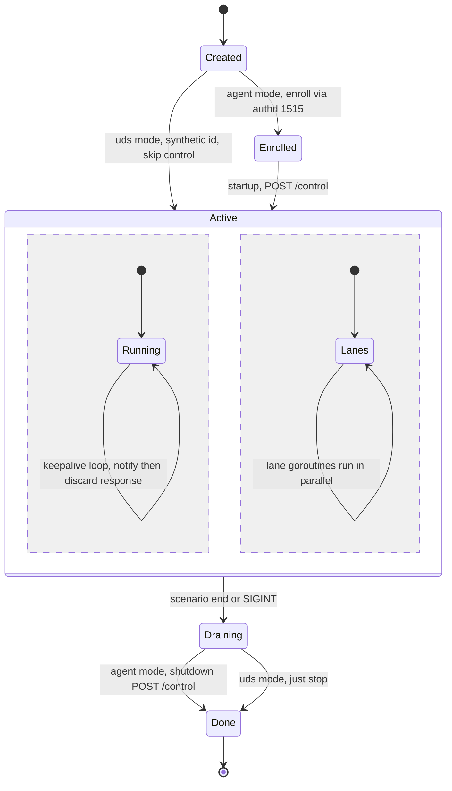
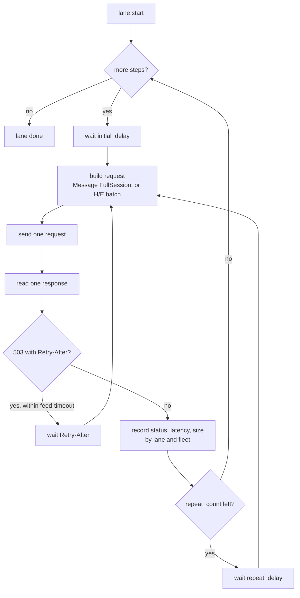

# 06 — Agent and session state machines

## The simulated agent

An agent goes through enrollment and startup once, then runs its lanes and its keepalive loop
concurrently until drain. In `uds` mode enrollment, startup, keepalives and shutdown are all
skipped — there is no remoted in the path, and the agent id is assigned by the scenario.

Two timing rules the transitions depend on, both learned against a real manager:

- **After enrolling, the fleet waits before signing anything.** remoted reloads `client.keys` on a
  timer (`remoted.keyupdate_interval`, 10 s by default), so an agent that signs a request the instant
  it enrolls is answered `401 Invalid client authentication` — its key is simply not in the
  transport's keystore yet. `--enroll-settle` (12 s by default) covers that window once for the whole
  fleet. The run clock restarts after it: enrollment and settling are setup, not load, and counting
  them would deflate every throughput figure.
- **The keepalive loop ends when the lanes do.** It is periodic and has no end of its own, so it is
  bound to a context cancelled once that agent's lanes finish. Otherwise a one-pass run
  (`repeat_until: 0`) would never return on its own and its measured duration would only reflect
  whatever external timeout killed it.

The `Active` state has two concurrent regions on purpose: the keepalive loop and the lanes are
independent, so a notify never waits behind a session and the lanes never wait behind a notify.

Rules:

- **The lanes run in parallel with each other**, one goroutine per lane (see
  [07](07-scenario-schema.md) and [08](08-concurrency-and-pacing.md)). An agent in the mixed fleet
  runs its FIM, SCA, syscollector, VD and engine lanes simultaneously — the realistic shape.
- **`startup` failure is fatal for that agent** (`400 invalid_version` or `401` means the run is
  misconfigured); it **MUST** be reported as failed, not silently kept sending.
- **A keepalive failure is not fatal**: it is counted (`control_notify_err`) and the loop continues,
  because a manager that starts failing keepalives under load is precisely a thing to observe.
- **`notify` without `startup` is legal** on the manager side, so a scenario **MAY** model
  keepalive-only fleets; when it does it **MUST** say so, since the response contents differ even
  though the sender ignores them.

## A lane

Each lane is one goroutine walking its steps in order. A step may repeat with delays
([07](07-scenario-schema.md)); a session step is a single request/response, an engine step ships an
H/E batch ([13](13-engine-event-streams.md)).

The only branch that re-sends is FR-11: a `503` carrying `Retry-After` means the CVE feed is not
ready, so the buffer goes back through `build request` after the delay (bounded by
`--feed-timeout`) rather than straight to `send`. Every other status ends the step and is recorded.

For a VDFirst/VDSync step specifically, that trip back through `build request` is not a no-op:
`Start.feed_offset` is re-read from the sender's own tracked value (step override, `-vd-feed-offset`,
or whatever the keepalive loop has learned by then — [05](05-flatbuffers-messages.md)) before
re-encoding, since the feed can finish loading, and the server's current offset can therefore
change, during a wait this long. Every OTHER field of the rebuilt buffer is identical to the first
attempt — the documents are a deterministic function of `(seed, docKey, spec)`, not regenerated
differently each time.

## The session itself has no state

There is no session state machine beyond "one request, one response": no acknowledgments, no
sequence numbers, no session id. Re-POSTing an identical buffer is idempotent, and that is the whole
retry story for every path except the one exception above — which does not reintroduce session
state either, since `feed_offset` is the SENDER's own tracked knowledge, not anything learned from
or about this particular session ([05](05-flatbuffers-messages.md)).

Two properties the sender **MUST** preserve so scenarios mean what they claim:

- **Sequential steps of one lane are sequential on the wire.** The full-resync step (Cleans then
  Delta) is a test of ordering only if the second request is not sent before the first response
  arrives. Concurrency within one lane is opt-in via the `parallel` step, never the default.
- **Agents are independent**, and so are the lanes of one agent: the run's concurrency is the fleet
  size × lanes × pacing, not a barrier between steps.

## Drain

Drain is bounded by `drain_timeout`:

1. stop starting new steps and stop the keepalive loops;
2. wait for in-flight responses, up to the timeout;
3. in `agent` mode send `shutdown` per agent (best-effort, counted);
4. flush the artifacts and print the summary.

Sessions still in flight when the timeout expires are counted as `abandoned_on_drain` and reported —
not failures of the manager, but a signal the window was shorter than intended. Cleanup of the
enrolled fleet is the orchestration's job (F9c-3), not the sender's; an engine lane marked
`run_while_siblings_active` stops as soon as its agent's inventory lanes finish, so it never keeps a
drain open on its own.
