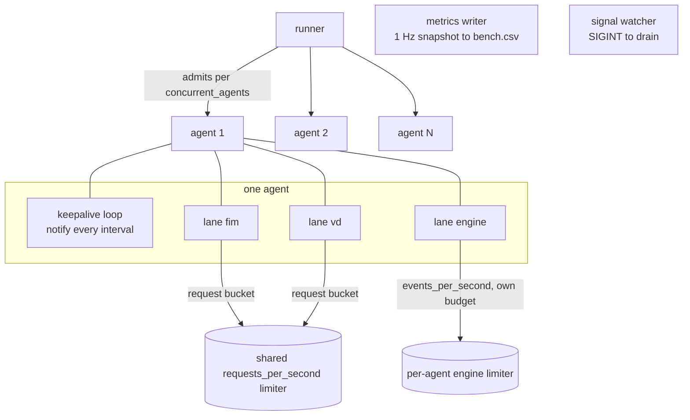

# 08 — Concurrency and pacing

## Goroutine model

Per run: one `runner`, one `metrics writer`, one `signal watcher`, and per active agent one
`keepalive loop` (agent mode with control enabled) plus **one goroutine per lane the fleet lists**. A mixed-fleet agent with five
lanes is five lane goroutines plus a keepalive; 100 such agents is ~600 goroutines — still an order
of magnitude below the retired simulator, which needed a reader goroutine per agent for the ack
protocol. Nothing here needs a reader: one request, one response, on the lane's own goroutine.

The sender **MUST NOT** share an HTTP client's connection between two agents: their identities
differ per request, and connection reuse across identities makes connection cost unattributable. One
client (and one keep-alive pool) **per agent** is the model; lanes of one agent **MAY** share that
client, since they share the identity, and they do. An agent that has an enrollment token also gets
a second, identity-less client for `POST /enroll`. In `uds` mode keep-alive is always off (one
request per connection is the socket's contract), and `--no-reuse` turns it off in agent mode.

## Pacing

Load shape comes from independent knobs, and confusing them is the classic benchmark mistake:

- **`concurrent_agents`** bounds how many agents are Active at once — the *concurrency*.
- **`requests_per_second`** bounds the aggregate request rate through one shared leaky bucket
  (`golang.org/x/time/rate`, burst 1) — the *throughput target*. It charges `/stateful` sessions,
  deletes, `/scan/vd`, `/cacerts` and measured `/enroll` requests. One session = one token no matter
  how many documents it carries (a 500-document VD full sync is still one request); 503-retry
  attempts take a token each, so retries are paced traffic, never a bypass of the target.
- **An engine lane's `events_per_second`** bounds *that lane's* EVENT rate independently, so a
  syslog engine lane at 250 events/s can run beside paced inventory lanes without either starving
  the other. The unit is real events: the limiter charges each `/stateless` batch its size in
  events (`events_per_batch` groups them), so the cap holds however events are grouped into
  requests. The rate is EACH AGENT'S OWN independent budget, not a shared aggregate — the knob
  shapes what one agent produces, so N agents running the lane in parallel deliver up to
  N × `events_per_second` to the manager in total.

A run **MUST** report the target and the *achieved* rate: below target, the manager is the limit and
the number is a result; at target, the sender was the limit and the run measured its own ceiling.
`requests_per_second: 0` means unlimited — correct for saturation, wrong for latency. The summary
records both (`meta.requests_per_second_target`, `throughput.achieved_vs_target`, computed from
sessions only).

The keepalive loops are **not** subject to the session bucket: their rate is the fleet size divided
by the interval, by construction, and throttling them would misrepresent a real fleet's traffic.
They are counted separately in the artifacts for the same reason.

## Deliberate saturation

Three scenarios exist to find limits rather than to be fast:

| Target | How | What to watch (scraped `/metrics`) |
|---|---|---|
| Pipeline queue (`503` shed) — `contract_ramp_503` | Many agents, large sessions, `requests_per_second: 0` | `sync.pipeline.shed.total`, per-shard depth (`sync.shard.<n>.depth`) |
| Body size (`413`) — `contract_oversized_413` | One session declaring more than the body cap | `413` count (a single request, not a rate). On a default manager the cap is derived from the 256 MiB in-flight budget, so this needs a configured `max_body_size` to trip |
| VD scan lane (`503` capacity) — `contract_vd_saturation` | A fleet of `VDFirst` sessions | `vd.capacity.503.total`, `vd.lane.depth`, `vd.lane.time` |

The VD lane's worker count is `wazuh_modules.inventory_sync_server_vd_workers`, whose default `0`
resolves to half the host's cores, at least one (`resolveVdWorkers()` in
`src/wazuh_modules/inventory_sync_server/src/inventorySyncServerFacade.hpp`). The ceiling therefore
moves with the host, and F9c-4 **MUST** state the worker count, or the numbers are not comparable
between machines. The sender does not record it (see [09](09-metrics-and-output.md)).

## Fairness and shard skew

Sessions land on `hash(agentId) % workers` (`syncPipeline.cpp`), so a fleet with sequential ids does not guarantee an
even spread. A run **SHOULD** report the per-shard depth spread from `/metrics`: a fleet that
saturates one shard while others idle is a property of the fleet, not the server, and must not be
reported as a server limit.

## Interleaving lanes within one agent

The mixed fleet exists to stress the *cross-lane* paths: one agent's FIM delta, VD scan and engine
stream in flight at once exercise the pipeline's per-agent FIFO, the scan lane's cross-lane registry
(one agent never has two sessions applied at once, whichever lane they took), and the engine ingress
— simultaneously. A sender that serialized an agent's lanes would never produce that contention, so
the parallel-lanes model is not a convenience, it is the point.
